目录

[第一部分 政治 1](#_bookmark0)

[第一章 哲学 1](#_bookmark1)

[第二章 党史 30](#_bookmark2)

[第三章 毛泽东思想 56](#_bookmark3)

[第四章 中国特色社会主义理论体系 77](#_bookmark4)

[第五章 党的报告解读 88](#_bookmark5)

[第二部分 经济 116](#_bookmark6)

[第一章 马克思主义政治经济学 116](#_bookmark7)

[第二章 微观经济 132](#_bookmark8)

[第三章 社会主义市场经济理论 142](#_bookmark9)

[第四章 宏观经济 156](#_bookmark10)

[第三部分 中国历史人文 174](#_bookmark11)

[第一章 中国古代史 174](#_bookmark12)

[第二章 中国近代史 211](#_bookmark13)

[第三章 新中国史、军史 217](#_bookmark14)

[第四部分 世界历史人文 232](#_bookmark15)

[第一章 世界古代史 232](#_bookmark16)

[第二章 世界近现代史 245](#_bookmark17)

[第三章 世界文化 264](#_bookmark18)

[第五部分 军事文化 302](#_bookmark19)

[第一章 中外经典军事理论和军事历史著作 302](#_bookmark20)

[第二章 著名军事人物和战役 305](#_bookmark21)

[第三章 军事技术 306](#_bookmark22)

[第六部分 科技常识 327](#_bookmark23)

[第一章 科技常识 327](#_bookmark24)

[第二章 现代高新技术 381](#_bookmark25)

[第三章 计算机基础 388](#_bookmark26)

[第七部分 国情地理 396](#_bookmark27)

[第八部分 国防和军队常识 407](#_bookmark28)

[第一章 国防常识 407](#_bookmark29)

[第二章 军队常识 430](#_bookmark30)

# 第一部分 政治

## 第一章 哲学

##### 第一节 哲学概述一、哲学的概念

1.  哲学与世界观的关系
2.  哲学：是理论化、系统化的世界观，又是方法论
3.  世界观：人们对于生活于其中的世界以及与世界关系的根本观点、根本看法
4.  方法论：是人们认识世界、改造世界的一般方法，是人们用什么样的方式、方法来观 察事物和处理问题
1.  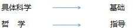哲学与具体科学的关系

##### 二、哲学的基本问题

1.  哲学的基本问题

    （1）思维和存在的关系问题是哲学的基本问题。

    恩格斯：“全部哲学，特别是近代哲学的重大的基本问题，是思维和存在的关系问题。”

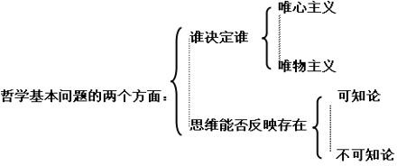

1.  一元论和二元论。

    凡是认为世界具有统一性，世界有一个本原的哲学就是一元论。

    二元论的特征是：否认世界的统一性，认为世界有物质和精神两个独立的本原。

1.  唯物主义和唯心主义的历史形态。

    哲学上的两大基本派别：就是唯物主义和唯心主义的对立。 唯物主义认为物质第一性，精神第二性，世界统一于物质。 唯心主义认为精神第一性，物质第二性，世界统一于精神。

1.  唯心主义：分为主观唯心主义、客观唯心主义

    二者的区别在于对“精神”的不同规定，但它们的实质都是一样的，都是把精神作为世 界的本原。

    Ⅰ.主观唯心论--把人的主观精神看成是世界的本原

    “万物皆备于我”（孟子）

    “万物与我为一”（庄子）

    “我思故我在。”（笛卡尔）

“存在就是被感知”“物质是观念的集合体”（贝克莱）

Ⅱ.客观唯心主义--把“客观”精神当成是世界的本原

“道生一，一生二，二生三，三生万物”“道是天地之根，万物之母”（老子）

“万物皆是一理”，“有理则有气”，“天者，理也”。（程颐）

“世界是绝对观念的异化”，“物质世界是绝对精神的外化”，“绝对理念是万事万物的本源”（黑格尔）

“理念世界”，“现实世界是理念世界的影子。”（柏拉图）

##### 唯心主义：

主观唯心强调内心客观唯心有神论

相同点：都承认精神是世界的本源

##### 【随堂演练】

1.  我国明代哲学家王守仁认为“心外无物”，月亮、太阳以及世界上的万物都存在于人心之中，都是心之意念的产物。这是（ ）的思想。
2.  客观唯心主义
3.  主观唯心主义
4.  机械唯物主义
5.  庸俗唯物主义
6.  下列观点中，属于主观唯心主义的有（ ）。
1.  物是感觉的复合
    1.  上帝创造世界
    2.  人是万物的尺度
    3.  理念是事物存在的根据和模仿的原理
1.  下列说法中，属于客观唯心主义的有（ ）。
    1.  万物皆备于我
    2.  吾心即宇宙
    3.  理在事先
    4.  谋事在人，成事在天
1.  阿杜的‘天黑’歌词中‘闭上眼睛就是天黑’传达了一种对现实生活的逃避意识，受到了 许多年轻人的追捧，下列与‘闭上眼睛就是天黑’反映的 哲学观点不一致的是（ ）。

    ①心外无理，心外无物 ②气者，理之依也

    ③吾心即宇宙，宇宙即吾心 ④人病则忧惧，忧惧见鬼出A.①③

    B.②③ C.③④ D.②④

1.  古代有一个佛偈故事：庙前佛幡随风而动，方丈以此考问众徒。甲徒曰：“风吹幡动！”乙徒曰：“幡何动？分明是你心动！心动才有幡动！”下面的思想与乙徒相近的是（ ）。
1.  万物皆只有一个理
2.  有理而后有气
3.  宇宙便是吾心
4.  父子君臣，天下之定理

6.19 世纪德国哲学家黑格尔认为，“绝对观念”先于自然界和人类社会而存在，自然界和人类社会是绝对观念外化或异化的结果。黑格尔的观点属于（ ）。

1.  客观唯心主义
2.  主观唯心主义
3.  辩证唯物主义
4.  形而上学的唯物主义
1.  唯物主义：古代朴素唯物主义、近代形而上学唯物主义、辨证唯物主义
2.  古代朴素唯物主义：认为某种物质的具体形态是世界的本源。 典型命题：金木水火土

    缺陷：直观性、猜测性、非科学性

1.  近代形而上学唯物主义：原子是世界的本原缺陷：机械性、形而上学性、不彻底性
1.  辩证唯物主义，即马克思主义哲学。
2.  马克思主义哲学的产生和基本特征

##### 产生：

1.  马克思主义的理论来源：
2.  德国古典哲学（康德、黑格尔、费尔巴哈）
3.  英国古典政治经济学
4.  英法空想社会主义

    德国古典哲学，特别是黑格尔的辩证法哲学和费尔巴哈的唯物主义哲学是马克思主义哲 学产生的直接理论来源。

1.  马克思主义哲学的科学依据

    19 世纪自然科学的发展，特别是三大发现即细胞学说、能量守恒与转化定律、生物进化论，是马克思主义哲学产生的自然科学依据与前提。

    马克思主义哲学产生的主观条件——马恩的努力和创造性活动。1848 年《共产党宣言》的发表，标志着马克思主义的诞生。

##### 马克思主义哲学的精髓： 基本特征：

1.  实践的观点是马克思主义哲学首要的和基本的观点
2.  以彻底的批判性为标志的科学性和革命性的统一

##### 【随堂演练】

1.  认为某种具体物质是世界本原，这种观点是（ ）。
1.  朴素唯物主义
    1.  机械唯物主义
    2.  形而上学唯物主义
    3.  理性中参透着感性的因素
1.  不属于马克思主义理论来源的是（ ）。
    1.  英国古典哲学
    2.  德国古典哲学
    3.  英国古典政治经济学
    4.  英国的空想社会主义学说
1.  马克思主义哲学的根本特征是（ ）的统一。
    1.  理论和实践
    2.  科学的世界观和方法论
    3.  实践性、革命性和科学性
    4.  绝对真理和相对真理
1.  我国哲学家范缜说：“形存则神存，形谢则神灭。”这是（ ）。
    1.  主观唯心主义观点
    2.  形而上学的观点
    3.  唯物主义观点
    4.  客观唯心主义观点

##### 第二节 唯物论

##### 一、世界的物质性

1.  物质

    列宁：“物质是标志客观实在的哲学范畴，这种客观实在是人通过感觉感知的，它不依赖于我们的感觉而存在，为我们的感觉所复写、摄影、反映。”

1.  物质的存在形式---运动

    运动是物质的存在方式和根本属性。

2.  运动的基本形式

    机械运动 物理运动 化学运动 生命运动 社会运动

1.  物质和运动的关系：

    A.物质与运动：物质是运动的物质；运动是物质的运动 离开运动谈物质，犯了（ ）错误；

    离开物质谈运动，犯了（ ）错误：

##### 运动:

1.  运动是物质的根本属性和存在方式
2.  运动是物质的运动，物质是运动的主体、承担者、载体
3.  二者不可分割

##### 静止：

1.  事物之间空间位置保持不变
2.  事物某一方面的性质在一定时期内基本不变
3.  运动的特殊状态静止也是运动

##### 运动与静止的关系

1.  运动是普遍的、永恒的、无条件的、绝对的
2.  静止是有条件的、相对的
3.  运动与静止的统一

##### 判断：

动中有静、静中有动。动即是静，静即是动。

除了运动的物质以外，世界上什么也没有。

##### 【随堂演练】

1.  “坐地日行八万里、巡天遥看一千河”所蕴含的哲理是（ ）
    1.  物质运动的客观性和时空的主观性的统一
    2.  物质运动的多样性和静止的单一性统一
    3.  物质运动的无限性和时空有限性的统一
    4.  物质运动的绝对性和静止的相对性的统一
2.  列宁认为，物质的唯一特性是（ ）。
1.  永恒的运动性
    1.  客观规律性
    2.  客观实在性
    3.  普遍联系性
1.  人愉快时感觉光阴似箭，痛苦时感觉度日如年，这说明（ ）。
    1.  时间是人的主观感觉
    2.  时间随着人的感觉变化而变化
    3.  客观存在的时间是可变的
    4.  人的时间观念具有相对性和可变性
1.  “主张“世界除了运动着的物质之外，什么也没有”的观点，属于（ ）。
    1.  否认意识存在的唯物主义
    2.  主张世界统一于物质的辩证唯物主义
    3.  否认时空存在的唯心主义
    4.  把人的意识理解为某种“精细物质”的机械唯物主义

##### 二、意识的主观能动性

1.  意识的产生（两个条件）：意识是自然界长期发展的产物，意识是社会历史的产物。
2.  意识是自然界长期发展的产物。三环节：①从无生命物质的反应特性发展到低等生物 的刺激感应性；②由低等生物的刺激感应性进到动物感觉心理；③由动物心理飞跃到人类意 识。
1.  意识是社会历史的产物。劳动在意识的产生中起了决定性作用。
1.  意识的本质：
2.  人脑的机能，是意识的物质器官。
3.  意识是人脑对客观存在的反映，是人脑对客观存在的主观映象。

##### 意识的本质：

意识是对客观存在的主观反映

意识是客观存在在人脑中的主观映像

恩格斯所说，一切观念都来自经验，都是现实的反应——正确或歪曲的反应

##### 三、物质和意识的辩证关系

1.  物质决定意识

    物质第一性，意识第二性，物质决定意识.

1.  意识对物质具有能动的反作用

    正确的意识能够指导人们有效地开展实践活动，促进客观事物的发展； 错误的意识则会把人的活动引向歧途，阻碍客观事物的发展。

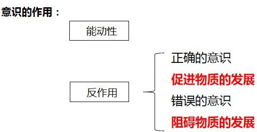

1.  方法论

    坚持一切从实际出发，使主观符合客观，坚持主观和客观具体的历史的统一。反对教条 主义和经验主义等主主义。

##### 【随堂演练】

1.  人类意识产生的历史过程，大体上经历了以下三个决定性环节（ ）。
    1.  概念、判断、推理
    2.  感性认识、理性认识、实践
    3.  生物的刺激感应、动物的感觉和心理、人类意识
    4.  客体、主体、客体
1.  狼孩没有意识，这一事实说明意识的产生（ ）。
    1.  不仅是自然界长期发展的产物，而且是社会的产物
    2.  不仅是物质现象而且是社会现象
1.  是社会的产物，而不是自然界发展的产物
    1.  不仅反映自然界而且反映社会
1.  意识的本质是（ ）。
    1.  人脑的机能、物质的反映
    2.  人脑产生的特殊物质
    3.  感觉的总和
    4.  逻辑的集合
1.  中国古代哲学家荀子说：“心不在焉，则白黑在前而目不见，雷鼓在侧而耳不闻。”这段话表明人的意识具有（ ）。
2.  客观性
3.  能动性
4.  对象性
5.  任意性
1.  “观念的东西不外是移入人的头脑并在人的头脑中改造过的物质的东西而已”。这一命 题揭示了（ ）。
2.  人脑是意识的源泉
3.  意识是人脑产生的特殊物质
4.  意识是客观存在的主观映象
5.  观念的东西同物质的东西是具有同一性的
1.  民谚“南人不梦驼，北人不梦象”说明了（ ）。
    1.  物质决定意识
    2.  意识反作用于物质
    3.  意识具有相对独立性
    4.  意识决定物质的变化

##### 第三节 辩证法

主要内容：两大特征、三大规律

两个观点——世界是普遍联系的、世界是永恒发展的

三大规律——质量互变规律、否定之否定规律、对立统一规律

##### 一、联系

1.  联系的概念

    联系指的是事物之间以及事物内部诸要素之间的相互影响、相互制约、相互作用。 事物与事物之间，即外部联系；

    事物内部要素之间，即内部联系。

1.  联系的特点
2.  客观性：事物本身所固有的客观现象
3.  普遍性（联系的存在范围广）
4.  多样性：形式是多样的
1.  条件性：联系是需要条件的
2.  间接联系---城门失火殃及池鱼
3.  整体和部分

    部分离开整体不再具有部分的功能

    关键部分有时候会对整体起决定性作用

##### 二、发展

##### （一）发展的概念

发展是事物运动变化中内在具有的前进的上升的运动，是客观世界永恒的普遍的特性。

##### （二）发展的特点

1.  发展的永恒性：世界上一切事物都处在永不停息地变化之中,世界是永恒发展的。
2.  发展的过程性：是指事物的发生、发展和灭亡，一个事物向另一个事物的变化，或不 同事物间的统一联系和相互转化。

##### （三）发展的实质——新事物的产生和旧事物的灭亡

##### （四）事物的发展是前进性和曲折性的统一

##### 【随堂演练】

1.  重视创新，从哲学上看是因为（ ）。
    1.  矛盾是事物发展的根据
1.  事物的发展最终是通过质变实现的
    1.  新事物是对旧事物的彻底否定
    2.  发展的实质是新事物的产生和旧事物的灭亡
1.  发展的实质是（ ）
    1.  同一事物的简单重复
    2.  事物数量的增减
    3.  事物位置的移动
    4.  新事物的产生和旧事物的灭亡
1.  从哲学上看，下列对“发展”理解正确的是（ ）

    ①事物性质和状态的改变是发展

    ②事物量变到一定程度的结果就是发展

    ③新事物的产生和旧事物的灭亡就是发展

    ④事物前进性和上升性的变化趋向才是发展A.③④

    B.②③④ C.①③④ D.①②③④

1.  颜之推在《慕贤》中指出：“是以与善人居，如入芝兰之室，久而自芳也；与恶人居，如入鲍鱼之肆，久而自臭也。”这一论断主要说明（ ）
1.  事物之间的联系是无条件的
2.  矛盾是事物发展的源泉和动力
3.  事物之间是相互联系的
4.  发挥主观能动性必须以尊重客观规律为前提

##### 三大规律

##### 一、质量互变规律 二、对立统一规律 三、否定之否定规律

##### 一、质量互变规律

1.  质、量和度
2.  质：一事物成为它自身而区别于其他事物内在规定性。
3.  量：量是事物的规模、程度、速度以及构成事物的成分在空间的排列等可以用数量表 示的规定性
4.  度：事物保持其质的量的限度或数量界限。事物的变化是否超出度的范围，是区分量 变和质变的根本标志。
1.  量变、质变及其辩证关系
2.  量变--事物数量的增减或场所的变更，是一种渐进的、不显著的变化。
3.  质变--事物根本性质的变化，是渐进过程的中断。
4.  量变和质变是相互转化、相互渗透的辩证关系。

##### 辩证关系：

量变是质变的前提和必要准备质变是量变的必然结果

量变发展到一定程度必然引起质变

1.  方法论意义
2.  注意量的积累，防微杜渐
3.  善于抓机遇，促成质变
4.  把握事物的度，坚持适度原则

##### 【随堂演练】

1.  航空界有个关于飞行安全的“海恩法则”：每一起严重事故的背后，必然有 29 次轻微事故

    和 300 起未遂先兆及 1000 起事故隐患。“海恩法则”启示我们（ ）

    1.  规律是客观的，我们要善于发现和利用规律
    2.  量变是质变的前提，质变是量变的必然结果
    3.  矛盾是普遍的、客观的
    4.  只要注意防范，事故是可以避免的
1.  俗话说“不积跬步，无以至千里；不积细流，无以成江河。”这句话说明（ ）
    1.  质变和量变是相互渗透的
    2.  量变在事物的发展中是不起作用的
1.  质变是由量变引起的
    1.  量变是由质变引起的
1.  美国科研人员做过这样的实验：将一只青蛙放到沸水中，青蛙触电般立即窜逃出去；又将 青蛙放入凉水中，然后用小火慢慢加热，青蛙虽然可以感觉到温度的变化，确没有立即跳出 去而逐渐丧失逃生能力。这种现象被称为“青蛙效应”。“青蛙效应”说明的关于事物发展状 态的哲理是（ ）

    ①事物发展的实质是量变 ②事物的质变是由渐进的量变引起的

    ③事物的质变与量变是同时发生的 ④事物的不显著的量变可以向质变转化A.①②

    B.①③ C.②④ D.③④

1.  “防微杜渐”的哲学依据是（ ）
    1.  对立统一规律
    2.  否定之否定规律
    3.  矛盾普遍性和特殊关系原理
    4.  质量互变规律

##### 二、对立统一规律（揭示了：联系的根本内容，发展的内在动力）

对立统一规律是唯物辩证法的实质和核心，是区分辩证法和形而上学的试金石，是事物

普遍联系的根本内容和永恒发展的根本规律，是事物普遍联系和发展的动力源泉，提供了认 识世界和改造世界的根本方法。

1.  揭示了事物运动和发展的源泉和动力
    1.  唯物辩证法的实质和核心
        1.  宇宙间最根本的规律

##### （一）矛盾的两种基本属性：同一性、斗争性

1.  同一性：相互依存、相互转化

    考点：福祸相倚，塞翁失马焉知非福

1.  斗争性：相互排斥、相互分离

##### （二）矛盾的普遍性

1.  事事有矛盾，时时有矛盾
2.  方法论：

    承认矛盾---分析矛盾---解决矛盾

##### （三）矛盾的特殊性

1.  三个方面
2.  方法论：

具体问题具体分析

1.  关键词：

因地制宜、量体裁衣、对症下药、特色、 特区、专门

##### （四）主要矛盾和次要矛盾主要矛盾：

多对矛盾中，处于支配地位，起决定作用

##### 关键词：

抓重点、抓中心、关键、典型问题

##### 矛盾的主要方面：

在一对矛盾中，决定事物的性质

##### （五）两点论和重点论

1.  两点论：

    同时看到主要矛盾和非主要矛盾、矛盾的主要方面和非主要方面

1.  重点论：

    分清主次

    抓住主要矛盾和矛盾的主要方面

##### （六）内因和外因

1.  含义：内因指事物的内部矛盾

外因指事物与其他事物之间的外部矛盾

1.  关系：

    内因是事物发展的根本原因，是变化的根据 外因是事物发展的第二位原因，是变化的条件 外因通过内因而起作用

##### 【随堂演练】

1.  马克思主义唯物辩证法认为，事物发展的根本规律是：（ ）
    1.  物质决定意识，意识反作用于物质的规律
    2.  对立统一规律
    3.  质量互变规律
    4.  生产力决定生产关系，经济基础决定上层建筑的规律
1.  在处理实际问题时，往往不能“一刀切”的主要原因是（ ）
    1.  事物矛盾之间存在有机联系
    2.  事物矛盾具有特殊性
    3.  事物矛盾具有共同点
    4.  事物矛盾具有普遍性
1.  “天下虽安，忘战必危”是我国古代著名的军事思想，充满着朴素的辩证法智慧。下列体现的哲学思想与这句话相同的是（ ）。
1.  “有心栽花花不开，无心插柳柳成荫”
2.  “不谋全局者不足以谋一域”
3.  “贾人旱则资舟，水则资车，以待乏也” D.“富贵而姿势弄权，乃自取灭亡之道”
1.  唯物辩证法的实质和核心是（ ）
    1.  对立统一规律
    2.  质量互变规律
    3.  运动与静止规律
    4.  实践的规律
1.  矛盾的两种基本属性是指（ ）
    1.  同一性和斗争性
    2.  运动性和静止性
    3.  时间性和空间性
    4.  普遍性和特殊性
1.  “物必先腐而后虫生”所体现的哲理是（ ）
    1.  必然性与偶然性的辩证关系
    2.  内因与外因的辩证关系
    3.  可能性与现实性的辩证关系
    4.  现象与本质的辩证关系

##### 三、否定之否定规律

1.  揭示了事物发展的方向和道路

    （螺旋式上升或波浪式前进）

1.  实质：扬弃

    （肯定——否定——否定之否定）

##### 【随堂演练】

面对激烈的竞争，一些成功企业的生存之道是：拿出更好的产品来击败自己的原有产品。有 人将这种行为戏称为“自吃幼崽”。这体现的哲理是（ ）。

A.追求真理是无限和反复的过程B.事物矛盾具有不平等性

1.  事物的否定是自身的否定
2.  事物发展是一个由量变到质变的过程

##### 第四节 认识论一、实践

实践是指人类有目的地能动地改造和探索现实世界的社会性的客观物质活动。

##### 实践的形式

1.  生产实践

    生产活动是人类最基本的实践活动

1.  社会实践

    建立和调整生产关系

1.  科学实验

##### 二、认识

1.  定义：认识是在实践基础上主体对客体的能动反映
2.  我们对事物有认识肯定是实践过？
3.  能动性表现在：主动性，有目的性，有创造性

##### （一）感性认识和理性认识

1.  初级阶段：感性认识

    感性认识是借助于感观所获得的关于事物的现象和外部联系的认识

    **特点：**直接性

1.  高级阶段：理性认识

    理性认识是借助于抽象思维所获得的关于事物的本质和内部联系的认识

##### （二）认识发展过程的两次飞跃：

1.  感性认识到理性认识
2.  理性认识到实践

“ 实践、认识、再实践、再认识”如此循环往复以至无穷，这就是认识的完整过程—

—毛泽东

##### （三）感性认识和理性认识的统一性

理性认识依赖于感性认识

感性认识有待于上升到理性认识感性认识和理性认识相互渗透

##### 三、实践和认识的辩证关系

1.  实践是认识的基础，实践对认识的决定作用
2.  实践是认识的来源
3.  实践是认识发展的动力
4.  实践是检验认识真理性的唯一标准
5.  实践是认识的目的和归宿
1.  认识能够指导实践

##### 认识反作用于实践的两种情况：

正确的理论指导实践会使实践达到预期的效果，使实践活动顺利进行。 错误的理论指导实践会对实践产生消极乃至破坏性的作用，使实践失败。

“从群众中来，到群众中去”

##### 【随堂演练】

“不登高山，不知天之高也；不临深渊，不知地之厚也。”这句话说明（ ）。A.人的一切知识都是从直接经验中获得的

1.  人的意识具有创造性
2.  人的认识是独立于实践之外的
3.  实践在认识过程中具有决定作用

##### 四、真理和谬误

1.  真理的客观性，即绝对真理的含义

    任何真理都是对于客观事物规律的正确反映，在它所反映的限度和范围内永远不能被推

    翻

1.  真理的相对性，即相对真理的含义

    真理的相对性，指人们在一定条件下对于客观过程及其规律的正确认识是有限度的 认识没有穷尽世界，认识有待于扩展

    认识没有穷尽该事物，认识有待于深化

真理和谬误的对立是相对的，二者的对立超出一定范围就会相互转化，即真理变成谬误， 谬误变成真理。

错误往往是正确的先导，失败常常是成功之母

任何真理都只适用于一定的条件，超出这个条件，真理就会变成谬误

##### 第五节 历史唯物主义

##### 一、社会存在

##### （一）社会存在：构成人类社会的一切存在，包括地理环境、人口因素和生产方式。

##### （二）地理环境、人口因素及生产方式在社会发展中的作用

地理环境和人口因素起到了制约和影响的作用。 地理环境是永恒的、必要的条件。

人口因素是重要的物质生活条件。

##### 二、社会意识

##### （一）社会意识是社会生活的精神生活，是社会存在的总体反映。

##### （二）特征：社会意识具有相对独立性

1.  社会意识与社会存在发展的不同步性
2.  社会意识的发展与经济发展的水平之间具有不平衡性
3.  社会意识的发展具有历史继承性
4.  社会意识之间的相互影响和相互作用
5.  社会意识对社会存在具有能动的反作用

##### 三、社会存在和社会意识的辩证关系

1.  社会存在决定社会意识，社会意识反作用于社会存在。
2.  社会存在和社会意识的关系是历史观点的基本问题。

    **唯心史观：**社会意识决定社会存在的前提出发，根本否定人民群众在社会历史发展中的 决定作用。

    **唯物史观：**（1）认为社会存在决定社会意识；（2）社会意识是社会存在的反映，并对

社会存在具有能动的反作用；（3）认为社会历史发展也有其客观规律；（3）既承认英雄对历史地推进作用，又强调人民群众对历史发展的决定性作用。

##### 【随堂演练】

1.  人们越来越重视地理环境在社会存在和发展中的作用，这是因为（ ）。
    1.  地理环境是人类物质生活的必要条件
    2.  地理环境能决定社会的性质
    3.  地理环境直接决定社会形态的更替
    4.  地理环境通过物质生产制约社会发展
1.  有人说，伟大人物“一言可以兴邦，一言可以丧邦”属于（ ）。
    1.  重视伟大人物的思想意识作用的正确观点
    2.  重视历史必然性作用的历史唯心主义观点
    3.  片面夸大个人历史作用的历史唯心主义观点
    4.  否认偶然性在历史发展中作用的机械论观点

## 第二章 党史

##### 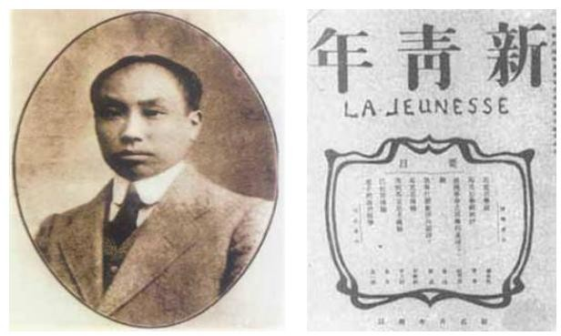中国共产党的创立及早年的革命活动时期陈独秀和他创办的《新青年杂志》

新文化运动打破了封建思想的桎梏，在中国社会中掀起了思想的启蒙运动，为马克思主 义的传播奠定了基础 。

##### 李大钊

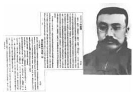

1918 年 10 月，“五四”运动的主要领导者李大钊在“新青年”杂志上发表了《庶民的

胜利》等文章，歌颂俄国工人阶级的胜利。

##### 中国共产党第一次全国代表大会

时间：1921.7.23-7.31；地点：上海、嘉兴南湖；

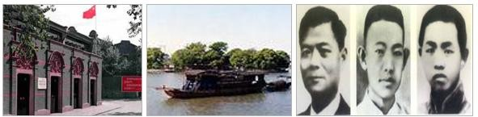出席代表：13 人，上海李达、李汉俊；北京张国焘、刘仁静；长沙毛泽东、何叔衡； 武汉董必武、陈潭秋；济南王烬美、邓恩铭；广州陈公博，日本东京周佛海以及陈独秀委派 的代表包惠僧。共产国际代表马林，尼可尔斯基也出席了大会。代表全国 53 位党员。

会议选举陈独秀、张国焘、李达组成中央局，陈独秀为中央局书记。中共一大的召开， 标志着中国有了一个完全新式的，以马克思列宁主义为行动指南、以实现共产主义为目标、 全国统一的工人阶级政党，自此我国的革命面貌就焕然一新了。

##### 中国共产党第二次全国代表大会

时间：1922.7.16-23 地点：上海

出席代表：陈独秀、李达、张国焘、邓中夏、蔡和森、张太雷等，代表党员 195 人。中心议题——进一步讨论和确定党在民主革命阶段的纲领。

大会规定了党的最高纲领是实现共产主义；最低纲领是打倒军阀，推翻国际帝国主义的 压迫，统一中国为真正的民主共和国，大会还指出了工人阶级、农民阶级、小资产阶级和民 族资产阶级是民主革命的动力。

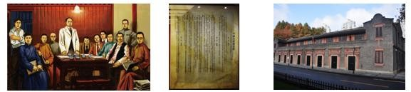

**历史意义：**党就在中国近代革命史上第一次明确的提出了彻底反帝反封建的民主革命纲 领，为中国各族人民的革命斗争指明了方向。制定了第一部《中国共产党章程》。

##### 中国共产党第三次全国代表大会

时间：1923.6.12-6.20 地点：广州中心议题：国共合作的问题。

大会接受共产国际执委会关于在中国实行国共合作的决议，正确地分析了孙中山反对帝 国主义和封建军阀的民主主义立场，以及把国民党改造为工人、农民、小资产阶级和资产阶 级的民主革命联盟的可能性。党的“三大”关于实行国共合作的政策是正确的

历史意义：它对于加速中国革命的步伐，促进反帝反封建的人民大革命的高潮，具有重 大的意义。

| 会议 | 时间 | 地点 | 内容 |
|------|------|------|------|

|  中共一大     |  1921 |  上海/嘉兴 | 确定党的名称为“中国共产党” 选举陈独秀为中央局书记                                       |
|---------------|-------|------------|-----------------------------------------------------------------------------------------|
|  中共二大     |  1922 |  上海      | 分析了国际形势，制定了党的最高纲领和最低纲领 第一次提出了彻底的反帝反封建的民主革命纲领 |
|  中共三大     |  1923 |  广州      | 中心议题是讨论同国民党建立统一战线问题，共产党员以 个人名义加入国民党                   |
| 国 民党 一 大 |  1924 |  广州      | 新三民主义——“联俄、联共、扶助农工” 标志着第一次国共合作的正式形成                       |

##### 第一次国内革命战争时期(北伐战争) 中国共产党第四次全国代表大会

时间：1925.1.11-22 地点：上海

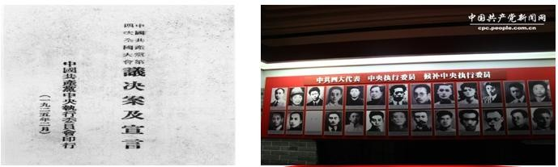中共四大召开，代表党员 994 人。大会分析了中国社会各阶级在民族革命运动中的地位，明确地提出了无产阶级领导权和农民同盟军问题。大会总结了一年来国共合作的经验教 训，制定了开展群众运动的计划，并决定在全国积极建立和加强党的组织，以适应革命发展 的需要。大会选出新的中央执行委员会，陈独秀为总书记。党的“四大”为革命斗争的新高 涨作了思想上和组织上的准备。

##### 北伐战争的胜利进军和大革命的失败

在 1927 年，蒋介石和汪精卫先后发动的四一二和七一五反革命政变，血腥屠杀共产党人和革命群众，公然背叛革命，这也标志着国共合作因此正式破裂，轰轰烈烈的大革命中途 夭折。

##### 第二次国内革命战争时期(1927-1937) 南昌起义与八七会议

1927 年 8 月至 1928 年底。党主要是发动和领导各地武装起义，创建工农红军和农村根据地，革命力量得到了初步的恢复和发展。

##### 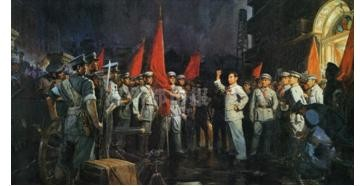南昌起义

##### 八七会议

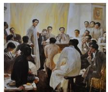

八七会议总结了大革命失败的经验教训，结束了陈独秀右倾投降主义在中央的统治，撤 销了陈独秀总书记的职务，选举了临时中央政治局；确定了土地革命和武装反抗国民党反动 派的总方针，并把发动农民举行秋收起义作为当前党的最主要的任务。毛泽东出席了这次会 议，并提出了著名的“枪杆子里出政权”的论断。

**意义：**给处于思想混乱和组织涣散的中国共产党指明了方向。

##### 中国共产党第六次全国代表大会

1928 年 6 月 18 日至 7 月 11 日 中国共产党在莫斯科召开了第六次全国代表大会。 大会批判了陈独秀的右倾投降主义和瞿秋白的左倾冒险主义错误。指出中国的社会性质

仍然是半殖民地半封建社会，中国现阶段的革命是资产阶级民主革命，革命的中心任务是反 对帝国主义和封建主义，实行土地革命，建立工农民主专政。并指出党在当时的总任务是争 取群众，准备暴动。

这次大会的路线基本上是正确的，对后来中国革命的发展起了积极的作用。

##### 莫斯科中共六大会址

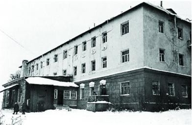

##### 农村包围城市、武装夺取政权的革命道路基本形成

1929 年 1 月到 1931 年 9 月，各地工农红军和农村革命根据地有了很大发展，具有中国特色的农村包围城市，武装夺取政权的革命道路基本形成。

##### 井岗风革命根据地

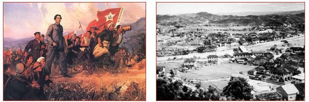

在创建井冈山革命根据地，特别是在红四军转战赣南、闽西的实践中，毛泽东逐渐形成 了农村包围城市的理论，它是马克思列宁主义的普遍真理同中国革命具体实践相结合的典范， 是对马克思列宁主义关于武装夺取政权的理论的重大发展，标志着毛泽东思想的初步形成。

##### 第五次反围剿的失败和长征

从 1930 年底到 1932 年冬，毛泽东、朱德以灵活的作战方针粉碎了国民党的四次围剿 。

1933 年 9 月，蒋介石对革命根据地发动了第五次军事围剿。这时，王明“左”倾机会主义在红军中占据了统治地位，拒不接受毛泽东的正确建议，用阵地战代替游击战和运动战， 用所谓“正规”战争代替人民战争，使红军完全陷于被动地位。经过一年苦战，终未取得反

“围剿”的胜利。最后于 1934 年 10 月仓促命令中央领导机关和红军主力退出根据地，开始长征。

##### 粉碎了国民党的四次围剿

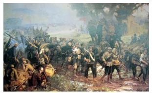

##### 王明

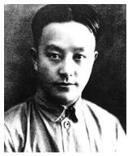

##### 红军长征路线图

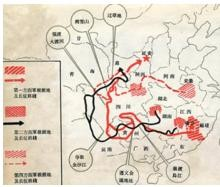

##### 遵义会议和长征胜利

1935 年 1 月在贵州遵义召开的独立自主地解决中国革命问题的一次极其重要的扩大会

议。是在红军第五次反“围剿”失败和长征初期严重受挫的情况下，为了纠正王明“左”倾 领导在军事指挥上的错误而召开的。这次会议开始确立实际以毛泽东为代表的马克思主义的 正确路线在中共中央的领导地位，挽救了党、挽救了红军、挽救了革命，是中国共产党历史 上一个生死攸关的转折点，标志着中国共产党从幼稚走向成熟。

##### 遵义会议标志着中国共产党从幼稚走向成熟

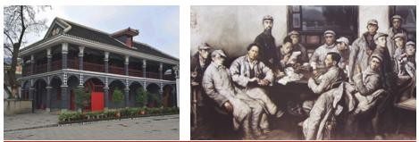

##### 红军三大主力会宁会师

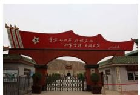

1936 年 10 月，红二、四方面军到达甘肃会宁地区，同红一方面军会师。红军三大主力会师，标志着长征的胜利结束。

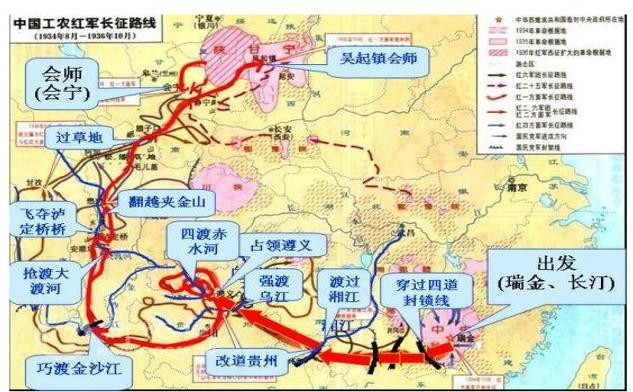

##### 抗日战争时期(1931-1945) 党的抗日民族统一战线政策

1931 年，侵华日军发动九一八事变后，完全侵占中国东北，并成立伪满洲国，此后陆续在华北、上海等地挑起战争冲突，国民政府则采取妥协政策避免冲突扩大。1937 年 7 月

7 日，日军在北平附近挑起卢沟桥事变，中日战争全面爆发。抗日战争时期是中国共产党领导的民族革命战争，它的主要打击对象是日本帝国主义和汉奸卖国贼。中国共产党在抗日战 争中采用抗日民族统一战线的政策，团结了一切可能团结的力量共同抗日。

瓦窑堡会议解决了遵义会议没有来得及解决的政治策略问题，确定了建立抗日民族统一 战线的政策，为党领导全国人民迎接伟大的抗日战争奠定了政治基础。

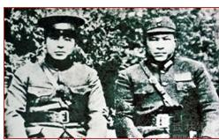西安事变的和平解决为抗日民族统一战线的建立准备了必要的前提，成为由国内战争走 向抗日民族战争的转折点

抗日民族统一战线时国共两党的珍贵合影

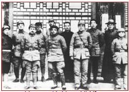

| 古田会议 | 1929 | 福建 | “思想上建党、政治上建军”的原则 |
|----------|------|------|--------------------------------|

|    遵义会议 |    1935 |    遵义 | 结束了王明“左”倾冒险主义在党中央的统治 开始确立了以毛泽东为代表的新的中央正确领导 中国共产党第一次独立自主地运用马克思列宁主义原理解 决中国革命问题 是中国共产党从幼年走向成熟的标志 |
|-------------|---------|---------|--------------------------------------------------------------------------------------------------------------------------------------------------------------------------------------|
| 瓦窑堡会 议 |  1935   |  瓦窑堡 |  决定建立最广泛的抗日民族统一战线                                                                                                                                                    |

##### 中国共产党第七次全国代表大会

时间：1945.4.23—6.11 地点：延安

内容：毛泽东《论联合政府》、朱德《论解放区战场》、刘少奇《关于修改党章的报告》、 周恩来《论统一战线》

大会总结了民主革命二十多年曲折发展的历史经验，制定了党的路线，即放手发动群众， 壮大人民力量，在我党的领导下，打败日本侵略者，解放全国人民，建立一个新民主主义的中国。大会通过了新党章，规定以马克思列宁主义的理论与中国革命的实践之统一的思想

——毛泽东思想，作为我们党的一切工作的指针。大会选举了新的中央委员会。

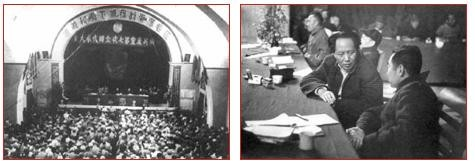意义：党的“七大”是一次团结的大会、胜利的大会，它实现了全党在马 克思列宁主义、毛泽东思想和党的路线的基础上的团结，为抗日战争和民主革命的胜利做了充分的准备。

##### 第三次国内革命战争时期（1945-1949） 西柏坡—中共七届二中全会

1949 年 3 月 5 日—13 日在河北西柏坡召开七届二中全会。指出党的工作重心由乡村转移到城市，以恢复和发展生产为工作的中心。此次会议还强调了要加强党的思想建设，防 止资产阶级思想侵蚀党的队伍，有预见性地提出了防止“糖衣炮弹”进攻的重大问题，并进 一步提出了“两个务必”的重要思想。（务必使同志们继续保持谦虚、谨慎、不骄、不燥的作风，务必使同志们继续保持艰苦奋斗的作风。）

意义：这次会议为迅速取得民主革命在全国的胜利，以及民主革命向社会主义革命转移 做了充分的准备，具有重大历史意义。

|  中共七大     |  1945 |  延安   | 毛泽东《论联合政府》，提出党的三大作风：理论联系实践， 密切联系群众，批评与自我批评 确立了毛泽东思想为党的指导思想       |
|---------------|-------|---------|--------------------------------------------------------------------------------------------------------------------------|
|  七届二中全会 |  1949 |  西柏坡 | 党的工作重心必须由乡村转到城市 提出了两个“务必”的思想，务必继续保持艰苦朴素的作 风；务必继续保持谦虚谨慎、不骄不躁的作风 |

##### 中国人民从此站起来了！

1949 年 10 月 1 日中华人民共和国成立,标志着新民主主义革命胜利,实现了从半殖民地半封建社会到民族独立、人民当家作主新社会历史性转变。

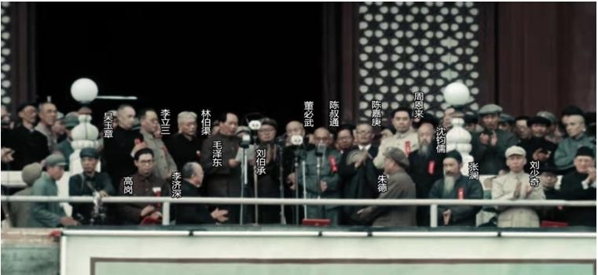

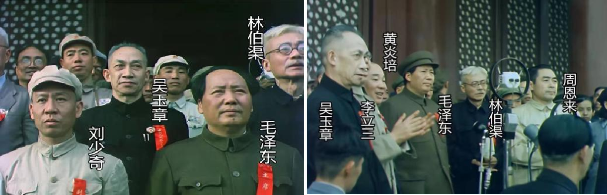

##### 社会主义革命和建设时期

##### 只有共产党才能发展中国（1949.10-1978.12） 基本完成社会主义改造时期(1949-1956)

新中国成立后的头几年里，党的主要任务是肃清国民党残余军队和土匪和反革命势力， 和平解放西藏、抗美援朝保家卫国、土地改革、三反五反，稳定物价统一财经。1953 年党中央提出过渡时期总路线和总任务，要在一个相当长的时期内，逐步实现国家的社会主义工业化，逐步实现国家对农业、工业和资本主义工商业的社会主义改造。

##### 和平解放西藏

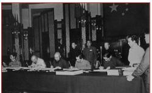

##### 抗美援朝

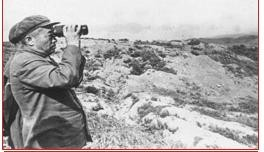

##### 《关于统一国家财政经济工作的决定》手稿

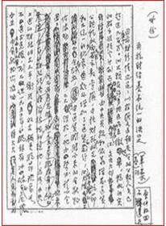

##### 开始全面建设社会主义时期(1956-1966) 中国共产党第八次全国代表大会

时间：1956.9.15-9.27 日 地点：北京

中共八大是新中国建国后召开的第一次全国代表大会，指出了国内的主要矛盾是人民对 于经济文化迅速发展的需要同当前经济文化不能满足人民需要的状况之间的矛盾，提出了党 和国家人民当前的主要任务，就是集中力量把国家尽快地从落后的农业国变为先进的工业国， 大会坚持了既反保守又反冒进，在综合平衡中稳步前进的经济建设方针。同时，还着重提出了执政党的建设问题，要坚持党的民主集中制和集体领导制度，反对个人崇拜，发展党内民主和人民民主，加强党和群众的联系。

八大”是我党历史上具有深远意义的一次大会，正确地分析了形势，适时地提出把党的 工作重心从革命转移到建设上来，制定了党在政治上、思想上、组织上以及经济上的一系列 正确方针。“八大”的重要文献是我国建设社会主义的指针，它的基本内容有着长远的指导意义。

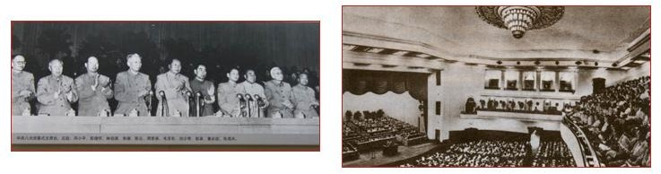

社会主义改造基本完成之后，从 1956 年到 1966 年，新中国进入了全面建设社会主义时期，在这个时期内，中国共产党开始探索适合中国实际的建设社会道路并取得了重要的成 果 。

##### 毛泽东的《论十大关系》

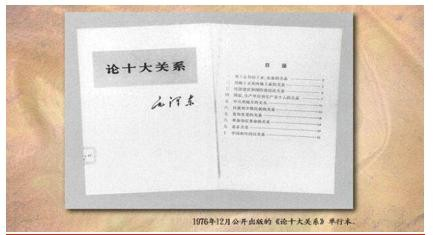

##### 大跃进运动

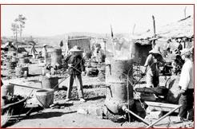

##### 武汉长江大桥

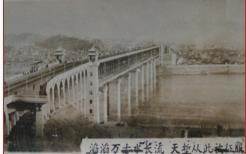

##### 改革开放和社会主义现代化建设时期

##### 中国特色社会主义道路是中国必由之路（1978.12 至今） 拔乱反正与改革开放逐步展开的阶段

##### 伟大的历史转折—党的十一届三中全会

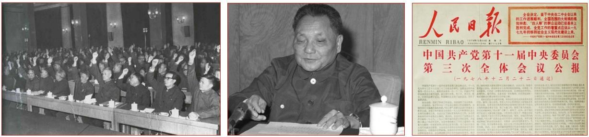

1978 年底，中共中央在北京召开了十一届三中全会，从此，中国进入社会主义现代化建设的新时期，全会作出了把党和国家的工作重心转移到经济建设上来，实行改革开放的伟 大决策。

##### 端正了三条路线：

1.  端正了党的思想路线。重新确立了解放思想、实事求是的思想路线
2.  端正了党的政治路线，把工作重点从阶级斗争为纲转到以经济建设为中心
3.  端正了党的组织路线，开始确立了以邓小平为核心的第二代中央领导集体 确立了一个方针：改革开放

##### 改革开放和现代化建设的新阶段探索中国特色社会主义道路

1982 年，在党的十二大上，邓小平强调指出了，我们的现代化建设，必须从中国的实际出发。无论是革命还是建设，都要注意学习和借鉴外国经验。但是，照抄照搬别国经验、 别国模式，从来不能得到成功。这方面我们有过不少教训。把马克思主义的普遍真理同我国的具体实际结合起来，走自己的道路，建设有中国特色的社会主义，这就是我们总结长期历史经验得出的基本结论。这成为了改革开放和现代化建设的指导思想。

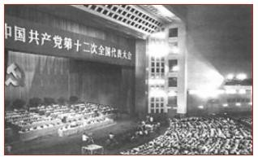

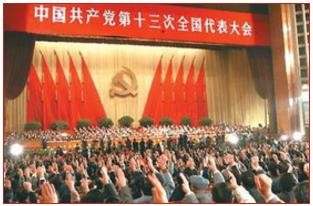1987 年，在党的十三大上，阐明了社会主义初级阶段的理论，明确概括和阐发了党的社会主义初级阶段一个中心，两个基本点的基本路线。

1992 年，以邓小平南方谈话和中共十四大为标志，中国的改革开放和现代化建设进入到了一个历史的新阶段。南方谈话为建设中国特色社会主义理论贡献了新的重要论点，党的

十四大明确了经济体制改革的目标是建立社会主义市场经济体制。

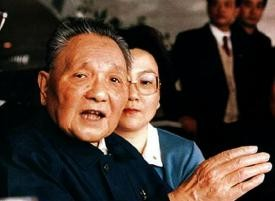

##### “一国两制”构想和香港、澳门回归

“一国两制”是邓小平为了实现中国统一的目标而创造的方针，是中国政府在台湾问题 上的主要方针，也即香港、澳门两个特别行政区所采用的制度。1997 年和 1999 年，香港和澳门相继在这一方针下回归祖国。

##### “三个代表”重要思想的形成

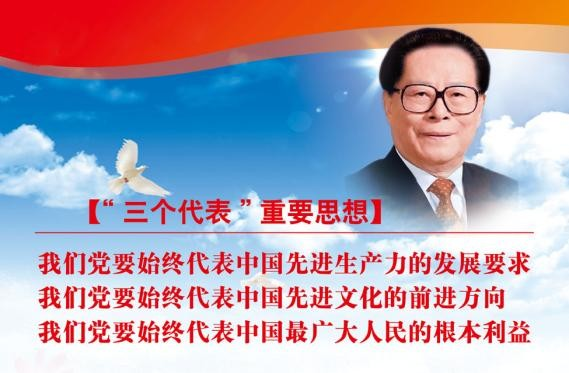

1997 年，中共十五大把邓小平理论确立为党的指导思想并写入党章，强调全党要高举邓小平理论伟大旗帜，抓住机遇，开拓进取实现经济发展和社会进步。

2002 年，中共十六大把三个代表重要思想确立为党的指导思想并写入党章，大会强调全党要高举邓小平理论伟大旗帜，全面贯彻三个代表重要思想，继往开来，与时俱进，全面 建设小康社会，加快建设社会主义现代化，为开创中国特色社会主义事业新局面而奋斗。

##### “科学发展观”重要思想的形成

2003 年 7 月 28 日，胡锦涛在全国防治非典工作会议上的讲话中提出“坚持以人为本， 树立全面、协调、可持续的发展观，促进经济社会和人的全面发展”，按照“统筹城乡发展、统筹区域发展、统筹经济社会发展、统筹人与自然和谐发展、统筹国内发展和对外开放”的要求推进各项事业的改革和发展的方法论——“科学发展观”思想 。

2007 年，党的十七大强调：高举中国特色社会主义伟大旗帜，以邓小平理论和三个代表重要思想为指导，深入贯彻落实科学发展观，继续解放思想，坚持改革开放，促进社会和 谐，为夺取全满建设小康社会而奋斗。

中国共产党第十七次全国代表大会把科学发展观写入党章。

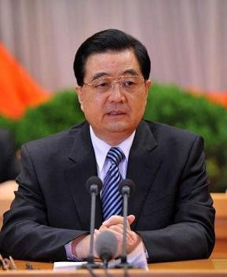

##### 中国共产党第十八次全国代表大会（2012 年 11 月 8 日在北京召开）

大会的主题：

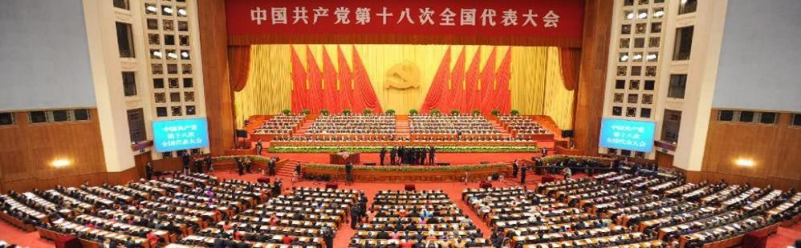高举中国特色社会主义伟大旗帜，以邓小平理论、“三个代表”重要思想、科学发展观为指导，解放思想，改革开放，凝聚力量，攻坚克难，坚定不移沿着中国特色社会主义道路 前行，为全面建成小康社会而奋斗。我们坚定不移高举中国特色社会主义伟大旗帜，既不走 封闭僵化的老路、也不走改旗易帜的邪路。中国特色社会主义道路，中国特色社会主义理论 体系，中国特色社会主义制度，是党和人民九十多年奋斗、创造、积累的根本成就，必须倍 加珍惜、始终坚持、不断发展。

##### 中国共产党第十九次全国代表大会（2017 年 10 月 18 日在北京召开）

大会的主题：

不忘初心，牢记使命，高举中国特色社会主义伟大旗帜，决胜全面建成小康社会，夺取 新时代中国特色社会主义伟大胜利，为实现中华民族伟大复兴的中国梦不懈奋斗。

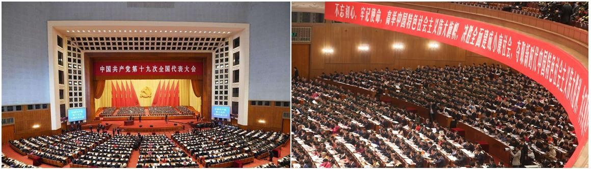

党的十九大是在全面建成小康社会关键阶段、中国特色社会主义发展关键时期召开的一 次十分重要的大会，对鼓舞和动员全党全国各族人民继续推进全面建成小康社会、坚持和发 展中国特色社会主义具有重大意义。

| 十九届四中全 会      | 2019 年10 月                  | 北京 |  全会审议通过《中共中央关于坚持和完善中国特色社会主义制度、推进国家治理体系和治理能力现代化若干重大问题的决定》                                                                                                                                                                                                                                                                                                                                                                                                                                                  |
|----------------------|-------------------------------|------|------------------------------------------------------------------------------------------------------------------------------------------------------------------------------------------------------------------------------------------------------------------------------------------------------------------------------------------------------------------------------------------------------------------------------------------------------------------------------------------------------------------------------------------------------------------|
|       十九届五中全会 |     2020 年10 月26 日 至29 日 | 北京 | 《中共中央关于制定国民经济和社会发展第十四个五年规划和二〇三五年远景目标的建议》 “四个全面”更新为：协调推进全面建设社会主义现代化国家、全面深化改革、全面依法治国、全面从严治党的战略布局。 人均国内生产总值达到中等发达国家水平，中等收入群体显著扩大 人民生活更加美好，人的全面发展、全体人民共同富裕取得更为明显的实质性进展 “十四五”时期经济社会发展“以推动高质量发展为主题，以深化供给侧结构性改革为主线，以改革创新为根本动力，以满足人民日益增长的美好生活需要为根本目的” 坚持创新在我国现代化建设全局中的核心地位，把科技自立自强作为国 家发展的战略支撑 |
|    十九届六中全会    |  2021 年11 月 8 日 至 11 日   | 北京 | 审议通过了《中共中央关于党的百年奋斗重大成就和历史经验的决议》和《关于召开党的第二十次全国代表大会的决议》。 一、四个历史时期，四个伟大飞跃 1.新民主主义革命时期:实现了中国从几千年封建专制政治向人民民主 的伟大飞跃。 2.社会主义革命和建设时期:实现了一穷二白、人口众多的东方大国大步 迈进社会主义社会的伟大飞跃。                                                                                                                                                                                                                                              |

|   |   |   | 改革开放和社会主义现代化建设新时期:推进了中华民族从站起来到 富起来的伟大飞跃。 中国特色社会主义新时代:中华民族迎来了从站起来、富起来到强起来 的伟大飞跃。 二、马克思主义中国化的三次飞跃 毛泽东思想是马克思列宁主义在中国的创造性运用和发展，是被实践证明了的关于中国革命和建设的正确的理论原则和经验总结，是马克思主义中国化的第-次历史性飞跃。 党从新的实践和时代特征出发坚持和发展马克思主义，科学回答了建设中国特色社会主义的发展道路、发展阶段、根本任务、发展动力、发展战略、政治保证、祖国统一、外交和国际战略、领导力量和依靠力量等一系 列基本问题，形成中国特色社会主义理论体系，实现了马克思主义中国化新的飞跃。 习近平新时代中国特色社会主义思想是当代中国马克思主义、二十一世纪马克思主义，是中华文化和中国精神的时代精华，实现了马克思主义中国化新的飞跃。 三、两个确立 党确立习近平同志党中央的核心、全党的核心地位，确立习近平新时代中国特色社会主义思想的指导地位，反映了全党全军全国各族人民共同心愿，对新时代党和国家事业发展、对推进中华民族伟大复兴历史进程具有决定性意义。 |
|---|---|---|-------------------------------------------------------------------------------------------------------------------------------------------------------------------------------------------------------------------------------------------------------------------------------------------------------------------------------------------------------------------------------------------------------------------------------------------------------------------------------------------------------------------------------------------------------------------------------------------------------------------------------------------------------------------------------------------------------------------------------------------------------------------------------------------------------------------------------------------------------------------------------------------------------------------------------------------------------------------------------------------------|

## 第三章 毛泽东思想

##### 第一节 毛泽东思想概述

##### 一、毛泽东思想的形成和发展

##### （一）毛泽东思想形成的社会历史条件

1.  时代背景：二十世纪上半叶，帝国主义战争和无产阶级革命的时代主题。
2.  物质基础：中国社会新的生产力的增长。
3.  阶级条件：中国工人运动的发展。
4.  理论基础：马克思主义在中国的广泛传播及其与中国优秀传统文化的融合。
5.  实践基础：中国共产党领导的革命和建设的实践。
6.  主观条件：毛泽东和以毛泽东为代表的共产党人的个人因素。

##### （二）毛泽东思想的主要内容

毛泽东思想的核心和精髓就是实事求是。它紧紧围绕着中国革命和建设这个主题，提出 了一系列相互密切关联的重要的理论观点，成为一个科学体系。它包含着丰富的内容：

1.  新民主主义革命的理论
2.  关于社会主义革命的理论
3.  关于社会主义建设的理论

##### （三）毛泽东思想形成的历史过程

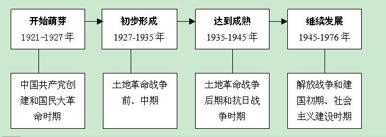

##### 二、毛泽东思想的科学涵义

##### （一）毛泽东思想的提出与发展

1.  “毛泽东思想”一语最早由王稼祥于 1943 年在《解放日报》上发表的《中国共产党与中国民族解放的道路》一文中提出。
2.  在正式文件中，首次出现于 1945 年的中共七大刘少奇的报告《论党》里。
3.  中共七大首次规定毛泽东思想为中国共产党的指导思想并写入党章。

##### （二）毛泽东思想的科学涵义

1.  毛泽东思想是马克思主义在中国的运用和发展。
2.  毛泽东思想是被实践证明了的关于中国革命和建设的正确理论和经验总结。
3.  毛泽东思想是中国共产党的集体智慧的结晶。

    毛泽东思想是中国共产党实现马克思主义基本原理同中国具体实际相结合的第一次历 史性飞跃的理论成果。

##### 【随堂演练】

1.  毛泽东思想确立为我们党的指导思想是在（ ）。
1.  三湾改编
    1.  遵义会议
    2.  中共七大
    3.  七届二中全会
1.  马克思主义中国化的第一个重大理论成果是（ ）。

    A.三民主义 B.不断革命论

2.  毛泽东思想
3.  二次革命论
1.  毛泽东思想在 20 世纪 20 年代后期和 30 年代前期初步形成的主要标志是（ ）。
    1.  农村包围城市道路的开辟和理论上的初步阐述
    2.  《中国社会各阶级的分析》
    3.  着重从思想上建党理论的阐述
    4.  新民主主义理论的形成

##### 三、毛泽东的主要著作

| 发表年份 | 著作名称                  | 主要内容及意义                                                                     |
|----------|---------------------------|------------------------------------------------------------------------------------|
|  1925 年 |  《中国社会各阶级的分析》 | 指出分清敌友是革命的首要问题，农民是革命 的主力军。 该文章是毛泽东思想萌芽的标志。 |

| 1926 年      | 《国民革命和农民运动》            | 指出农民问题是国民革命的中心问题。                                                                                                                                                                                                                                                                                                       |
|--------------|-----------------------------------|------------------------------------------------------------------------------------------------------------------------------------------------------------------------------------------------------------------------------------------------------------------------------------------------------------------------------------------|
|  1928 年     |  《中国的红色政权为什么能够存在》 | 提出“工农武装割据”：在中国共产党的领导 下，以土地革命为基本内容，武装斗争为主要 形式，农村根据地为战略阵地。                                                                                                                                                                                                                             |
|  1930 年     |  《星星之火，可以燎原》           | 该文章是毛泽东思想形成的重要标志，提出了 走“农村包围城市，武装夺取政权”的道路。                                                                                                                                                                                                                                                          |
|  1930 年     |  《反对本本主义》                 | 首次确立了实事求是的重要思想。不唯书、不 唯上、只唯实。没有调查，就没有发言权。                                                                                                                                                                                                                                                          |
|  1939 年     |  《\<共产党人\>发刊词》           | 提出三大法宝： 统一战线、武装斗争、党的建设。党的建设是中国革命胜利的重要保证， 是一个“伟大的工程”。                                                                                                                                                                                                                                     |
|      1939 年 |      《中国革命和中国共产党》     | 分析了中国的社会性质问题，精辟的指出“认 清中国的国情，乃是认清一切革命问题的根本 依据”。首次提出“新民主主义”的概念，系统地阐明了中国革命的对象、任务、动力、性 质、前途和领导权等问题，指出中国革命是无 产阶级的领导的人民大众的反帝反封建的新民主主义革命 阐述了中国革命分为新民主主义革命（必要准 备）和社会主义革命（必然趋势）两步。 |
|  1940 年     |  《新民主主义论》                 | 提出新民主主义革命理论，标志着毛泽东思想 的成熟。                                                                                                                                                                                                                                                                                        |

|            |                               | 政治纲领：建立无产阶级领导的，以工农联盟 为基础的，几个革命阶级联合专政的民主共和 国。                                                                                                                                                          |
|------------|-------------------------------|-------------------------------------------------------------------------------------------------------------------------------------------------------------------------------------------------------------------------------------------------|
|   1943 年  |   《反对党八股》              | 延安整风时期重要著作。延安整风主要内容： 反对主观主义整顿学风，反对宗派主义整顿党风，反对党八股以整顿文风。邓小平指出，把 列宁建党学说发展的最为完备的是毛泽东。                                                                                |
|    1943 年 |    《关于领导方法的若干问题》 | 最早的完整的提出群众路线。从群众中来，到群众中去。第一次从哲学高度对党的群众路线作了理论概括。群众路线体现了党的根本宗 旨，是党的一切工作都必须遵循的根本路线。 有无群众的观点是我党区别于其他一切剥削 阶级政党的根本区别。                     |
|  1945 年   |  《关于若干历史问题的决议》   | 标志着整风运动的结束。采用“惩前毖后、治 病救人”的方针。强调思想上建设党，党的根 本组织原则：民主集中制。                                                                                                                                        |
|    1945 年 |    《论联合政府》             | 指出加强党的领导是争取革命胜利的关键。报 告概括了中国共产党在长期革命斗争中形成的三大作风：理论和实践相结合的作风，和人 民群众紧密地联系在一起的作风以及自我批评的作风。指出这是中国共产党区别于其它政 党的显著标志，全党要保持和发扬这些作风， |

|            |                                 | 更好地团结和率领全国人民，完成党的战略任 务。中国共产党与一切剥削阶级政党相区别的 重要标志                                                                        |
|------------|---------------------------------|-------------------------------------------------------------------------------------------------------------------------------------------------------------------|
|    1947 年 |    《目前形势和我们的任务》     | 第一次提出新民主主义的三大经济纲领： ⑴没收封建阶级的土地归农民所有； ⑵没收蒋介石、宋子文、孔祥熙、陈立夫为首的垄断资本归新民主主义国家所有； ⑶保护民族工商业。    |
|  1948 年   |  《在晋绥干部会议上的讲话》     | 提出了新民主主义革命的总路线：无产阶级领 导的，人民大众的，反对帝国主义、封建主义 和官僚资本主义的革命。                                                          |
|  1949 年   |  《论人民民主专政》             | 人民民主专政的本质特征是对人民实行民主， 对敌人实行专政；人民民主专政的组织形式是人民代表大会制度。                                                               |
|   1949 年  |  《在中共七届二中全会上的报告》 | 工作重心由农村转向城市；第一次明确的提出了执政党的建设问题。两个务必：务必使同志们继续地保持谦虚、谨慎、不骄、不躁的作风， 务必使同志们继续地保持艰苦奋斗的作风。 |
|   1956 年  |   《论十大关系》                | 总结了我国社会主义建设的经验，提出了调动 一切积极因素为社会主义建设事业服务的基本方针，对适合中国情况的社会主义建设道路 进行了初步的探索。                        |

|   |   | 明确了建设社会主义的根本思想是必须根据 本国情况走自己的道路。 |
|---|---|---------------------------------------------------------------|

##### 【随堂演练】

1.  “革命不是请客吃饭，不是做文章，不是绘画绣花，不能那样雅致，那样从容不迫，文质彬彬，那样温良恭俭让。革命是暴动，是一个阶级推翻另一个阶级的暴烈的行动”。这段话出自毛泽东的（ ）。
2.  《中国社会各阶级的分析》
3.  《湖南农民运动考察报告》
4.  《井冈山的斗争》
5.  《星星之火，可以燎原》
1.  毛泽东在《论十大关系》中首先论述的是（ ）。
    1.  重工业、轻工业和农业的关系
    2.  沿海工业和内地工业的关系
    3.  经济建设和国防建设的关系
    4.  中央和地方的关系
1.  毛泽东提出“不做正确的调查同样没有发言权”的口号的著作是（ ）。
    1.  《关于调查人口和土地状况的通知》
    2.  《反对本本主义》
    3.  《改造我们的学习》
1.  《关于领导方法的若干问题》

##### 第二节 新民主主义革命理论

##### 一、近代中国社会与资产阶级民主革命

近代中国国情：半殖民地半封建社会。 主要矛盾：帝国主义与中华民族的矛盾。

近代中国的两大历史任务：一是求得民族独立和人民解放；二是实现国家繁荣富强和人 民共同富裕。

旧民主主义革命向新民主主义革命转变：1919 年爆发的五四运动，成为中国新民主主义的开端。

##### 二、新民主主义革命的总路线

新民主主义革命总路线的完整提出：1948 年 4 月，毛泽东《在晋绥干部会议上的讲话》中完整提出新民主主义革命总路线，即无产阶级领导的，人民大众的，反对帝国主义、封建主义和官僚资本主义的革命。

新民主主义革命的领导：无产阶级。中国新民主主义革命的胜利，主要原因就是中国共 产党的正确领导。无产阶级必须同资产阶级争夺领导权，而建立以工农联盟为基础的广泛的 统一战线，则是实现无产阶级领导权的关键。（谁领导?）

新民主主义革命的动力：人民大众，包括无产阶级、农民阶级、城市小资产阶级和民族 资产阶级。（谁革命？）

新民主主义革命的对象：帝国主义、封建主义、官僚资本主义。（革谁命？）

##### 新民主主义的特点：

一是有新的领导阶级； 二是有新的时代背景； 三是有新的指导思想； 四是有新的革命道路； 五是有新的革命前途。

领导阶级的不同是新旧民主主义革命的本质区别。

##### 旧民主主义革命与新民主主义革命的异同

|  相同点   | 社会性质：都发生在半殖民地半封建社会 革命任务：都是反对外国资本主义侵略和本国封建统治 革命性质：都属于资产阶级民主革命的范畴                                                                                                                                                                                   |
|-----------|----------------------------------------------------------------------------------------------------------------------------------------------------------------------------------------------------------------------------------------------------------------------------------------------------------------|
|    不同点 | 领导力量：资产阶级，无产阶级（根本区别） 指导思想：资产阶级的平等、自由思想和民主共和观念；马克思主义 革命前途：建立资产阶级民主共和国；完成民主革命任务后，还要进入社会主义社会 结果不同：革命任务没有完成，社会性质没有改变；新民主主义革命的胜 利成为社会主义的必要准备，社会主义是新民主主义革命的必然结果 |

##### 三、新民主主义的基本纲领

1.  新民主主义的政治纲领

    建立无产阶级领导的各个革命阶级联合专政的民主共和国。

人民民主专政是中国革命的主要经验和主要纲领。革命的根本问题是国家政权问题。中 国共产党的领导人民奋斗，就是要建立人民自己的政权，这是工人阶级（经过共产党）领导 的以工农联盟为基础的人民民主政权，这是我们的主要经验和纲领。

1.  新民主主义的经济纲领

    三大经济纲领：一是没收封建地主阶级的土地归农民所有；二是没收四大家族官僚资本 归新民主义国家所有；三是保护民族工商业。

    新民主主义的五种经济成分：社会主义国营经济、半社会主义性质的合作社经济、私人 资本主义经济、个体经济、国家资本主义经济。

1.  新民主主义的文化纲领

    无产阶级领导的、人民大众的、反帝反封建的文化，是以共产主义思想为指导的民族的、 科学的、大众的文化。

##### 【随堂演练】

1.  第一次提出了新民主主义革命的科学概念的著作是（ ）。
    1.  《新民主主义论》
    2.  《中国革命和中国共产党》C.《论人民民主专政》

        D.《论联合政府》

1.  在中国革命进程中，具有新民主主义革命和社会主义革命双重性质的事件是（ ）。
1.  没收封建阶级的土地归农民所有
    1.  没收官僚资本归新民主主义国家所有
    2.  接收帝国主义在华企业归新民主主义国家所有
    3.  赎买民族工商业归人民民主专政国家所有
1.  近代中国的国情是（ ）
    1.  封建社会
    2.  资本主义初级阶段
    3.  半殖民地半封建社会
    4.  前资本主义社会
1.  新旧民主主义革命的分水岭是（ ）
    1.  五四运动
    2.  新文化运动
    3.  中国共产党的成立
    4.  辛亥革命的失败
1.  新民主主义革命路线的核心是（ ）。
    1.  无产阶级的领导
    2.  人民大众的参与
    3.  工农联盟的巩固
    4.  人民军队的建设

##### 四、新民主主义革命的基本经验——三大法宝

1.  武装斗争
2.  中国革命必须以长期的武装斗争为主要形式
3.  中国武装斗争实质是无产阶级领导的以农民为主体的革命战争

    毛泽东指出:“中国共产党的武装斗争，就是无产阶级领导之下的农民战争。”

4.  新型人民军队的建设的基本原则：全心全意为人民服务是人民军队的惟一宗旨；党对 军队绝对领导是人民军队的根本原则；政治工作是人民军队的生命线。
1.  统一战线
2.  中国新民主主义革命时期的统一战线，包含着两个联盟。

    一是工人阶级和其他劳动人民的联盟；二是工人阶级同可以合作的非劳动人民的联盟

1.  最广泛的统一战线：全体社会主义劳动者、拥护社会主义的爱国者、拥护祖国统一的 爱国者（十一届三中全会）、社会主义事业建设者、致力于中华民族伟大复兴的爱国者。
1.  党的建设
2.  在中国建设一个马克思主义政党是一项伟大的工程

    在半殖民地半封建的农村和长期战争环境下，怎样建设一个全国范围的具有广大群众性 的、思想上政治上组织上完全巩固的无产阶级政党的问题，毛泽东在 1939 年 10 月《〈共产党人〉发刊词》中把它称之为一项“伟大的工程”。

1.  党的建设的主要内容

    ①着重从思想上建党。

    ②坚持党的民主集中制原则。民主集中制是中国共产党的根本组织原则，民主集中制的基本 要求是：个人服从组织，少数服从多数，下级服从上级，全党服从中央。

    ③继承和发扬党的优良传统和作风。毛泽东在《论联合政府》中概括了中国共产党的三大优 良传统与作风，即理论联系实际，密切联系群众，批评与自我批评。

    ④正确处理党内矛盾和开展党内斗争，开展整风运动是进行马克思主义教育的好形式。 延安整风运动：反对主观主义整顿学风（核心），反对宗派主义整顿党风，反对党八股

    以整顿文风。

##### 【随堂演练】

1.  延安整风运动的内容不包括（ ）。
    1.  反对主观主义
    2.  反对党八股
    3.  反对宗派主义
    4.  反对官僚主义
1.  中国共产党在中国革命中战胜敌人的三大法宝是（ ）。
    1.  土地革命、党的建设、武装斗争
    2.  武装斗争、统一战线、党的建设
    3.  统一战线、土地革命、武装斗争
    4.  工人运动、农民运动、武装斗争
1.  中国共产党在新民主主义革命领导权问题上有着深刻认识，党认为实现对革命的领导权的 根本保证是（ ）。
2.  动员全民开展武装斗争
3.  建立最广泛的人民统一战线
4.  加强中国共产党的建设
5.  扩大革命的影响力和控制力
1.  在革命统一战线中，基本的、主要的联盟是（ ）。
    1.  工人阶级同其他劳动人民的联盟
    2.  劳动者与非劳动者之间的联盟
    3.  进步势力与中间势力的联盟
    4.  工人阶级同民族资产阶级的联盟

##### 第三节 社会主义改造理论

##### 一、新民主主义社会向社会主义社会过渡的思想

中华人民共和国的成立，标志着中国进入了新民主义社会。它是一个带有过渡性质的社

会。

##### 主要矛盾：

1949 年-1952 年，国内的主要矛盾是人民大众与帝国主义、封建主义和国民党反动派残余势力的矛盾；

1952 年后至 1956 年，国内的主要矛盾是无产阶级同资产阶级的矛盾，社会主义道路

和资本主义道路之间的矛盾。

1956 年三大改造完成之后，国内的主要矛盾是人民对于建立先进的工业国的要求同落后的农业国的现实之间的矛盾,人民对于经济文化迅速发展的需要同当前经济文化不能满足人民需要的状况之间的矛盾。

##### 二、党在过渡时期的总路线

过渡时期总路线的基本内容。要在一个相当长的时期内，逐步实现国家的社会主义工业化，并逐步实现国家对农业、手工业和资本主义工商业的社会主义改造（即“一化三改造”）。

##### 三、社会主义改造的基本经验

农业：自愿互利、典型示范和国家帮助的原则，从互助组-初级社-高级社。 手工业：供销合作小组——供销合作社——生产合作社。

资本主义工商业：对官僚资本采取无偿没收的政策，对民族资本实行利用、限制、改造 的方针，采取和平赎买政策。

##### 四、社会主义制度在中国的确立

1956 年我国社会主义改造取得了决定性胜利，标志着中国已经从新民主主义社会进入到社会主义社会，我国开始进入社会主义初级阶段。

1.  以生产资料公有制为基础的社会主义经济制度已经确立起来。
    1.  我国的政治领域也发生重大变化，确立了中国共产党领导的人民民主专政的社会主义基本 政治制度。
        1.  我国社会的阶级关系也发生了根本的变化。
1.  我国社会的主要矛盾也发生了变化。

##### 【随堂演练】

1.  中华人民共和国的成立，标志着中国已从半殖民地半封建社会进入到（ ）。
    1.  资本主义社会
    2.  新民主主义社会
    3.  社会主义社会
    4.  共产主义社会
1.  社会主义在中国确立的主要标志是（ ）。
    1.  中华人民共和国的成立
    2.  第一个五年计划的完成
    3.  中华人民共和国宪法的颁布
    4.  三大改造的胜利完成
1.  我国对个体手工业进行社会主义改造的主要方式是（ ）。
    1.  赎买
    2.  统购统销
    3.  公私合营
    4.  合作化

4.（多选）20 世纪 50 年代中期，社会主义改造基本完成，标志着（ ）。

1.  社会主义制度在我国已经确立
2.  我国进入了社会主义初级阶段
3.  我国步入了社会主义改革时期
4.  我国实现了新民主主义向社会主义过渡
1.  社会主义改造基本完成后中国共产党的中心任务是（ ）。
    1.  正确处理人民内部矛盾，巩固社会主义制度
    2.  调动一切积极因素，为社会主义事业服务
    3.  加强和改进党的建设，巩固党的执政地位
    4.  集中力量发展生产力，建设社会主义现代化的强国

##### 第四节 社会主义建设理论一、社会主义经济建设

“统筹兼顾、适当安排”。既反保守又反冒进，在综合平衡中稳步前进的方针适合中国国情的中国工业化道路。

##### 二、社会主义政治和文化建设

人民代表大会制度是我国的根本政治制度。中国共产党同各民主党派“长期共存，互相 监督”的方针。实现民族平等的民族区域自治制度。

发展科学技术和教育事业，建设宏大的工人阶级知识分子队伍。我国繁荣社会主义文化 科学事业实行“百花齐放，百家争鸣”的方针，对待历史和传统文化采取“古为今用”的方 针；对待外国文化采取“洋为中用”的方针。

##### 三、社会主义国防和外交建设

| 时期        | 政策                        | 具体内容                                                                              |
|-------------|-----------------------------|---------------------------------------------------------------------------------------|
|    建国初期 |  “另起炉灶”                 | 不承认国民党政府同各国建立的旧的外交关系，而 要在新的基础上同各国另行建立新的外交关系 |
|             |  “打扫干净屋子再请客”       | 清除帝国主义在中国的残余势力，取消帝国主义在 华的一切特权。以巩固新的中国的独立和主权 |
|             | “一边倒”                    | 新中国倒向社会主义阵营一边                                                            |
|  50 年代    | 和平共处五项原则、求同 存异 | 互相尊重主权和领土完整、互不侵犯、互不干涉内 政、平等互利、和平共处                   |

##### 【随堂演练】

1.  我国处理国际关系的基本准则是（ ）。
    1.  和平共处五项原则
        1.  反对霸权主义，维护世界和平
            1.  建立国际政治经济 新秩序
            2.  一个国家，两种制度
1.  我国的民主党派是（ ）。
    1.  执政党
        1.  参政党
            1.  在野党
1.  反对党
1.  社会主义制度建立后，民主党派的性质是（ ）。

    A.小资产阶级政党B.各阶级的联盟

2.  为社会主义服务的政治联盟
3.  资产阶级政党
1.  从 1956 年起，毛泽东领导全党开始了探索中国自己的社会主义建设道路的艰难曲折的历程，（ ）成为全党探索中国社会主义建设道路的先声。
2.  《论无产阶级专政的历史经验》
3.  《论十大关系》
4.  《一九五七年夏季的形势》
5.  《关于正确处理人民内部矛盾的问题》

##### 第五节 毛泽东思想活的灵魂一、毛泽东思想的活的灵魂

1.  实事求是
2.  实事求是是毛泽东思想的精髓
3.  实事求是辩证唯物主义和历史唯物主义的思想路线,是毛泽东思想的出发点、根本点, 是毛泽东思想活的灵魂三个方面的有机统一中最具特色、最根本的原则。
1.  群众路线
2.  群众路线的基本内涵和基本要求

    群众路线,就是一切为了群众,一切依靠群众;从群众中来,到群众中去。

3.  群众路线是党的根本工作路线

    立党为公，执政为民，是我们党同一切剥削阶级政党的根本区别。

1.  独立自主
2.  独立自主,自力更生,是从中国实际出发，依靠群众进行革命和建设的必然结论
3.  独立自主的基本内涵和基本要求
4.  独立自主、自力更生是中国革命和建设的基本立足点

##### 二、在新的历史条件下,坚持和发展毛泽东思想

毛泽东思想是中国共产党实现马克思主义基本原理同中国具体实际相结合的第一次历 史性飞跃的理论成果。

##### 【随堂演练】

1.  毛泽东思想的活的灵魂是（ ）
    1.  武装斗争、统一战线、党的建设
    2.  实事求是、群众路线、独立自主
    3.  武装斗争、土地革命、根据地建设
    4.  理论与实践相结合、密切联系群众、批评与自我批评
1.  毛泽东思想的精髓和根本出发点是（ ）。
    1.  实事求是
    2.  群众路线
    3.  独立自主
    4.  党的建设

## 第四章 中国特色社会主义理论体系

##### 一、中国特色社会主义理论体系的内涵

1.  邓小平理论初步回答了“什么是社会主义、怎样建设社会主义”的问题；
2.  “三个代表”重要思想创造性地回答了建设什么样的党、怎样建设党的问题；
3.  科学发展观则着力解决了“实现什么样的发展、怎样发展”的问题。
4.  习近平新时代中国特色社会主义思想重在回答“坚持和发展什么样的中国特色社会主 义、怎样坚持和发展中国特色社会主义”的问题。

##### 二、中国特色社会主义理论体系是几代共产党人带领人民不懈探索的结晶

中国特色社会主义理论体系是改革开放以来我们党形成并逐步丰富和发展起来的科学理论体系，总体上属于马克思列宁主义同中国实际相结合的第二次历史性飞跃的理论成果。

##### 第一节 邓小平理论一、邓小平理论概述

##### （一）什么是邓小平理论

1.  定义：邓小平理论是马克思主义与当代中国实际和时代特征相结合的新成果，是毛泽东思想在新的历史条件下的继承和发展，是当代中国的马克思主义，总结了我国社会主义兴衰成败的经验教训，形成了新的科学理论体系，对社会主义本质的认识提高到了新的发展水平， 是马克思主义在中国发展的新阶段。
2.  核心内容：党在社会主义初级阶段的基本路线
3.  精髓：解放思想、实事求是
4.  主题：什么是社会主义，怎样建设社会主义

##### （二）邓小平理论形成背景

1.  理论基础——马克思列宁主义和毛泽东思想
2.  历史根据——社会主义建设正反两方面的经验总结
3.  现实依据——十一届三中全会以来中国的改革开放和现代化建设实践
4.  时代背景——和平与发展是当今时代的主题

##### 二、邓小平理论的主要内容

##### （一）灵魂和精髓

1.  解放思想、实事求是邓小平理论的精髓和活的灵魂。
2.  解放思想是实事求是的内在要求和前提；实事求是是解放思想的目的和归宿。

##### （二）社会主义初级阶段

1.  含义

    十一届六中全会通过了《关于建国以来党的若干历史问题的决议》首次提出，我国的社 会主义制度还是处于初级阶段。

2.  我国已经进入社会主义社会
3.  我国的社会主义社会正处于并将长期处于初级阶段
1.  社会主义初级阶段的主要矛盾

    社会主义初级阶段的主要矛盾是人民日益增长的物质文化需要同落后的社会生产之间 的矛盾（1981 年十一届六中全会进行的规范表述）。

1.  社会主义初级阶段的基本路线
2.  主要内容：领导和团结各族人民，以经济建设为中心，坚持四项基本原则，坚持改革 开放，自力更生，艰苦创业，为把我国建设成为富强、民主、文明、和谐的社会主义现代化 国家而奋斗。
3.  一个中心，两个基本点：

    ①以经济建设为中心，是我们党和国家兴旺发达、长治久安的根本要求。

    ②四项基本原则是立国之本，是我们党和国家生存发展的政治基石。

    四项基本原则——坚持社会主义道路、坚持人民民主专政、坚持党的领导、坚持马列主义毛泽东思想

    ③改革开放是强国之路，是我们党和国家发展进步的活力源泉。

##### （三）三个有利于

1.党的十二届三中全会指出：应把是否有利于发展生产力作为检验一切改革的是成败的主要 标准。

2.1992 年南方谈话，邓小平于把生产力的标准拓展为“三个有利于”的标准

3.党的十四大：判断改革和各方面工作的是非得失，要以是否有利于发展社会主义社会的生产力，是否有利于增强社会主义国家的综合国力，是否有利于提高人民的生活水平为标准。

##### （四）社会主义本质论

1.  社会主义本质

    邓小平于 1992 年南方谈话中对社会主义的本质这一重大问题作出了总结性的理论概

括。邓小平指出——社会主义的本质，是解放生产力、发展生产力，消灭剥削、消除两极分化，最终实现共同富裕。

1.  社会主义根本任务——解放生产力和发展生产力

##### （五）社会主义改革开放理论

1.  改革开放是一场伟大的革命

    1978 年，中国共产党召开了具有重大历史意义的十一届三中全会，开启了改革开放历史新时期，从此，中国共产党人和中国人民走上了改革开放的道路。

    改革是中国的第二次革命，是社会主义发展的直接动力，是社会主义制度的自我完善和 自我发展。改革开放，是新时期中国最鲜明的特征。没有改革开放，就没有中国特色的社会 主义。

1.  对外开放是全方位的对外开发。是对世界所有国家的开放，不仅限于经济领域的开放，还 包括科技、教育、文化、党派团体等领域的全方位开放。

3.1980 年，邓小平首倡，先后在深圳、珠海、汕头、厦门建立了四个经济特区，到 1992 年后，已形成经济特区——沿海开放城市——沿海经济开放区——沿江经济区——内地中 心城市的具有全方位、多层次、宽领域的对外开放格局。

经济特区：深圳、珠海、厦门、汕头、海南岛、喀什、霍尔果斯

4.2001 年我国正式加入世界贸易组织（WTO），标志着我国对外开放进入到一个新的阶段。

5.2013 年上海自由贸易试验区

2015 年广东、福建、天津自由贸易试验区

2017 年[辽宁](https://baike.baidu.com/item/%E4%B8%AD%E5%9B%BD%EF%BC%88%E8%BE%BD%E5%AE%81%EF%BC%89%E8%87%AA%E7%94%B1%E8%B4%B8%E6%98%93%E8%AF%95%E9%AA%8C%E5%8C%BA)、[浙江](https://baike.baidu.com/item/%E4%B8%AD%E5%9B%BD%EF%BC%88%E6%B5%99%E6%B1%9F%EF%BC%89%E8%87%AA%E7%94%B1%E8%B4%B8%E6%98%93%E8%AF%95%E9%AA%8C%E5%8C%BA)、[河南](https://baike.baidu.com/item/%E4%B8%AD%E5%9B%BD%EF%BC%88%E6%B2%B3%E5%8D%97%EF%BC%89%E8%87%AA%E7%94%B1%E8%B4%B8%E6%98%93%E8%AF%95%E9%AA%8C%E5%8C%BA)、[湖北](https://baike.baidu.com/item/%E4%B8%AD%E5%9B%BD%EF%BC%88%E6%B9%96%E5%8C%97%EF%BC%89%E8%87%AA%E7%94%B1%E8%B4%B8%E6%98%93%E8%AF%95%E9%AA%8C%E5%8C%BA)、[重庆](https://baike.baidu.com/item/%E4%B8%AD%E5%9B%BD%EF%BC%88%E9%87%8D%E5%BA%86%EF%BC%89%E8%87%AA%E7%94%B1%E8%B4%B8%E6%98%93%E8%AF%95%E9%AA%8C%E5%8C%BA)、[四川](https://baike.baidu.com/item/%E4%B8%AD%E5%9B%BD%EF%BC%88%E5%9B%9B%E5%B7%9D%EF%BC%89%E8%87%AA%E7%94%B1%E8%B4%B8%E6%98%93%E8%AF%95%E9%AA%8C%E5%8C%BA)、[陕西自由贸易试验区](https://baike.baidu.com/item/%E4%B8%AD%E5%9B%BD%EF%BC%88%E9%99%95%E8%A5%BF%EF%BC%89%E8%87%AA%E7%94%B1%E8%B4%B8%E6%98%93%E8%AF%95%E9%AA%8C%E5%8C%BA)。

6.正确处理改革发展和稳定的关系：改革是动力，发展是目的，稳定是前提。

##### （六）“一国两制”的科学构想

“一个国家，两种制度”的构想，是以邓小平为代表的中国共产党人，在新的历史条件 下，为和平解决台湾、香港和澳门的问题，实现祖国和平统一，把马克思主义的基本原理同 中国实际相结合的产物。

一国两制的基本内容：在祖国统一的前提下，国家的主体坚持社会主义制度，同时在台 湾、香港、澳门保持原有的资本主义制度和生活方式长期不变。

##### 特别行政区享受的特殊权力和法律保护：

保证台湾、香港、澳门的高度自治和繁荣稳定。在统一的中华人民共和国内，依宪法规 定在台、港、澳设置特别行政区。特别行政区不同于中国内地其他省、市、自治区，享有高 度的自治权利。特别行政区除在外交和国防方面服从中央政府外，拥有行政管理权、立

法权、独立的司法权和终审权；特别行政区可以实行单独的财政预算，中国政府不征税；中 央政府不干预特别行政区的内部事务；特别行政区人民的各种合法权益，以及外国人和侨胞 在此地的私人投资等，均予以法律保护；台湾特别行政区还可以保留自己的军队，中央政府 不派军队到台湾去。

##### 【随堂演练】

1.  “尽职而不越位、帮忙而不添乱、切实而不表面”“协商不代替、监督不对立，为了大目标、同唱一台戏”。概括了政协的主要职能是（ ）。
2.  维护国家主权和政治统一
3.  维护祖国的统一
4.  领导统一战线
5.  政治协商、民主监督和参政议政
1.  邓小平理论首要的基本理论问题是（ ）。
    1.  发展才是硬道理
    2.  解放生产力，发展生产力
    3.  什么是社会主义，怎样建设社会主义
    4.  发展是党执政兴国的第一要务
1.  建设有中国特色的社会主义理论精髓是（ ）
    1.  坚持以经济建设为中心
    2.  坚持四项基本原则，坚持改革开放
    3.  解放思想，实事求是
    4.  坚持党的基本路线
1.  邓小平理论形成和发展的理论基础是（ ）
1.  马列主义和毛泽东思想
    1.  我国和其他国家社会主义建设的经济总结
    2.  我国改革开放和现代化建设的经验总结
    3.  时代主题的转换和新技术革命的兴起
1.  【多选】邓小平理论的科学体系包含的主要内容有（ ）
    1.  社会主义本质论
    2.  社会主义初级阶段理论
    3.  社会主义改革开放理论
    4.  社会主义市场经济理论
1.  社会主义的根本目标是（ ）
    1.  解放生产力，发展生产力
    2.  消灭阶级，消除两极分化
    3.  最终实现共同富裕
    4.  增强社会主义国家综合国力
1.  我国对外开放是以（ ）为基础。
    1.  独立自主、自力更生
    2.  经济建设
    3.  四项基本原则
    4.  科学文化建设
1.  “一国两制”的战略构想基本前提是（ ）
    1.  为现代化建设创造条件
    2.  实现中华民族的伟大复兴
    3.  港澳台地区实行高度自制
    4.  国家主权统一于中华人民共和国
1.  实现最广大人民根本利益的基础条件是（ ）。
    1.  推进政治体制改革
    2.  完善法律制度
    3.  发展先进生产力
    4.  发展先进文化
1.  党在社会主义初级阶段基本路线的内容可概括为（ ）。
2.  坚持四项基本原则
3.  坚持改革开放
4.  “一个中心”、“两个基本点”
5.  自力更生、艰苦创业
1.  社会主义初级阶段基本路线的核心和主体是（ ）

    A.经济建设B.改革开放

1.  四项基本原则
2.  精神文明建设
1.  对小平提出要搞清‘什么是社会主义，怎样建设社会主义’其实质就是要求在（ ） 的基础上，进一步认清社会主义本质。

    A.坚持社会主义基本制度B.解放思想 C.发展生产力

    D.拨乱反正

1.  【多选】根据宪法规定，香港特别行政区享有行政管理权和（ ）
2.  立法权
3.  独立司法权
4.  外交权D.终审权

##### 第二节 “三个代表”重要思想和科学发展观一、“三个代表”

##### （一）重要内涵

1.  内容：中国共产党始终代表中国先进生产力的发展要求（基础和前提），代表中国先进文化的前进方向（灵魂和旗帜），代表中国最广大人民的根本利益（主体和目的）。
    1.  精髓：解放思想、实事求是、与时俱进
1.  解决的问题：“三个代表”重要思想创造性地回答了建设一个什么样的党，怎样建设党。

##### （二）根本要求

贯彻“三个代表”重要思想，关键在坚持与时俱进，核心在坚持党的先进性，本质在坚 持执政为民。

1.  与时俱进是马克思主义的理论品质，是马克思主义政党应有的精神状态，是中国共产党始 终紧跟时代的基本前提。
2.  坚持党的先进性，是共产党永葆生机活力和增强创造力、凝聚力、战斗力的重要保证，是 巩固党的执政地位的前提、依据和基础。
3.  立党为公，执政为民。实现人民的愿望，满足人民的需求，维护人民的利益，是“三个代 表”重要思想的根本出发点和落脚点

##### 二、科学发展观

##### （一）加入党章

十七大将科学发展观写进党章；十八大将其作为党的指导思想写进党章

##### （二）内涵

1.  主要内容：科学发展观，第一要义是发展、核心是以人为本、基本要求是全面协调可持续、 根本方法是统筹兼顾。科学发展观最鲜明的精神实质是：解放思想、实事求是、与时俱进、求真务实
2.  五个统筹：城乡发展、区域发展、经济社会发展、人与自然和谐发展、国内发展与对外开 放。
1.  实质：要实现经济社会更好更快地发展
2.  精神实质：解放思想、实事求是、与时俱进、求真务实

## 第五章 党的报告解读

##### 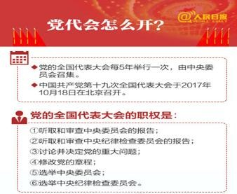第一节 十九大报告解读一、大会概要

##### 二、高频考点

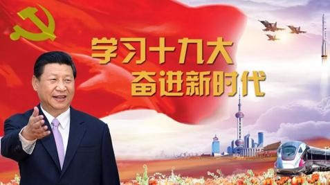

##### （一）大会主题

不忘初心，牢记使命，高举中国特色社会主义伟大旗帜，决胜全面建成小康社会，夺取 新时代中国特色社会主义伟大胜利，为实现中华民族伟大复兴的中国梦不懈奋斗

##### （二）共产党人的初心和使命

十九大报告提出，中国共产党人的初心和使命，就是为中国人民谋幸福，为中华民族谋 复兴。

##### （三）中国特色社会主义进入新时代

中国特色社会主义进入新时代，是报告作出的一个重大判断。

与中国特色社会主义进入新时代相应，我国社会主要矛盾也发生转化。

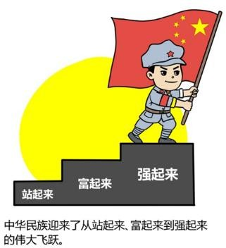

##### （四）我国社会主要矛盾变化

原表述：“人民日益增长的物质文化需要同落后的社会生产之间的矛盾”

现表述：“人民日益增长的美好生活需要和不平衡不充分的发展之间的矛盾”。 基本国情：处于并将长期处于社会主义初级阶段

国际地位：我国是世界最大发展中国家

##### 知识链接

1840-1949 年间中国社会主要矛盾分析

1840 年——1919 年旧民主主义革命时期

主要矛盾：帝国主义和中华民族的矛盾，封建主义和人民大众的矛盾。1919 年——1949 年新民主主义革命时期

主要矛盾：帝国主义和中华民族的矛盾，封建主义和人民大众的矛盾，（官僚资本主义的矛盾）。

1949 年——1956 年社会主义革命时期国际矛盾：新中国同帝国主义的矛盾

国内矛盾：工人阶级和资产阶级的矛盾

1956 年党的八大上，“人民对于经济文化迅速发展的需要同当前经济文化不能满足人民需要的状况之间的矛盾”，被视为当时中国国内主要矛盾的内容。

改革开放初的党对中国社会主要矛盾的判断是“人民日益增长的物质文化需要和落后的 社会生产之间的矛盾”。

##### （五）新时代中国特色社会主义思想

1.  对“马 列 毛 邓 三 科”的继承和发展
2.  是马克思主义中国化最新成果
1.  党和人民实践经验和集体智慧的结晶
2.  是中国特色社会主义理论体系的重要组成部分。

##### （六）“党政军民学，东 西南北中，党是领导一切的”

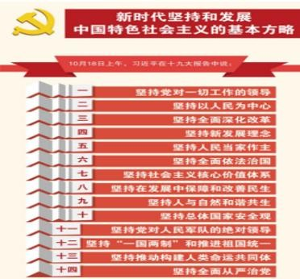

##### （七）“两个一百年”奋斗目标的历史交汇期

第一个一百年，是到中国共产党成立 100 年时（2021 年）全面建成小康社会；

第二个一百年，是到新中国成立 100 年时（2049 年）建成富强、民主、文明、和谐的社会主义现代化国家。

##### （八）新时代中国特色社会主义发展的安排

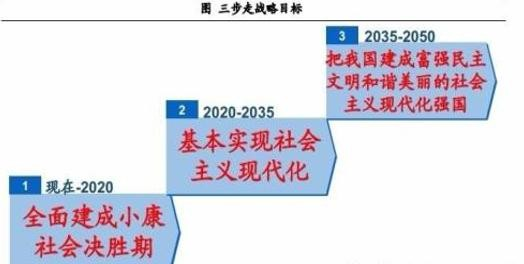

从 2020 年到本世纪中叶可以分两个阶段来安排

①从 2020→2035，在全面建成小康社会的基础上，再奋斗十五年，基本实现社会主义现代化。

②从 2035→本世纪中叶，在基本实现现代化的基础上，再奋斗十五年，把我国建成富强民主文明和谐美丽的社会主义现代化强国。

##### 知识链接—经济新常态

习近平指出中国经济呈现出新常态，有几个主要特点 一是从高速增长转为中高速增长。

二是经济结构不断优化升级，第三产业消费需求逐步成为主体，城乡区域差距逐步缩小， 居民收入占比上升，发展成果惠及更广大民众。

三是从要素驱动、投资驱动转向创新驱动。

**例题：**党的十八届五中全会提出了引领中国发展的“五大理念”，即创新、协调、绿色、开放、共享。下列发展举措中，不符合“五大理念”的是（ ）。

1.  实施“京津冀一体化”“长江经济带”战略
    1.  把发展、民生、社会建设融为一体，减少贫困人口
1.  充分利用劳动力资源丰富优势，大力发展生产要素驱动的作用
    1.  推动建立绿色低碳循环发展产业体系，实施近零碳排放区示范工程

**例题：**日前，习近平主席在亚太经合组织工商领导人峰会上表示，新常态将给中国带来新的 发展机遇。下列关于我国经济发展“新常态”的主要特点描述正确的一项是（ ）。 A.从高速增长转为低速增长

1.  从投资驱动转向要素驱动
2.  经济结构不断优化升级
3.  面临的挑战趋于常态化

##### （九）坚持在发展中保障和改善民生

十九大报告提出，要坚持在发展中保障和改善民生，在幼有所育、学有所教、劳有所得、 病有所医、老有所养、住有所居、弱有所扶上不断取得新进展，保证全体人民在共建共享发展中有更多获得感。

##### （十）建设现代化经济体系

十九大报告指出，我国经济已由高速增长→高质量发展阶段，正处在转变发展方式、优 化经济结构、转换增长动力的攻关期，建设现代化经济体系是跨越关口的迫切要求和我国发 展的战略目标。

##### （十一）实施乡村振兴战略

十九大报告提出实施乡村振兴战略，并将其与科教兴国战略、人才强国战略、创新驱动

发展战略、区域协调发展战略、可持续发展战略、军民融合发展战略并列。

农业农村农民问题是关系国计民生的根本性问题，必须始终把解决好“三农”问题作为 全党工作重中之重。

##### （十二）推进合宪性审查

十九大报告提出，加强宪法实施和监督， 推进合宪性审查工作，维护宪法权威。

##### 知识链接：

1.2012 年是 1982 年宪法即现行宪法颁布三十周年。宪法作为国家根本法，对国家经济、社会、法治、文化等方方面面产生了重大影响，宪法确立了中国特色社会主义道路，指导中 国的改革开放取得了巨大成就。

1.  12 月 4 日，是中国的“宪法日”
2.  2015 年 7 月 1 日，全国人大常委会表决通过实行宪法宣誓制度的决定。

    （宪法宣誓的主体：一是由全国人大选举或决定任命的；二是在全国人大闭会期间，由全国 人大常委会任命或决定任命的；三是由国务院及其各部门、最高人民法院、最高人民检察院 任命的；四是由地方各级人大及县级以上地方各级人大常委会选举或决定任命，以及地方各 级人民政府、人民法院、人民检察院任命的。）

    **例题：**根据全国人大常委会关于实行宪法宣誓制度的决定，实行宪法宣誓的人员不包括

    （ ）

    1.  各级人民政府任命的国家工作人员
    2.  各级人民法院、人民检察院任命的国家工作人员
1.  党的机关、政协机关、民主党派和工商联等机关的工作人员
    1.  各级人大及县级级以上各级人大常委会选举或决定任命的国家工作人员

##### （十六）生态文明建设是千年大计

十九大报告提出，坚持人与自然和谐共生，建设生态文明是中华民族永续发展的千年大

计。

##### （十七）新时代党的强军思想

十九大提出确立新时代党的强军思想在国防和军队建设中的指导地位。（此前的表述是

“党在新形势下的强军思想”。）

##### （十八）新型国际关系

建设相互尊重、公平正义、合作共赢的新型国际关系。

##### （十九）打铁必须自身硬

十九大报告提出，打铁必须自身硬。

##### （二十）新时代党的建设总要求

##### （二十一）反腐败斗争新表述

报告作出这样的宣示：“反腐败斗争压倒性态势已经形成并巩固发展、巩固压倒性态势、夺取压倒性胜利的决心必须坚如磐石”。

在“不敢腐的目标初步实现，不能腐的笼子越扎越牢，不想腐的堤坝正在构筑”的基础

上，十九大报告提出要“强化不敢腐的震慑，扎牢不能腐的笼子，增强不想腐的自觉”。

##### （二十二）反腐败斗争新举措

十九大报告提出，推进反腐败国家立法，建设覆盖纪检监察系统的检举举报平台。

十九大报告提出，制定国家监察法，依法赋予监察委员会职责权限和调查手段，用留置 取代“两规”措施。

##### （二十三）政治领导力

##### （二十四）着力点：实体经济

##### （二十五）实现三大历史任务

为实现推进现代化建设、完成祖国统一、维护世界和平与促进共同发展三大历史任务， 为决胜全面建成小康社会、夺取新时代中国特色社会主义伟大胜利、实现中华民族伟大

复兴的中国梦、实现人民对美好生活的向往继续奋斗！

##### （二十六）总结：十九大报告体现“四个新”：

新时代、新使命、新思想、新征程

##### 【试题】

1.  中国共产党第十九次全国代表大会 24 日上午在人民大会堂胜利闭幕。大会通过了关于《中国共产党章程（修正案）》的决议，决定这一修正案自通过之日起生效。大会一致同意，在党章中把习近平（ ）同马克思列宁主义、毛泽东思想、邓小平理论、“三个代表”重要思想、科学发展观一道确立为党的行动指南。

A.新时期中国特色社会主义思想B.新时代中国特色社会主义思想

1.  新时期中国特色社会主义思想体系
2.  新时代中国特色社会主义思想体系
1.  中国共产党第十九次全国代表大会会议时间是（ ）。

    A.2017 年 10 月 18 日─24 日

    B.2017 年 10 月 18 日─25 日

    C.2017 年 10 月 19 日─24 日

    D.2017 年 10 月 18 日─26 日

1.  中国特色社会主义进入新时代，我国社会主要矛盾已经转化为人民日益增长的 \_需要和 \_的发展之间的矛盾。
2.  美好生活 不充分不平衡
3.  幸福生活 不平衡不充分
4.  幸福生活 不充分不平衡
5.  美好生活 不平衡不充分
1.  中国共产党第十九次全国代表大会，是在全面建成小康社会决胜阶段、中国特色社会主义 进入 \_的关键时期召开的一次十分重要的大会。
2.  新时期
3.  新阶段
1.  新征程
2.  新时代
1.  中国共产党人的初心和使命，就是为中国人民 \_，为中华民族 。这个初心和使命是激励中国共产党人不断前进的根本动力。
2.  谋幸福，谋未来
3.  谋生活，谋复兴
4.  谋幸福，谋复兴D.谋生活，谋未来
1.  坚持反腐败无禁区、全覆盖、零容忍，坚定不移“打虎”、“拍蝇”、“猎狐”， \_的目标初步实现， 的笼子越扎越牢， 的堤坝正在构筑，反腐败斗争压倒性态势已经形成并巩固发展。
2.  不敢腐 不能腐 不想腐
3.  不能腐 不敢腐 不想腐
4.  不想腐 不敢腐 不能腐
5.  不敢腐 不想腐 不能腐
1.  从 到 \_，是“两个一百年”奋斗目标的历史交汇期。
    1.  二〇二〇年 二〇三五年
    2.  十九大 二十大
    3.  二十大 二十一大
1.  二〇三五年 本世纪中叶
1.  从现在到二〇二〇年，是全面建成小康社会 。

    A.决战期B.决胜期

2.  关键期
3.  攻坚期
1.  我国经济已由 \_阶段转向 \_阶段，正处在转变发展方式、优化经济结构、转换增长动力的攻关期，建设现代化经济体系是跨越关口的迫切要求和我国发展的战略目标。
2.  高速增长 高水平发展
3.  高速发展 高水平发展
4.  高速增长 高质量发展
5.  高速发展 高质量发展

##### 第二节 十九届一中、二中全会、三中全会

2017 年 10 月 25 日，十九届一中全会选举习近平、李克强、栗战书、汪洋、王沪宁、赵乐际、韩正为新一届中央政治局常委，习近平中央委员会总书记，栗战书中央国家安全委员会办公室主任，汪洋国务院副总理，王沪宁，复旦大学，学者型官员，中央书记处书记、 中央政策研究室主任，赵乐际，中央纪律检查委员会书记。

中国共产党第十九届中央委员会第二次全体会议，于 2018 年 1 月 18 日至 19 日在北京举行。全会由中央政治局主持。中央委员会总书记习近平作了重要讲话。全会审议通过了

《中共中央关于修改宪法部分内容的建议》。

中国共产党第十九届中央委员会第三次全体会议于 2018 年 2 月 26 日至 28 日在北京举行。全会由中央政治局主持。中央委员会总书记习近平作了重要讲话。全会审议通过了《中 共中央关于深化党和国家机构改革的决定》和《深化党和国家机构改革方案》，同意把《深化党和国家机构改革方案》的部分内容按照法定程序提交十三届全国人大一次会议审议。

全会提出，深化党和国家机构改革的首要任务是，完善坚持党的全面领导的制度，加强 党对各领域各方面工作领导，确保党的领导全覆盖，确保党的领导更加坚强有力。

全会提出，转变政府职能，优化政府机构设置和职能配置，是深化党和国家机构改革的重要任务。要坚决破除制约使市场在资源配置中起决定性作用、更好发挥政府作用的体制机制弊端，围绕推动高质量发展，建设现代化经济体系，调整优化政府机构职能，合理配置宏观管理部门职能，深入推进简政放权，完善市场监管和执法体制，改革自然资源和生态环境管理体制，完善公共服务管理体制，强化事中事后监管，提高行政效率，全面提高政府效能， 建设人民满意的服务型政府。

全会提出，统筹党政军群机构改革，是加强党的集中统一领导、实现机构职能优化协同 高效的必然要求。

全会提出，治理好我们这样的大国，要理顺中央和地方职责关系，更好发挥中央和地方 两个积极性。

全会提出，机构编制法定化是深化党和国家机构改革的重要保障。

全会号召，全党全国各族人民要紧密团结在以习近平同志为核心的党中央周围，统一思想，统一行动，锐意改革，确保完成深化党和国家机构改革的各项任务，不断构建系统完备、 科学规范、运行高效的党和国家机构职能体系，为决胜全面建成小康社会、加快推进社会主义现代化、实现中华民族伟大复兴的中国梦而奋斗！

##### 第三节 十九届四中全会

中国共产党第十九届中央委员会第四次全体会议，于 2019 年 10 月 28 日至 31 日在北京举行。

全会听取和讨论了习近平受中央政治局委托作的工作报告，审议通过了《中共中央关于 坚持和完善中国特色社会主义制度、推进国家治理体系和治理能力现代化若干重大问题的决 定》。习近平就《决定（讨论稿）》向全会作了说明。

全会提出，中国特色社会主义制度是党和人民在长期实践探索中形成的科学制度体系， 我国国家治理一切工作和活动都依照中国特色社会主义制度展开，我国国家治理体系和治理能力是中国特色社会主义制度及其执行能力的集中体现。

全会强调，我国国家制度和国家治理体系具有多方面的显著优势，主要是：坚持党的集 中统一领导，坚持党的科学理论，保持政治稳定，确保国家始终沿着社会主义方向前进的显 著优势;坚持人民当家作主，发展人民民主，密切联系群众，紧紧依靠人民推动国家发展的显著优势;坚持全面依法治国，建设社会主义法治国家，切实保障社会公平正义和人民权利的显著优势;坚持全国一盘棋，调动各方面积极性，集中力量办大事的显著优势;坚持各民族一律平等，铸牢中华民族共同体意识，实现共同团结奋斗、共同繁荣发展的显著优势；坚持 公有制为主体、多种所有制经济共同发展和按劳分配为主体、多种分配方式并存，把社会主 义制度和市场经济有机结合起来，不断解放和发展社会生产力的显著优势；坚持共同的理想 信念、价值理念、道德观念，弘扬中华优秀传统文化、革命文化、社会主义先进文化，促进 全体人民在思想上精神上紧紧团结在一起的显著优势;坚持以人民为中心的发展思想，不断保障和改善民生、增进人民福祉，走共同富裕道路的显著优势;坚持改革创新、与时俱进， 善于自我完善、自我发展，使社会充满生机活力的显著优势;坚持德才兼备、选贤任能，聚

天下英才而用之，培养造就更多更优秀人才的显著优势；坚持党指挥枪，确保人民军队绝对忠诚于党和人民，有力保障国家主权、安全、发展利益的显著优势;坚持“一国两制”，保持香港、澳门长期繁荣稳定，促进祖国和平统一的显著优势;坚持独立自主和对外开放相统一， 积极参与全球治理，为构建人类命运共同体不断作出贡献的显著优势。这些显著优势，是我们坚定中国特色社会主义道路自信、理论自信、制度自信、文化自信的基本依据。

##### 第四节 十九届五中全会

中国共产党第十九届中央委员会第五次全体会议，于 2020 年 10 月 26 日至 29 日在北京举行。

全会听取和讨论了习近平受中央政治局委托作的工作报告，审议通过了《中共中央关于 制定国民经济和社会发展第十四个五年规划和二〇三五年远景目标的建议》。习近平就《建议（讨论稿）》向全会作了说明。

“十三五”时期，全面深化改革取得重大突破，全面依法治国取得重大进展，全面从严治党取得重大成果，国家治理体系和治理能力现代化加快推进，中国共产党领导和我国社会主义制度优势进一步彰显；经济实力、科技实力、综合国力跃上新的大台阶，经济运行总体平稳，经济结构持续优化，预计二〇二〇年国内生产总值突破一百万亿元；脱贫攻坚成果举世瞩目，五千五百七十五万农村贫困人口实现脱贫；粮食年产量连续五年稳定在一万三千亿斤以上；污染防治力度加大，生态环境明显改善；对外开放持续扩大，共建“一带一路”成果丰硕；人民生活水平显著提高，高等教育进入普及化阶段，城镇新增就业超过六千万人， 建成世界上规模最大的社会保障体系，基本医疗保险覆盖超过十三亿人，基本养老保险覆盖近十亿人，新冠肺炎疫情防控取得重大战略成果；文化事业和文化产业繁荣发展；国防和军队建设水平大幅提升，军队组织形态实现重大变革；国家安全全面加强，社会保持和谐稳定。

全会提出了到二〇三五年基本实现社会主义现代化远景目标，这就是：我国经济实力、科技实力、综合国力将大幅跃升，经济总量和城乡居民人均收入将再迈上新的大台阶，关键核心技术实现重大突破，进入创新型国家前列；基本实现新型工业化、信息化、城镇化、农业现代化，建成现代化经济体系；基本实现国家治理体系和治理能力现代化，人民平等参与、 平等发展权利得到充分保障，基本建成法治国家、法治政府、法治社会；建成文化强国、教育强国、人才强国、体育强国、健康中国，国民素质和社会文明程度达到新高度，国家文化软实力显著增强；广泛形成绿色生产生活方式，碳排放达峰后稳中有降，生态环境根本好转， 美丽中国建设目标基本实现；形成对外开放新格局，参与国际经济合作和竞争新优势明显增强；人均国内生产总值达到中等发达国家水平，中等收入群体显著扩大，基本公共服务实现均等化，城乡区域发展差距和居民生活水平差距显著缩小；平安中国建设达到更高水平，基本实现国防和军队现代化；人民生活更加美好，人的全面发展、全体人民共同富裕取得更为明显的实质性进展。

全会提出了“十四五”时期经济社会发展主要目标，这就是：经济发展取得新成效，在质量效益明显提升的基础上实现经济持续健康发展，增长潜力充分发挥，国内市场更加强大， 经济结构更加优化，创新能力显著提升，产业基础高级化、产业链现代化水平明显提高，农业基础更加稳固，城乡区域发展协调性明显增强，现代化经济体系建设取得重大进展；改革开放迈出新步伐，社会主义市场经济体制更加完善，高标准市场体系基本建成，市场主体更加充满活力，产权制度改革和要素市场化配置改革取得重大进展，公平竞争制度更加健全， 更高水平开放型经济新体制基本形成；社会文明程度得到新提高，社会主义核心价值观深入人心，人民思想道德素质、科学文化素质和身心健康素质明显提高，公共文化服务体系和文化产业体系更加健全，人民精神文化生活日益丰富，中华文化影响力进一步提升，中华民族凝聚力进一步增强；

生态文明建设实现新进步，国土空间开发保护格局得到优化，生产生活方式绿色转型成效显著，能源资源配置更加合理、利用效率大幅提高，主要污染物排放总量持续减少，生态环境持续改善，生态安全屏障更加牢固，城乡人居环境明显改善；民生福祉达到新水平，实现更加充分更高质量就业，居民收入增长和经济增长基本同步，分配结构明显改善，基本公共服务均等化水平明显提高，全民受教育程度不断提升，多层次社会保障体系更加健全，卫生健康体系更加完善，脱贫攻坚成果巩固拓展，乡村振兴战略全面推进；国家治理效能得到新提升，社会主义民主法治更加健全，社会公平正义进一步彰显，国家行政体系更加完善， 政府作用更好发挥，行政效率和公信力显著提升，社会治理特别是基层治理水平明显提高， 防范化解重大风险体制机制不断健全，突发公共事件应急能力显著增强，自然灾害防御水平明显提升，发展安全保障更加有力，国防和军队现代化迈出重大步伐。

全会提出，坚持创新在我国现代化建设全局中的核心地位，把科技自立自强作为国家发 展的战略支撑，面向世界科技前沿、面向经济主战场、面向国家重大需求、面向人民生命健 康，深入实施科教兴国战略、人才强国战略、创新驱动发展战略，完善国家创新体系，加快 建设科技强国。要强化国家战略科技力量，提升企业技术创新能力，激发人才创新活力，完 善科技创新体制机制。

全会提出，加快发展现代产业体系，推动经济体系优化升级。坚持把发展经济着力点放 在实体经济上，坚定不移建设制造强国、质量强国、网络强国、数字中国，推进产业基础高 级化、产业链现代化，提高经济质量效益和核心竞争力。

全会提出，形成强大国内市场，构建新发展格局。坚持扩大内需这个战略基点，加快培育完整内需体系，把实施扩大内需战略同深化供给侧结构性改革有机结合起来，以创新驱动、 高质量供给引领和创造新需求。要畅通国内大循环，促进国内国际双循环，全面促进消费， 拓展投资空间。

全会提出，全面深化改革，构建高水平社会主义市场经济体制。坚持和完善社会主义基 本经济制度，充分发挥市场在资源配置中的决定性作用，更好发挥政府作用，推动有效市场 和有为政府更好结合。要激发各类市场主体活力，完善宏观经济治理，建立现代财税金融体 制，建设高标准市场体系，加快转变政府职能。

全会提出，优先发展农业农村，全面推进乡村振兴。

全会提出，优化国土空间布局，推进区域协调发展和新型城镇化。

全会提出，繁荣发展文化事业和文化产业，提高国家文化软实力。坚持马克思主义在意 识形态领域的指导地位，坚定文化自信，坚持以社会主义核心价值观引领文化建设，加强社 会主义精神文明建设，围绕举旗帜、聚民心、育新人、兴文化、展形象的使命任务，促进满 足人民文化需求和增强人民精神力量相统一，推进社会主义文化强国建设。要提高社会文明 程度，提升公共文化服务水平，健全现代文化产业体系。

全会提出，推动绿色发展，促进人与自然和谐共生。坚持绿水青山就是金山银山理念， 坚持尊重自然、顺应自然、保护自然，坚持节约优先、保护优先、自然恢复为主，守住自然生态安全边界。深入实施可持续发展战略，完善生态文明领域统筹协调机制，构建生态文明体系，促进经济社会发展全面绿色转型，建设人与自然和谐共生的现代化。要加快推动绿色低碳发展，持续改善环境质量，提升生态系统质量和稳定性，全面提高资源利用效率。

全会提出，实行高水平对外开放，开拓合作共赢新局面。坚持实施更大范围、更宽领域、 更深层次对外开放，依托我国大市场优势，促进国际合作，实现互利共赢。

全会提出，改善人民生活品质，提高社会建设水平。坚持把实现好、维护好、发展好最 广大人民根本利益作为发展的出发点和落脚点，尽力而为、量力而行，健全基本公共服务体 系，完善共建共治共享的社会治理制度，扎实推动共同富裕，不断增强人民群众获得感、幸 福感、安全感，促进人的全面发展和社会全面进步。

全会提出，统筹发展和安全，建设更高水平的平安中国。坚持总体国家安全观，实施国 家安全战略，维护和塑造国家安全，统筹传统安全和非传统安全，把安全发展贯穿国家发展 各领域和全过程，防范和化解影响我国现代化进程的各种风险，筑牢国家安全屏障。要加强 国家安全体系和能力建设，确保国家经济安全，保障人民生命安全，维护社会稳定和安全。 全会提出，加快国防和军队现代化，实现富国和强军相统一。贯彻习近平强军思想，贯

彻新时代军事战略方针，坚持党对人民军队的绝对领导，坚持政治建军、改革强军、科技强 军、人才强军、依法治军，加快机械化信息化智能化融合发展，全面加强练兵备战，提高捍 卫国家主权、安全、发展利益的战略能力，确保二〇二七年实现建军百年奋斗目标。要提高 国防和军队现代化质量效益，促进国防实力和经济实力同步提升，构建一体化国家战略体系 和能力，推动重点区域、重点领域、新兴领域协调发展，优化国防科技工业布局，巩固军政 军民团结。

全会强调，实现“十四五”规划和二〇三五年远景目标，必须坚持党的全面领导，充分 调动一切积极因素，广泛团结一切可以团结的力量，形成推动发展的强大合力。要加强党中 央集中统一领导，推进社会主义政治建设，健全规划制定和落实机制。要保持香港、澳门长 期繁荣稳定，推进两岸关系和平发展和祖国统一。要高举和平、发展、合作、共赢旗帜，积 极营造良好外部环境，推动构建新型国际关系和人类命运共同体。

全会号召，全党全国各族人民要紧密团结在以习近平同志为核心的党中央周围，同心同 德，顽强奋斗，夺取全面建设社会主义现代化国家新胜利！

##### 第五节 十九届六中全会

中国共产党第十九届中央委员会第六次全体会议公报

（2021 年 11 月 11 日中国共产党第十九届中央委员会第六次全体会议通过）

中国共产党第十九届中央委员会第六次全体会议，于 2021 年 11 月 8 日至 11 日在北

京举行。

出席这次全会的有，中央委员 197 人，候补中央委员 151 人。中央纪律检查委员会常务委员会委员和有关方面负责同志列席会议。党的十九大代表中部分基层同志和专家学者也 列席会议。

全会由中央政治局主持。中央委员会总书记习近平作了重要讲话。

全会听取和讨论了习近平受中央政治局委托作的工作报告，审议通过了《中共中央关于党的百年奋斗重大成就和历史经验的决议》，审议通过了《关于召开党的第二十次全国代表大会的决议》。习近平就《中共中央关于党的百年奋斗重大成就和历史经验的决议（讨论稿）》 向全会作了说明。

##### 一、充分肯定党的十九届五中全会以来中央政治局的工作。

1.  经济保持较好发展态势；
    1.  科技自立自强积极推进；
    2.  改革开放不断深化；
    3.  脱贫攻坚战如期打赢；
    4.  民生保障有效改善；
    5.  社会大局保持稳定；
    6.  国防和军队现代化扎实推进；
    7.  中国特色大国外交全面推进；
    8.  党史学习教育扎实有效；
    9.  战胜多种严重自然灾害；
    10. 成功举办庆祝中国共产党成立 100 周年系列活动，中共中央总书记习近平发表重要讲话， 正式宣布全面建成小康社会，激励全党全国各族人民意气风发踏上向第二个百年奋斗目标进

军的新征程。

##### 二、总结党的百年奋斗重大成就和历史经验：（“三个需要”，重要性）

1.  是在建党百年历史条件下开启全面建设社会主义现代化国家新征程、在新时代坚持和发展 中国特色社会主义的需要；
2.  是增强政治意识、大局意识、核心意识、看齐意识，坚定道路自信、理论自信、制度自信、 文化自信，做到坚决维护习近平同志党中央的核心、全党的核心地位，坚决维护党中央权威和集中统一领导，确保全党步调一致向前进的需要；
3.  是推进党的自我革命、提高全党斗争本领和应对风险挑战能力、永葆党的生机活力、团结 带领全国各族人民为实现中华民族伟大复兴的中国梦而继续奋斗的需要。

##### 三、对党成立一百年以来党的领导人带领人民取得的成就和功绩以“四个时期”进行梳理：

##### （一）新民主主义革命时期，党面临的主要任务是，反对帝国主义、封建主义、官僚资本主 义，争取民族独立、人民解放，为实现中华民族伟大复兴创造根本社会条件。以毛泽东同志 为主要代表的中国共产党人：

1.  创立了毛泽东思想；
2.  创造了新民主主义革命的伟大成就，成立中华人民共和国：

    ①彻底结束了旧中国半殖民地半封建社会的历史；

    ②彻底结束了极少数剥削者统治广大劳动人民的历史；

    ③彻底结束了旧中国一盘散沙的局面；

    ④彻底废除了列强强加给中国的不平等条约和帝国主义在中国的一切特权。

    总结：这段时期毛泽东同志带领的中国共产党人完成了新民主主义革命建立了新中国，开启

了新纪元。

##### （二）社会主义革命和建设时期，党面临的主要任务是，实现从新民主主义到社会主义的转 变，进行社会主义革命，推进社会主义建设，为实现中华民族伟大复兴奠定根本政治前提和 制度基础。以毛泽东同志为主要代表的中国共产党人提出关于社会主义建设的一系列重要思 想：

1.  毛泽东思想是马克思列宁主义在中国的创造性运用和发展，是被实践证明了的关于中国革 命和建设的正确的理论原则和经验总结，是马克思主义中国化的第一次历史性飞跃；
2.  我国建立起独立的比较完整的工业体系和国民经济体系，农业生产条件显著改变，教育、 科学、文化、卫生、体育事业有很大发展，人民解放军得到壮大和提高，彻底结束了旧中国的屈辱外交。（在建国后的一段时间内，我国在工农业、科教文卫体、国防和外交方面取得的成就）

    总结：这段时期毛泽东同志带领的中国共产党人建立社会主义制度并建设了社会主义。

##### （三）改革开放和社会主义现代化建设新时期，党面临的主要任务是，继续探索中国建设社 会主义的正确道路，解放和发展社会生产力，使人民摆脱贫困、尽快富裕起来，为实现中华 民族伟大复兴提供充满新的活力的体制保证和快速发展的物质条件。【之后将此时期又进一步划分为三个历史时期】

1.  党的十一届三中全会以后，以邓小平同志为主要代表的中国共产党人，创立了邓小平理论， 解放思想，实事求是：

    ①作出把党和国家工作中心转移到经济建设上来、实行改革开放的历史性决策；

    ②深刻揭示社会主义本质；

③确立社会主义初级阶段基本路线；

④明确提出走自己的路、建设中国特色社会主义，科学回答了建设中国特色社会主义的一系 列基本问题；

⑤制定了到二十一世纪中叶分三步走、基本实现社会主义现代化的发展战略

小结：十一届三中全会后邓小平同志领导时期，成功开创了中国特色社会主义。

1.  党的十三届四中全会以后，以江泽民同志为主要代表的中国共产党人，团结带领全党全国 各族人民，坚持党的基本理论、基本路线，加深了对什么是社会主义、怎样建设社会主义和 建设什么样的党、怎样建设党的认识，形成了“三个代表”重要思想：

    ①捍卫了中国特色社会主义，确立了社会主义市场经济体制的改革目标和基本框架；

    ②确立了社会主义初级阶段公有制为主体、多种所有制经济共同发展的基本经济制度和按劳 分配为主体、多种分配方式并存的分配制度；

    ③开创全面改革开放新局面；

    ④推进党的建设新的伟大工程；

    小结：十三届四中全会后江泽民同志领导时期，成功把中国特色社会主义推向二十一世纪。

1.  党的十六大以后，以胡锦涛同志为主要代表的中国共产党人，团结带领全党全国各族人民， 在全面建设小康社会进程中推进实践创新、理论创新、制度创新，深刻认识和回答了新形势下实现什么样的发展、怎样发展等重大问题，形成了科学发展观：

    ①强调坚持以人为本、全面协调可持续发展；

    ②着力保障和改善民生，促进社会公平正义；

    ③推进党的执政能力建设和先进性建设；

小结：党的十六大后在胡锦涛同志领导时期：成功在新形势下坚持和发展了中国特色社会主 义。

##### 对改革开放和社会主义现代化建设新时期进行成果总结：

1.  党从新的实践和时代特征出发坚持和发展马克思主义；
2.  科学回答了建设中国特色社会主义的发展道路、发展阶段、根本任务、发展动力、发展战 略、政治保证、祖国统一、外交和国际战略、领导力量和依靠力量等一系列基本问题；
3.  形成中国特色社会主义理论体系，实现了马克思主义中国化新的飞跃；
4.  创造了改革开放和社会主义现代化建设的伟大成就；

    2.我国实现了从高度集中的计划经济体制到充满活力的社会主义市场经济体制、从封闭半封 闭到全方位开放的历史性转变；

5.  实现了从生产力相对落后的状况到经济总量跃居世界第二的历史性突破；
6.  实现了人民生活从温饱不足到总体小康、奔向全面小康的历史性跨越；
7.  推进了中华民族从站起来到富起来的伟大飞跃；

##### （四）党的十八大以来，中国特色社会主义进入新时代。党面临的主要任务是，实现第一个百年奋斗目标，开启实现第二个百年奋斗目标新征程，朝着实现中华民族伟大复兴的宏伟目标继续前进。党领导人民自信自强、守正创新，创造了新时代中国特色社会主义的伟大成就。 以习近平同志为主要代表的中国共产党人，从新的实际出发，创立了习近平新时代中国特色社会主义思想：

①就新时代坚持和发展什么样的中国特色社会主义、怎样坚持和发展中国特色社会主义，建 设什么样的社会主义现代化强国、怎样建设社会主义现代化强国，建设什么样的长期执政的

马克思主义政党、怎样建设长期执政的马克思主义政党等重大时代课题；

②提出一系列原创性的治国理政新理念新思想新战略，是习近平新时代中国特色社会主义思 想的主要创立者；

③习近平新时代中国特色社会主义思想是当代中国马克思主义、二十一世纪马克思主义，是 中华文化和中国精神的时代精华，实现了马克思主义中国化新的飞跃；

总结：以习近平同志为核心的党中央，出台一系列重大方针政策，推出一系列重大举措，推进一系列重大工作，战胜一系列重大风险挑战，解决了许多长期想解决而没有解决的难题， 办成了许多过去想办而没有办成的大事，推动党和国家事业取得历史性成就、发生历史性变革。

##### 四、十八大以来在党的建设方面取得的成就：

1.  在坚持党的全面领导上，党中央权威和集中统一领导得到有力保证；
2.  党的领导制度体系不断完善；
3.  党的领导方式更加科学；
4.  全党思想上更加统一、政治上更加团结、行动上更加一致；
5.  党的政治领导力、思想引领力、群众组织力、社会号召力显著增强。

##### 五、十八大以来，在以习近平同志为核心的党中央领导下所取得的十二个方面的成就：

1.  在全面从严治党上；
2.  在经济建设上；
3.  在全面深化改革开放上；
4.  在政治建设上；
1.  在全面依法治国上；
2.  在文化建设上；
3.  在社会建设上；
4.  在生态文明建设上；
5.  在国防和军队建设上；
6.  在维护国家安全上；
7.  在坚持“一国两制”和推进祖国统一上；
8.  在外交工作上；

##### 六、中国共产党百年奋斗的历史意义：

1.  从根本上改变了中国人民的前途命运，中国人民对美好生活的向往不断变为现实；
2.  开辟了实现中华民族伟大复兴的正确道路，创造了经济快速发展和社会长期稳定两大奇迹；
3.  展示了马克思主义的强大生命力，其科学性和真理性在中国得到充分检验，人民性和实践 性在中国得到充分贯彻，开放性和时代性在中国得到充分彰显；
4.  深刻影响了世界历史进程，拓展了发展中国家走向现代化的途径；
5.  锻造了走在时代前列的中国共产党，中国共产党无愧为伟大光荣正确的党。

##### 七、一百年来，党领导人民进行伟大奋斗，积累了宝贵的历史经验：（十个“坚持”）

1.  坚持党的领导；
2.  坚持人民至上；
3.  坚持理论创新；
4.  坚持独立自主；
1.  坚持中国道路；
2.  坚持胸怀天下；
3.  坚持开拓创新；
4.  坚持敢于斗争；
5.  坚持统一战线；
6.  坚持自我革命。

##### 八、全会提出，不忘初心，方得始终

党团结带领中国人民走过了第一个百年的历程，交出了一份优异的答卷。现在又踏上了 实现第二个百年奋斗目标新的赶考之路。

全党要牢记中国共产党是什么、要干什么这个根本问题；

以咬定青山不放松的执着奋力实现既定目标，以行百里者半九十的清醒不懈推进中华民 族伟大复兴。

##### 九、对党踏上第二个百年的未来提出新的要求——“四个必须”：

1.  全党必须坚持马克思列宁主义、毛泽东思想、邓小平理论、“三个代表”重要思想、科学 发展观，全面贯彻习近平新时代中国特色社会主义思想；
2.  必须坚持党的基本理论、基本路线、基本方略，增强“四个意识”，坚定“四个自信”，做到“两个维护”，坚持系统观念，统筹推进“五位一体”总体布局，协调推进“四个全面”战略布局；
3.  全党必须永远保持同人民群众的血肉联系，践行以人民为中心的发展思想，不断实现好、 维护好、发展好最广大人民根本利益，团结带领全国各族人民不断为美好生活而奋斗；
1.  全党必须铭记生于忧患、死于安乐，常怀远虑、居安思危，继续推进新时代党的建设新的 伟大工程，坚持全面从严治党；

##### 十、全会决定，中国共产党第二十次全国代表大会于 2022 年下半年在北京召开。

全会认为，党的二十大是我们党进入全面建设社会主义现代化国家、向第二个百年奋斗 目标进军新征程的重要时刻召开的一次十分重要的代表大会，是党和国家政治生活中的一件 大事。

# 第二部分 经济

## 第一章 马克思主义政治经济学

##### 第一节 马克思主义政治经济学的创立和发展一、马克思主义政治经济学概述

1.  马克思主义政治经济学的形成的历史背景、理论来源

    历史背景：19 世纪中叶，生产社会化和资本主义私有制的矛盾日益暴露，无产阶级和资产阶级的对立成为居于主导地位的社会矛盾。

    理论来源：资产阶级古典政治经济学是马克思主义政治经济学的理论来源。

1.  剩余价值理论是马克思使社会主义从空想变成科学的两个伟大发现之一马克思在科学上的两个伟大发现：创立了唯物史观和剩余价值理论。

##### 二、马克思主义政治经济学的理论基础

1.  马克思主义政治经济学的理论基础是辩证唯物主义和历史唯物主义 运用辩证唯物主义：揭示社会经济运动的变化规律。

    运用历史唯物主义：把社会经济形态的发展和更替看作是生产力与生产关系矛盾运动的 必然结果。

1.  物质资料生产是人类生存和发展的基础

##### 物质资料生产是：

①人类最基本的实践活动；

②人类社会存在和发展的基础；

③成为马克思主义政治经济学研究的出发点。

##### 物质资料生产过程是生产、分配、交换、消费四个环节的统一体。其中：

①生产对分配、交换、消费起决定作用；

②分配、交换、消费又反作用于生产。

1.  政治经济学的研究对象是生产关系，必须紧密联系生产力来考察生产关系

    生产关系：生产过程中人与人的关系。生产力与生产关系是社会生产不可分割的两个方

    面。

    马克思主义政治经济学的研究对象是生产关系。但不是孤立地研究生产关系，而是紧密 地联系生产力来考察生产关系。这是由生产力与生产关系之间的辩证关系决定的。

1.  生产关系是生产力发展的社会条件

    生产力的发展，一方面要遵循自身发展的需要；另一方面又离不开一定的社会条件。生产的社会条件包括多方面内容，有政治的、法律的、文化的，但最基本、最重要的社

    会条件是生产关系。

##### 第二节 社会经济制度与经济运行的一般原理一、社会经济制度的变革

1.  社会经济制度的更替

    社会形态的发展表现为社会经济制度的变革。在人类历史上，相继出现了五种基本类型 的生产关系，即原始公社制度、奴隶制度、封建制度、资本主义制度和社会主义制度。

1.  社会经济制度变革的一般规律

    推动社会经济制度变革最根本的动力是生产力和生产关系的矛盾运动。在社会生产中， 生产力是最活跃、最革命的因素，它经常处在不断变化之中，是决定生产关系变化的根本原因。

##### 二、社会经济的两种基本形态：自然经济与商品经济

自然经济的基本特征：自给自足的经济；封闭、保守型的经济；以简单再生产为特征， 以自然分工为基础，与较低的社会生产力发展水平相适应。

商品经济的基本特征：本质上是交换经济；开放型、进取型的经济；以扩大再生产为特 征，与较发达的社会生产力相联系。

##### （一）商品

1.  商品：商品是用来交换的劳动产品： 判断：下列属于商品的有哪些？
2.  自然状态的空气、阳光：
3.  农贸市场上正在出售的蔬菜：
4.  收到朋友送来的生日蛋糕；
5.  某同学从商店买了一支钢笔；
1.  商品的二因素
2.  商品的使用价值：商品能满足人们某种需要的属性。使用价值的意义：有使用价值， 商品才能交换。
3.  商品的价值：凝结在商品中的无差别的人类劳动。
1.  使用价值和价值的关系
2.  二者相互依存，共处于商品这个统一体中。使用价值是价值的物质承担者：价值通过 使用价值表现出来，没有合格的使用价值，价值不能得到实现。
3.  二者存在对立的一面，相互排斥。任何人都不能同时拥有商品的两个基本属性
1.  劳动二重性：抽象劳动和具体劳动

    抽象劳动的定义说：凝结在商品中的无差别的人类劳动 实际上发生的劳动都是具体劳动。

    生产商品的劳动是具体劳动与抽象劳动的统一。具体劳动和抽象劳动是生产商品的同一 个劳动、同一次劳动的不可分割的两个方面。

    劳动二重性学说是马克思创立的，它是理解马克思主义政治经济学的钥匙。

1.  劳动二重性与商品二因素的关系

    商品二因素是由劳动二重性决定的。具体地说，具体劳动创造商品的使用价值，而抽象 劳动形成商品的价值。

1.  商品的价值量

    含义：商品价值的大小

##### 商品的价值量是由生产商品的社会必要劳动时间决定的：

1.  个别劳动时间。个别劳动时间是每个商品生产者生产某种商品所实际耗费的劳动时间。在个别劳动时间内支出的劳动叫个别劳动。个别劳动的社会性质通过商品交换来体现。
1.  社会必要劳动时间是指在社会现有的正常的生产条件下，在社会平均的劳动熟练程度 和劳动强度下制造某种使用价值所需要的劳动时间。
2.  社会必要劳动时间决定商品价值量的意义。

    在生产过程中，个别劳动时间低于社会必要劳动时间，企业才能在竞争中处于有利地位。 因此，大家都拼命降低个别劳动时间，使得社会必要劳动时间不断降低，这就是商品经济促进生产力发展的内在原因。

##### （二）价值规律

1.  含义：价值规律是商品生产和商品交换的客观规律。
2.  基本内容：商品的价值量由生产这种商品的社会必要劳动时间决定；商品交换要以价值量 为基础，实行等价交换。

    价值规律是商品经济的基本规律。只要有商品生产和商品交换，价值规律就一定会发挥 作用。

3.  表现形式：价值规律是通过价格受供求关系影响围绕价值上下波动表现出来的。

    从单个交换过程来看，商品的价格可能高于或低于商品的价值；但从一段较长时间来看， 商品的平均价格和商品的价值相符。

4.  价值决定价格

    价值是价格的基础，价格是价值的货币表现。价值决定价格，受供求、宏观调控、货币 政策等影响。价格与供求相互影响、相互制约。在其他条件不变的情况下，商品的价值量越 大，价格越高；商品的价值量越小，价格越低。

##### 【随堂演练】

1.  “旧时王谢堂前燕，飞入寻常百姓家。”唐代诗人刘禹锡的这两句诗词，常被用来形容 过去的一些昂贵商品现在变成了大众消费品。导致这种变化的根本原因是（ ）。
2.  人民生活质量提高
3.  社会劳动生产率提高
4.  商品市场日益繁荣
5.  大众消费观念发生变化
1.  某农民一年生产了 2 万千克粮食，做了如下处理。据此回答 1-2 小题。
2.  你认为下列哪一选项属于商品（ ）。
3.  自己吃掉 1 千千克
4.  支援灾区 1 千千克
5.  做饲料喂猪 2 千克
6.  卖给国家 1 千千克
1.  由上题的答案可知，商品是（ ）。A.用来交换的
2.  交给国家的劳动产品
3.  供他人消费的劳动产品
4.  用来交换的劳动产品
1.  劳动产品能否成为商品的关键是（ ）。
    1.  是否留给自己使用
1.  是否赠送他人
    1.  是否用于交换
    2.  是否无偿供他人使用
1.  商品最本质的因素是（ ）。
    1.  使用价值
    2.  交换价值
    3.  价值
    4.  价格
1.  废品收购站收购的各种废铁、废塑料制品（ ）。
    1.  有价值，没有使用价值
    2.  没有价值，有使用价值
    3.  是价值和使用价值的统一
    4.  既没有价值又没有使用价值
1.  商品是用来交换的劳动产品，因此商品具有（ ）两个属性。
    1.  价值与使用价值
    2.  货币表现与价值
    3.  劳动力与使用价值
    4.  价值与生产资料
1.  在商品竞争中，往往会出现这种现象，即一个厂家提高劳动生产率后，另外的厂家也会想 尽办法提高劳动生产率，最后导致整个社会生产这种产品的劳动生产率都提高了，这时该商 品 价 值 量 （ ）。
2.  不变
3.  变小C.变大

    D.无法确定

1.  通常所说的“物以稀为贵”应该理解为（ ）。A.价值决定使用价值
2.  使用价值决定价值
3.  商品稀少，价值就大
4.  供求关系影响商品价格

##### （三）货币

1.  货币的含义

    货币是固定的充当一般等价物的特殊商品。

1.  货币产生过程：偶然的物物交换——扩大的物物交换——一般等价物为媒介的交换—— 货币为媒介的交换。

##### 纸币的含义：

纸币是由国家发行并强制流通的货币符号，它在市场经济中是主要的货币存在形式。国 家能决定纸币的发行量、纸币的面值，但不能决定纸币的购买力或者纸币所代表的价值。

纸币的发行量要以流通中实际需要的货币量为限度。

1.  货币的职能：
2.  基本职能：

    ①价值尺度：货币的衡量其他商品价值大小的职能。

    当商品的价值用货币表现的时候，称之为价格。价格由价值决定，受供求关系、宏观调 控、货币政策等因素的影响。

②流通手段：

含义：货币充当商品交换媒介的职能。流通公式：商品---货币---商品。

1.  其他职能：

    ①支付手段：是指货币在商品赊购赊销过程中的延期支付，以及用于清偿债务或支付赋税、 租金、工资等职能。

    ②贮藏手段：是指货币退出流通领域，当作独立的价值形态和社会财富的一般代表而保存起 来。

    ③世界货币：是指货币越出国内流通领域，而在世界市场上执行一般等价物作用的职能。

##### 【随堂演练】

1.  以下（ ）不属于货币的职能。
    1.  价值尺度
    2.  贮藏手段
    3.  世界货币
    4.  买卖流通
1.  在下列经济行为中，货币流通手段职能的是（ ）。
    1.  顾客用 10 元钱可购买 5 斤苹果
    2.  顾客买 5 斤苹果，一周后付款 10 元
    3.  顾客用 10 元钱购买了 5 斤苹果
    4.  顾客向水果店以每斤 2 元的价格预订 5 斤苹果
1.  金银充当货币后，可以与一切商品交换，这表明（ ）。
    1.  金银作为货币，就不在是商品了
    2.  金银作为货币，代表着一种社会生产关系 C.金银天然具有作为货币的社会属性

        D.金银作为货币，其购买力大小是不变的

1.  【多选】小明在超市里看到一支钢笔的标价是 10 元，他最后以打折后 8 元的价格买下， 在这里，货币的职能有（ ）。
2.  价值尺度
3.  支付手段
1.  流通手段
2.  贮藏手段
1.  王芳在商场购买 5 件打折商品，原价为 150 元，折后实际支付 40 元，在这次购买活动中，

    40 元执行的是货币的（ ）。

2.  支付手段职能
3.  价值尺度职能C.贮藏手段职能

    D.流通手段职能

##### 第三节 资本主义经济制度及其运行

##### 一、资本主义经济制度的建立及其特征

##### （一）资本主义经济制度的确立

（1）17 世纪 40 年代开始的资产阶级革命，使资产阶级掌握了国家政权，资本主义生产方式占据了统治地位。

（2）18 世纪 60 年代开始的资本主义工业革命，促进了生产力的巨大发展和生产关系的重大变革，并最终使资本主义经济制度得以确立。

##### （二）资本主义经济制度的基本特征

1.  资本主义经济制度的基础是生产资料的资本家私有制。
2.  资本主义经济制度的本质特征是雇佣劳动制度。

    资本主义生产关系的实质是以生产资料私有制为基础的雇佣劳动制度。资本家在市场上

购买到生产资料和劳动力以后，便离开了流通领域，进入了资本主义的生产过程。资本主义 生产过程是劳动过程和价值增殖过程的统一。

##### 二、剩余价值

##### （一）货币转化为资本

1.  资本是能带来剩余价值的价值，反映一定社会的生产关系。货币是资本的最初形式， 但货币本身并不就是资本。只有在一定的条件下，当货币用来作为剥削工人剩余价值手段时， 货币才成为资本。
2.  作为资本的货币和作为商品流通媒介的货币不同：

    第一，流通形式不同。作为商品流通媒介的货币，流通形式是商品-货币-商品（W-G-W′）;作为资本的货币，流通形式是货币-商品-货币（G-W-G′）。

    第二，流通内容不同。商品流通的起点和终点是不同质的商品，交换双方获得各自所需 的使用价值;资本流通的起点和终点是同质的货币，但终点的量大于起点的量。

    第三，流通目的不同。商品流通中，商品生产者以取得某种使用价值为目的;资本流通中，资本家以取得价值增殖为目的。

    在商品流通中，货币是交换媒介，不发生价值增殖。而在资本流通中，货币成为资本的 存在形式，发生了价值增殖。

1.  资本的总公式是 G-W-G′。其中，买和卖都不产生剩余价值，剩余价值的产生只能从商品的使用环节上去寻找，即货币所有者在市场上购买到一种特殊商品，这种商品在使用中 不但能创造价值，而且能创造出比自身价值更大的价值。这种特殊商品就是劳动力。

    资本总公式的矛盾：根据价值规律，商品交换按等价原则进行，在流通领域价值不能增

殖；但是资本经过这个流通过程，却产生了剩余价值，剩余价值表现为流通的结果。 原因：劳动力成为商品，是货币转化为资本的前提。

##### （二）劳动力成为商品的条件

劳动力即人的劳动能力，是潜藏于人体的体力和脑力的总和。劳动力在任何社会都是生 产的基本要素，但并非在任何社会都可以成为商品。

##### 劳动力成为商品的两个基本条件：

①劳动者有人身自由

②劳动者丧失了一切生产资料和生活资料，除了自己的劳动力以外，一无所有，必须靠 出卖劳动力才能生存。

##### （三）资本的本质

在资本主义制度下，资本作为一种能够带来剩余价值的价值，其本质不是物，而是体现 在物上的、或者说是被物的外壳掩盖下的特定的社会生产关系，即资产阶级和无产阶级之间 剥削和被剥削的关系。

它不是永恒的范畴，而是一个历史的范畴。

##### （四）不变资本和可变资本

根据资本的不同部分在剩余价值生产中的不同作用，把资本区分为不变资本和可变资本。

1.  不变资本：以生产资料形式存在的那部分资本，在资本主义生产过程中借助雇佣工人 的具体劳动，把原有的价值转移到新产品中去，不改变自己的价值量，即不增值价值，因此

叫不变资本（C）。

1.  可变资本：以劳动力形式存在的那部分资本，在资本主义生产过程中能创造出比劳动力自身价值更大的新价值，使原有的价值量发生变化，即发生价值增殖，因此叫可变资本（V）。剩余价值是可变资本产生的。

##### 不变资本和可变资本划分的意义：

1.  进一步揭示了剩余价值产生的源泉，揭露了资本主义剥削的实质和特点。
2.  为考察资本主义剥削程度提供了科学的依据。剩余价值率 m′

    剩余价值率=剩余价值（m）/可变资本（V）=剩余劳动时间/必要劳动时间

##### （五）剩余价值的本质和来源

1.  在资本主义生产过程中，工人的劳动时间分为两部分：一部分是再生产劳动力价值的 时间，叫做必要劳动时间；另一部分是无偿地为资本家生产剩余价值的时间，叫做剩余劳动 时间。
2.  剩余价值就是雇佣工人在剩余劳动时间内创造的、被资本家无偿占有的超过劳动力价 值的那部分价值。雇佣工人的剩余劳动是剩余价值的源泉。

##### （六）剩余价值生产的两种方法

1.  绝对剩余价值

    绝对剩余价值是指在必要劳动时间不变的条件下，由于工作日的绝对延长而生产的剩余 价值。

1.  相对剩余价值

    ①相对剩余价值是指在工作日长度不变的条件下，由于缩短必要劳动时间相应延长剩余劳动 时间而生产的剩余价值。

    ②相对剩余价值的生产

    相对剩余价值生产是全社会劳动生产率普遍提高的结果。

    社会劳动生产率的提高是通过个别资本家追逐超额剩余价值而实现的。

    超额剩余价值，是指个别资本家提高劳动生产率，使自己商品的个别价值低于社会价值 而多得的那部分剩余价值。追求超额剩余价值是个别资本家改进生产技术的直接动机，而各 个资本家竞相追求超额剩余价值的结果，使资本家普遍获得相对剩余价值。

1.  工资

    资本主义的工资本质上不是劳动的价值或者价格，而是劳动力的价值或者价格。工资可 分为名义工资和实际工资，名义工资是以货币形式表现的工资，而实际工资是指工人得到的 货币能购买到的物品和服务的数量。

##### 【随堂演练】

1.  区分不变资本和可变资本的依据是资本的不同部分（ ）。
    1.  在生产中的位置是否移动
    2.  在运动中的职能是否变化
    3.  在价值增殖中的作用不同
    4.  根据价值周转方式不同
1.  绝对剩余价值生产是（ ）。
    1.  在工作日不变条件下，延长工人必要劳动时间实现的
    2.  在工作日不变条件下，缩短工人必要劳动时间实现的
    3.  在必要劳动时间不变条件下，延长工人工作日实现的
    4.  在必要劳动时间不变条件下，缩短工人工作日实现的
1.  超额剩余价值的获得是（ ）。
    1.  个别企业提高劳动生产率，商品个别价值低于社会价值的结果
    2.  部门平均劳动生产率提高，资本有机构成提高的结果
    3.  社会劳动生产率普遍提高，劳动力价值降低的结果
    4.  资本家压低工资，使劳动力价格低于劳动力价值的结果
1.  研究社会资本再生产的核心问题是

    A、社会总产品的构成问题

    B、社会总产品的实现问题

    C、社会资本的循环问题

    D、社会资本的周转问题

## 第二章 微观经济

##### 第一节 市场主体

##### 一、市场主体的含义

市场主体、市场体系和宏观调控体系是构成现代市场经济的基本要素。市场主体是市场 运行过程中进入市场从事经营活动，具有自主经营、自负盈亏、自我约束、自我发展，从而 享受权利，承担义务的社会组织或经济组体。在所有参与经济活动的主体中，企业是市场存 在与发展的最主要的主体。

##### 二、市场主体的分类

1.  家庭

    社会中的每一个成员，都是特定的家庭成员，家庭是市场经济中数量最多的重要主体。 家庭具有消费者、劳动者、投资者等多种功能。自给自足的生产者都是家庭。

1.  企业

    企业是指从事生产、流通、服务等经济活动，以产品或服务满足社会需要并获取盈利， 依法设立，自主经营，自负盈亏的经济组织。

    企业是最具活力的市场主体。

1.  中介机构

    以营利为目的，从家庭和企业中派生出来的。

1.  事业单位

事业单位又称为非盈利机构，是受国家机关领导、向社会提供纯公共物品，不实行独立 经济核算的单位。

1.  政府
2.  政府是一种特殊的市场主体。是市场经济的宏观调控者、公共服务者和最大的产品购 买者。
3.  政府通过税收给付各种支出；经常性项目力求收支平衡，不发生赤字。

##### 第二节 市场机制一、市场机制

1.  市场机制，又称市场经济的运行机制，是指市场经济的基本规律。
2.  市场经济以价值规律为基础，通过供求关系来反映生产消费的状况和价格的变动，供求关 系和价格的相互作用又是通过竞争机制来实现的。

    因此供求机制、价格机制和竞争机制构成市场机制的主体。三者之间相互联系、相互制 约，体现了市场经济的基本规律。其中，价格机制与竞争机制是市场经济运行的最重要的机 制，价格机制是核心，竞争是本质。

##### 二、市场需求

##### （一）市场需求的概念

市场需求即市场对某一产品和服务的需求。

##### （二）形成市场需求有两个必要条件

1.  消费者有此需求；
2.  消费者有购买能力。

##### （三）如何增大市场需求

1.  降低商品的价格。
2.  刺激富人消费。
3.  寻找新市场、新人群。

##### （四）影响需求的主要因素其因素主要有以下几种：

1.  价格。
2.  偏好。
3.  收入。
4.  相关商品价格
5.  替代品
6.  互补品
1.  预期

    普遍预期某一商品未来价格会显著上涨，则会增加现时的消费，或多购买一些贮存起来。 因为人们普遍有“买涨不买跌”的心理。

##### 三、市场供给

##### （一）市场供给

1.  供给量是指一定时间内企业在各种可能下的价格下对某种产品的愿意销售并能够销售的 数量。
2.  供给量不仅受到产品成本、生产要素的价格、政府的租税或补贴政策因素等影响，而且最 终必须经过交换，受到商品销售价格的影响。

##### （二）决定市场供给的因素

1.  产品成本。这是影响供给的重要因素。如果其他因素将保持既定不变，其成本越低利润必 然越高，生产属于有利状态，供给自然增加。
2.  商品的价格。在影响某种商品供给的其他因素不变的情况下，商品销售价格越高，生产者 愿意供给的产量也就越多。
3.  生产技术的变化。由于技术进步或与技术进步有关的其他原因引起的生产要素价格的下降， 将会引起单位产品的成本下降，从而使得任一价格相对应的产品的供给数量增加。
4.  相关商品的价格。如替代品或互补品的价格
5.  政府的租税或补贴政策。

##### 四、价格机制和竞争机制

价格机制是指价格形成、价格运行过程及其价格的作用体系。

##### 价格机制包括：

①价格形成机制。价格在一定时点上的形成方式和具体条件，它是价格机制的核心内容；

②价格运行机制。指一定时期内价格运动的状态、运动方向以及相对价格的变化方向；

③价格调节机制。指价格的功能及其作用体系，一是价格对经济活动的调节，二是市场状况、 市场类型对价格的影响作用。

竞争机制，是指竞争同供求关系、价格变动、生产要素流动与组合，以及市场成果分配 诸因素之间的有机联系和运动趋向。

##### 第三节 市场体系一、市场体系

市场体系是指具有不同功能的各类市场所构成的有机整体。社会主义市场体系是指在社 会主义公有制为主体的生产方式中，由具有不同功能的各类市场组成的相互关联、相互制约 的有机整体。市场不仅是指具体的场所，而且是指所有买者和卖者交换关系的总和。

商品市场、资本市场、劳动力市场是市场体系的最基本内容，可称为市场体系的三大支

柱。

##### 二、市场的分类

市场类型有很多种，按市场的主体不同来分类可分为以下几种：

##### （一）按购买者的购买目的和身份来划[分消费者市场](http://baike.baidu.com/item/%E6%B6%88%E8%B4%B9%E8%80%85%E5%B8%82%E5%9C%BA)：

生产商市场—工业使用者市场或工业市[场转卖者市场](http://baike.baidu.com/item/%E8%BD%AC%E5%8D%96%E8%80%85%E5%B8%82%E5%9C%BA)—中间商市场

##### [政府市场](http://baike.baidu.com/item/%E6%94%BF%E5%BA%9C%E5%B8%82%E5%9C%BA)：

##### （二）按照企业的角色分

购买市场——企业在市场上是购买者，其购买[生产要素](http://baike.baidu.com/item/%E7%94%9F%E4%BA%A7%E8%A6%81%E7%B4%A0)。 销售市场——企业在市场上是销售者，出售自己的产品。

##### （三）按产品或服务供给方的状况（即市场上的竞争状况）分

| 市场类型 | 厂商数量 | 新厂商加入 |
|----------|----------|------------|
| 完全竞争 | 很多     | 容易       |
| 垄断竞争 | 较多     | 较易       |
| 寡头垄断 | 几家     | 不易       |
| 完全垄断 | 一家     | 不可能     |

##### 三、四种市场模型的特点与定价方式

| 名称   | 特点                           | 典例         | 定价方式               |
|--------|--------------------------------|--------------|------------------------|
|        | 有数量极多的小规模买者和卖者； |              |                        |
|        | 产品同质、无差异，而且买卖双方 |              |                        |
| 完全竞 |                                |              |                        |
|        | 只能接受而不能影响价格；各种资 | 农产品市场   | 供求关系               |
| 争市场 |                                |              |                        |
|        | 源可以自由进入和退出该行业；买 |              |                        |
|        | 者和卖者完全可以掌握市场的信息 |              |                        |
|        |                                |              | 边际收益等于边际成本   |
| 完全垄 | 卖方只有一个企业，而买方有许多 | 公用事业部门 | 的原则定价；单一定价   |
| 断市场 | 个；新企业的进入由于各种条件而 | （一个卖方， | （每一单位商品价格相   |
|        | 不可能；没有相近的替代品       | 多个买方）   | 同）和歧视定价（对不同 |
|        |                                |              | 人收不同价格）结合     |

|        | 卖者的数目很多，彼此之间存在竞 |              |                        |
|--------|--------------------------------|--------------|------------------------|
| 垄断竞 |                                |              |                        |
|        | 争；进入和退出该行业比较容易； | 日用工业品和 | 边际收益等于边际成本   |
| 争市场 |                                |              |                        |
|        | 产品之间存在产别；交易双方能够 | 副食品市场   | 的原则定价             |
|        | 得到比较充分的信息             |              |                        |
|        |                                |              | 寡头勾结，采用卡特尔； |
|        | 卖者为数不多；信息的获取和资源 | 汽车、钢铁、 | 寡头无勾结，采用价格领 |
| 寡头垄 |                                |              |                        |
|        | 的流动有很大限制；必须考虑自己 | 石油和有色金 | 先制（一人定价，其他跟 |
| 断市场 |                                |              |                        |
|        | 企业的行动会引起其他企业会做出 | 属等行业     | 随）和成本加成法（估算 |
|        | 什么反映                       |              | 平均成本后加上一个固   |
|        |                                |              | 定百分比利润）         |

##### 【随堂演练】

1.  市场经济是一种（ ）。
    1.  基本经济制度
    2.  经济运行方式
    3.  资本组织形式
    4.  生产经营
1.  市场机制的核心机制（ ）。
    1.  竞争机制
    2.  供求机制
    3.  价格机制
1.  利率机制
1.  【多选】市场机制主要有（ ）。
    1.  竞争机制
    2.  供求机制
    3.  价格机制
    4.  利率机制
1.  以下商品中属于互补商品的是（ ）。
    1.  黄金和白银
    2.  汽车和汽油C.橡胶和油漆

        D.原油和页岩气

1.  高速铁路以其舒适安全快捷的性能，给公路交通和民航交通带来巨大的挑战，下列哪项是 航班票价最有可能做出的反应？（ ）。

    A.下调，因为高铁与航班是互补商品 B.没反应，因为高铁与航班是互补商品

2.  下调，因为高铁与航班是互为替代商品
3.  上调，因为高铁与航班是互为替代商品
1.  老王家弄了两亩地，用大棚种植新鲜的草莓，属于（ ）市场类型
1.  完全竞争
    1.  垄断竞争C.寡头垄断D.完全垄断

##### 第四节 市场经济体制

##### 一、计划经济体制与市场经济体制

计划经济体制，或称计划经济，又称指令型经济，是对生产和资源分配以及产品消费事 先进行计划的经济体制。由于几乎所有计划经济体制都依赖于指令性计划，因此计划经济也 被称为指令性经济。

市场经济体制是指依靠市场手段对资源进行配置的经济体制。

##### 二、市场经济的基本要素

市场经济是通过市场机制的作用来配置社会资源的一种经济组织形式。它是商品经济充 分发展的必然产物。市场经济通常由三个基本要素构成： 1.市场主体：市场上参与交易活动的组织和个人；企业是最主要的市场主体。

1.  市场体系：即相互联系的各类市场的有机统一体；
2.  市场机制：即市场经济规律作用的机制。

    特征：经济资源商品化、经济关系货币化、市场价格自由化和经济系统开放化。

3.  市场经济的特征

    A 平等性

    B 竞争性

C 法制性

D 开放性

1.  市场经济的基本功能
2.  利益刺激功能；
3.  优化资源配置功能；
4.  优胜劣汰功能；
5.  自动调节收入分配功能；
1.  市场经济的缺陷

    A 自发性

    B 盲目性C 滞后性

##### 掌握：

1.  计划与市场都是调节经济的手段，都属于资源配置方式，不属于区别社会性质的范畴。
2.  社会主义和市场经济之间不存在根本矛盾，市场经济可以与公有制相结合，社会主义也可 以搞市场经济。 3.计划多一点还是市场多一点，不是社会主义与资本主义的本质区别。

    4.计划与市场可以有机结合。

## 第三章 社会主义市场经济理论

##### 一、社会主义市场经济理论的提出与发展

| 1982 年，十二大             | 提出“计划经济为主，市场调节为辅”的原则                                                                                                                                                                                                                                                                                                             |
|-----------------------------|----------------------------------------------------------------------------------------------------------------------------------------------------------------------------------------------------------------------------------------------------------------------------------------------------------------------------------------------------|
|  1984 年，十二届三中全会    | 《中共中央关于经济体制改革的决定》提出“公有制基础上的 有计划的商品经济”                                                                                                                                                                                                                                                                            |
| 1992 年，南方谈话           | 计划和市场都是经济手段                                                                                                                                                                                                                                                                                                                             |
|  1992 年，十四大            | 提出中国经济体制改革的目标是建立社会主义市场经济体制。 标志着中国的经济改革进入了全面建立社会主义市场经济体 制的新阶段，也标志着我国社会主义市场经济理论                                                                                                                                                                                           |
|     1993 年，十四届三中全会 | 《中共中央关于建立社会主义市场经济体制若干问题的决定》 指出，社会主义市场经济体制是同社会主义基本制度结合在一起的；建立社会主义市场经济体制，就是要使市场在国家宏观调控下对资源配置起基础性作用。制定了社会主义市场经济体制的基本框架。要进一步转换国有企业经营机制，建立适应市场经济要求，产权清晰、权责明确、政企分开、管理科学的现 代企业制度。 |
|   2013 年，十八届三中全会   | 《中共中央关于全面深化改革若干重大问题的决定》，经济体制改革是全面深化改革的重点，核心问题是处理好政府和市场 的关系，使市场在资源配置中起决定性作用和更好发挥政府作 用。                                                                                                                                                                           |
|  2019 年，十九届四中全会    | 提出需要坚持和完善的社会主义基本经济制度包括：公有制为 主体、多种所有制经济共同发展，按劳分配为主体、多种分配                                                                                                                                                                                                                                      |

##### 二、社会主义市场经济的特点

社会主义市场经济：是同社会主义基本社会制度结合在一起的，市场在国家宏观调控下 对资源配置起决定性作用。

1.  所有制结构上，以公有制为主体，多种所有制经济共同发展，一切符合“三个有利于”的 所有制形式都可以而且应该用来为社会主义服务。
2.  分配制度上，坚持按劳分配为主体，多种分配方式并存的制度。把按劳分配和按生产要素 分配结合起来。
3.  宏观调控上，由于公有制为主体，因而国家对市场的调控具有较雄厚的物质基础，又有牢固的政治基础和广泛的群众基础。与现阶段生产力水平相适应；由我国所有制结构决定的； 是发展社会主义市场经济的客观要求
4.  经济体制改革的核心

    处理好政府和市场的关系：经济体制改革是全面深化改革的重点，使市场在资源配置中 起决定性作用和更好发挥政府作用

##### 三、社会主义市场经济的基本框架

1.  三个“制度”
2.  建立现代企业制度，建立现代企业制度是社会主义的中心环节。 建立以产权清晰、权责明确、政企分开、管理科学为基本特征的现代企业制度，即建立适应市场经济要求的现 代企业制度。
1.  建立现代所有制和现代分配制度：以公有制为主体，多种经济成分共同发展的所有制 结构，以按劳分配为主体，多种分配方式并存的收入分配制度，是社会主义经济体制的动力 机制。
2.  建立多层次的社会保障制度。这是社会主义市场经济体制的安全阀和稳定器。

    社会保障体系包括社会保险、社会福利、社会救济、优抚安置等方面的内容，而以社会保险和社会救济为基本组成部分。

1.  三个“体系”
2.  建立全国统一开放的市场体系。商品市场、资本市场、劳动力市场是市场体系的最基 本内容，是市场体系的三大支柱。（核心）
3.  建立以间接手段为主，完善的宏观调控体系。（调节器）

    政府要从微观管理转向宏观管理，尽量缩小政府直接审批的范围，把要素分配和资源配 置的职能转移给市场，政府只行使必要的宏观调控和审批。

4.  健全和完善的法律体系。（重要内容和组成部分）

    要改善和加强市场的管理和监督，建立正常的市场进入、市场竞争和市场交易秩序，保 证公平交易，平等竞争，保护经营者和消费者的合法权益。

##### 四、现代企业制度

企业概念：企业是指从事生产、流通、服务等经济活动，以产品或服务满足社会需要并 获取盈利，依法设立、自主经营、自负盈亏的经济组织。

1.  现代企业制度的含义
2.  所谓现代企业制度，是指以法人财产权为基础，以有限责任制度为条件，以法人治理

结构为核心的企业制度。

1.  现代企业制度包括：现代企业产权制度：分为业主制、合伙制、公司制；现代企业管 理制度：强调权责明确；和现代企业组织制度：股东代表大会、董事会、监事会和高级经理 人员组成的相互依赖又相互制衡的公司治理结构。
1.  现代企业制度的特征
2.  产权清晰；
3.  权责明确；
4.  政企分开；
5.  管理科学。
1.  公司制是现代企业制度的典型形式

##### 五、收入分配

##### （一）按劳分配

按劳分配是分配个人消费品的社会主义原则，即在生产资料社会主义公有制条件下，对 社会总产品做了各项必要的社会扣除以后，按照个人提供给社会的劳动的数量和质量分配个 人消费品。

##### 社会主义市场经济中按劳分配的实现特点：

①按劳分配是社会主义初级阶段的分配主体，但不是社会唯一的分配原则；

②按劳分配必须借助于商品货币形式来实现。

##### （二）按要素分配

生产要素是指进行社会生产经营活动所必须具备的因素或条件，包括劳动力、土地、资 本和技术等等。

按要素分配是指在市场经济条件下，生产要素的使用者根据各种生产要素在生产经营过 程中发挥的贡献的大小，按照一定比例，对生产要素的所有者支付相应的报酬的一种分配方 式。

它是生产要素私人所有制在经济上的实现，在市场经济条件下，与多种所有制形式并存 相适应，按生产要素分配对于促进资源的合理配置，推动生产力的发展具有积极作用。

按要素分配的内容主要包括：按资本要素分配、按劳动力要素分配、按技术要素分配、 按管理要素分配、按信息要素分配、按土地要素分配。

按资本要素分配：[利息收入](https://baike.baidu.com/item/%E5%88%A9%E6%81%AF%E6%94%B6%E5%85%A5)、[红利](https://baike.baidu.com/item/%E7%BA%A2%E5%88%A9)、[股息](https://baike.baidu.com/item/%E8%82%A1%E6%81%AF)、投资利润、[租金收入](https://baike.baidu.com/item/%E7%A7%9F%E9%87%91%E6%94%B6%E5%85%A5)。

按劳动力要素分配：在生产资料私有制下，根据劳动者投入的劳动量的多少所获取的收 入，经常在个体劳动和私营经济中体现。

按技术要素分配：按技术要素分配主要包括以专利权的形式获得专利收益和以[技术入股](https://baike.baidu.com/item/%E6%8A%80%E6%9C%AF%E5%85%A5%E8%82%A1) 的形式获取[利润分红](https://baike.baidu.com/item/%E5%88%A9%E6%B6%A6%E5%88%86%E7%BA%A2)两个方面。

按管理要素分配：在[生产经营活动](https://baike.baidu.com/item/%E7%94%9F%E4%BA%A7%E7%BB%8F%E8%90%A5%E6%B4%BB%E5%8A%A8)中，主要表现为组织协调和指挥运筹才能。在分配形 式上，主要包括[承包制](https://baike.baidu.com/item/%E6%89%BF%E5%8C%85%E5%88%B6)、年薪制。[津贴制](https://baike.baidu.com/item/%E6%B4%A5%E8%B4%B4%E5%88%B6)等。

按信息要素分配：提供信息咨询和服务的行业所获得的收入。 按土地要素分配：以土地使用权入股获取的收入。

##### （三）以按劳分配为主体、多种分配方式并存的分配制度

1.  公有制经济中非按劳分配收入的形式
1.  福利性分配：公有制企业中的福利分配，分配形式有货币和实物两种
2.  经营性分配：指承包经营者和租赁者依据其经营水平和承担风险的能力获得的个人收 入。
3.  资产性分配：指投资于股票或债券得到的股息、红利以及银行利息和租金等。
1.  按劳分配为主体，多种分配方式并存，实现社会公平

    个人收入的分配包括初次分配和再分配两个过程。初次分配在微观领域中进行，在市场上实现。国家或政府对个人收入的调节，集中在再分配过程。政府要通过各种宏观调控手段， 保护合法收入、取缔非法收入、整顿不合理收入、调节过高收入，保证低收入者的基本生活， 帮助贫困地区和家庭发展经济，解决收入差距过大的问题，尽可能实现社会公平，保持社会稳定。

##### 六、社会保障制度

由国家通过[国民收入分配](https://baike.baidu.com/item/%E5%9B%BD%E6%B0%91%E6%94%B6%E5%85%A5%E5%88%86%E9%85%8D)和[再分配](https://baike.baidu.com/item/%E5%86%8D%E5%88%86%E9%85%8D)实现。对社会成员特别是生活有特殊困难的群体的基 本生活权利给予保障的社会安全制度。

社会保障的特征

1.  覆盖广泛性
2.  参与强制性
3.  制度立法性
4.  受益制度上的约束性：社会保障是保障社会成员基本的生活，并不是解决贫富差距悬殊的 最终手段，受益并不是无限度的无约束的 。

##### （一）社会保险

社会保险是指国家通过法律强制实施，为工薪劳动者在年老、疾病、生育、失业以及遭受职业伤害的情况下，提供必要的物质帮助的制度。它是社会保障制度的核心内容，是社会保障的基本纲领。从社会保险的项目内容看，它是以经济保障为前提的。一切国家的社会保险制度，不论其是否完善，都具有强制性、社会性和福利性等特点。按照我国劳动法的规定， 社会保险项目分为[养老保险](https://baike.baidu.com/item/%E5%85%BB%E8%80%81%E4%BF%9D%E9%99%A9)、[失业保险](https://baike.baidu.com/item/%E5%A4%B1%E4%B8%9A%E4%BF%9D%E9%99%A9)、[医疗保险](https://baike.baidu.com/item/%E5%8C%BB%E7%96%97%E4%BF%9D%E9%99%A9)、[工伤保险](https://baike.baidu.com/item/%E5%B7%A5%E4%BC%A4%E4%BF%9D%E9%99%A9)和[生育保险](https://baike.baidu.com/item/%E7%94%9F%E8%82%B2%E4%BF%9D%E9%99%A9)。社会保险的保障对象是全体劳动者，资金主要来源是用人单位和劳动者个人的缴费，政府给予资助。依法享受社会保险是劳动者的基本权利。

##### （二）社会救济

社会救济也称社会救助，是政府对生活在社会基本生活水平以下的贫困地区或贫困居民 给予的基本生活保障。社会救济是基础的、最低层次的社会保障，其目的是保障公民享有最 低生活水平，给付标准低于社会保险。社会救济主要包括自然灾害救济、[失业救济](https://baike.baidu.com/item/%E5%A4%B1%E4%B8%9A%E6%95%91%E6%B5%8E)、孤寡病 残救济和城乡困难户救济等。

国家和社会以多种形式对因自然灾害、意外事故和残疾等原因而无力维持基本生活的灾民、贫民提供救助。包括提供必要的生活资助、福利设施，急需的生产资料、劳务、技术、 信息服务等。维持最低水平的基本生活是社会救济制度的基本特征。社会救济经费的主要来源是政府[财政支出](https://baike.baidu.com/item/%E8%B4%A2%E6%94%BF%E6%94%AF%E5%87%BA)和社会捐赠。

##### （三）社会福利

社会福利是政府为社会成员举办的各种公益性事业及为各类残疾人、生活无保障人员提 供生活保障的事业。社会福利所包括的内容十分广泛，不仅包括生活、教育、医疗方面的福

利待遇，而且包括交通、文娱、体育等方面的待遇。社会福利是一种服务政策和服务措施， 其目的在于提高广大社会成员的物质和精神生活水平，使之得到更多的享受。同时，社会福利也是一种职责。

社会福利旨在改善受惠者的生活，提高受惠者的生活质量，是工资外的另一种收入，有

“社会工资”的美称，是社会保障的最高纲领。

##### （四）优抚安置

优抚安置，是指政府对军属、烈属、复员转业军人、残废军人予以优待抚恤的制度。在我国，优抚安置的对象主要是烈军属、复员退伍军人、残疾军人及其家属；优抚安置的内容主要包括提供抚恤金、优待金、补助金，举办军人疗养院、光荣院，安置复员退伍军人等。

社会优抚是社会保障的特殊纲领。

##### （五）社会互助和个人储蓄积累

社会互助是指在政府鼓励和支持下，社会团体和社会成员自愿组织和参与的扶弱济困活动。社会互助具有自愿、非营利性的特点，其主要形式有：工会、妇联等团体组织的群众性互助互济；民间公益事业团体组织的慈善救助；城乡居民自发组成的各种形式的互助组织等。 社会互助的资金来源主要是社会捐赠和成员自愿交费、政府从税收方面给予的支持。

个人储蓄积累是一种有备无患、防患于未然的自我保障。

##### 七、转变经济发展方式

经济增长指一个国家或地区在一定时期内的总产出与前期相比所实现的增长。经济增长 率的高低体现了一个国家或地区在一定时期内经济总量的增长速度，但并不能全面反映一个

国家或地区经济发展的实际状况，没有考虑生态与环境变化的影响。

经济发展既包括经济增长，还包括伴随经济增长过程出现的技术进步、结构优化、制度 变迁、福利改善及人与自然之间关系的进一步和谐等方面的内容。

##### （一）经济增长方式

是指一个国家（或地区）经济增长的实现模式，它可分为两种形式：粗放型和集约型。

1.  粗放型经济

    在现代，主要的粗放型经济形式有两种：一是迁移农业，二是游牧业。迁移农业主要分 布于森林一类的地方。比如在[亚马逊热带雨林](https://baike.baidu.com/item/%E4%BA%9A%E9%A9%AC%E9%80%8A%E7%83%AD%E5%B8%A6%E9%9B%A8%E6%9E%97)，土著人就有这种经济形式；游牧业当然主要 分布在草场草地一类的地方，比如我国西藏部分地区。其基本特征是依靠增加生产要素量的 投入来扩大生产规模，实现经济增长。以这种方式实现经济增长，消耗较高，成本较高，产 品质量难以提高，经济效益较低。

1.  集约型经济

    其基本特征是依靠提高生产要素的质量和利用效率，来实现经济增长。以这种方式实现 经济增长，消耗较低，成本较低，产品质量能不断提高，经济效益较高。

1.  方式转变

    [经济增长方式转变](https://baike.baidu.com/item/%E7%BB%8F%E6%B5%8E%E5%A2%9E%E9%95%BF%E6%96%B9%E5%BC%8F%E8%BD%AC%E5%8F%98)，是指经济增长方式从粗放型增长方式为主转向集约型增长方式为主。 这种转变是渐进的，需要有一个过程，是全局性的，不排斥某些地区、城市、企业在某些条件下实行粗放型增长。各地区和城市受其所处环境、市场条件、技术发展水平以及就业状况等因素的制约，经济增长方式可能存在很大差异，增长方式的转变也不会步调一致。

习近平强调，目前我国经济要围绕转变经济发展方式，坚持以提高经济发展质量和效益为中心，促进经济增长由主要依靠投资、出口拉动向依靠消费、投资、出口协调拉动转变， 由主要依靠第二产业带动向依靠第一、第二、第三产业协同带动转变，由主要依靠增加物质资源消耗向主要依靠科技进步、劳动者素质提高、管理创新转变。

##### （二）优化产业结构

1.  第一产业：农业
2.  第二产业：工业和建筑业。（工业包括采掘、制造、自来水、电力、蒸汽、热水、煤气）
3.  第三产业：服务部门、流通部门、提高科技水平和居民素质的部门、为社会公共需要服务 的部门。

    PS：战略性新兴产业：节能环保、新一代信息技术、生物、高端装备制造、新能源、新材料和新能源汽车七个产业

    **★**促进国民经济又好又快发展，必须加快转变经济发展方式，推进产业结构优化升级。

##### 【随堂演练】

1.  建立社会主义市场经济体制，就是要使市场在国家宏观调控下（ ）。
    1.  对生产资料的配置起基础性作用
    2.  对消费资料的配置起基础性作用
    3.  对资源配置起决定性作用
    4.  对生产力的配置起基础性作用
1.  计划和市场（ ）
1.  是划分社会主义和资本主义社会的标志
    1.  存在于不同的社会制度中
    2.  属于社会制度的范畴
    3.  是经济建设手段的不同
1.  完善社会主义市场经济体制，迫切要求政府从“越位”的地方“退位”，在“缺位”的地方“补位”，把不该管的事交给市场，把该管的事不折不扣的管好，这说明（ ）
2.  市场经济应该完全由市场自由调节
3.  市场经济应弱化政府的宏观调控
4.  宏观调控对资源配置具有基础性作用
5.  市场调节与宏观调控应有机结合
1.  现代企业制度的主要形式是（ ）
    1.  个体业主制企业
    2.  合伙制企业
    3.  公司制企业
    4.  国有制企业
1.  建立现代企业制度是我国国有企业改革的方向，现代企业制度的基本特征是（ ）
    1.  自主经营、自负盈亏、自我发展、自我约束
    2.  产权清晰、权责明确、政企分开、管理科学
    3.  政企分开、宏观管住、微观开放
1.  面向市场、自主经营、自我发展
1.  为维护本地啤酒生产企业的利益，某市政府禁止外地生产的啤酒进入本地销售。某市政府 的做法违背了市场经济的（ ）。
2.  盲目特征
3.  法制性特征
4.  竞争性特征
5.  自发性特征
1.  目前，海尔集团已经建起一个具有国际竞争力的全球性设计、制造、营销和服务网络。这 表明市场经济具有（ ）特征。
2.  开放性
3.  平等性
4.  法制性
5.  竞争性
1.  不少农民“跟风种地”，去年市场什么品种走俏，今年就种什么品种，结果往往事与愿违。他们之所以不能取得预期的经济效益，其原因是市场调节具有（ ）。
2.  开放性
3.  竞争性
4.  自发性
5.  盲目性
1.  社会主义初级阶段的基本经济制度是（ ）。
    1.  公有制为主体，多种所有制经济共同发展
    2.  计划与市场相结合
    3.  社会主义市场经济体制
    4.  按劳分配为主体多种分配方式并存
1.  我国调整产业结构，转变经济增长方式的中心环节是（ ）。
2.  发展农业，提高农民收入
3.  大力发展第三产业
4.  增强自主创新能力
5.  实施引进来和走出去战略
1.  近年来，在开发房地产的热潮中，一些公司为追求更多的利润，热衷于投资兴建高档豪华的“贵族式”住宅、饭店等，结果占用了大量资金，市场却冷冷清清，有的公司不堪重负 而被迫下马。这一事实主要说明（ ）。
2.  竞争是市场经济的基本特征
3.  激烈的市场竞争使资源优化配置
4.  在房地产市场开发中市场调节具有滞后性
5.  市场调节具有盲目性
1.  下列不属于收入再分配手段的是（ ）。
2.  最低工资保障
1.  最低生活保障
2.  税收
3.  社会保险
1.  在市场经济条件下，资源配置的主体是（ ）。
2.  市场
3.  计划
4.  企业
5.  政府

## 第四章 宏观经济

##### 第一节 宏观经济调控一、概述

国家依据客观经济规律的要求，为了实现一定的经济发展目标和战略任务，运用各种手 段对国民经济的发展方向、规模、速度和比例进行调节，以正确处理各方面的利益关系。

主要任务：保持经济总量平衡；抑制通货膨胀，促进重大经济结构优化；实现经济稳定 增长。

特点：宏观而不是微观，间接而不是直接。

主体：国家机关，主要是权力机关和行政机关。

##### 二、总供给与总需求

##### （一）社会总供给

指一个国家或地区在一定时期内（通常为 1 年）由社会生产活动实际可以提供给市场的可供最终使用的产品和劳务总量。它包括两个部分：

一是由国内生产活动提供的产品和劳务，包括农林牧渔业、工业、建筑业等行业提供的 产品，也包括由交通运输、邮电通讯、银行保险、商业服务业等行业提供的服务，即国内生 产总值。

二是由国外提供的产品和劳务，即商品和劳务输入。

##### （二）社会总需求

指一个国家或地区在一定时期内（通常为１年）由社会可用于投资和消费的支出所实际 形成的对产品和劳务的购买力总量。

总需求由国内需求和国外需求组成：国内需求，包括投资需求和消费需求。投资需求由 固定资产投资需求和流动资产投资需求组成。消费需求由居民个人消费需求和社会集团消费 需求组成。国外需求，即产品和劳务的输出。

##### 一般将总需求分为四大部分：

1.  消费需求：是居民的日常消费。
    1.  投资需求：是企业在投资和再投资过程中形成的商品和劳务需求。
    2.  政府支出：是政府部门对商品和劳务的购买。
    3.  净出口：代表了国外对本国商品和劳务的需求。

##### （三）总供给与总需求

总需求=消费+投资+政府支出+出口（支出法） 总供给=消费+储蓄+税收+进口（收入法）

要实现总供给和总需求在总量上相等，就是要使： 投资+政府购买+出口=储蓄+税收+进口

如果上述条件能够实现，就基本实现了总供给和总需求的数量均衡。

##### 三、宏观调控的目标

1.  促进经济增长

    经济增长是 GDP 或人均 GDP 的增加。影响经济增长的因素有制度、资源和技术。

2.  经济增长的充分条件是制度与意识的相应调整。
3.  资源的增加是增长的源泉。资源包括劳动与资本。劳动指劳动力的增加，劳动力的增

加又可以分为劳动力数量的增加与劳动力质量的提高。资本分为物质资本与人力资本。物质 资本又称有形资本，是指设备、厂房存货等的存量。人力资本又称无形资本，是体现在劳动 者身上的投资，如劳动者的文化技术水平、健康状况等。

1.  技术进步是实现经济增长的必要条件。技术进步在经济增长中的作用，体现在生产率 的提高上，即同样的生产要素投入量能提供更多的产品。
1.  充分就业

    充分就业就是要保持一个较高的、稳定的就业水平。在充分就业的情况下，凡是有能力 并自愿参加工作者，都能在较合理的条件下随时找到适当的工作。通常以失业率指标来衡量 劳动力的就业程度。

    所谓失业率，指社会的失业人数与愿意就业的劳动力之比。失业的种类分为周期性失业、 摩擦性失业、季节性失业、结构性失业

2.  周期性失业是在经济周期中的经济危机与萧条阶段，由于需求不足或者劳动力需求长 期不足所造成的失业。
3.  摩擦性失业是在生产过程中，由于暂时的不可避免的摩擦而导致的失业。它是由于经 济运行中各种因素的变化和劳动力市场的功能缺陷所造成的临时性失业。当一个国家某个地 区的某一类职业的工人找不到工作，而在另外一些地区却又缺乏这种类型的工人时，就产生 摩擦性失业。
4.  季节性的失业是指有些行业的工作季节性很强而造成的失业。季节性失业可以设法减 少，但无法完全避免。
5.  结构性失业是劳动力供给结构与劳动力需求结构不一致造成的失业。
1.  稳定物价

    稳定物价是指一般物价水平在短期内不发生显著的或急剧的波动，但并不排除某种商品 价格相对于其他商品价格的变动，世界各国普遍以通货膨胀率作为衡量和物价稳定与否的一 个指标。

1.  保持国际收支平衡

    国际收支衡是一国在一定时期内（通常是一年内）对外国的全部经济交往所引起的收支 总额的对比。国际收支平衡就是采取各种措施纠正国际收支差额，使其趋于平衡。

    一定时期内一国的出口额大于进口额，则称为出超即贸易顺差。它表明一国外汇有净收 入，外汇储备增加，该国商品国际竞争力强，在国际市场上处于有利的地位。如果进口额大 于出口额，称为入超，即贸易逆差，也叫贸易赤字。这表明一国的外汇储备减少，该国商品 国际竞争力弱，在国际市场上处于不利的地位。

##### 货币流通规律

货币流通规律也叫货币需要量规律，它是指一定时期内一个国家的商品流通过程中客观 需要的货币量的规律。

通货膨胀：在纸币流通条件下，因纸币供应量大于实际需求，也即现实购买力大于产出 供给，导致货币贬值，而引起的一段时间内物价持续而普遍地上涨现象。

通货紧缩：通货紧缩是指由商品和劳务总需求小于总供给所引起的物价总水平在较长时 间内持续下降的一种经济现象，它与通货膨胀现象正好相反。

##### 区别与联系

实质：二者都是由社会总需求与社会总供给不平衡造成的。

|       | 通货膨胀                                                              | 通货紧缩                                                                                |
|-------|-----------------------------------------------------------------------|-----------------------------------------------------------------------------------------|
| 实质  | 社会总需求大于社会总供给                                              | 社会总需求小于社会总供给                                                                |
|  原因 | 纸币的发行量超过流通中实际需要的 货币量                               | 纸币的发行量少于流通中实际需要的货币量                                                  |
|  危害 | 直接引起物价上涨，纸币贬值，经济 秩序混乱，生活水平下降，影响社会稳定 | 直接引起物价下跌，影响企业与投资的积极性， 市场销售困难，影响经济的长远发展，失业率上升 |
|  对策 | 实行适度从紧的货币政策和量入为出的财政政策，控制货币供应量与信贷 规模 | 采取积极的财政政策和稳健的货币政策，加大投资力度，扩大内需，并努力扩大出口              |

##### 四、宏观调控方式

1.  经济手段：关键词“钱”。通过钱调解的就是经济手段，经济手段是最主要的手段。其中财政政策和货币政策较为主要，税收、利率都是典型的经济手段。
2.  行政手段：关键词“权”。政府依靠行政权力/强制力来进行宏观调控的手段。常见为“政 府检查”、“政府制定指标”、“有事情需要政府核准”、“政府的命令”等题干表述，体现政府 的行政权力。
3.  法律手段：如政府出台《反垄断法》规制垄断行为；再如司法手段惩罚经济犯罪的行 为。
4.  计划手段：国家会制定一些计划来进行宏观调控。如建国初期为了发展重工业而制定 的“一五计划”、当前的“十四五规划”。

主要是间接调节，并以经济手段和法律手段为主，辅之以必要的行政手段，充分发挥宏 观调控的总体功能。

##### “两只手”

“看不见的手”出自英国经济学家亚当·斯密的《国富论》这部著作，指的是市场机制对经济发展的作用；

“看得见的手”出自凯恩斯的《就业、利息和货币通论》一书，指的是国家对经济生活 的干预。

##### 改变世界历史的四大著作：

1936 年英国凯恩斯《就业、利息与货币通论》出版，标志着现代宏观经济的建立。该书与爱因斯坦《相对论》、达尔文《物种起源》、马克思《资本论》并称为改变世界历史的四 大著作。

##### 第二节 财政与税收

##### 一、财政收入和财政支出

##### （一）财政收入

指政府为满足公共支出的需要，依法通过国家财政集中一定数量的货币或事物收入。主 要包括四个部分：税、利、债、费。

1.  “税”指税收

    政府收入中最主要的部分，它是国家为了实现其职能，按照法律预先规定的标准，强制 地、无偿地取得财政收入的一种手段。

1.  “利”指利润

    国家凭借国有资产所有权获得的利润、租金、股息、红利、资金使用费等收入的总称。

1.  “债”指公债

    政府对公众的债务，或公众对政府的债权，它是政府财政收入的另一个组成部分，主要 用来弥补财政赤字，到期必须还本付息。公债包括中央政府的债务与地方政府的债务。一般 把中央政府的债务称为国债。

1.  “费”指费用

    指国家政府机关或事业单位在提供公共服务、实施行政管理或提供特定公共设施的使用 时，向受益人收取一定费用的收入形式。

##### （二）财政支出

也称[公共财政](https://baike.baidu.com/item/%E5%85%AC%E5%85%B1%E8%B4%A2%E6%94%BF)支出，是指在市场经济条件下，政府为提供公共产品和服务，满足社会共 同需要而进行的财政资金的支付。分类如下：

1.  按经济性质：财政支出分为生产性支出和[非生产性支出](https://baike.baidu.com/item/%E9%9D%9E%E7%94%9F%E4%BA%A7%E6%80%A7%E6%94%AF%E5%87%BA)。
2.  按财政支出的经济性质：即按照财政支出是否能直接得到等价的补偿进行分类，可以 把财政支出分为[购买性支出](https://baike.baidu.com/item/%E8%B4%AD%E4%B9%B0%E6%80%A7%E6%94%AF%E5%87%BA)和[转移性支出](https://baike.baidu.com/item/%E8%BD%AC%E7%A7%BB%E6%80%A7%E6%94%AF%E5%87%BA)。
3.  按最终用途分类：分为补偿性支出，积累性支出与[消费性支出](https://baike.baidu.com/item/%E6%B6%88%E8%B4%B9%E6%80%A7%E6%94%AF%E5%87%BA)。
4.  按财政支出与[国家职能](https://baike.baidu.com/item/%E5%9B%BD%E5%AE%B6%E8%81%8C%E8%83%BD)关系可将财政支出分为：

    ①经济建设费支出，包括基本建设支出、[流动资金支出](https://baike.baidu.com/item/%E6%B5%81%E5%8A%A8%E8%B5%84%E9%87%91%E6%94%AF%E5%87%BA)、地质勘探支出、[国家物资储备支出](https://baike.baidu.com/item/%E5%9B%BD%E5%AE%B6%E7%89%A9%E8%B5%84%E5%82%A8%E5%A4%87%E6%94%AF%E5%87%BA)、 工业交通部门基金支出、商贸部门基金支出等；

②[社会文教费](https://baike.baidu.com/item/%E7%A4%BE%E4%BC%9A%E6%96%87%E6%95%99%E8%B4%B9)支出，包括科学事业费和[卫生事业费](https://baike.baidu.com/item/%E5%8D%AB%E7%94%9F%E4%BA%8B%E4%B8%9A%E8%B4%B9)支出等；

③[行政管理费支出](https://baike.baidu.com/item/%E8%A1%8C%E6%94%BF%E7%AE%A1%E7%90%86%E8%B4%B9%E6%94%AF%E5%87%BA)，包括公检法支出、武警部队支出等；

④其它支出，包括[国防支出](https://baike.baidu.com/item/%E5%9B%BD%E9%98%B2%E6%94%AF%E5%87%BA)、债务支出、政策性补贴支出等。

1.  按财政支出产生效益的时间分类可以分为：

    经常性支出：是维持公共部门正常运转或保障人们基本生活所必需的支出，主要包括人 员经费、公用经费和社会保障支出。特点是它的消耗会使社会直接受益或当期受益，直接构 成了当期公共物品的成本，按照[公平原则](https://baike.baidu.com/item/%E5%85%AC%E5%B9%B3%E5%8E%9F%E5%88%99)中当期公共物品受益与当期公共物品成本相对应的 原则，[经常性支出](https://baike.baidu.com/item/%E7%BB%8F%E5%B8%B8%E6%80%A7%E6%94%AF%E5%87%BA)的弥补方式是[税收](https://baike.baidu.com/item/%E7%A8%8E%E6%94%B6)。

    资本性支出**：**是用于购买或生产使用年限在一年以上的耐久品所需的支出，它们的耗费 的结果将形成供一年以上的长期使用的固定资产。

##### 二、财政预算

财政预算又称国家预算，是事先编制的国家财政收支计划。财政预算体现宏观经济政策 的意图，制约政府收支活动范围和方向，一旦法定程序批准，就具备了法律效力。

##### 财政预算的调节作用

1.  从收入方面看

    它可以通过改变税收收入的结构、中央收入与地方收入的结构、财政收入与国民收入的 结构等，实现一定的政策目的。

1.  从支出方面看

    财政预算除了用于必不可少的行政、国防支出之外，主要用于基础设施、文化、教育、 科学、公用事业等，调节经济社会发展的各项比例关系。

##### 三、扩张性和紧缩性的财政政策

1.  扩张性财政政策

    适用时期：经济衰退时

    主要措施：增加政府支出和转移支付；减少税收，刺激经济；

1.  紧缩性财政政策

    适用时期：经济过热

    主要措施：减少政府开支，减少补贴，增税，减少支出，增加财政收入

##### 第三节 货币政策主体是央行

##### 一、含义

央行运用政策工具调节或改变货币供给量，以影响利率和宏观经济活动水平的一种宏观 经济政策。

##### 二、货币政策工具

| 利率          | 提高利率有利于鼓励存款、减少贷款，减少市场上货币供应量。                                                                                                        |
|---------------|-----------------------------------------------------------------------------------------------------------------------------------------------------------------|
|  再贴现率     | 商业银行将其贴现的未到期票据向中央银行申请再贴现时的预扣利率。再贴现指中央银行通过买进商业银行持有的已贴现但尚未到期的商业汇票， 向商业银行提供融资支持的行为。 |
|  存款准备金率 | 中央银行要求的存款准备金占其存款总额的比例。经济过热，央行可通过 提高存款准备金率抑制消费。                                                                     |

##### 三、货币政策

1.  紧缩的货币政策

    适用时期：通货膨胀

    主要措施：出售有价债券，提高贴现率和再贴现率；提高法定准备金；提高利率

1.  扩张的货币政策

    适用时期：经济萧条

    主要措施：买进有价债券，降低贴现率和再贴现率；降低法定准备金；降低利率

##### 四、财政政策与货币政策的配合

经济萧条时，

扩张性财政政策与扩张性货币政策相配合，刺激经济 经济繁荣时，

紧缩性财政政策与紧缩性货币政策相配合，制止通货膨胀

|           |  项目      | 通货膨胀 （采用紧缩性的政策） | 通货紧缩 （采用扩张性的政策） |
|-----------|------------|-------------------------------|-------------------------------|
|  财政政策 | 税收       | 增税                          | 减税                          |
|           | 财政支出   | 减少支出                      | 增加支出                      |
|  货币政策 | 存贷款利率 | 提高利率                      | 降低利率                      |
|           | 再贴现率   | 提高                          | 降低                          |

|   | 存款准备金率 | 提高 | 降低 |
|---|--------------|------|------|

##### 【随堂演练】

1.  下列不属于积极财政政策措施的是（ ）
    1.  减少税收，降低税率，扩大减免税范围
    2.  增加财政补贴
    3.  扩大财政支出
    4.  放松信贷控制
1.  通过增加货币供给来带动总需求的增长的是（ ）政策。
    1.  紧缩性财政
    2.  扩张性财政
    3.  紧缩性货币
    4.  扩张性货币
1.  变动利率对经济影响的一般规律有（ ）。
    1.  提高利率，储蓄减少
    2.  降低利率，投资会减少
    3.  提高利率，会抑制通货膨胀
    4.  降低利率，消费会减少
1.  货币政策是政府调控宏观经济的基本手段之一，当通货膨胀较为严重时，应该采取的货币

政策是（ ）。

A.紧缩性货币政策B.扩张性货币政策

1.  适度宽松货币政策
2.  积极货币政策
1.  下列不属于紧缩性货币政策的措施是（ ）。
    1.  发行央行票据
    2.  提高存款准备金率
    3.  买进政府债券
    4.  提高再贴现率
1.  为了抑制通货膨胀，国家宏观调控部门可以采取的措施是（ ）。A.降低再贴现率
2.  降低央行基准利率
3.  提高个人所得税起征点
4.  提高银行存款准备金率
1.  在经济衰退时期，有利于扩大内需的政策措施是（ ）。

    A.提高税率 B.提高存款准备金率

2.  降低税率
1.  缩减财政支出
1.  通货膨胀一般指因货币供给大于货币实际需求而引起的一段时间内物价持续而普遍上涨 的现象。通货膨胀的实质是（ ）

    A.社会总需求大于社会总供给 B.物价很快地上涨，使货币失去价值

2.  货币供给量大于需求量
3.  社会总需求小于社会总供给
1.  通货膨胀是（ ）。
    1.  任何形式的货币流通情况下都可能发生的现象
    2.  伴随商品生产一同出现的现象
    3.  金属货币流通条件下特有的现象
    4.  纸币发行数量超过了流通所需要的货币量而产生的现象

10.（多选）我国食品安全出现了一些问题，下列说法正确的是（ ）。

1.  只靠市场自身是无法调节的
2.  这些问题需要市场自发地调节
3.  这是发展经济必然的代价
4.  国家需要运用行政手段和法律手段

##### 第四节 常见经济学名词

##### （一）国内生产总值 （Gross Domestic Product，简称 GDP）

国内生产总值是指一个国家或地区范围内反映所有常住单位生产活动成果的指标。所谓 常住单位，是指在一国经济领土内具有经济利益中心的经济单位。所谓生产活动包括三大产 业在内的所有行业和部门。在价值形态上它等于国民经济各部门生产的增加值之和。

##### 国内生产总值的构成

消费、私人投资、政府支出和净出口额四个部分是国内生产总值的一般构成。

##### （二）国民生产总值（[Gross National Product](https://baike.baidu.com/item/Gross%20National%20Product)，简称 [GNP](https://baike.baidu.com/item/GNP/517353)）

指一个国家（地区）所有常驻机构单位在一定时期内（1 年内）收入初次分配的最终[成](https://baike.baidu.com/item/%E6%88%90%E6%9E%9C/3820163)果。是一国所拥有的生产要素所生产的最终产品价值，是一个国民概念 GNP 是指一个国家

（或地区）所有国民在一定时期内新生产的产品和服务价值的总和。GNP 是按国民原则核算的，只要是本国（或地区）居民，无论是否在本国境内（或地区内）居住，其生产和经营 活动新创造的增加值都应该计算在内。比方说，中国的居民通过劳务输出在境外所[获得](https://baike.baidu.com/item/%E8%8E%B7%E5%BE%97/10801701)的收 入就应该计算在中国的 GNP 中。

##### （三）消费者物价指数（Consumer Price Index 英文缩写为 CPI）

是反映与居民生活有关的商品及劳务价格统计出来的物价变动指标，通常作为观察通货 膨胀水平的重要指标。

一般说来当 CPI\>3%的增幅时我们称为 Inflation，就是通货膨胀；而当 CPI 的\>5%的增幅时，就是严重的通货膨胀。

##### （四）生产者物价指数（Producer Price Indexes 英文缩写为 PPI）

生产者物价指数主要的目的在衡量各种商品在不同的生产阶段的价格变化情形。根据价格传导规律，PPI 对 CPI 有一定的影响。PPI 反映生产环节价格水平，CPI 反映消费环节的价格水平。整体价格水平的波动一般首先出现在生产领域，然后通过产业链向下游产业扩散， 最后波及消费品。

##### （五）[国民生产净值](https://baike.baidu.com/item/%E5%9B%BD%E6%B0%91%E7%94%9F%E4%BA%A7%E5%87%80%E5%80%BC)（net national product，缩写 NNP）

指一个国家的全部国民在一定时期内，国民经济各部门生产的最终产品和[劳务价值](https://baike.baidu.com/item/%E5%8A%B3%E5%8A%A1%E4%BB%B7%E5%80%BC)的[净](https://baike.baidu.com/item/%E5%87%80%E5%80%BC) 值。一般以市场价格计算。它等于国民生产总值减去[固定资产折旧](https://baike.baidu.com/item/%E5%9B%BA%E5%AE%9A%E8%B5%84%E4%BA%A7%E6%8A%98%E6%97%A7/3458403)后的余额。

[国民生产净值](https://baike.baidu.com/item/%E5%9B%BD%E6%B0%91%E7%94%9F%E4%BA%A7%E5%87%80%E5%80%BC)（NNP）= 国民生产总值（GNP）- 资产折旧价值。

##### （六）价格管制政策

价格机制在市场经济中调节着商品和生产要素的需求与供给，可以使资源实现优化配置。 但由供求所决定的价格对经济却并不一定是最有利的。

##### 这里会有两种情况：

一种情况是，对生产产生不利的影响。 另一种情况是，对社会产生不利的影响。

支持价格政策是政府为扶植某一行业的生产而规定该行业产品的最低价格的一种政策。 限制价格政策是指政府为了限制某些生活必需品的物价上涨而对这些产品规定其最高

价格的政策。限制价格就是冻结物价。

##### （七）财政赤字率

财政赤字是财政支出大于财政收入而形成的差额，它反映着一国政府的收支状况。 财政赤字率=财政赤字/GDP×100%=（财政支出—财政收入）/GDP×100%。 欧盟财政赤字率安全警戒线为 3%。

##### （八）棘轮效应

棘轮效应，是指人的消费习惯形成之后有不可逆性，即易于向上调整，而难于向下调整。 尤其是在短期内消费是不可逆的，其习惯效应较大。这种习惯效应，使消费取决于相对收入， 即相对于自己过去的高峰收入。消费者易于随收入的提高增加消费，但不易于收入降低而减少消费，以致产生有正截距的短期[消费函数](https://baike.baidu.com/item/%E6%B6%88%E8%B4%B9%E5%87%BD%E6%95%B0)。这种特点被称为棘轮效应。即由俭入奢易，由奢入俭难。

##### （九）三驾马车

拉动经济增长的“三驾马车”：投资、消费和出口。

##### （十）三种收入分配结构

1.  “金字塔型”结构：是绝大多数社会成员处于塔的底部，属于贫困阶层。
    1.  “哑铃型”结构：是两头大中间小，在社会总人口中贫困者和富裕者占有多数，但中间阶层则比较弱小。“金字塔型”和“哑铃型”社会结构都呈现明显的阶级或阶层的对抗，因此， 属于非稳定型的社会结构。
    2.  “橄榄型”结构：就是两头小，中间大，即贫困者和极端富裕者只占社会人口的少数， 而绝大多数是处在中间的比较富裕的阶层。

        社会结构分层理论认为，“橄榄型”属于稳定型的社会结构。因为中间阶层在技能、职

能、收入和财富占有状况，社会地位或权力等方面都处于中间状态，这些处于中间状态的人 群，对社会主导价值观有较强的认同感，对社会对立和社会矛盾起着缓解作用，从而奠定稳 定社会结构的基础。

##### 【随堂演练】

1.  根据下列选项中所列各国的恩格尔系数，他们中最穷的是（ ）。
    1.  甲国 0.6
    2.  乙国 0.5
    3.  丙国 0.4
    4.  丁国 0.3
1.  下列经济指标与衡量对象对应关系正确的是（ ）。
    1.  赤字率——财政风险
    2.  恩格尔系数——收入分配差距
    3.  基尼系数——居民生活水平
    4.  生产者物价指数——货币供应量
1.  【多选】关于基尼系数的正确说法包括（ ）。
    1.  基尼系数为 0，表示收入分配绝对平均
    2.  基尼系数的值越大，表明收入分配不平均程度就越大
    3.  基尼系数的值域总是在 0 和 1 之间
    4.  任何社会中，基尼系数都不可能等于 0
1.  基尼系数为 1，表示收入分配绝对不平均

# 第三部分 中国历史人文

## 第一章 中国古代史

三皇五帝始，尧舜禹相传； 夏商与西周，东周分两段； 春秋和战国，一统秦两汉； 三分魏蜀吴，二晋前后沿； 南北朝并立，隋唐五代传； 宋元明清后，皇朝至此完。

##### 专题一 先秦时期

##### 旧石器时代的早期人类

| 名称     | 生活地点   | 距今时间                 | 生产状况       |
|----------|------------|--------------------------|----------------|
| 元谋人   | 云南元谋   | 约 170 万年前            | 旧石器         |
| 蓝田人   | 陕西蓝田   | 约 80 万年               | 旧石器         |
| 北京人   | 北京周口店 | 约 70 万年至约 20 万年前 | 使用天然火     |
| 山顶洞人 | 北京周口店 | 越 1.8 万年前            | 骨针、人工取火 |

##### 新石器时代的文化

| 名称     | 生活地点 | 距今时间 | 农作物 | 社会状况 |
|----------|----------|----------|--------|----------|
| 半坡文化 | 陕西西安 | 约六千年 | 粟     | 母系氏族 |

| 河姆渡文化 | 浙江余姚 | 约五到三千年 | 水稻 | 母系氏族         |
|------------|----------|--------------|------|------------------|
| 大汶口文化 | 山东泰安 | 约四到五千年 |      | 父系氏族私有财产 |

##### 出现陶器；

##### 新石器时代晚期出现金属工具，而铁器的出现较晚，出现在春秋晚期； 五谷：稻、黍（小米）、稷（高粱）、麦、菽（大豆）

| 国家 | 建立时间     | 建立者 | 都城       | 暴君 |
|------|--------------|--------|------------|------|
| 夏   | 约前 2070 年 | 禹     | 阳城       | 桀   |
| 商   | 约前 1600 年 | 汤     | 殷（盘庚） | 纣   |
| 西周 | 约前 1046 年 | 武王   | 镐京       | 幽王 |

##### 一、夏朝（前 2070——前 1600)

1.  禹传子启，家天下，世袭制代替禅让制。
    1.  二里头文化：距今约 3800 年-3500 年。发现地：河南洛阳。是我国迄今发现的最早宫殿建筑基址。发现了大型绿松石龙形器“中国龙”。

##### 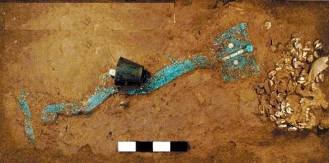“中国龙”

1.  夏历：《夏小正》。即阴历，又称农历。

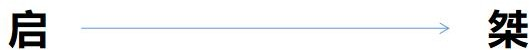

##### 二、商朝（前 1600---前 1046）

1.  商汤灭夏
2.  迁都：

    商朝定都亳（今河南商丘） 盘庚迁都殷（今河南安阳）

1.  文化：
2.  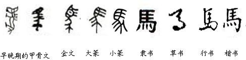甲骨文：河南安阳发现。殷商时刻在龟甲兽骨上的文字，是中国已发现的古代文字中 体系较为完整的文字

##### 甲骨文

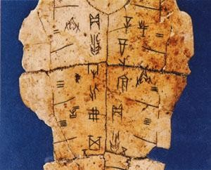

##### 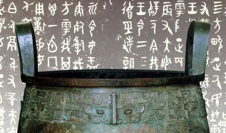金文

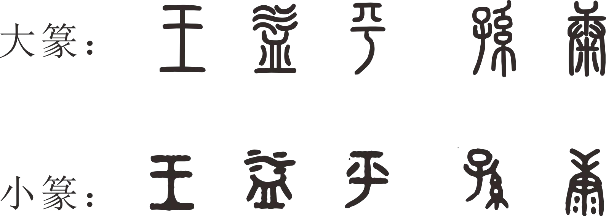

##### 隶书

1.  青铜器：夏商周三代被称为青铜时代。

##### 三、西周（公元前 1046——公元前 771）

1.  武王伐纣：公元前 11 世纪，周武王发动牧野之战，打败商朝，定都镐京（今西安），建立西周。
2.  主要制度：分封制（周天子—诸侯—卿大夫—士大夫—平民—奴隶）、宗法制、礼乐制和 井田制，当时的爵位是公、侯、伯、子、男。
3.  国人暴动：公元前 841 年周厉王时发生了“国人暴动”，起义的平民和奴隶攻入王宫，周

厉王出逃。

1.  《诗经》，最早的一部诗歌总集，共 305 篇，分《风》《雅》《颂》三类，表现手法赋、比、兴。
2.  六艺：礼、乐、射、御、书、数。
3.  科学技术：

    十天干 ： 甲、乙、丙、丁、戊、己、庚、辛、壬、癸

    十二地支： 子、丑、寅、卯、辰、巳、午、未、申、酉、戌、亥

    十二时辰：夜半（子时 23:00-1:00）、鸡鸣（丑时 1:00-3:00）、平旦、昧旦、昧爽（寅时 3:00-5:00）、日出（卯时 5-7）、食时（辰时 7-9）、隅中（巳时 9-11）、日中（午时 11-13）、日昳（未时 13-15）、晡时（申时 15-17）、日入（酉时 17-19）、黄昏（戌时 19-21）、人定（亥时 21-23）

##### 随堂演练

根据干支纪年法，2015 年是乙未羊年，那么 2020 年是（ ）。

1.  癸丑牛年
    1.  庚丑牛年
    2.  庚子鼠年
    3.  壬子鼠年

##### 四、春秋（前 770——前 476）

公元前 771 年，少数民族犬戎攻入镐京，杀死周幽王，西周灭亡。幽王的儿子周平王继位，将王都迁到洛邑，史称东周。东周分为春秋和战国两个时期。

##### 春秋五霸

齐桓公——老马识途

晋文公——退避三舍、秦晋之好楚庄王——一鸣惊人

吴王阖闾

越王勾践——卧薪尝胆

1.  城濮之战

    公元前 632 年，晋国与楚国大战于城濮，晋文公退避三舍，诱敌深入，楚军战败，奠定了晋国的霸主地位。

1.  问鼎中原

    公元前 606 年，楚庄王伐陆浑之戎，观兵于周郊，并派人向周王去问九鼎之轻重。鼎是王权象征，传说大禹铸了九个鼎，代表九州。楚庄王问鼎，表明他有做天子的野心。

1.  卧薪尝胆

    公元前 494 年，吴越争霸中勾践战败，曾卧薪尝胆，后“十年生聚，十年教训”，逐渐恢复了国力并最终灭掉了吴国。

##### 五、战国（前 476——前 221）

战国七雄：齐、楚、燕、韩、赵、魏、秦

##### 商鞅变法

商鞅变法——立木取信

承认土地私有，允许自由买卖； 推行县制；

制定秦律。

##### 科技文化成就

1.  天文：《春秋》当中记载：“秋七月，有星孛于北斗”，这是世界最早关于哈雷彗星的记录，比欧洲早 670 年。
2.  科技：战国时期发明“司南”，用来辨别方向，是现在所用的指南针的始祖，是世界最早的指南工具。
3.  水利：
4.  春秋时期吴国修建邗沟，联系长江和淮河，是中国最早见于明确记载的运河。
1.  郑国渠：是最早在关中建设的大型水利工程，战国末年由秦国穿凿。公元前 246 年， 韩国水工郑国主持兴建。
1.  都江堰：是世界文化遗产、世界自然遗产。位于四川省成都市都江堰市灌口

镇，被誉为“世界水利文化的鼻祖”。都江堰是由秦国蜀郡太守李冰及其子率众在公元前

256 年左右修建的。

1.  社会：金属货币流行，春秋后期，已经有铸造的铜币出现。
1.  史学：
2.  《春秋》是我国最早的编年断代史，开创编年体的先例，由孔子整理成书。
3.  春秋时期鲁国人左丘明撰写《左传》，是对孔子《春秋》的解释。是中国古代最早一部叙事详尽的编年体史书。
1.  天文：战国时期甘德、石申二人测定的恒星记录，后人整理为《甘石星经》，世界最早。
1.  医学：《黄帝内经》，记载了我国最早的人体解剖知识。
1.  文学：战国时期《楚辞》（我国第一部浪漫主义诗歌总集），屈原的《离骚》、《九歌》、《天问》

##### 六、百家争鸣

|     儒家 |  孔子       |  编纂《春秋》修订“五经”   | 创办私学。主张“德治”和“仁”孔子“述而不作”仁义礼智信 其弟子作《论语》，记叙其言行                 |
|----------|-------------|---------------------------|-------------------------------------------------------------------------------------------------|
|          |  孟子       |  《孟子》                 | 性善论。民贵君轻。仁政 “劳心者治人，劳力者治于人”                                               |
|          |  荀子       |  《荀子》                 | 性恶论。天行有常，不为尧存，不为桀亡； 朴素唯物主义                                             |
|    道家  |  老子       |  《道德经》               | “无为而治”“上善若水”“柔弱胜刚强”“祸 兮福之所倚，福兮祸之所伏”“道生一，一生二，二生三，三生万物” |
|          |  庄子       |  《庄子》，又称《南华经》 | “天人合一”“清静无为”“庖丁解牛”“庄 周梦蝶”“鹏程万里”《齐物论》《逍遥游》                         |
| 墨家     | 墨子        | 《墨子》                  | 兼爱，非攻                                                                                      |
|  法家    | 商鞅 韩非子 | 《商君书》 《韩非子》     |  以法治国。君主专制。                                                                           |
| 杂家     | 吕不韦      | 《吕氏春秋》              | “一字值千金”；“刻舟求剑”                                                                        |
|  兵家    | 孙武 孙膑   | 《孙子兵法》 《孙膑兵法》 | 军事思想。《孙子兵法》：世界上最早最著 名的兵书，为春秋末期齐国人孙武                           |
| 名家     | 公孙龙      | 《指物论》                | 白马非马                                                                                        |

##### 随堂演练

1.  孔子在中国历史上留下了光辉的文化轨迹，以下关于孔子的说法正确的是（ ）。
1.  著作《论语》，记录孔子本人及弟子言行
    1.  孔子在教育学上的贡献是打破公学，创办私学
    2.  “罢黜百家，独尊儒术”使孔子一跃成为当时名家
    3.  孔子核心思想是“仁政”，提出“民贵君轻”观点
1.  许多成语源于我国古代著名的历史故事。下列成语故事发生在战国时期的是（ ）。A.卧薪尝胆 B.退避三舍

    C.秦晋之好D.负荆请罪

1.  我国古代有许多伟大的思想家，其中提出“民为贵，社稷次之，君为轻”的是（ ）。
    1.  董仲舒
    2.  老子
    3.  孟子
    4.  庄子

4“. 乐以天下，忧以天下，然而不王者，未之有也”与下列哪一观点属于同一学派？（ ）。

1.  刑过不避大臣，赏善不遗匹夫
2.  天之道，损有余而补不足；人之道则不然，损不足以奉有余
3.  域民不以封疆之界，固国不以山溪之险，威天下不以兵革之利
4.  其用战也胜，久则钝兵挫锐，攻城则力屈，久暴师则国用不足

##### 专题二 秦汉时代

##### 一、秦朝（前 221——前 207）

公元前 230 年到公元前 221 年，秦王政陆续灭掉六国，建立秦帝国，定都咸阳。

##### （一）政治：废封建，设郡县

##### （二）经济：统一度量衡、统一币制

##### （三）文化：统一文字、焚书坑儒

##### （四）建筑：万里长城

长城的兴建，始于战国年间，当时齐、楚、燕、赵、魏、韩、秦都修过长城。

##### （五） 灭亡

| 大泽乡起义   | 公元前 209 年，陈胜吴广，建立张楚政权，历史上第一次大规模农民起义 |
|--------------|-------------------------------------------------------------------|
| 刘邦项羽起义 | 公元前 207 年，项羽巨鹿之战打败秦军主力；刘邦攻入咸阳，秦亡       |

##### 楚汉之争：

巨鹿之战——公元前 207 年，项羽领导的起义军大败章邯和王离领导的秦军主力，历史上著名的以少胜多的战役。典故：破釜沉舟。

咸阳失守——公元前 206 年，刘邦进入咸阳

垓下之战（四面楚歌），项羽无脸面见江东父老，自刎乌江。

##### 汉朝（前 202 年-220 年）

公元前 202 年，汉高祖刘邦称帝，建立汉朝，定都长安，史称西汉。

登基后一面消灭韩信等异姓诸侯王，又裂土分封九个同姓诸侯王。另一面采用休养生息 的宽松政策治理天下，让士兵复员归家，豁免徭役，重农抑商，恢复残破的社会经济，稳定 封建统治秩序。

##### 文景之治

西汉汉文帝、汉景帝统治时期，社会经济衰弱，朝廷推崇黄老之术，采取“轻徭薄赋”、

“与民休息”的政策。这一时期政治清明，经济发展，人民生活安定。

##### 汉武帝

颁布推恩令：诸侯将王国中部分土地分给无继承权的兄弟，建立侯国，侯国归所在郡管 辖，只能衣食租税，无治民权，更无统兵权。

加强思想控制：采用董仲舒（目不窥园）天人感应，君权神授，“罢黜百家，独尊儒术”

的建议。设立太学。

军事——北击匈奴（卫青、霍去病） 外交——丝绸之路：张骞出使西域

选官：察举制——举孝廉、秀才、贤良方正等，察廉

##### 帝国转折——王莽改制

公元 8 年，王莽篡夺政权建立新朝，西汉结束。

为缓和西汉末年日益加剧的社会矛盾而采取的一系列新的措施的“托古改制”。包括土地改革、币制改革、商业改革和官名县名改革。

##### 秦汉文化——历史

“史家之绝唱，无韵之离骚” 司马迁和司马光是什么关系？

##### 丝绸之路

中国输出的是：丝绸、瓷器、茶叶、铁器以及凿井、造纸等技术相继西传；

中国引进的是：西方的毛皮、汗血马、葡萄、核桃、胡椒、石榴、琉璃、香料等，以及 魔术、音乐、舞蹈、雕塑等也纷纷东来。世界三大宗教：佛教、基督教、伊斯兰教也传入了 我国。

##### 东汉

公元 25 年，刘秀称帝，光武帝。定都洛阳，史称东汉。

光武帝统治时期，东汉的农业、手工业大大发展；生产技术大大提高，商人的足记远之 西域和国外，出现了经济繁荣的景象，史称“光武中兴”。

##### 三班——班彪、班固、班昭

##### 秦汉文化——文学

汉赋——班固：《两都赋》

司马相如：《子虚赋》、《上林赋》、《长门赋》 汉乐府——《孔雀东南飞》：第一部长篇叙事诗

《木兰辞》：合称“乐府双璧”

《淮南子》——刘安组织编纂，录有神话女娲补天、后羿射日、共工怒 触不周山、嫦娥奔月四大神话。

##### 秦汉文化——科技

张衡——发明地动仪，比欧洲早一千七百多年；月食：对月食作了最早的科学解释。

张仲景——医圣

《伤寒杂病论》——第一部从理论到实践、确立辨证论治法则的医学专著，是中医临床的基本原则，是中医的灵魂所在。

华佗——麻沸散；五禽戏

##### 秦汉文化——数学

《九章算术》（作者不明）系统总结了战国、秦、汉时期的数学成就；不仅最早提到分数问题，也首先记录了盈不足等问题，“方程”章还在世界数学史上首次阐述了复数及其加减运算法则。《九章算术》是当时世界上最简练有效的应用数学，它的出现标志中国古代数学形成了完整体系。

##### 秦汉文化——科技

蔡伦——纸神

造纸术：西汉时期已有造纸术；东汉蔡伦改进了造纸术，使纸的应用广泛起来。4 世纪传播到朝鲜、日本、越南；8 世纪传播到中亚；12 世纪传播到欧洲。

##### 专题三 魏晋南北朝三国

“天下大势，分久必合，合久必分。”

三国（220 年－280 年）是中国历史上的一段时期，主要有曹魏、蜀汉及孙吴三个政权。

##### 一、魏（三国时期）（220——265）

##### （一）政治

1.  官渡之战（公元 200 年）：曹操 VS 袁绍。曹操大胜，奠定了统一北方的基础。
    1.  赤壁之战（208 年）：孙刘联军 VS 曹操。孙刘联军获胜，三国鼎立之势形成。
    2.  三分天下：220 年，曹丕建魏；221 年，刘备建汉；229 年，孙权建吴。
    3.  吴国孙权于公元 230 年遣人访问夷洲（台湾），这是大陆和台湾大规模往来的最早记录。

##### 二、晋

##### （一）西晋（265——316）：公元 265 年司马炎废魏帝，建立西晋

五胡乱华：匈奴、鲜卑、羯、氐、羌

##### （二）东晋（317——420）：公元 317 年司马睿在建康即位，东晋开始

淝水之战：东晋以少胜多，大败前秦。前秦统治瓦解，北方地区重新陷入割据混战状态， 东晋取得暂时稳定，为经济发展提供了有利条件。

（成语：“风声鹤唳”、“草木皆兵”）

##### 东晋——五胡乱华

“五胡”：主要指匈奴、鲜卑、羯、羌、氐五个胡人大部落，但事实上五胡是西晋末各乱华胡人的代表，数目远非五个。

##### 南北朝

南朝：宋、齐、梁、陈

北朝：北魏、东魏、西魏、北齐、北周

##### 北魏孝文帝改革

均田与租调：给人民分地，受田的农民要给国家交租和交调，租就是粮食，调就是布帛。 目的在于促使人民从事农业。

整顿吏治：给官员俸禄，避免贪污和抢掠。迁都洛阳。

移风易俗，实行汉制。

##### 文化——历史

西晋陈寿——《三国志》：纪传体国别史南朝范晔——《后汉书》：纪传体

前四史——《史记》《汉书》《后汉书》《三国志》

##### 文化——文学

陶渊明：字元亮，号五柳先生，尤爱菊花，开创田园派。

《归田园居》、《桃花源记》、《归去来兮辞》、《五柳先生传》

《搜神记》：古代志怪小说最高成就，东晋干宝搜集整理，有“干将莫邪”、“董永”等神话。

《世说新语》：刘义庆记述魏晋人物言谈轶事的笔记小说。

##### 文化——艺术

顾恺之：《女史箴图》、《洛神赋图》，精于人像、佛像、鸟兽、山水等。

##### 文化——科技

《周髀算经》中有勾股定理的记载；

祖冲之：第一个将圆周率准确值算到小数点后七位

贾思勰：《齐民要术》，我国现存最古老、最完整的农书范缜《神灭论》：坚持物质第一性，系统阐述无神论思想 北魏郦道元《水经注》，详细介绍全国的重要河流。

##### 专题四 隋唐五代十国隋朝

公元 581 年，杨坚建立隋朝，都长安，成功地统一了历经数百年分裂的中国。

“开皇之治”——隋文帝杨坚倡导节俭，节省政府内不少开支、废除了不必要的杂税并设置谷仓储存食粮。

##### 唐朝

公元 618 年，李渊称帝，建立唐朝。玄武门之变——李世民

公元 626 年

“杀兄弑弟囚父”

贞观之治——知人善用，广开言路，虚心纳谏；

以农为本，厉行节约，休养生息

690 年，武则天废唐睿宗，改国号为武周，定都洛阳，号称神都。

贞观遗风——减轻农民负担，促进社会生产。人口明显增长，边疆得到巩固和开拓， 史称“贞观遗风”，为唐朝全盛时期的到来奠定了基础。

唐玄宗——开元盛世杨玉环

安史之乱——安禄山、史思明是唐由盛而衰的转折点

##### 隋朝

科举制：公元 605 年，隋朝创立了科举制，沿袭 1300 年。

##### 隋唐政治——对外交流

唐太宗——玄奘天竺取经唐玄宗——鉴真东渡

日本派遣唐使来唐

##### 隋唐科技——中医药

《千金方》——“药王”孙思邈；

《唐本草》——唐高宗修《唐本草》，最早颁布的官方药典

##### 文化——艺术

四大石窟

莫高窟——始建于前秦前秦时期

位于甘肃省敦煌市

云冈石窟——始建于北魏位于山西省大同市

龙门石窟——始建于北魏位于河南省洛阳市

麦积山石窟——始建于后秦位于甘肃省天水市

##### 隋唐文化——文学 四大名楼——滕王阁

江西省南昌市赣江之滨

“落霞与孤鹜齐飞”

##### 四大名楼——岳阳楼

湖南省岳阳市

长江与洞庭湖交汇处

“先天下之忧而忧”

##### 四大名楼——黄鹤楼

湖北省武汉市

长江蛇山

昔人已乘黄鹤去， 此地空余黄鹤楼。黄鹤一去不复返， 白云千载空悠悠。

**四大名楼——鹳雀楼**山西省永济市 黄河东岸

“白日依山尽”

##### （一）初唐四杰

王勃（《滕王阁序》“落霞与孤鹜起飞，秋水共长天一色”、《送杜少府之任蜀州》“海内存知己，天涯若比邻”）

杨炯（《从军行》《出塞》） 卢照邻（《长安古意》）

骆宾王（《咏鹅》）

##### （二）盛唐

|  山水田园 |  王维 |  字摩诘，称王右丞，“诗佛”。 “诗中有画画中有诗” | 九月九日忆山东兄弟》；《使至塞 上》《送元二使安西》（“劝君更尽一杯酒，西出阳关无故人”） |
|-----------|-------|------------------------------------------------|-----------------------------------------------------------------------------------------|

|        | 孟浩然 | 世称“孟襄阳”                                           | 《春晓》《宿建德江》 |
|--------|--------|--------------------------------------------------------|----------------------|
|   边塞 | 岑参   | 《白雪歌送武判官归京》“忽如一夜春风来，千树万树梨花开” |                      |
|        | 王昌龄 | 《出塞》“秦时明月汉时关，万里长征人未还”               |                      |
|        | 高适   | 《别董大》“莫愁前路无知己，天下谁人不识君”             |                      |
|        | 王之涣 | 《登鹳雀楼》《凉州词》“羌笛何须怨杨柳，春风不度玉门关” |                      |

|  李白 |  字太白，号青莲居士，“诗仙”                                   | 《蜀道难》；《行路难》；《梦游天姥吟留 别》；《将进酒》                     |
|-------|---------------------------------------------------------------|-----------------------------------------------------------------------------|
|  杜甫 | 字子美，自号少陵野老，世称“杜工 部”，“诗圣”，其诗被称为“诗史” | “三吏”《新安吏》《石壕吏》《潼关吏》； “三别”《新婚别》《垂老别》《无家别》 |

##### （三）中晚唐

|  白居易 | 字乐天，号香山居士， “诗魔”“诗王” | 《长恨歌》“在天愿作比翼鸟，在地愿为连理枝”； 《琵琶行》“千呼万唤始出来，犹抱琵琶半遮面” |
|---------|-----------------------------------|-----------------------------------------------------------------------------------------|
| 李贺    | 字长吉，“诗鬼”                    | 《雁门太守行》“黑云压城城欲摧，甲光向日金鳞开”                                          |
|  刘禹锡 |  字梦得                           | 《陋室铭》；《乌衣巷》“旧时王谢堂前燕，飞入寻常 百姓家”                                 |
|  李商隐 |  字义山，号玉溪生                 | 《无题》“春蚕到死丝方尽，蜡炬成灰泪始干”；《锦 瑟》“沧海月明珠有泪，蓝田日暖玉生烟”     |
|  杜牧   | 字牧之，号樊川居士，世 称杜樊川   | 《泊秦淮》“商女不知亡国恨，隔江犹唱后庭花”； 《阿房宫赋》；《过华清宫》                 |

|   孟郊 | 因其诗作多写世态炎凉， 民间苦难，故有“诗囚” 之称，与贾岛齐名“郊寒 岛瘦”。 |  《游子吟》；《登科后》；名句有“春风得意马蹄疾， 一日看尽长安花”。 |
|--------|---------------------------------------------------------------------------|--------------------------------------------------------------------|

##### 随堂演练

1.  下列诗句背景与科举制实行无关的是（ ）。
    1.  慈恩寺下题名处，十七人中最少年
    2.  太宗皇帝真长策，赚得英雄尽白头

        C..黑发不知勤学早，白首方悔读书迟

        D.春风得意马蹄疾，一日看尽长安花

1.  下列哪组词语都与中国古代科举考试有关？（ ）。
    1.  蟾宫折桂、桂冠、连中三元
    2.  问鼎中原、独占鳌头、蟾宫折桂
    3.  连中三元、五子登科、名落孙山
    4.  金榜题名、桂冠、独占鳌头

##### 专题五 宋元两宋

北宋：公元 960 年，赵匡胤发动陈桥兵变，手下将是拥立其为皇帝，取国号为“宋”，都开封。后世称其为宋太祖。

庆历新政：1043 年，范仲淹主持。主要内容：澄清吏治，富国强兵，厉行法治。

王安石变法：1069 年（北宋神宗），王安石推行新法，又称“熙宁变法”。颁布了“农田水利法”、均输法、青苗法、免役法（又称募役法）、市易法、方田均税法，并推行保甲法 和将兵法以强兵。变法失败。王安石被列宁誉为是“中国十一世纪伟大的改革家”。

##### 两宋经济

南宋时期，经济重心由北方转移到了南方北宋出现了最早的纸币“交子”

宋朝海外贸易超过前代，北宋设置“市舶司” 北宋兴起的景德镇后来成为著名的瓷都

##### 两宋科技

北宋平民毕升发明了活字印刷。

指南针在宋代航海交通上普遍使用。

北宋科学家沈括《梦溪笔谈》，创制“十二气历”，成为：中国科学史的里程碑。

##### 四大发明

造纸术

活字印刷术指南针

火药

##### 两宋文化——唐宋八大家

韩愈、柳宗元

唐代古文运动的领袖

欧阳修、三苏。宋代古文运动的核心王安石、曾巩

临川文学的代表人物

|   唐朝   |  韩愈   | 字退之，世称韩昌黎。唐代古文运动倡 导者，苏轼称其为“文起八代之衰” |  《师说》《马说》                               |
|----------|---------|-------------------------------------------------------------------|-------------------------------------------------|
|          |  柳宗元 |  字子厚，人称“柳河东”、“柳柳州”                                   | 《永州八记》《黔之驴》《小 石潭记》《捕蛇者说》 |
|     宋朝 | 欧阳修  | 字永叔，号醉翁，又号六一居士                                      | 《醉翁亭记》                                    |
|          | 苏洵    |                                                                   |                                                 |
|          | 苏轼    | 字子瞻，号东坡居士，宋词豪放派代表                                | 《念奴娇》《水调歌头》                          |
|          | 苏辙    | 字子由，自号颖滨遗老                                              |                                                 |
|          |  王安石 | 字介甫，号半仙，封荆国公，世人又称 王荆公、临川先生               |                                                 |
|          | 曾巩    | 字子固，世称南丰先生                                              |                                                 |

##### 两宋文化——宋词

|  豪放派 |  范仲淹 | 字希文，谥文正，亦称范履霜，北宋著 名文学家、政治家、军事家、教育家。 |  《岳阳楼记》        |
|---------|---------|-----------------------------------------------------------------------|----------------------|
|         | 辛弃疾  | 字幼安                                                                | 《永遇乐》《青玉案》 |

|           | 岳飞    | 字鹏举                                              | 《满江红》《小重山》            |
|-----------|---------|-----------------------------------------------------|---------------------------------|
|           | 陆游    | 字务观，号放翁                                      | 《示儿》《钗头凤》              |
|    婉约派 | 李煜    | 字重光，出名从嘉，“千古词帝”                        | 《虞美人》《浪淘沙》            |
|           | 柳永    | 原名三变，“凡有井水饮处，皆能歌柳词”                | 《雨霖铃》                      |
|           | 秦观    | 字少游，号淮海居士                                  | 《鹊桥仙》                      |
|           |  李清照 | 号易安居士，“千古第一才女”，与辛弃疾 并称“济南二安” | 《一剪梅》《声声慢》 《醉花阴》 |

##### 两宋文化——清明上河图

北宋张择端的《清明上河图》是一幅风俗画的杰作，描写的是北宋都城开封的繁荣景象。

##### 两宋文化——《资治通鉴》

《资治通鉴》是北宋著名史学家、政治家司马光和他的助手刘攽、刘恕、范祖禹、司马 康等人历时十九年编纂的一部规模空前的编年体通史巨著。记载了从战国到五代共 1362 年的史实。在这部书里，编者总结出许多经验教训，供统治者借鉴，宋神宗认为此书“鉴于往事，有资于治道”，即以历史的得失作为鉴诫来加强统治，所以定名为《资治通鉴》。

##### 随堂演练

1.  下列诗句与人物对应不正确的是（ ）。
    1.  拔山力尽乌江水，今古悠悠空浪花——项羽
        1.  千山万壑赴荆门，生长明妃尚有村——西施
            1.  羽扇纶巾，谈笑间，樯橹灰飞烟灭——周瑜
            2.  三顾频烦天下计，两朝开济老臣心——诸葛亮
1.  下列诗句描述的情景，发生在冬季的是（ ）。
    1.  月落乌啼霜满天，江枫渔火对愁眠
        1.  小荷才露尖尖角，早有蜻蜓立上头
            1.  忽如一夜春风来，千树万树梨花开
            2.  无可奈何花落去，似曾相识燕归来

##### 元朝

1206 年，铁木真被推举为蒙古的大汗，尊称为“成吉思汗”。其孙忽必烈 1271 年建

立元朝（公元 1271-1368 年），称为元世祖。

行省制度：三省制改为中书省一省独揽，地方设行省，由中央委派官员管理，地方政治 制度进入划省而治的阶段。

宣政院：统领宗教事务和管辖西藏地区，西藏正式纳入我国版图。

澎湖巡检司：管辖澎湖、台湾地区，是我国在台湾附近岛屿设立专门政权机构的开始。 马可波罗：意大利旅行家，写下《马可波罗游记》一书，生动描述了大都、杭州等城市

的繁荣景象，激发了欧洲人对中国的向往，对以后新航路的开辟产生了巨大的影响。

##### 元朝——元曲

| 元曲四大家 | 代表作及人物                                             |
|------------|----------------------------------------------------------|
| 关汉卿     | 《窦娥冤》——窦娥；《救风尘》——赵盼儿；《望江亭》——谭记儿 |
| 马致远     | 《汉宫秋》——王昭君、汉元帝；《青衫泪》——白居易           |
| 郑光祖     | 《倩女离魂》——张倩女、王文举                             |
| 白朴       | 《墙头马上》——裴少俊；《梧桐雨》——唐明皇、杨贵妃         |

元曲四大悲剧：《窦娥冤》、《梧桐雨》、《汉宫秋》、《赵氏孤儿》

元曲四大爱情剧：《拜月亭》（关汉卿著，王瑞兰、蒋世隆）、《西厢记》（王实甫著，崔莺莺、红娘、张生）、《墙头马上》、《倩女离魂》

##### 随堂演练

1.  关于宋词，下列说法不正确的是（ ）。
    1.  “人比黄花瘦”是女词人李清照的名句
        1.  “有井水处即能歌柳词”说的是柳永
            1.  “樯橹灰飞烟灭”说的是官渡之战
                1.  辛弃疾是“豪放派”的代表词人之一
1.  历史上，不少豪放派诗人（词人）有婉约佳作，而婉约派也不乏豪放名句，这是一种有趣 的“反差”。下列选项中，不能体现这种“反差”的是（ ）。
2.  李清照：生当作人杰，死亦为鬼雄
3.  晏殊：无可奈何花落去，似曾相识燕归来
4.  苏轼：春宵一刻值千金，花有清香月有阴
1.  辛弃疾：众里寻他千百度，蓦然回首，那人却在灯火阑珊处
1.  关于以下诗文中的人物，说法不正确的是（ ）。
    1.  醉翁之意不在酒，在乎山水之间也——“醉翁”是欧阳修
        1.  臣本布衣，躬耕于南阳——“臣”是诸葛亮
            1.  少陵野老吞声哭——“少陵野老”是杜牧
                1.  座中泣下谁最多，江州司马青衫湿——“江州司马”是白居易

##### 专题六 明清明朝

1368 年，朱元璋率领农民起义，推翻元朝政权，建立了明朝，即明太祖。明初定都南京，后来，明成祖朱棣迁都北京。

##### 郑和下西洋：

明成祖命三宝太监郑和，率领 240 多艘船只，先后七次，最远到达非洲东海岸和红海沿岸。

##### 明朝科技文化

徐光启——《农政全书》：是中国古代的一部农业百科全书。

宋应星——《天工开物》：被誉为“中国 17 世纪的工艺百科全书”。

徐霞客——《徐霞客游记》：最早揭示了中国西南地区石灰岩地貌的各种特征。 李时珍——《本草纲目》：集十六世纪以前中国本草学之大成。

永乐大典——迄今为止世界最大的百科全书，解缙主持编纂 汤显祖——《牡丹亭》：柳梦梅、杜丽娘

##### 清朝

1616 年，努尔哈赤建立后金；1636 年，皇太极改国号为“清”。1644 年，清军自山海关南下，占领北京，当时的皇帝是顺治皇帝。

##### 康雍乾时期文字狱

康熙——命施琅收复台湾，设置台湾府，隶属于福建省

——索额图签订《尼布楚条约》，划定中俄边界

——册封五世班禅雍正——设立军机处

——设驻藏大臣，同班禅达赖共同管理西藏乾隆——新疆：伊犁将军

——下江南

——《四库全书》当时世界上最大的一部丛书，分为经史子集四目。

##### 明清小说

##### 四大奇书与四大名著

《金瓶梅》——兰陵笑笑生

《水浒传》——施耐庵

《三国演义》——罗贯中著

《西游记》——吴承恩

《红楼梦》——曹雪芹

##### 三言二拍

《喻世明言》、《警世通言》、《醒世恒言》——冯梦龙

《初刻拍案惊奇》、《二刻拍案惊奇》——凌濛初

《聊斋志异》

俗称《鬼狐传》：“写鬼写妖高人一等，刺贪刺虐入木三分”、“鬼狐有性格，笑骂成文章”

##### 明清传奇

汤显祖“玉茗堂四梦”“临川四梦”：《牡丹亭》（杜丽娘）

《长生殿》：清初洪升创作，主人公为唐明皇与杨贵妃

《桃花扇》：清初孔尚任创作，主人公为李香君与侯方域，“借离合之情，写兴亡之感”

##### 戏剧

京剧：京剧形成于 1840 年前后，主要唱腔有二黄、西皮，因此京剧也称“皮黄。表现手法：唱、念、做、打

##### 角色分配：

①“生”内部分老生、小生、武生、娃娃生。

②“旦”指女性角色，内部分正旦、花旦、闺门旦、武旦、老旦、彩旦、刀马旦。

③“净”主要扮演性格、品质或相貌不同于一般、有突出特征的男性人物，需脸谱。

④“丑”扮演喜剧角色，俗称小花脸。

##### 京剧

传统剧目：《打渔杀家》《空城计》《霸王别姬》《铡美案》 现代京剧：《红灯记》《沙家浜》《智取威虎山》《白毛女》

##### 旦角：

梅派（梅兰芳）、荀派（荀慧生）、程派（程砚秋）、尚派（尚小云）、张派（张君秋） 四大名旦：梅兰芳、荀慧生、程砚秋、尚小云

##### 五大剧种

黄梅戏：湖北——黄梅

安徽——安庆

经典剧目：《天仙配》《女驸马》《牛郎织女》

评剧：河北唐山

经典剧目：《秦香莲》《刘巧儿》

越剧：浙江绍兴

才子佳人

经典剧目：《红楼梦》《梁山伯与祝英台》

豫剧：河南梆子

最大的地方剧种

经典剧目：《花木兰》《穆桂英挂帅》

##### 随堂演练

1.  下列关于我国京剧的表述中，不正确的是( )。
    1.  京剧已列入人类非物质文化遗产代表作名录
        1.  京剧中一般用黑色脸谱来表示忠勇侠义
            1.  京剧“四大名旦”是指梅兰芳、程砚秋、尚小云和荀慧生
                1.  唱、念、做、打是京剧表演的四种艺术手法
1.  平时人们说“他们一个唱红脸，一个唱白脸”。这其中，“唱白脸”的意思是( )。
    1.  扮演正面人物
        1.  充当反面角色
            1.  故作温文尔雅
                1.  假装暴躁易怒
1.  下列剧种与其代表作对应正确的是( )。
    1.  昆曲——《天仙配》
        1.  黄梅戏——《梁山伯与祝英台》
            1.  京剧——《霸王别姬》
                1.  豫剧——《空城记》

## 第二章 中国近代史

##### 第一节 鸦片战争

##### 一、第一次鸦片战争（1840 年 -1842 年）

1.  原因：根本原因是英国企图打开中国市场，倾销产品、掠夺原料，把中国变为其殖民地。
    1.  导火索：1839 年 6 月林则徐虎门销烟。
        1.  南京条约
2.  签订方：中英
3.  内容：割香港岛给英国；开放广州、厦门、福州、宁波、上海为通商口岸；中国向英国赔款 2100 万银元；英国享有领事裁判权；英国在中国的进出口货物纳税，中国需与英国共同议定。
1.  救亡图存：
2.  林则徐：近代开眼看世界第一人。虎门销烟。
3.  魏源《海国图志》：提出“师夷长技以制夷”，是中国近代史学史上第一部较为详尽较为系统的世界历史、地理著作。

##### 二、第二次鸦片战争（1856 年-1860 年）

1.  《天津条约》

    内容：外国公使进驻北京；外籍传教士得入内地自由传教；外国商船可在长江各口岸往

    来。

2.  英法联军进攻北京，火烧圆明园。
3.  《北京条约》

内容：开天津为商埠；准许英法招募华工出国；割让九龙司给英国。

##### 第二节 太平天国（1851-1864 年） 一、兴衰

兴：1843 年创立“拜上帝教”；1851 年 1 月金田起义，洪秀全称天王，建立“太平天国”；1853 年攻占南京，改名“天京”并定都。

衰：1856 年天京变乱，由盛转衰。

##### 二、纲领

1.  《天朝田亩制度》——原则：凡天下田，天下人同耕。内容：废除封建地主阶级土地所有 制，按人口和年龄平均分配土地。意义：太平天国的革命纲领，突出反映了农民阶级废除封 建土地所有制的强烈愿望，但只是空想，无法实施。
2.  《资政新篇》——内容：向西方学习，进行经济、政治和文化改革。评价：中国人最早提出的带有资本主义色彩的改革方案，符合社会发展的规律和趋势，但未涉及农民土地问题， 无法调动农民的积极性，未能真正推行。

##### 第三节 洋务运动（19 世纪 60 年代-90 年代）

##### 一、目的：“师夷长技以自强”，维护清政府封建统治。二、推行机构：总理衙门

##### 三、代表人物：中央：奕。地方：曾国藩、李鸿章、左宗棠、张之洞四、口号：前期“自强”，后期“求富”

##### 五、内容：

（一）军事工业：代表：安庆内军械所、江南制造总局（上海）、福州船政局

（二）民用工业：代表：上海轮船招商局、开平煤矿、湖北织布局、汉阳铁厂

（三）海军：筹建北洋、南洋、福建三支海军，中央成立海军衙门

（四）新式教育：同文馆建立，举办新式学校，派遣留学生出国

##### 六、失败标志：甲午中日战争惨败；根本原因在于未从根本上变革落后的封建制度。

##### 第四节 民族危机的加深

##### 一、甲午中日战争（1894-1895）

1.  《马关条约》：将辽东半岛、台湾岛及所有附属各岛屿、澎湖列岛割让给日本；赔偿日本军费白银两亿两；开放沙市、重庆、苏州、杭州为通商口岸，日本得派领事驻扎，日本轮船 得驶入；日本人得在通商口岸城市从事各项工艺制造，机器得进口，产品免征杂税；日本暂 占威海卫。
2.  影响：进一步破坏了中国主权的完整，刺激了列强瓜分中国的野心，民族危机进一步加深； 清政府大量举借外债，经济命脉为列强控制；通商口岸开放，使帝国主义侵略势力深入到中国内地；允许在华投资办厂，严重阻碍了民族资本主义的发展，掀起了帝国主义瓜分中国的狂潮。中国社会半殖民地化程度大大加深了。

##### 二、义和团运动与八国联军侵华

1.义和团：“扶清灭洋”。

2.1900 年八国联军（日、美、奥匈帝国、英、法、德、意、俄）攻占大沽炮台，7 月攻陷天津，8 月占领北京。

1.  《辛丑条约》：清政府向各国赔款白银 4、5 亿两，划北京使馆区，中国人不得居住，各国可派兵驻守；列强可在自北京至山海关沿铁路重要地区的 12 个地方驻扎军队；清政府承诺镇压反帝斗争；将总理衙门改为外务部，成为清政府与列强交涉的专门机构。
2.  影响：清政府完全成为帝国主义列强统治中国的工具，标志着中国完全沦为半殖民地半封 建社会。

##### 第五节 戊戌变法

##### 一、公车上书：1895 年康有为领导，维新思想发展为爱国救亡的政治运动。二、《天演论》：严复。物竞天择、适者生存。为戊戌变法提供了思想基础。

##### 三、发展：1898 年初，康有为呈递《应诏统筹全局折》，请求光绪帝确定维新变法政策。

##### 1898 年康有为在北京发起组织保国会，具有资产阶级政党的性质

##### 四、百日维新—光绪帝颁布《定国是诏》，变法开始。经过百日，以失败告终。

##### 第六节 辛亥革命一、同盟会

1.  建立：1905 年，东京，第一个全国性的资产阶级革命政党
2.  政治纲领：驱除鞑虏，恢复中华、创立民国、平均地权
3.  纲领的阐发——三民主义：民族、民权、民生

##### 二、武昌起义

（一）爆发：1911 年 10 月 10 日，武昌

（二）成果：

1.1912 年 1 月 1 日，中华民国成立（总统制的共和政体）

1.  南京临时政府：资产阶级民主政府
2.  《中华民国临时约法》：我国第一部资产阶级宪法
3.  革命果实被袁世凯窃取

（三）失败原因：资产阶级的软弱性和妥协性（根本）；中外反动势力的联合绞杀；

（四）评价：

推翻了封建王朝的统治，使民主共和的观念深入人心；沉重打击了帝国主义的侵略势力； 为民族资本主义的发展创造了有利条件；对近代亚洲被压迫民族的解放运动起了推动作用。

##### 第七节 五四新文化运动一、新文化运动

（一）兴起：1915 年陈独秀在上海创办《新青年》

（二）前期主要内容：提倡民主科学；提倡新文学；提倡新道德

（三）后期内容：李大钊发表《布尔什维主义的胜利》，马克思主义开始传播

##### 二、五四运动

（一）导火索：巴黎和会上中国外交的失败

（二）经过：（1）第一阶段：北京，学生。（2）第二阶段：上海，工人

（三）意义：工人阶级开始登上历史舞台，促进了马克思主义的传播，是一次彻底的反帝反 封建的革命运动，标志着新民主主义革命的开端

| 近代史                                                                         |
|--------------------------------------------------------------------------------|
| 1840 鸦片战争 中国近代史的开端                                                 |
| 1842《南京条约》标志中国开始沦为半殖民地半封建社会                             |
| 1851-1864 太平天国 农民起义失败                                                |
| 1856 第二次鸦片战争                                                            |
| 1858《天津条约》                                                               |
| 1860《北京条约》                                                               |
| 1861-1894 洋务运动 开近代教育之先河                                            |
| 1894 甲午中日战争                                                              |
| 1895《马关条约》标志着中国社会半殖民地半封建社会程度大大加深                   |
| 1898 戊戌变法 康梁政治改革运动                                                 |
| 1900 八国侵华                                                                  |
| 1901《辛丑条约》标志着中国完全沦为半殖民地半封建社会                           |
| 1905 同盟会成立 第一个统一的资产阶级革命政党                                   |
| 1911 辛亥革命 反抗清政府的爱国运动                                             |
| 1912 孙中山成立南京临时政府（一项政治运动）                                    |
| 1915 新文化运动 陈独秀《新青年》 口号是民主和科学                              |
| 1919 五四运动 工人阶级登上历史舞台标志着中国从旧民主主义革命迈向新民主主义革命 |
| 1919-1949 新民主主义革命时期                                                   |
| 1949-1956 社会主义革命时期                                                     |

## 第三章 新中国史、军史

##### 一、概念

中华人民共和国的成立，是中国现代史的开端。

新中国成立后，我国建立和巩固了人民民主专政的国家政权，由新民主主义向社会主义 过渡。

1956 年，社会主义改造完成，社会主义制度建立，人民对经济文化迅速发展的需要同经济文化不能满足人民需要的状况之间的矛盾，成为我国社会的主要矛盾。

我国的主要任务是进行社会主义经济建设。在中国共产党的领导下，社会主义建设事业 在探索中曲折前进。

##### 二、分期

1.  按社会性质划分为两大阶段：

    （1）新民主主义社会阶段：1949.10～1956 年底

    （2）社会主义初级阶段：1956 年底～21 世纪中叶

1.  按历史的发展划分为四个时期：
2.  过渡时期：新民主主义向社会主义过渡。（1949.10～1956 年底）这一时期分为两个阶段：

    ①人民政权的巩固和国民经济恢复阶段：（1949.10～1952 年）

    ②社会主义制度建立：（1953～1956 年底）

1.  开始全面建设社会主义时期：（1956～1966）
1.  文化大革命时期：文革十年动乱时期（1966.5～1976.10）（4）社会主义现代化建设新时期：1976 年以来

    ①徘徊中前进的两年：1976.10～1978.12

    ②拨乱反正，实现伟大的历史转折：1978.12～1982 年

    ③改革开放全面展开：1982 年至今

##### 新民主主义向社会主义过渡：（1949～1956）

1.  过渡原因：

    ①新民主主义革命是社会主义革命的必由之路，社会主义革命是新民主主义革命的最终目标；

    ②历史已经证明，资本主义道路在中国走不通，走社会主义道路是中国历史的选择、人民的 选择；

    ③中共最高革命目标，是实现社会主义、共产主义。

1.  过渡的条件：

    ①社会条件：新民主主义革命的胜利，结束了半殖民地半封建社会的历史，为中国由新民主 主义和平过渡到社会主义准备了必要的前提；

    ②政治条件：中共领导地位的确立，中共领导下的多党合作制形成，人民民主专政的建立和 巩固，为中国走上社会主义道路创造了必要的政治前提；

    ③经济条件：社会主义国营经济的建立及在国民经济中领导地位的确立，为中国走社会主义 道路创造了必要的经济前提；

    ④国际条件：二战后民族解放运动广泛展开，社会主义阵营形成，世界和平进步力量增长， 为中国由新民主主义向社会主义过渡提供了有利的国际环境；

1.  过渡时期党的任务：

    巩固无产阶级政权、恢复和发展国民经济、建立社会主义制度。

1.  过渡过程：

    ①.1949 年～1952 年：彻底完成民主革命任务，建立起社会主义国营经济，巩固了政权， 恢复了经济；

    ②.1953 年制定了过渡时期的总路线，开始三大改造；

    ③.1954 年制定宪法，规定了国家的性质和根本的政治制度；

    ④.1956 年三大改造完成，社会主义制度建立。

1.  过渡性的表现：

    ①.社会主要矛盾：由社会主义与资本主义的矛盾，转变为先进的社会制度与落后的生产力之间的矛盾；

    ②.社会阶级结构：由多种成分并存，到都成为社会主义劳动者；

    ③.社会经济结构：由多种经济形式并存，到社会主义公有制成为唯一的经济基础；

    ④.国家政治制度：政治协商制度过渡到人民代表大会制度。

1.  过渡时期的社会性质：既具有新民主主义社会性质，又具有社会主义性质。 政治上：实行工人阶级领导的，工农联盟为基础的人民民主专政；

    经济上：五种经济成分并存。即社会主义性质的国营经济、合作社经济、个体经济、国 家资本主义经济、私人资本主义经济同时并存。

1.  过渡的特点：

    ①.中国是经过新民主主义向社会主义过渡，而不是一般的从资本主义过渡到社会主义

    ②.中国是在无产阶级掌握政权的情况下向社会主义过渡，通过改造实现社会主义革命

    ③.在向社会主义过渡中，无产阶级与资产阶级保持政治联盟，采取和平手段、改造生产关系和发展生产力同步进行。

1.  过渡过程中创造性的重大举措、依据：

    ①.经济上：对民族资本主义工商业进行“限制、利用”，打击投机倒把，合理调整工商业，土地改革中保存富农经济，采取赎买政策，完成对资本主义工商业的改造，实现和平过渡。

    ②.政治上：实行共产党领导下的多党合作制，发展人民民主统一战线，实行与民主党派长期共存、互相监督。

    ③.民族关系：实行民族区域自治的政治制度，实行民族平等，民族团结，共同繁荣的原则。

    ④.外交上：中国提出与友好国家，新兴民族独立国家和平共处五项原则。

##### 新中国的成立： 历史条件：

1.  人民解放战争已在全国范围内取得基本胜利；
2.  国民党反动政府已被推翻；
3.  七届二中全会和毛泽东《论人民民主专政》，为新中国的成立作了理论和路线、方针准备；
4.  全国人民拥护在共产党领导下迅速成立中央人民政府；
1.  新政协会议，为新中国的成立作了组织上的准备；
2.  成立：1949 年 10 月 1 日，中华人民共和国成立。
1.  意义：（1）中华人民共和国成立，新民主主义革命胜利，结束了中国半殖民地半封建社会的历史，中国人民从此站立起来了，中国的历史进入一个新纪元；（2）新中国的成立，标志着中国从此走上了独立、民主、统一的道路，开始了向社会主义过渡的新时期；（3）新中国的成立，冲破了帝国主义的东方战线，壮大了世界和平、民主和社会主义的力量，鼓舞 了世界被压迫民族和被压迫人民争取解放的斗争；
1.  新中国成立初期面临的形势：
2.  国内：

    人民解放战争尚未完全结束，国民党残敌负隅顽抗，大批特务、土匪进行破坏活动；国 民经济处于崩溃状态；

1.  国际：

    美国和一些帝国主义国家对中国采取政治上不承认、经济上封锁禁运、军事上包围威胁 的政策，企图扼杀新中国；新中国面临着外部侵略的威胁；

1.  党和人民政府的任务：

    继续完成民主革命的任务；巩固人民政权；恢复国民经济。

1.  中共在政治、经济、外交方面采取的措施和进行的斗争：
1.  政治上：

    ①召开新政协会议，初步建立了中共领导的多党合作、民主协商的政治制度；

    ②.追歼残敌，剿匪作战，和平解放西藏。实现祖国大陆统一；

    ③.进行抗美援朝。使中国国际威望空前提高，为中国的经济建设和社会改革赢得了相对稳定的和平环境；

    ④.开展土地改革运动。彻底废除封建剥削的土地制度，为农业生产的发展和国家工业化开辟了道路；

    ⑤展开镇反运动。取缔旧社会遗留的丑恶现象，使我国社会秩序得到安定；

    ⑥.开展“三五反”运动。抵制资产阶级的腐蚀，打退不法资本家向社会主义的进攻，在工商业中进行一次普遍的守法经营教育，开始建立工人阶级对资本家的监督；

1.  经济上：

    ①没收官僚资本。建立社会主义性质的国营经济，人民政府掌握了国家的经济命脉，为人民 政权的巩固和国民经济的恢复奠定了经济基础；

    ②.稳定物价，统一财经。经过“银元之战”、“米棉之战”，全国物价稳定，人民政府赢得人民信任；统一财经，将全国主要财政经济由中央集中统一管理，初步确立了以中央集中统一 为主的财政经济管理体制；

    ③合理调整工商业。使有利于国计民生的私营工商业在国营经济的领导下，得到恢复和发展。

    ④领导人民恢复和发展生产。在农村引导农民开展互助合作，兴修水利；在工矿企业进行民 主改革和生产改革，确立工人阶级领导地位，提高工人生产积极性；

1.  外交上：

①新中国奉行独立自主的和平外交政策。不承认国民政府的屈辱的外交关系，取缔帝国主义 在华一切特权，坚定地站在社会主义阵营一边，团结世界各国人民。

②积极开展外交活动。同苏联等国建立外交关系；积极同邻国和新兴的民族独立国家发展友好关系；提出“和平共处五项原则”；参与国际事务；（如参加日内瓦会议、亚非会议。）提高了中国的国际地位，打破了美国在外交上孤立中国的政策。

##### 三大改造：

1.  原因：
2.  为了建立社会主义制度，必须对生产资料私有制进行变革，纳入社会主义轨道；
3.  随着经济的恢复发展和工业化的进行，分散的落后的个体经济束缚了生产力的发展， 为解放生产力发展经济，需要进行三大改造；
1.  三大改造：

    是指 1953～1956 年底，国家对农业、手工业、资本主义工商业进行社会主义改造。

1.  实质：变生产资料私有制为公有制的革命。
1.  评价：
2.  三大改造是用社会主义生产关系代替旧的生产关系，是变革生产关系的社会主义革命，它使我国的社会主义制度基本上建立起来；
3.  对资本主义工商业的改造，实行赎买政策，和平过渡，这是中国社会主义改造的创举；
4.  在社会主义改造后期，要求过急，工作过粗，对一部分工商业者的使用和处理不够适

当，以致遗留了一些问题。

##### 社会主义建设道路的探索：

1.  历史条件：

    ①.三大改造完成，社会主义制度基本确立,推动了社会主义建设的全面展开；

    ②.一五计划即将完成，经济建设取得巨大成就，提供了物质条件；

    ③.苏共二十大后，中共破除了对斯大林和苏联经验的迷信，更加注意总结本国建设的经验， 探索适合本国国情的社会主义建设道路；

    ④.印度支那实现停战，国际局势趋向缓和，周边环境相对稳定，社会主义建设具备了良好环境；

1.  探索过程：

    ①.50 年代中期，在总结自身建设经验和借鉴苏联经验的基础上进行初步探索：表现在《论十大关系》的发表、中共八大正确路线和方针的制定、《关于正确处理人民内部矛盾的问题》 的发表等，但也出现了反右派斗争扩大化的错误。

    ②.50 年代末社会主义建设事业遭受挫折，中共犯了严重的左倾错误：表现在大跃进、人民公社化运动、开展反右倾斗争、国民经济严重困难等；

    ③60 年代上半期，一方面经济工作中调整国民经济取得重大成就，另一方面政治思想领域左倾错误持续发展，导致文革发生；

    ④文革十年，社会主义事业遭受严重挫折，是一次全局性、持续性的左倾错误；

    ⑤社会主义建设新时期，实事求是，形成邓小平理论。

2.  历程的特点：

①具有艰难性与曲折性：大跃进、文革的严重挫折；

②具有一贯性、持续性：始终参照中国国情，不断总结历史经验教训。

1.  探索初期出现曲折的原因：

    ①反右倾扩大化从理论上修改了八大关于外国社会主要矛盾的科学论断，提出了以阶级斗争 为纲的错误理论；

    ②片面追求社会主义建设的高速度，左倾冒进，忽视客观规律；

    ③经验不足，背离了实事求是的思想路线

1.  文革后出现新局面的原因：

    ①文革后，中共中央总结了社会主义建设的经验教训，吸取了文革的教训,开展真理标准的讨论，解放了思想，重新确立了实事求是的思想路线；

    ②十一届三中全会作出了党的工作重心的转移和改革开放的决策；

    ③坚持四项基本原则，强调建设中国特色的社会主义；

    ④十三大制定了社会主义初级阶段的理论

    ⑤邓小平理论的指导

1.  十一届三中全会前后中共政策的变化：

    ①.指导思想上：从以阶级斗争为纲转移到经济建设为中心；

    ②.经济上：从单一的公有制经济转到以公有制为主体的多种经济成分并存，从高度集中的计划经济管理体制转向社会主义市场经济体制；

    ③.对外关系上：从封闭保守转向对外开放，已形成多层次有重点、全方位对外开放的新格

局；

1.  认识：

    ①社会主义事业是一项伟大而艰巨的事业，其领导者共产党的成熟与否是其成败的关键；

    ②要实事求是，符合中国的国情，遵循客观规律。

##### 文化大革命后，以邓小平为代表的中共党人探索中国特色的社会主义道路：

1.  历史条件：
2.  长期的左倾错误，使中国陷入严重的困境，必须尽快改变；
3.  关于真理标准问题的讨论，解放了思想，重新确立了实事求是的马克思主义思想路线；
4.  中共正确总结了建国以来社会主义建设正反两方面的经验教训，特别是吸取了文革的 教训；
1.  探索中国特色的社会主义道路要解决的问题：
2.  正确认识社会主义制度下社会的主要矛盾和党的中心任务；
3.  不断改革完善生产关系，以适应生产力的发展；
4.  对外开放，采取各种方式利用外资、引进技术，加速中国经济发展；
5.  适应社会化大生产规律和世界经济一体化趋势，建立社会主义市场经济；
1.  探索历程：
2.  十一届三中全会，结束了“阶级斗争为纲”，实现了工作重心的转移，作出了改革开放的决策；
1.  十一届三中全会后，拨乱反正在全国展开，十一届六中全会彻底否定了文化大革命；
2.  十一届三中全会后，改革开放迈开步伐，逐步深入；还提出四项基本原则，为改革开 放提供政治保障；
3.  十二大提出建设中国特色的社会主义；
4.  十三大提出社会主义初级阶段的理论，提出一个中心、两个基本点和三步走的发展战 略；
5.  十四大，提出建立社会主义市场经济体制的目标；
6.  十五大，把邓小平理论作为党的指导思想写入党纲；

##### 军史

1927 年 8 月 1 日，南昌起义一声炮响，标志着中国共产党和中国人民拥有了自己的武装力量。

中国人民解放军是中国共产党缔造和领导的，用马列主义、毛泽东思想和邓小平理论武 装起来的，全心全意为人民服务的人民军队。

它是中华人民共和国的主要武装力量，肩负着巩固国防、抵抗外敌入侵、保卫祖国和人 民和平劳动并参加社会主义国家建设的神圣使命。

中国人民解放军诞生于 1927 年 8 月 1 日的南昌起义。它在土地革命战争时期叫做中国工农红军，抗日战争时期称八路军和新四军，全国解放战争时期和中华人民共和国建立后称 中国人民解放军。

1949 年 10 月 1 日，新中国成立之后，中国人民解放军又由过去革命战争年代单一陆军的“小米加步枪”状态，逐步发展壮大成为由陆军、海军、空军、战略导弹部队(第二炮兵)和其他诸技术兵种组成的合成军队。

改革开放以来，中国人民解放军进入了革命化、现代化和正规化的发展建设阶段。

##### 一、中国工农红军在土地革命战争中诞生成长，经受反“围剿”和长征的严峻考验。

1924 年，中国共产党和中国国民党合作领导人民进行反帝反封建的社会大革命。

1927 年 4 月和 7 月,中国国民党内的蒋介石集团和汪精卫集团先后背叛革命，血腥屠杀

共产党人和革命人民，使 1924 年开始的国共两党合作的反帝反封建大革命遭到失败。中国共产党从失败中认识到独立领导武装斗争的极端重要性。

1927 年 8 月 1 日,以周恩来为书记的中国共产党前敌委员会和贺龙、叶挺、朱德、刘伯

承等领导共产党掌握和影响的国民革命军 2 万余人在南昌举行起义,打响了武装反抗国民党反动派的第一枪。

8 月 7 日，中共中央在汉口召开紧急会议，正式确定实行土地革命和武装起义的方针。

8 月下旬，中共中央决定建立工农革命军。

1927 年 9 月 29 日到达永新县三湾村，进行改编，将部队缩编为工农革命军第 1 军第

1 师第 1 团，把党的支部建在连上，实行民主制度，制定革命纪律，为建设新型人民军队奠定了初步基础。

1930 年 8 月 23 日，中国工农红军第一方面军成立，朱德任司令员，毛泽东任政委。

1931 年 11 月，中国工农红军第四方面军成立，徐向前任总指挥。1933 年 5 月，中国工农红军总司令部成立，朱德任总司令兼第一方面军司令员,周恩来任总政治委员兼第一方面军政治委员,刘伯承任总参谋长，王稼祥任总政治部主任。

1934 年，组成以第一方面军为主力的中央红军。

##### 二、红军改编为八路军、新四军，开赴抗日前线，为中华民族独立自由坚持持久抗战。

1937 年 7 月 7 日，日本侵略军以制造卢沟桥事变为起点进而发动全面侵华战争。中国军队奋起抗击，开始了全国性的抗日战争。

根据国共两党达成的协议,中国工农红军主力于 1937 年 8 月 25 日改编为国民革命军第八路军(简称八路军),朱德任总指挥，彭德怀任副总指挥，叶剑英任参谋长，左权任副参谋长, 任弼时任政治部主任,邓小平任副主任，林彪、贺龙、刘伯承分任师长，全军共 4.6 万人。

八路军 3 个师自 8 月下旬起陆续开赴华北抗日前线。

1937 年 10 月，根据国共两党协议,南方 8 省的红军和游击队改编为国民革命军陆军新编第四军(简称新四军)。叶挺任军长,项英任副军长，辖第 1、第 2、第 3、第 4 支队，全军共 1 万余人。

1941 年 1 月，国民党顽固派制造了震惊中外的“皖南事变”，新四军损失 7000 多人，军长叶挺受伤被扣，副军长项英遇害。中共中央决定陈毅为新四军代军长，刘少奇为新四军政委。

1942 年下半年，八路军组织 105 个团的兵力，对华北地区的日伪军展开大规模攻势作战，沉重打击了日伪军。

8 月 15 日，日本宣布无条件投降，9 月 2 日，正式在投降书上签字。至此，中国人民的抗日民族解放战争胜利结束。

##### 三、在反对国民党反动派发动的全面内战中发展壮大，夺取解放战争的胜利。

中国共产党高举和平、民主、团结的旗帜，在同国民党政府进行谈判，争取国内和平的 同时，对其发动内战的阴谋保持高度警惕，加强应变准备。

1945 年 9 月，中共中央制定了“向北发展，向南防御”的战略方针。共产党领导的各

大战略区的部队进行了整编，至 1946 年 6 月,全军共编成 27 个野战纵队、6 个野战旅和 14

个炮兵团,从组织上实现了由抗日游击战向运动战的战略转变。

1946 年 6 月，蒋介石公然撕毁国共双方于 1 月 10 日签订的《停战协定》，以重兵围攻中原部队，接着对各解放区发动全面进攻。中原军区部队胜利突围，各解放区部队奋起自卫， 解放战争全面展开。此后各解放区部队陆续改称人民解放军。

1947 年 3 月，正式使用人民解放军总部名称,人民解放军总司令朱德,副总司令彭德怀， 参谋长叶剑英。

1947 年 7～9 月，人民解放军在总兵力尚处于劣势、国民党军在继续重点进攻的情况下转入战略进攻,以主力打到外线去,将战争引向国民党统治区,并把进攻重点指向中原地区。

1947 年 10 月 10 日，人民解放军总部发布《中国人民解放军宣言》，发出“打倒蒋介石，解放全中国”的号召。

1948 年 9 月～1949 年 1 月，东北人民解放军在辽宁省西部和沈阳地区举行辽沈战役， 华东、中原野战军和华东、中原军区部队等在以徐州为中心的广大地区举行淮海战役,东北野战军和华北军区部队在北平(今北京)、天津、张家口地区举行平津战役,取得了战略决战的胜利,共歼灭国民党军 154 万余人。国民党赖以进行内战的精锐部队大部被歼灭，其反动统治的基础从根本上开始动摇。

三大战役后，人民解放军的总兵力增加到 400 万人，其中野战军 218 万人。

1949 年 3 月,中共七届二中全会确定了解决国民党残存部队的“三种方式”，即用武力解决的天津方式；进行和平改编的北平方式；暂时予以保留，待时机成熟后再行改编的绥远 方式。并提出人民解放军不但是一个战斗队，而且是一个工作队，要担负经营和建设新解放 区的任务。

“枪杆子里面出政权”。人民解放军在 4 年的解放战争中,共歼灭国民党军 807 万人， 解放了除西藏(1951 年 5 月和平解放)和台湾、澎湖、金门、马祖以及南海诸岛以外的全部

国土，为夺取新民主主义革命的胜利，结束帝国主义、封建主义和官僚资本主义在中国的统 治做出了巨大贡献。

“枪杆子里面出政权”。人民解放军在 4 年的解放战争中,共歼灭国民党军 807 万人， 解放了除西藏(1951 年 5 月和平解放)和台湾、澎湖、金门、马祖以及南海诸岛以外的全部国土，为夺取新民主主义革命的胜利，结束帝国主义、封建主义和官僚资本主义在中国的统 治做出了巨大贡献。

# 第四部分 世界历史人文

## 第一章 世界古代史

### 第一节 古代西亚诸文明

##### 一、古巴比伦王国（约公元前 1894 年—前 1595 年）

1.  古巴比伦王国：大致在当今的伊拉克共和国版图内。大约公元前 1894 年，阿摩利人建立，

    大约于公元前 1595 年被赫梯人灭亡。

2.  汉谟拉比法典：汉漠拉比制订了古代奴隶制社会第一部较完整的法典（这部法典是世界历 史上第一部完整保存下来的成文法典）。法典由序言、条文（273 条）和结语三部分组成。
3.  楔形文字：公元前四千年后期，苏美尔人最早创造了图画文字，公元前三千年，这种文字发展成为楔形文字。

##### 二、新巴比伦王国（公元前 626—539 年）

1.  新巴比伦王国是由迦勒底人于公元前 626 年建立的。公元前 539 年，新巴比伦王国被波斯帝国灭亡。新巴比伦王国的灭亡标志着该地区文明独自发展历史的终结。
2.  空中花园：尼布甲尼撒二世为了其妻子建造的花园，这个花园远看起来就像位于天空中般， 因此被称为空中花园。这个空中花园名满天下，被后世誉为古代世界七大奇观之一。

**三、赫梯、以色列** 1.赫梯国家是由哈梯人和捏西特人共同创造的，公元前 8 世纪被亚述帝国灭亡。赫梯是西亚地区最早发明冶铁术和使用铁器的国家。

1.  以色列犹太国家是由从两河流域来到巴勒斯坦的希伯来人创建的。公元前 586 年，新巴

    比伦王国灭亡了犹太，还把城中 4 万多居民掳掠到巴比伦进行奴役，这些被奴役的人，史称“巴比伦之囚”。

2.  犹太教：公元前 538 年，波斯灭亡巴比伦，犹太人重返巴勒斯坦，史称“耶路撒冷第二次重建”，犹太教至此形成。犹太教的经典有《律法书》、《先知书》、《圣录》。信奉耶和华，规定安息日，使用犹太教历法，即希伯来历。基督教兴起后，接受了犹太教《圣经》，称之为《旧约全书》，而把基督教的说教称为《新约全书》。

##### 随堂演练

【例 1·单选】《汉谟拉比法典》出自（ ）。 A.古埃及 B.古巴比伦

C.古罗马 D.古印度

【例 2·单选】美索不达米亚在希腊语中的意思是两河之间的土地，即古巴比伦的所在，位于现今（ ）境内，美索不达米亚文明又称两河流域文明。

A. 印度 B.伊拉克

C.沙特 D.苏丹

### 第二节 古代埃及文明

##### 一、古代埃及的历史进程

1.  古埃及的历史可以分为前王朝时期、早王朝时期（1—2 王朝）、古王国时期（3—6 王朝）、第一中间期（7—10 王朝）、中王国时期（11—12 王朝）、第二中间期（13—17 王朝）、新王国时期（18—20 王朝）、后王国时期（21—31 王朝）。
2.  法老是古代埃及最高统治者的称谓，法老之下设立一宰相，称为维西尔。古王国时期地方上最重要的行政单位是诺姆（州），行政长官称为诺马尔赫（州长）。

##### 二、古代埃及的宗教和墓葬

1.  金字塔：修建开始于埃及古王国时期，是古代埃及国王的陵墓，因其外观形似汉字的“金” 字。最大的金字塔（胡夫金字塔）也修建于这一时期，因此古王国时期又被称为金字塔时期。 著名的狮身人面像（斯芬克司）位于哈夫拉金字塔前。
2.  氏族图腾崇拜：是埃及宗教观念的最早起源，有自然神和各种动物神的崇拜。
3.  灵魂不灭观：古埃及人认为人死但灵魂不死。将遗体制成木乃伊，灵魂则可永世长存。灵 魂不灭的观念也有阶级性。

##### 三、古代埃及的文化

1.  图形文字：埃及最早的文字，早在王国之前就已产生。
2.  象形文字：古王国时期产生，一般由三部分组成，即表意符号、表音符号和部首符号。
3.  王国初期，出现 24 个辅音字母。希腊、罗马人统治后，象形文字成为一种死文字。
4.  古代埃及最著名的神庙建筑是在底比斯修建的卡尔纳克神庙和卢克索神庙。

### 第三节 古代印度文明

##### 一、印度河流域的早期文明

1.  古代印度：指喜马拉雅山以南的整个南亚次大陆地区。我国《史记》，《汉书》称为身毒，

    《后汉书》称为天竺，唐代玄奘改译为印度。印度作为地域名称是从印度河的名称引申而来 的。

2.  吠陀时代：“吠陀”（原意为知识、学问）是雅利安人的圣书，共有四部。《梨俱吠陀》是最古老的一部，它反映的时代被称为“早期吠陀时代”（约公元前 1500 年—900 年）。其余三部《沙摩吠陀》、《耶柔吠陀》、《阿达婆吠陀》与“梵书”、“森林书”、“奥义书”（吠陀的解释书）所反映的时代，史称“后期吠陀时代”（约公元前 900 年—600 年）。
3.  种姓制度：是中国古代文献中对印度一种等级制度的泛称。第一等级是婆罗门种姓，婆罗 门基本是主管宗教祭祀的氏族贵族；第二等级是刹帝利种姓，国王等军事行政贵族集团；第 三等级是吠舍种姓，吠舍是雅利安人的一般公社成员；第四等级是首陀罗种姓，为被征服居 民，和其它失去公社成员身份的人。

##### 二、列国时代（公元前 6—前 2 世纪）与早期佛教

1.  列国时代：这一时期古印度有“十六大国”大致可以分为君主国和共和国两大类，君主制 在恒河流域占有优势，并且最终将取共和制而代之。
2.  早起佛教：创始人是乔达摩·悉达多，他死后佛教继续传播，终于成为世界三大宗教之一。最根本的教义是“四谛”，包括苦谛、集谛、灭谛、道谛。否认瓦尔那制度，否认婆罗门教，主张“众生平等”，满足了下层人民的需要。

##### 三、孔雀帝国及佛教的传播

1.  孔雀王朝（约公元前 324—前 187 年）的建立者是旃陀罗笈多。阿育王掌握全国的军事、行政、司法等最高权利，依靠佛教进行思想统治。
2.  佛教传播：公元前 253 年，阿育王举行了佛教史上的第三次结集，编纂整理经、律、论三藏经典。还派佛教徒到斯里兰卡和缅甸传播佛教。
3.  现在所称的阿拉伯数字，实际上是由古印度人所创造的。

##### 随堂演练

【例 1·单选】最早创造阿拉伯数字的是（ ）

A. 希 腊人 B.印度人

C.阿拉伯人 D.罗马人

【例 2·多选】四大文明古国是国际上认可度较高的关于世界四大古代文明的统称，下列属于四大文明古国的有（ ）。

A. 古巴比伦 B.古埃及

C.古代中国 D.古印度

### 第四节 古代希腊文明

##### 一、爱琴文明（公元前 2000 年—前 1200 年）

1.  爱琴文明：包括克里特与迈锡尼文明。克里特文明最大特征是宫殿的修筑，米诺斯王宫是克里特文明最伟大的创造。克里特文明所使用的文字是象形文字和线形文字 A，至今尚未释读成功。
2.  迈锡尼文明使用的文字是线形文字 B，1952 年被释读成功，已经证明是古希腊语的一支。公元前 12 世纪初发生了著名的特洛伊战争。

##### 二、希腊城邦的形成及其制度

1.  荷马时代：公元前十一至九世纪的希腊留下的主要文化遗产是“荷马史诗”，所以历史上把这一时期称为“荷马时代”。“荷马史诗”包括《伊利亚特》和《奥德赛》两部作品，相传 为盲诗人荷马所作。
2.  希腊城邦最早形成于公元前 8 世纪。第一届奥林匹克运动会于公元前 776 年举行，从此希腊各城邦有了共同的传统节日和历史纪年。
3.  雅典：位于中希腊的阿提卡半岛上。从公元前 8 世纪开始，主要通过平民与氏族贵族的斗争形成的。雅典贵族统治政体的改变从梭伦改革开始，民主政治和国家实力的顶峰是在伯里 克利时代。
4.  斯巴达：居民分为斯巴达人，还有绝大部分被征服的土著居民，叫希洛人。斯巴达人成年 男子享有公民权，希洛人是奴隶阶层，这种剥削制度总称为希洛制。实行贵族专制政治、严 格的军事统治和军事训练制度。

##### 三、古代希腊的宗教与文化

1.  被西方人称为“历史之父”的是希罗多德。其与修昔底德、色诺芬是古希腊最著名的三个 史学家。
2.  古希腊天文学家恩培多克首先解释了日食形成的原因，阿那克萨哥拉解释了月食形成的原 因。
3.  希腊古典时代的医学家希波克拉底被称为“医学之父”，他使古希腊的医学成为一门真正的科学。
4.  公元前5 世纪古希腊文学的重要成果是悲剧和喜剧，这一时期产生了3 个著名的悲剧作家： 埃斯库罗斯、索福克勒斯和欧里彼得斯；还有一位著名的喜剧作家：阿里斯托芬。
5.  古希腊雕刻艺术以表现人体为主要形式，代表作有米隆的“掷铁饼者”。
6.  希腊化时代最著名的数学家是欧几里德，他的代表作是《几何原本》。
7.  希腊化时代亚历山大利亚的托勒密提出了“地球中心说”的理论。
8.  提出“人不能两次踏入同一河流”这一思想的是古希腊哲学家赫拉克利特。
9.  苏格拉底是著名的古希腊哲学家，他和他的学生柏拉图，及柏拉图的学生亚里士多德被并 称为“希腊三贤”。
10. 古希腊宗教崇拜的主要神系是奥林帕斯神系，有 12 个主要的神祇，众神之首是宙斯。

| **随堂演练**    |                    |              |
|-----------------|--------------------|--------------|
| 【例 1·多选】（ | ）属于古希腊城邦。 |              |
| A.雅典城邦      |                    | B.斯巴达城邦 |
| C.波斯王国      |                    | D.苏美尔城邦 |

【例 2·单选】 “吾爱吾师，吾更爱真理”中的“吾”和“吾师”分别指谁？（ ）

1.  “吾”指柏拉图“吾师”指亚里士多德
2.  “吾”指亚里士多德“吾师”指苏格拉底
3.  “吾”指柏拉图“吾师”指苏格拉底
4.  “吾”指亚里士多德“吾师”指柏拉图

【例 3·单选】在希腊神话中，被称为众神之王的是（ ）。

A.宙斯 B.赫拉

C.雅典娜 D.阿波罗

### 第五节 古代罗马文明

##### 一、罗马共和国的建立及平民与贵族的斗争

1.  根据罗马历史传统说法，公元前 753 年罗慕路斯建立了罗马城，并且成为罗马的第一个王。
2.  罗马人在推翻王的统治后，由两个执法官取代王执掌国家政权，后称为执政官，每届任期 一年。
3.  凯撒独裁：公元前 49 年，恺撒成为罗马的独裁者，前 43 年恺撒被刺。期间改组元老院、

    改革历法（接受一种由亚历山大里亚天文学家发明的新历法，每年定为 365 天，每 4 年补

    加一天，即著名的儒略历，一直沿用至 1582 年）等。

4.  前三头同盟与后三头同盟：公元前 1 世纪中叶，凯撒、克拉苏、庞培，他们活跃并操纵罗

    马政治，历史上称为“前三头政治同盟”。公元前 43 年，恺撒养子屋大维、恺撒部将安敦

尼和恺撒的骑兵长官雷必达结成“后三头同盟”。

##### 二、罗马帝国

1.  安敦尼王朝其统治时期罗马帝国达到鼎盛，在罗马历史上被称为“黄金时代”。
2.  公元 330 年，君士坦丁一世将帝国首都从罗马迁到东方的君士坦丁堡，号为新罗马。

##### 三、古代罗马文化

罗马最古老的成文法是公元前 5 世纪编订的《十二铜表法》，罗马法的鼎盛阶段在元首制时期。罗马法由公民法、万民法和自然法三个分支组成。

##### 随堂演练

【例题·单选】凯撒大帝是（ ）著名的政治家。

A.古希腊 B.古埃及

C.古罗马 D.法国

### 第六节 古典文明向中古文明的过渡

##### 一、基督教的兴起和发展

1.  基督教大约产生于 1 世纪中叶，最早出现在罗马统治下的犹太下层群众中间，信徒信奉耶稣为救世主。
2.  公元 313 年《米兰敕令》颁布后，基督教获得了在罗马帝国传播的合法地位。
3.  公元 325 年，君士坦丁一世在尼西亚召开基督教会议，这是基督教历史上第一次宗教大

集结（基督教大公会议）。

1.  公元 392 年，皇帝狄奥多西一世将基督教定为罗马帝国国教。
2.  基督教的“三位一体”教义是指圣父、圣子、圣灵三个位格结合于同一个本体。

##### 二、民族大迁徙与西罗马帝国的灭亡

1.  罗马帝国周边的蛮族主要是凯尔特人、日耳曼人和斯拉夫人。匈奴的西侵促成欧洲民族大 迁徙。
2.  公元 476 年，日耳曼人奥多亚克推翻罗马末帝罗慕洛·奥古斯都的统治，西罗帝国灭亡。

##### 三、拜占庭帝国

1.  拜占庭帝国是横跨欧亚非三洲的帝国，它的首都君士坦丁堡被马克思称为“东西方之间的 一道金桥”。
2.  查士丁尼一世时期颁布的《罗马民法大全》是欧洲第一部系统完备的法律文献。
3.  中世纪的拜占庭文化是古典希腊罗马的文化传统、基督教和近东文明古国文化三种因素交 互作用的结果。
4.  公元 1453 年，奥斯曼军队攻陷君士坦丁堡，拜占庭皇帝君士坦丁十一世阵亡，拜占庭帝国最终灭亡。

### 第七节 伊斯兰文明的兴起与阿拉伯帝国

##### 一、伊斯兰教的兴起

1.6 世纪后期，伊斯兰教在麦加产生。信仰伊斯兰教者称为“穆斯林”，伊斯兰教的经典是

《古兰经》，伊斯兰教认为安拉是宇宙天地间唯一真神，而穆罕默德是安拉选定的使者，向

众人传播真主的启示。

1.  公元 610 年，穆罕默德宣布他作为安拉的使者向人们传播真理，伊斯兰教由此产生。公

    元 630 年，穆罕默德率军进入麦加，麦加的归顺标志着伊斯兰教在阿拉伯半岛的胜利。

2.  “哈里发”意为先知的继承者。穆罕默德去世后，阿布·伯克尔、欧麦尔、奥斯曼和阿里相继担任哈里发之职。这四大哈里发统治时期被称为神权共和时代。

##### 二、阿拉伯帝国

1.  公元 661 年，穆阿维叶在大马士革建立倭马亚王朝，中国史籍称“白衣大食”。
2.  公元 750 年，阿拔斯王朝建立，初期定都库法，公元 762 年迁都巴格达。中国史籍称“黑衣大食”。
3.  公元 1258 年，蒙古军队攻陷巴格达，阿拉伯帝国就此灭亡。

##### 三、阿拉伯文化

1.  数学：将“阿拉伯数字”传至欧洲，阿拉伯人被称为“东西方文明交流的使者”
2.  医学：医学家拉齐与他的《医学集成》；伊本·西那和他的《医典》
3.  文学：诗歌与故事集最有名。《一千零一夜》又名《天方夜谭》，是阿拉伯文学的不朽之作。

##### 随堂演练

【例题】在古代文明的传播与融合中，架起东西方之间的桥梁，被誉为“东西方文化使者” 的是（ ）

A.苏美尔人 B.雅利安人

C.日耳曼人 D.阿拉伯人

### 第八节 欧洲基督教文明

##### 一、法兰克王国

1.  公元 481 年，萨利克法兰克人首领克洛维建立法兰克王国，史称墨洛温王朝。
2.  公元 843 年缔结的《凡尔登条约》奠定了日后法兰西、德意志和意大利三个国家疆域的基础。

##### 二、西欧封建制度

1.9—13 世纪是西欧封建庄园兴盛时期，典型的庄园采用劳役地租的剥削方式。

1.  西欧中世纪的城市取得自由或者自治，一般以赎买为手段，以封建主或国王颁发的特许证 书（特许状）为凭据。
2.  西欧中世纪手工业生产的基本单位是作坊，人员由作坊主（师傅）、学徒和帮工组成。
3.  在西欧中世纪封君封臣关系中，封臣对封君主要有“效忠”、“帮助”和“劝旨”的义务； 封君对封臣主要有“保护”和“维持”的义务。

##### 三、西欧封建国家的兴起与强盛

1.  蛮族为了统治的需要，都相继皈依基督教。基督教会的宗教权威确立并王权神授。
2.  公元 962 年，罗马教皇为德意志国王奥托一世加冕，建立神圣罗马帝国。
3.  公元 1295 年，英王爱德华一世召开“模范国会”，被认为是英国国会的开始。
4.  英法百年战争：起因包括王位继承问题、领土争端和对佛兰德尔的争夺等，战争从 1337 年-1453 年，断断续续长达 116 年，是世界最长的战争，最终法国取得胜利。法国的圣女贞德带领军队对抗英军的入侵，最后被捕并被处决。
5.  公元 1456 年谷登堡用活字排版印刷了《圣经》，这是西欧最早的活字印刷品。

### 第九节 中世纪亚洲与美洲的历史

##### 一、德里苏丹国与莫卧尔帝国

1.  德里苏丹是印度历史上第一个较为稳固的伊斯兰教政权。
2.  莫卧尔帝国的创始人是帖木儿的直系后裔巴布尔，沙加汗统治时期被称为莫卧尔帝国的

    “黄金时代”。

3.  莫卧尔帝国的封建土地所有制有扎吉尔制度和柴明达尔制度。
4.  莫卧尔帝国皇帝沙加汗为其妻泰姬·马哈尔建造的泰姬陵是莫卧尔帝国建筑的代表之作。

##### 二、日本封建国家与古代文化

1.  日本的第一部法典是公元 701 年编成的《大宝律令》，该律令标志着大化改新的完成。
2.  平安时代是日本政治体制从律令政治向武家政治的转换时期。
3.  日本遣唐使的代表有阿倍仲麻吕，吉备真备和空海等人，后两人分别发明了“片假名”和

    “平假名”。

4.  平安时代形成了有日本特色的“国风文化”。

##### 三、古代美洲文明

1.  玛雅人是美洲印第安人中文化最发达的一支，创造了发达的象形文字体系。
2.  玛雅人的数学采用 20 进制，他们率先把“0”用于计算科学。

## 第二章 世界近现代史

### 第一节 资本主义的兴起

##### 一、新航路的开辟

1.  原因：西欧各国的商品经济发展和资本主义萌芽造成了货币需求量的增加；受《马可·波罗行记》的影响；奥斯曼帝国控制了东西方商道；西欧航海技术进步及地图、远洋船只的出 现。
2.  经过：

    （1）1488 年，葡萄牙人迪亚士到达好望角。

    （2）1497～1498 年，葡萄牙人达·伽马绕过非洲好望角到达印度。

    （3）1492 年，在西班牙王室的支持下，意大利人哥伦布越过大西洋到达了新大陆美洲。

    （4）1519～1522 年，葡萄牙人麦哲伦环球航行成功，证实了地圆学说。

3.  影响：引起了“商业革命”，世界市场开始形成；引起了“价格革命”，欧洲物价猛涨；有利于资本主义的发展；引发了西欧国家积极扩张海外殖民地的活动；加快了荷、英、法等西 欧国家的资本原始积累。

##### 随堂演练

【例 1·判断】航海家是哥伦布率领船队用事实证明了海洋是相通的，地球是圆形的（ ）

【例 2·单选】哥伦布发现新大陆中的“新大陆”是指（ ）

A.非洲 B.亚洲

C.美洲 D.大洋洲

##### 二、文艺复兴

1.  文艺复兴：14 世纪中叶至 17 世纪初在欧洲发生的思想文化运动，掀起了人文主义的思潮。被认为是中古时代和近代的分界。
1.  文学家与艺术家及其作品

|      意大利 | 但丁       | 《神曲》                                                                                                               |  被称为“文艺复兴三颗巨星”，也成为“文坛三杰 “ （文艺复兴前三杰） 。 |
|-------------|------------|------------------------------------------------------------------------------------------------------------------------|--------------------------------------------------------------------|
|             | 彼得帕克   | 十四行诗，《歌集》                                                                                                     |                                                                    |
|             |  薄伽丘    | 《十日谈》 （主张“幸福在人间”，是欧洲 文学历史上第一部现实主义巨著）                                                   |                                                                    |
|             | 马基雅维利 | 《君主论》                                                                                                             |                                                                    |
|             | 拉斐尔     | 《西斯廷圣母》 《雅典学院》                                                                                            |  文艺复兴（美术）三杰（文艺复兴后三杰）                            |
|             | 米开朗琪罗 | 《创世纪》 《大卫》                                                                                                    |                                                                    |
|             | 达芬奇     | 《蒙娜丽莎的微笑》 《最后的晚餐》                                                                                      |                                                                    |
| 西班牙      | 塞万提斯   | 《堂吉诃德》                                                                                                           |                                                                    |
| 德国        | 丢勒       | 《启示录》                                                                                                             |                                                                    |
| 法国        | 蒙田       | 《蒙田随笔全集》                                                                                                       | 被誉为“思想的宝库”                                                 |
|             | 拉伯雷     | 《巨人传》                                                                                                             |                                                                    |
|   英国      |   莎士比亚 | 四大悲剧： 《哈姆雷特》《奥赛罗》《李尔王》《麦克白》 四大喜剧： 《威尼斯商人》《仲夏夜之梦》 《皆大欢喜》《第十二夜》 |   英国戏剧之父                                                     |

1.  天文学家

    尼古拉·哥白尼：是文艺复兴时期的波兰天文学家、数学家。其 40 岁时，他提出了日心说，否定了教会的权威，开创现代天文学，并经过长年的观察和计算完成他的伟大著作《天 体运行论》。

    乔尔丹诺·布鲁诺：文艺复兴时期意大利思想家、自然科学家。捍卫哥白尼的太阳中心说，并提出宇宙无限论。

    伽利略·伽利雷：意大利物理学家、天文学家，科学革命的先驱。伽利略用望远镜观察到天体运行，支持了哥白尼的日心学说；提出自由落体定律。

    约翰尼斯·开普勒：德国杰出的天文学家、物理学家、数学家。发现了行星运动的三大定律，分别是轨道定律、面积定律和周期定律，被称为“天空立法者”。

##### 随堂演练

【例 1·单选】提出日心说体系的天文学家是（ ）。

A.意大利布鲁诺 B.意大利伽利略

C.德国开普勒 D.意大利哥白尼

【例 2·判断】文艺复兴的核心是人文主义。（ ）

【例 3·单选】在欧洲，文艺复兴文学三杰中，《歌集》是（ ）创作的。

A.但丁 B.薄伽丘

C.彼特拉克 D.塞万提斯

##### 三、启蒙运动

1.  启蒙运动：在 17 世纪及 18 世纪欧美地区发生的一场知识及文化运动，该运动相信理性发展知识可以解决人类实存的基本问题。人类历史从此展开在思潮、知识及媒体上的“启

    蒙”，开启现代化和现代性的发展历程。启蒙运动同时为美国独立战争与法国大革命提供了框架，并且导致了资本主义和社会主义的兴起。

1.  主要人物及其代表作

|     英国 |  洛克   |  《政府论》 | 第一个系统阐述宪政民主政治以及提倡人的 “自然权利”的人，他主张要捍卫人的生命、自由和财产权。 |
|----------|---------|-------------|---------------------------------------------------------------------------------------------|
|          |  霍布斯 |  《利维坦》 |                                                                                             |

|       法国 |  孟德斯鸠 |  《论法的精神》                                                                       | 在洛克分权思想的基础上明确提出了“三权分立”学说；他特别强调法 的功能，认为法律是理性的体现。      |
|------------|-----------|---------------------------------------------------------------------------------------|--------------------------------------------------------------------------------------------------|
|            |   伏尔泰  | 主张天赋人权，认为人生下来就是自由和平等的法律应以人性为出发点，在法律 面前人人平等。 | 十八世纪法国资产阶级启蒙运动的旗手，被誉为“法兰西思想之王”、“法兰西最优秀的诗人”、“欧洲的良心”。 |
|            | 狄德罗    | 《百科全书》                                                                          | 社会契约说                                                                                       |

|   | 卢梭  | 《社会契约论》                                  |       |
|---|-------|-------------------------------------------------|-------|
|   |  康德 | 《纯粹理性批判》《实践理 性批判》《判断力批判》 |  理性 |

##### 随堂演练

【例 1·单选】西方国家实行立法、司法、行政三权分立，系统提出这一原则的学者是（ ）

A.洛克 B.孟德斯鸠

C.古德诺 D.亚里士多德

【例 2·多选】18 世纪法国启蒙运动的代表人物包括（ ）

A.孟德斯鸠 B.狄德罗

C.卢梭 D.伏尔泰

##### 四、资产阶级革命

##### （一）英国

1.  背景

    18 世纪 60 年代，英国工业革命机器工厂创造了巨大生产力，人类进入蒸汽时代； 英国的海外掠夺、贸易的发展等英国积累了资本主义发展的资本；

    斯图亚特王朝实行宗教专制，导致了资产阶级革命的爆发。

1.  重要人物：1653 年，克伦威尔建立军事独裁统治，自任“护国公”。

    重要文献：1688 年光荣革命，推翻了封建复辟王朝的专制统治。1689 年英国颁布了《权

利法案》，内容是限制国王权力的种种规定。

1.  君主立宪制的形成

    确立了议会为国家最高权力机关，国王只能依据宪法和法律进行统治。《权利法案》为限制王权提供了宪法保障，英国确立了议会高于王权的政治原则，逐步建立起了君主立宪制 的资产阶级专政，资产阶级与封建统治阶级相互妥协的产物。

##### （二）美国独立运动（1773-1776）

1.1773 年 11 月，发生了波士顿倾茶事件，是北美人民反对英国殖民统治暴力行动的开始。

2.“莱克星顿的枪声”，标志着北美独立战争的开始。

3.1775 年 5 月，第二届大陆会议召开，把民兵整编为大陆军，任命华盛顿为总司令。

4.1776 年 7 月 4 日，大陆会议通过《独立宣言》，英属北美殖民地正式宣布独立。

5.美国共和政体：确立是以 1787 年宪法为标志的。1787 年宪法具有三权分立的性质，体现了“分权与制衡”的原则。1787 年宪法确定了美国政体和国家的国家政体为总统制共和制；国家结构为联邦制度；国会拥有立法权力。

##### （三）法国

1.1789 年 7 月 14 日，法国国王解散三级会议导致巴黎人民攻占巴士地狱，是法国资产阶级大革命的开始，这一天成为法国的国庆纪念日。

2.法国君主立宪派控制制宪议会，制宪议会发布《人权宣言》，1791 年，制宪议会颁布宪法， 规定法国为君主立宪制国家违反《人权宣言》。 3.1793 年，巴黎人民第三次起义，雅各宾派控制法国政权，罗伯斯庇尔实行恐怖政策。

4.1799 年，拿破仑发动“雾月政变”，成立执政府，开始了他的军事独裁统治。主持修订、颁布的《法国民法典》，（又称《拿破仑法典》），又制定《商法典》和《刑法典》。

**（四）美国内战（1861-1865）** 1.南北战争即美国内战，是美国历史上唯一一次内战，参战双方为北方美利坚合众国和南方的美利坚联盟国，最终以北方联邦胜利告终。战争之初，北方为了维护国家统一而战，后来， 演变为一场消灭奴隶制的革命战争。

1.  原因：在北方，资本主义经济发展迅速。而在南方，则实行的是种植园黑人奴隶制度。南 方奴隶制度是生长在美国社会的赘瘤，它严重窒息了北方工商业的发展，南北矛盾和斗争自

    19 世纪初起日趋激烈。

2.  重要人物：林肯，颁布《解放宣言》、《宅地法》；美国作家哈里特·比彻·斯托（斯托夫人） 于 1852 年发表的一部反奴隶制小说——《汤姆叔叔的小屋》。对美国社会的影响巨大，以致在南北战争爆发的初期，当林肯接见斯托夫人时，曾说到：“你就是那位引发了一场大战的小妇人。”
3.  结果：战争最终以北方联邦胜利告终。南北战争摧毁了奴隶制，南北战争是美国历史上第 二次资产阶级革命，为美国跻身于世界强国之列奠定了基础。

##### （五）日本

1.19 世纪中期，日本处在封建社会末期。1854 年美国与日本签订了不平等的《日美亲善条约》，激化了矛盾。1868 年初，内战爆发，倒幕军取得了胜利。

2.1868 年明治天皇建立新政府，建立君主立宪政体。提出“富国强兵，殖产兴业，文明开化”等口号发展资本主义。

1.  推动了日本社会的进步，使之摆脱了民族危机，从此走上了发展资本主义的道路。

##### 随堂演练

【例 1·单选】美国独立战争的矛头指向是（ ）。

A.英国殖民者 B.西班牙殖民者

C.南方奴隶 D.北方蓄奴制度

【例 2·判断】罗伯斯比尔是法国大革命雅各宾代表人物。（ ）

【例 3·单选】1789 年，法国大革命爆发，制宪会议颁布了（ ）.

A.《独立宣言》 B.《联合国宣言》

C.《人权宣言》 D.《联合公报》

### 第二节 两次工业革命及其成就

##### 一、第一次工业革命（18 世纪 60 年代\~19 世纪 40 年代）

1.  英国工业革命：或称作英国产业革命。18 世纪发源于英格兰中部地区，以蒸汽机作为动力机被广泛使用为标志的。
2.  成就

    纺织业——1764-1767 年，纺织工哈格里夫斯发明珍妮纺纱机，提高了纺纱效率。

    1769 年，詹姆斯·瓦特根据前人的成果，成功发明了单向蒸汽机，人类社会由此进入了“蒸汽时代”。

交通运输——1765 年，英国开始使用铁轨；1788 年，开始架设铁桥；1807 年，美国人富尔顿制成的以蒸汽为动力的汽船试航成功；1814 年，英国人史蒂芬逊发明蒸汽机车；

1825 年，于英国的第一条铁路上试车成功。

##### 随堂演练

【例题·单选】第一次工业革命首先发生在英国，开始于（ ）

A.机械工业 B.纺织工业

C.煤炭工业 D.钢铁工业

##### 二、第二次工业革命（19 世纪 60 年代后期开始）

1.  第二次工业革命：19 世纪中期，欧洲国家和美国、日本的资产阶级革命或改革的完成， 促进了经济的发展。19 世纪 60 年代后期，开始第二次工业革命。人类进入了“电气时代”。
2.  成就

    1866 年，德国人西门子制成了发电机，到 70 年年代，实际可用的发电机问世；

    1867 年，瑞典人诺贝尔发明炸药；

    19 世纪 70 年代，美国人贝尔发明了电话； 八九十年代，电灯、电车、放映机相继问世；

    80 年代德国人卡尔·本茨等人成功地制造出由内燃机驱动的汽车；

    90 年代德国人狄塞尔制成柴油机；

    90 年代意大利人可尼试验无线电报取得了成功；

    1903 年美国莱特兄弟飞机试飞成功。

【例题·单选】最早发明汽车的人是德国发明家（ ）

A.迈巴赫 B.狄塞尔

C.卡尔·本茨 D.戴姆勒

### 第三节 第一次世界大战

##### 一、背景及经过

1.  在资本主义经济政治发展不平衡规律作用的影响下，欧洲列强之间的矛盾错综复杂，但基 本矛盾有三对，即法德矛盾、俄奥矛盾和英德矛盾
2.  导火索：1914 年 6 月 28 日，在巴尔干半岛的波斯尼亚，奥匈帝国的皇位继承人斐迪南大公夫妇被枪杀，史称萨拉热窝事件。
3.  经过：1914 年 8 月 12 日，英国向奥匈帝国宣战，第一次世界大战爆发。1918 年 11 月德国投降，第一次世界大战以同盟国的失败宣告结束。

##### 二、巴黎和会

1.  召开及其实质

    1919 年 1 月 18 日，在巴黎凡尔赛宫召开了和会。会议由美、英、法、意、日 5 国控制，中国作为战胜国也参加了会议。经过激烈的较量和彼此的妥协签订了《凡尔赛和约》。 巴黎和会其实是一战后帝国主义列强争夺世界霸权、重新瓜分世界的一场分赃大会，它

    并没有解决帝国主义之间争夺殖民地的矛盾，对战败国德国的苛刻的勒索，也种下了复仇的 种子。

1.  “凡尔赛-华盛顿体系”的建立

    《凡尔赛和约》和随后签订的各项条约，构成了凡尔赛体系。1921 年美英等九个国家在美国华盛顿召开会议,签定《四国条约》、《五国条约》、《九国公约》，构成战后帝国主义在 远东和太平洋地区的统治秩序，称为华盛顿体系。

##### 随堂演练

【例题·单选】（ ）是一战后的分赃会议。

A.德黑兰会议 B.巴黎和会

C.慕尼黑会议 D.雅尔塔会议

### 第四节 国际共产主义运动及俄国十月社会主义革命

##### 一、国际共产主义运动

1.  国际共产主义运动：为了推翻剥削阶级的社会建立起社会主义，进而实现共产主义，在世 界各国开展的共产主义运动。以 1847 年 6 月 2 日共产主义者同盟的建立为开端。
2.  共产党宣言：1848 年 2 月卡尔·马克思和费里德里希·恩格斯为共产主义者同盟起草纲领， 是国际共产主义运动第一个纲领性文献，标志着马克思主义的诞生。
3.  巴黎公社：一个在 1871 年 3 月 18 日（正式成立的日期为同年的 3 月 28 日）到 5 月 28 日期间短暂地统治巴黎的政府。是世界上第一个无产阶级专政的政权。

##### 二、俄国十月革命的胜利

1.  十月革命：以列宁为首的无产阶级政党，发动了彼得格勒武装起义。1917 年 11 月 7 日

    （俄历 10 月 25 日），俄国共产党（布尔什维克）领导工人士兵发动武装起义，建立了苏

维埃政权，取得了十月社会主义革命的胜利。

1.  战时共产主义政策：又称“军事共产主义”。俄国十月革命后，内战爆发，苏俄的粮食、煤炭、石油和钢铁等陷入敌手，苏俄政府为粉碎国内地主资产阶级和帝国主义发动的反苏维 埃政权的战争，采取的包括：国内贸易国有化、余粮收集制、实物配给制、义务劳动制等临 时性的社会经济政策的总称。
2.  新经济政策：苏俄政府实行的“战时共产主义”政策，引起人民不满。列宁决定从 1921

    年 3 月开始实行向社会主义过渡的经济政策。其中一项重要内容是：征收粮食税代替余粮收集制。并允许外资企业和国家暂时管理无力经营的企业。后来因斯大林上台而被逐步取消。

##### 随堂演练

【例题·单选】俄国十月革命刚刚胜利之时，国内外反动势力疯狂扼杀革命，俄国经济几乎崩溃。当时苏俄应对困境的政策是（ ） A.大炼钢铁 B.农业合作化

C.新经济政策 D.战时共产主义

### 第五节 资本主义世界经济危机

##### 一、1929-1933 年资本主义世界经济危机

1929-1933 年经济危机爆发的根本原因是资本主义制度的基本矛盾，即社会化大生产和生产资料私人占有之间的矛盾。这次经济危机从美国开始，波及整个资本主义世界。它主 要有以下特点：第一，范围特别广。第二，持续时间特别长。主要资本主义国家由此一蹶不 振。

##### 二、美国罗斯福新政

1.  富兰克林·罗斯福针对当时的实际，实施了一系列旨在克服危机的政策措施，历史上被称为“新政”。 核心三 R：救济（Relief）、复兴（Recovery）和改革（Reform），也称三 R新政。
2.  思想渊源：包括凯恩斯主义在内及 19 世纪末 20 世纪初美国的实用主义哲学思潮、进步

    主义思潮和改革、一战期间对经济的全面干预以及 20 世纪 20—30 年代早期制度学派经济学理论创新。

3.  新政的主要内容：整顿银行与金融体系，美元贬值以刺激出口；复兴工业（中心措施）：蓝鹰行动（防止盲目竞争引起的生产过剩）；调整农业政策；推行“以工代赈”；确定各企业的生产规模、价格水平、市场分配工资标准和工作时日数等。
4.  新政在美国和世界资本主义发展史上具有重要意义，开创了国家干预经济新模式，美国进 入国家垄断资本主义时期。

##### 三、德、日法西斯专政的建立

1.  德国的法西斯党简称纳粹党。阿道夫·希特勒于 1919 年 9 月参与。1933 年 7 月 14 日， 希特勒凭借授权法宣布：在德国唯一的政党就是民族社会主义德国工人党。德国法西斯专政建立，标志着凡尔赛-华盛顿体系的瓦解。
2.  日本明治维新后，社会保留了较多的封建残余，推行军国主义教育，并制定“大陆政策” 和军国主义路线。1941 年东条英机上台，以个人独裁方式强化军部法西斯独裁，日本天皇制法西斯专政达到顶峰。

##### 随堂演练

【例题·单选】富兰克林•罗斯福“新政”的理论基础是英国的（ ）

A.凯恩斯主义 B.重农主义

C.伯恩斯坦主义 D.重商主义

### 第六节 第二次世界大战

**一、第二次世界大战的爆发和扩大** 1.慕尼黑阴谋，是指二战之前，英法为避免战争爆发，签署慕尼黑协定，牺牲捷克的苏台德 区的一项绥靖政策。

1.  二战的爆发：1939 年 9 月 1 日凌晨，德国军队对波兰发动突然袭击。波德战争和中国抗日战争的打响，意味着一场世界性的战争——第二次世界大战的全面爆发。
2.  参战双方：法西斯轴心国——德国、日本、意大利等；反法西斯同盟国——美国、苏联、 英国、中国等。
3.  苏德战争爆发：1941 年 6 月 22 日，法西斯德国撕毁了《苏德互不侵犯条约》，出动军队向苏联发动全面进攻，苏德战争的爆发，标志着第二次世界大战进一步扩大。 5.日军偷袭珍珠港：1941 年 12 月 7 日，日本偷袭珍珠港，美、英随即对日宣战，太平洋战争爆发。第二次世界大战达到了最大规模。

    6.世界反法西斯同盟的形成 ：1942 年 1 月 1 日，26 个国家在华盛顿签署了《联合国家宣言》，宣言的签署和发表标志着国际反法西斯同盟正式建立。

    第六节 第二次世界大战

##### 二、世界反法西斯战争的转折和胜利

1.  非洲战场的转折点——阿拉曼战役

    1942 年，英军与德意联军为争夺北非战略主动权而进行的一场大规模坦克交战。德意

军队战败，北非战场发生转折。

1.  太平洋战场的转折点——中途岛海战

    第二次世界大战的重要战役，也是美国海军以少胜多的著名战役。中途岛战役于 1942

    年 6 月 4 日展开，美国海军在此战役中成功击退日本海军对中途岛环礁的攻击，日军在海战中大败，战略主动权逐步丧失。

1.  世界反法西斯战争的转折——斯大林格勒战役

    1943 年 2 月，斯大林格勒战役，以苏联红军的胜利结束，斯大林格勒战役成为苏德战场和二战的转折点。

2.  德黑兰会议：美、英、苏三国首脑于 1943 年 11 月 28 日至 12 月 1 日在德黑兰举行会晤。讨论开辟欧洲第二战场问题；就战后如何处置德国的问题进行了初步讨论；波兰问题；苏联对日作战问题等问题。
1.  开罗会议：1943 年 11 月 22 日-26 日，中国、美国、英国三国政府首脑在开罗举行国际会议。讨论制定联合对日作战计划和解决远东问题，日本侵占的包括东三省、台湾和澎湖列 岛在内的中国领土必须归还中国。会议发表的公报，史称《开罗宣言》。
1.  诺曼底登陆

    代号“霸王行动”，是第二次世界大战中盟军在欧洲西线战场发起的一场大规模攻势。

    1944 年 6 月，接近三百万士兵渡过英吉利海峡前往法国诺曼底，盟军成功开辟了欧洲大陆的第二战场。

##### 随堂演练

【例 1·单选】世界反法西斯战争的转折点是（ ）。

A.莫斯科战役 B.诺曼底登陆

C.斯大林格勒战役 D.柏林攻坚战

【例 2·单选】下列二战参战国中，在参战性质上与其他三个国家不相同的是（ ）

A.德国 B.意大利

C.美国 D.日本

##### 三、雅尔塔体系

1.布雷顿森林体系：1944 年 7 月，西方国家的代表在布雷顿森林举行会议，确立以美元和黄金为基础的金汇兑本位制，其实质是建立一种以美元为中心的国际货币体系，建立了国际 货币基金组织和世界银行两大国际金融机构。 2.雅尔塔会议：雅尔塔会议是美国（富兰克林·德拉诺·罗斯福）、英国（温斯顿·丘吉尔）和苏 联（约瑟夫·维萨里昂诺维奇·斯大林）三个大国在 1945 年 2 月 4 日至 11 日之间在雅尔塔举行的一次关于制定战后世界新秩序和利益分配问题的一次首脑会议。

3.1945 年 5 月，德国无条件投降。

4.波茨坦会议：1945 年 7 月 17 日到 1945 年 8 月 2 日，美、英、苏 3 国商讨对德国的处置问题以及争取苏联尽早对日作战；中美英的名义发布《波茨坦公告》促令日本无条件投降。

5.1945 年 9 月 2 日，日本签署无条件投降书。

6.1945 年 10 月，《联合国宪章》签订生效，联合国正式成立。五大常任理事国有：美国、俄罗斯、英国、法国和中国。

7.雅尔塔体系：第二次世界大战后期，盟国举行了一系列国际会议及雅尔塔会议上通过的公 报、协定和密约等构成雅尔塔体系。具体内容主要有：战后处置德国问题、波兰问题、远东 问题、联合国问题。 但雅尔塔体系是苏联与美英相互妥协的结果，打上强权政治的烙印。雅尔塔体系事实上划分了美苏的势力范围，最终促使世界分裂，导致两大阵营的形成。

##### 随堂演练

【例题·多选】下列属于联合国安理会常任理事国的有（ ）

A.中国 B.美国

C.法国 D.英国

##### 四、冷战

##### （一）杜鲁门主义和马歇尔计划

1.  杜鲁门主义：遏制共产主义，干涉别国内政，加紧控制他国的纲领和政策

    2 马歇尔计划（欧洲复兴计划）：美国对西欧各国进行经济援助、协助重建；排除了苏联和东欧各国。

##### （二）两大阵营

1.  北大西洋公约组织—1944 年成立
2.  美国与西欧、北美主要发达国家建立的国际军事集团组织
3.  资本主义阵营军事上实现战略同盟的标志，美国称霸世界的标志
4.  华约：1955 年成立，东欧社会主义国家除南斯拉夫外为对抗北约而成立的政治军事同盟。

##### （三）朝鲜战争和越南战争

1.  朝鲜战争（1950 年-1953 年）：两个意识形态对立的政府间的战争，冷战的重要部分。
2.  越南战争（1961 年-1973 年）：冷战下的一次实战。

##### 五、第三世界的兴起

##### （一）亚非会议召开

1.  二战后亚非地区民族解放运动高涨，独立国家增多
2.  印尼万隆召开，第三世界开始兴起

##### （二）不结盟运动

1961 年，第三世界作为独立的政治力量登上国际政治舞台

##### （三）七十七国集团

1964 年成立，扭转发展中国家在国际贸易中被动地位的

##### 六、美、日、西欧三足鼎立

##### （一）日本

战后日本利用被美国独占和美国将大量加工制造业搬进日本之机，大力吸收、学习、借 鉴，经济迅速发展。20 世纪 60 年代末，日本成为仅次于美国的资本主义世界第二号经济大国。

##### （二）西欧

美国的马歇尔计划对西欧经济的恢复起了重要帮助。其中联邦德国成为西欧最强的经济大国，在经济发展的过程中，西欧国家开始了一体化进程。1967 年，“欧洲共同体”正式建立。

##### （三）美国

20 世纪 70 年代，美国虽仍居资本主义世界经济的第一位，但由于深陷越南战争，国际竞争力相对下降。

### 第七节 世界格局的新变化

##### 一、东欧剧变与苏联解体

1.  东欧剧变：东欧照搬苏联模式引发了经济危机，80 年代末到 90 年代初，东欧各社会主义国家的政治经济制度从社会主义向资本主义的和平演变，是国际社会主义运动一次严重的挫 折
2.  苏联解体：1991 年苏联宣布停止存在，冷战结束。

##### 二、欧盟

1.  历程：①1951 年，欧洲钢煤联营 ②1958 年，欧洲经济共同体和欧洲原子能联营。③

    1967 年，以上三个机构合并，形成欧洲共同体。

2.  成立：1993 年 11 月 1 日《马斯特里赫特条约》正式生效，欧盟诞生。
3.  欧元：2002 年 1 月 1 日正式启用，欧盟国家中英国仍使用英镑。
4.  英国脱离欧盟：2016 年 6 月 23 日。

## 第三章 世界文化

### 第一节 外国文学

##### 一、欧洲文学

##### （一）古希腊文学

|  荷马史诗 | 荷马创作的《伊利亚特》和《奥德赛》的统称。西方文学史上最早的正式书 面文学作品，以特洛伊战争为中心，描写了古希腊的神话、英雄人物                    |
|-----------|----------------------------------------------------------------------------------------------------------------------------------------------------|
|  伊索寓言 | 世界上最早的寓言故事集。名篇：《农夫和蛇》《狐狸和葡萄》《龟兔赛跑》《乌 鸦喝水》《牧童和狼》《北风和太阳》                                        |
|   悲剧    | “戏剧之父”忒斯庇斯 埃斯库罗斯：古希腊最伟大的悲剧作家，《被缚的普罗米修斯》索福克勒斯：“命运悲剧”《俄狄浦斯王》《安提戈涅》 欧里庇得斯：《美狄亚》 |
|  喜剧     | “喜剧之父”阿里斯托芬：《阿卡奈人》《骑士》《鸟》（古希腊现存的结构最 完整的寓言喜剧）                                                              |

##### （二）意大利文学

|  但丁     |  “中世纪的最后一位诗人，同时也是新时代的最初一位诗人”。作品《神曲》， 分为《地狱》《炼狱》《天堂》三部分，坚决反对中世纪的蒙昧主义 |
|-----------|------------------------------------------------------------------------------------------------------------------------------------|
|  彼特拉克 |  “文艺复兴之父”，以十四行诗著称，后世尊称“诗圣”。作品《歌集》                                                                      |

|  薄伽丘 |  直接抨击宗教神学和教会，开创了欧洲短篇小说的艺术形式。作品《十日谈》 |
|---------|-----------------------------------------------------------------------|
|  塔索   |  《被解放的耶路撒冷》描写十字军东征                                   |

##### （三）法国文学

|  莫里哀   |  《伪君子》《吝啬鬼》《可笑的女才子》                                       |
|-----------|-----------------------------------------------------------------------------|
|  博马舍   | 《费加罗的婚礼》（“法国大革命是从《费加罗的婚礼》公演那天开始的”—— 拿破仑） |
|  蒙田     |  《随笔集》创散文体裁，“思想的宝库”                                         |
|  拉封丹   |  寓言作家，被誉为“法国的荷马”，《狼和小羊》《乌鸦和狐狸》                   |
|  孟德斯鸠 |  《论法的精神》《波斯人信札》                                               |
|  伏尔泰   |  “法兰西之王”“欧洲的良心”《老实人》                                         |
|  狄德罗   |  第一部法国《百科全书》主编，《拉摩的侄儿》《论戏剧艺术》                   |
|  卢梭     |  《论人类不平等的起源和基础》《社会契约论》《爱弥儿》《忏悔录》             |

|  拉伯雷   |  《巨人传》开法国长篇小说之先河                                                                                            |
|-----------|----------------------------------------------------------------------------------------------------------------------------|
|  司汤达   |  最早和最重要的现实主义实践者之一，《红与黑》《巴马修道院》                                                                |
|  雨果     | “法兰西的莎士比亚”，《巴黎圣母院》《悲惨世界》（拿破仑战争和之后的十几 年） 《九三年》（法国大革命背景）                   |
|  巴尔扎克 | 批判现实主义作家，“现代法国小说之父”。《朱安党人》《驴皮记》《人间喜剧》 （《欧也妮·葛朗台》（吝啬人葛朗台）、《高老头》） |
|  大仲马   |  《三个火枪手》（又称《三剑客》）、《基督山伯爵》                                                                          |
|  小仲马   |  《茶花女》                                                                                                                |
|  梅里美   |  《嘉尔曼》（也称《卡门》）                                                                                                |
|  乔治·桑  |  《安蒂亚娜》《康素爱萝》                                                                                                  |
|  福楼拜   |  “自然主义文学的鼻祖”“西方现代小说的奠基者”，《包法利夫人》《情感教育》                                                    |
|  左拉     |  自然主义文学流派的领袖，重要的批判现实主义作家。《萌芽》《娜娜》                                                          |
| 凡尔纳    | “现代科学幻想小说之父”，《海底两万里》《地心游记》                                                                         |
| 莫泊桑    | “短篇小说之王”，《漂亮朋友》（长篇）、《羊脂球》《项链》《我的叔叔于勒》                                                   |

|  都德     |  《柏林之围》《最后一课》（背景：普法战争）                  |
|-----------|--------------------------------------------------------------|
|  罗曼罗兰 |  法国第一位诺贝尔文学奖获得者，《约翰·克里斯朵夫》《母与子》 |

##### （四）英国文学

1.  莎士比亚

|  四大喜剧 |  《仲夏夜之梦》《威尼斯商人》《第十二夜》《皆大欢喜》             |
|-----------|-------------------------------------------------------------------|
|  四大悲剧 |  《哈姆雷特》（又名《王子复仇记》）《奥赛罗》《李尔王》《麦克白》 |
|  历史剧   |  《亨利四世》《约翰王》《理查二世》                               |
|  其他作品 |  悲剧《罗密欧与朱丽叶》，喜剧《无事生非》《辛白林》               |

1.  其他

| 斯宾塞  | “诗人的诗人”；《仙后》                                            |
|---------|-------------------------------------------------------------------|
|  乔叟   |  “英国诗歌之父”；诗体故事集《坎特伯雷故事集》                     |
|  弥尔顿 |  《失乐园》（与《荷马史诗》《神曲》并称西方三大诗歌）《力士参孙》 |

|  华兹华斯  |  《抒情歌谣集·序言》（英国浪漫主义的第一篇艺术宣言）《丁登寺》                                             |
|------------|------------------------------------------------------------------------------------------------------------|
|  拜伦      |  《恰尔德·哈洛尔德游记》《唐璜》                                                                           |
|  雪莱      | “抒情诗之花”，《解放了的普罗米修斯》《致云雀》 《西风颂》“如果冬天来了，春天还会远吗？”                    |
|  济慈      |  《夜莺颂》《伊莎贝拉》《秋颂》                                                                            |
|  笛福      |  现实主义小说奠基人，“英国和欧洲小说之父”。《鲁滨逊漂流记》                                                |
|  斯威夫特  |  《格列佛游记》（“小人国游记”）                                                                            |
|  司各特    |  《威弗莱》（苏格莱詹姆斯党起义为题材）《修墓老人》《艾凡赫》                                              |
|  简·奥斯丁 |  《傲慢与偏见》《爱玛》                                                                                    |
|  狄更斯    | 《大卫·科波菲尔》《雾都孤儿》《匹克威克外传》《孤星血泪》 《双城记》（描写法国大革命，“双城”指巴黎和伦敦） |
|  萨克雷    | 《名利场》（拿破仑战争期间和战后的英国）《弗吉尼亚人》（一部分以美 国统一战争为背景）                      |

|  勃朗特三姐妹 |  夏洛蒂：《简·爱》；艾米莉：《呼啸山庄》；安妮：《怀尔德菲尔庄园的房客》 |
|---------------|--------------------------------------------------------------------------|
|  哈代         |  《德伯家的苔丝》                                                        |
|  伏尼契       |  《牛虻》，歌颂意大利革命党人                                            |
|  王尔德       |  英国唯美主义运动倡导者，童话《巨人的花园》《快乐王子》《夜莺与玫瑰》    |
|  萧伯纳       |  诺贝尔文学奖获得者，《圣女贞德》《伤心之家》                            |
|  毛姆         |  剧本《腓特烈夫人》，长篇小说《人生的枷锁》《月亮和六便士》              |
|  柯南道尔     |  侦探小说家，《血字的研究》《波西米亚丑闻》《红发会》                    |
|  乔伊斯       |  现代派作品的经典《尤利西斯》（模仿《奥德赛》）                          |

##### （五）俄罗斯文学

|  普希金  | “俄罗斯文学之父”，童话《渔夫和金鱼的故事》，诗体小说《叶甫 盖尼·奥涅金》，长篇小说《上尉的女儿》                      |
|----------|-----------------------------------------------------------------------------------------------------------------------|
|  果戈理  | 短篇小说《外套》，讽刺喜剧《钦差大臣》，长篇小说《死魂灵》， 小说集《彼得堡故事集》（包括《狂人日记》《涅瓦大街》等） |
| 屠格涅夫 | 《罗亭》《贵族之家》《父与子》                                                                                        |

| 陀思妥耶夫斯基    | 《罪与罚》《白痴》《二重性格》                                                                       |
|-------------------|------------------------------------------------------------------------------------------------------|
|  列夫·托尔斯泰    | 具有“最清醒的现实主义”的“天才艺术家”，“俄国十月革命的镜子”。 《战争与和平》《安娜·卡列尼娜》《复活》 |
| 契诃夫            | “散文中的普希金”，《变色龙》《套中人》《小公务员之死》                                               |
| 高尔基            | “无产阶级文学之父”，自传体三部曲《童年》《在人间》《我的大学》                                       |
| 马雅可夫斯基      | 开创新的诗体形式“阶梯式”，《向左进行曲》                                                             |
| 肖洛霍夫          | 《静静的顿河》《被开垦的处女地》                                                                     |
| 法捷耶夫          | 《毁灭》《青年近卫军》（反法西斯卫国战争）                                                           |
| 尼·奥斯特洛夫斯基 | 《钢铁是怎样炼成的》《暴风雨所诞生的》                                                               |

##### （六）其他欧洲国家文学

|  西班牙的塞万提斯 |  《堂吉诃德》：文学史上第一部现代小说；人物：堂吉诃德、桑丘·潘扎        |
|-------------------|-------------------------------------------------------------------------|
|  西班牙诗人维加   |  《羊泉村》（戏剧）：西班牙黄金世纪最重要的诗人和剧作家，“天才中的凤凰” |
|  匈牙利诗人裴多菲 |  《自由与爱情》（“生命诚可贵，爱情价更高”），《勇敢的约翰》             |

|  捷克作家哈谢克 |  《好兵帅克》（一战背景）                                                                                             |
|-----------------|-----------------------------------------------------------------------------------------------------------------------|
|  奥地利的茨威格 |  小说《一个陌生女人的来信》《象棋的故事》                                                                             |
|  奥地利的卡夫卡 |  小说《变形记》《审判》《城堡》《乡村医生》                                                                           |
|  德国格林兄弟   | 童话作品《白雪公主》《灰姑娘》《小红帽》《青蛙王子》《睡美人》《大拇指》《勇敢的小裁缝》                              |
|  丹麦作家安徒生 | “世界童话大王”，《豌豆公主》《皇帝的新衣》《人鱼公主》《坚定的锡兵》 《拇指姑娘》《夜莺》《丑小鸭》《卖火柴的小女孩》 |
|  挪威作家易卜生 | “现代戏剧之父”，开创“社会问题剧”新样式，《玩偶之家》《人民公敌》                                                      |

##### 二、美洲文学

##### （一）美国文学

|  斯托夫人 | “引起一场大战的小妇人”，美国最早的现实主义小说， 揭露蓄奴制野蛮丑恶的《汤姆叔叔的小屋》 |
|-----------|-----------------------------------------------------------------------------------------|

|  霍桑            |  《红字》                                                                                                   |
|------------------|-------------------------------------------------------------------------------------------------------------|
|  惠特曼          |  美国现代诗歌之父，《草叶集》                                                                               |
|  麦尔维尔        |  “美国的莎士比亚”，“捕鲸百科全书”《白鲸》                                                                   |
|  欧·亨利         | 与莫泊桑、契诃夫并称“世界三大短篇小说巨匠”， 《麦琪的礼物》《警察与赞美诗》《最后一片藤叶》                 |
|  马克·吐温       |  长篇小说《汤姆·索亚历险记》，《王子与贫儿》， 讽刺小说《百万英镑》《竞选州长》                             |
|  海明威          | 诺贝尔文学奖获得者，《太阳照样升起》《永别了，武器》（一战）、 《丧钟为谁而鸣》（西班牙内战）、《老人与海》 |
|  赛珍珠          |  诺贝尔文学奖获得者，作品多以中国为背景，《大地》                                                           |
|  玛格丽特·米切尔 |  《飘》（以美国内战为背景）                                                                                 |

##### （二）拉美文学

|  危地马拉作家阿斯图里亚斯 |  诺贝尔文学奖获得者，《总统先生》                 |
|---------------------------|---------------------------------------------------|
|  哥伦比亚作家马尔克斯     |  “魔幻现实主义”，诺贝尔文学奖获得者，《百年孤独》 |

##### 三、亚洲文学

##### （一）印度文学

|  诗歌总集《吠陀》 |  婆罗门教和现代印度教最重要、最根本的经典，是印度最古老的文献材料。《梨俱吠陀》是其产生最古、文学价值最高的作品 |
|-------------------|-----------------------------------------------------------------------------------------------------------------|
|  史诗             |  《摩诃婆罗多》《罗摩衍那》                                                                                     |
|  泰戈尔           | 东方第一位诺贝尔文学奖获得者， 《摩诃摩耶》《吉檀迦利》《新月集》《飞鸟集》《园丁集》                           |

##### （二）日本文学

|  古代文学  | 《万叶集》日本现存最早的诗歌总集                                     |
|------------|----------------------------------------------------------------------|
|            | 《源氏物语》紫式部所作，世界上最早的长篇写实小说，日本古典文学的高峰 |
| 近现代文学 | 二叶亭四迷：日本近代文学的开创者，《浮云》《面影》《平凡》           |

|   | 夏目漱石：《我是猫》《门》《行人》《道草》                             |
|---|------------------------------------------------------------------------|
|   | 芥川龙之介：《罗生门》《地狱变》《竹林中》                             |
|   | 川端康成：诺贝尔文学奖获得者，《伊豆的舞女》《雪国》《千羽鹤》《古都》 |
|   | 小林多喜二：《共产党人》，《蟹工船》                                   |

##### （三）阿拉伯文学

|  《古兰经》     |  伊斯兰教的经典，第一部阿拉伯文散文巨著                                                    |
|-----------------|--------------------------------------------------------------------------------------------|
|  《一千零一夜》 |  阿拉伯民间故事集，代表作《阿拉丁神灯》《阿里巴巴和四十大盗》 《渔翁、魔鬼和四色鱼的故事》 |

##### 四、非洲文学

|  埃及诗人艾哈迈德·绍基 |  阿拉伯文坛的“诗圣”，《女王克娄巴特拉》 |
|------------------------|-----------------------------------------|
|  埃及文学家塔哈·侯赛因 |  自传体小说《日子》《鹧鸪的鸣声》       |

|  塞内加尔诗人桑格尔      |  1960 年当选总统，《祈求和平》《黑色的妇女》                           |
|--------------------------|------------------------------------------------------------------------|
|  尼日利亚作家沃莱·索因卡 |  非洲第一位诺贝尔文学奖获得者，《沼泽地的居民》《疯子与专 家》《大路》 |

### 第二节 外国优秀文化

##### 一、外国哲学

##### （一）苏格拉底

1.  苏格拉底（公元前 469—公元前 399 年），出生于雅典。古希腊著名的思想家、哲学家。苏格拉底和他的学生柏拉图，以及柏拉图的学生亚里士多德并称为“古希腊三贤”，被后人认为是西方哲学的奠基者，称苏格拉底的哲学为“伦理哲学”。
2.  苏格拉底要求作“心灵的转向”，把哲学从研究自然转向研究自我，即后来人们所常说的，将哲学从天上拉回到人间。他的名言是“认识你自己”。
3.  苏格拉底问答法：也称苏格拉底反诘法。这种问答分为三步：第一步称为苏格拉底讽刺，他认为这是使人变得聪明的一个必要的步骤，因为除非一个人很谦逊“自知其无知”，否则他不可能学到真知。第二步叫定义，在问答中经过反复诘难和归纳，从而得出明确的定义和概念，第三步叫助产术，引导学生自己进行思索，自己得出结论，正如苏格拉底自己所说，他虽无知，却能帮助别人获得知识，好象他的母亲是一个助产婆一样，虽年老不能生育， 但能接生，能够帮助新的生命诞生。

##### （二）柏拉图

1.  柏拉图（公元前 427 年—公元前 347 年），古希腊伟大的哲学家，也是全部西方哲学乃至整个西方文化最伟大的哲学家和思想家之一。代表作：《对话录》《理想国》。有其创造或发展的概念包括：柏拉图思想、柏拉图主义、柏拉图式爱情等。
2.  柏拉图是客观唯心主义的创始人。他继承和发展了苏格拉底的“概念”论和巴门尼德 的存在论，建立了以理念论为核心的哲学体系。理念论是柏拉图哲学的本体论，也是柏拉图 哲学的基石。他的“回忆说”认为认识就是回忆，坚持了唯心主义先验论。
3.  柏拉图式爱情：柏拉图式爱情被称为精神恋爱。这种爱认为爱情和性欲是相互对立的 两种状态。柏拉图恋爱重视的是精神的交流。

##### （三）亚里士多德

1.  亚里士多德（公元前 384～前 322），古希腊人，世界古代史上伟大的哲学家、科学家和教育家之一，一位百科全书式的科学家，堪称希腊哲学的集大成者。马克思曾称亚里士多德是古希腊哲学家中最博学的人物，恩格斯称他是“古代的黑格尔”。代表作：《工具论》，

    《物理学》，《形而上学》，《伦理学》，《政治学》。

2.  亚里士多德抛弃了他的老师柏拉图所持的唯心主义观点，认为世界乃是由各种本身的 形式与质料和谐一致的事物所组成的；认为知识起源于感觉。《形而上学》是亚里士多德在公元前 335 年的重要著作，奠定了当时西方思想理论。二十世纪，形而上学成为逻辑实证论者们争论的议题，提出形而上学是用孤立、静止、片面的观点观察世界的思维方式。
3.  他在研究方法上，习惯于对过去和同时代的理论持批判态度，提出并探讨理论上的盲 点，使用演绎法推理，用三段论的形式论证。
4.  亚里斯多德认为较重物体的下坠速度会比较轻物体的快，这个错误观点直到 16 世纪，

意大利科学家伽利略通过实验推翻。

1.  语录：吾爱我师，吾更爱真理；羽毛相同的鸟，自会聚在一起

##### 随堂演练

【例 1·判断】在西方哲学中，被誉为古希腊三贤的是：苏格拉底、柏拉图和亚里士多德。（ ）

【例 2·判断】被马克思誉为“古代最伟大的思想家”，并且提出“吾爱吾师，但吾更爱真理” 名言的哲学家是柏拉图。（ ）

##### （四）弗朗西斯·培根

1.  英国文艺复兴时期散文家、哲学家。英国唯物主义哲学家，实验科学的创始人，是近代归纳法的创始人。主要著作有《新工具》、《论科学的增进》以及《学术的伟大复兴》等。
2.  培根在哲学上最大的贡献在于，提出了唯物主义经验论的一系列原则；制定了系统的 归纳逻辑，强调实验对认识的作用。马克思、恩格斯称培根是“英国唯物主义的第一个创始人”；是“整个实验科学的真正始祖”，这是对培根哲学特点的科学概括。
3.  培根认为，世界是不以人的意志为转移的客观存在，人的知识（认识）只有通过感性经验从客观外界获得。认为认识的真实性和存在的真实性是一致的，“其间的差别不过是直接的光线和反射的光线而已”，这是一种相当彻底的唯物主义反映论。

##### （五）约翰·洛克

1.  约翰·洛克（1632 年 8 月 29 日-1704 年 10 月 28 日），是英国思想家、哲学家和著述家。在知识论上，洛克与乔治·贝克莱、大卫·休谟三人被列为英国经验主义的代表人物。

代表作：《政府论》、《论宽容》、《人类理智论》等

1.  洛克是第一个以连续的“意识”来定义自我概念的哲学家，他也提出了心灵是一块“ 白板”的假设，即人生下来是不带有任何记忆和思想的。反对君主专制，提倡分权。

##### （六）笛卡尔

1.  笛卡尔，（1596 年 3 月 31 日—1650 年 2 月 11 日），是法国著名的哲学家、物理学家、数学家、神学家。
2.  他对现代数学的发展做出了重要的贡献，因将几何坐标体系公式化而被认为是解析几 何之父。创立了著名的平面直角坐标系，被誉为“近代科学的始祖”。
3.  笛卡尔是二元论的代表，留下名言“我思故我在”（或译为“思考是唯一确定的存在”），提出了“普遍怀疑”的主张，是欧洲近代哲学的奠基人之一，黑格尔称他为“现代哲学之父”。融唯物主义与唯心主义于一体。

##### （七）伏尔泰

1.  伏尔泰（1694 年 11 月 21 日—1778 年 5 月 30 日），法国启蒙思想家、文学家、哲学家。伏尔泰是十八世纪法国资产阶级启蒙运动的泰斗，被誉为“法兰西思想之王”、“法兰 西最优秀的诗人”、“欧洲的良心”。主张开明的君主政治，强调自由和平等。代表作《哲学通信》《形而上学论》《路易十四时代》《老实人》等。
2.  伏尔泰是自然法学说的拥护者；开创了理性主义史学。
3.  伏尔泰反对君主制度，提倡自然神论，批判天主教会，主张言论自由。他很有名的一句话：“我并不同意你的观点，但是我誓死捍卫你说话的权利。

##### （八）卢梭

1.  让·雅克·卢梭（1712 年 6 月 28 日—1778 年 7 月 2 日），法国十八世纪伟大的启蒙思想家、哲学家，18 世纪法国大革命的思想先驱，杰出的民主政论家和浪漫主义文学流派的开创者，启蒙运动最卓越的代表人物之一。
2.  主要著作有《论人类不平等的起源和基础》、《社会契约论》、《爱弥儿》、《忏悔录》等。

    《社会契约论》，描述人和社会关系的。《社会契约论》也许是卢梭最为人知的著作。这本书 后来成为了反映西方传统政治思想的最有影响力的著作之一。

    第二节 外国优秀文化

##### （九）孟德斯鸠

1.  孟德斯鸠（1689 年 1 月 18 日－1755 年 2 月 10 日），法国启蒙时期思想家、西方国家学说和法学理论的奠基人，与伏尔泰、卢梭合称“法兰西启蒙运动三剑侠”。是一位百科全书式的学者。其代表作有《波斯人信札》、《论法的精神》等。
2.  孟德斯鸠认为决定法的精神和法的内容是每个国家至关重要的。保证法治的手段是“ 三权分立”，即立法权、行政权和司法权分属于三个不同的国家机关，三者相互制约、权力均衡。“三权分立说”对于 1787 年的《美国宪法》、1791 年-1795 年的《法国宪法》和1792年的《普鲁士法典》的制定工作产生重大的影响。

##### 随堂演练

【例题·单选】（ ）是法国第一位真正意义上的启蒙作家，其理论著作《论法的精神》把 法制提高到国家政治生活的首位，并详细论证了三权分立学说。 A.伏尔泰 B.卢梭 C.孟德斯鸠 D.狄罗德

##### （十）德尼·狄德罗

1.  狄德罗，（1713 年 10 月 5 日—1784 年 7 月 30 日），18 世纪法国唯物主义哲学家、

    百科全书派代表人物。他的最大成就是主编《百科全书》，此书概括了 18 世纪启蒙运动的精神。

2.  狄德罗的哲学思想，在坚持唯物主义哲学观点的同时，又具有同时代唯物主义者缺乏 的辩证法思想。站在法国第三等级的立场上，坚持国家起源于契约，君主的权力来自人民协 议的观点。
3.  提出了“美在关系”说、“关系是悟性的一种作用”，又把美也分为 3 种：“实在的美”，又称为“ 在我身外的美”；“见出的美”，又称为“与我有关的美”；虚构的美，实际是艺术家创造的艺术作品的美。

##### （十一）黑格尔

（1）乔治·威廉·弗里德里希·黑格尔（1770 年 8 月 27 日－1831 年 11 月 14 日），德国哲

学家。黑格尔的思想象征着了 19 世纪德国唯心主义哲学运动的顶峰。建立了世界哲学史上最为庞大的客观唯心体系，极大地丰富了辩证法。代表作品：《精神现象学》、《逻辑学》、《哲 学科学全书纲要》、《法哲学原理》。

1.  黑格尔的辩证法认为整个历史和精神的世界是一个过程，就是说，是在不断的地运动 着，变化着，发展着和改造着的。认识论认为，认识具有三元运动。
2.  语录：凡是合理的都是存在的，凡是存在的都是合理的； 对现实的抽象就是对现实的毁灭；

    目标有价值，生活才有价值；

    在纯粹光明中就像在纯粹黑暗中一样，看不清什么东西；

美是理念的感性显现； 熟知并非真知；

历史常常惊人地重演。

##### 随堂演练

【例题·判断】“美是理念的感性显现”是黑格尔的著名命题。（ ）

##### （十二）现代西方哲学的两大思潮

1.  人本主义

    ①现代西方哲学的两股思潮之一。通常是指人本学唯物主义，是一种把人生物化的形而上学 唯物主义学说。以 19 世纪德国的费尔巴哈及之后俄国的车尔尼雪夫斯基为代表。费尔巴哈将自己的哲学称作“人本主义”或“哲学中的人本主义原则”。

    ②发端于德国哲学家叔本华和尼采的唯意志主义，提出意志是万物的本原和基础，认为“生命本身就是强力意志”，它是非理性的、不受制约的。

    ③在对待社会和人生的态度上，叔本华宣扬悲观主义和虚无主义；尼采鼓吹“超人哲学”。第二次世界大战以后，其代表是萨特的存在主义。人本主义本质上是唯心主义的，属于现代 资本主义的意识形态。

2.  科学主义

    是现代西方哲学的两股思潮之一。提出追求“确实的”知识，即凭感觉经验获得的知识， 把经验和科学理解为感觉、表象的总和；强调知识只能建立在经验范围内的“实证”基础上。 实用主义和逻辑实证主义都属于科学主义思潮哲学流派。从本质上看，科学主义属于唯心主义；从总体上说，它属于资本主义意识形态。

##### 随堂演练

【例题·单选】现代西方哲学的两大思潮是（ ）

A.经验主义和实证主义 B.人本主义和科学主义

C.存在主义和精神分析学 D.唯意志主义和生命哲学

##### 二、外国绘画

1.  油画
2.  油画的前身是 15 世纪以前欧洲绘画中的蛋彩画，后经尼德兰画家扬·凡·艾克（1385 年-1441 年）对绘画材料等加以改良后发扬光大。后人因扬·凡·艾克对油画艺术技巧的纵深发展做出的独特贡献，誉其为“油画之父”。
3.  代表作：最著名的就是达·芬奇的《蒙娜丽莎》；梵·高的《向日葵》等
1.  浮世绘：日本的风俗画，版画。它是日本江户时代（1603～1867 年间，也叫德川幕府时代）兴起的一种独特的民族艺术，是典型的花街柳巷艺术。主要描绘人们日常生活、风景和演剧。浮世绘常被认为专指彩色印刷的木版画（日语称为锦绘），具有很高的艺术价值。
1.  达·芬奇

    （1）（1452 年 4 月 15 日-1519 年 5 月 2 日），出生于意大利的佛罗伦萨。欧洲文艺复兴时期的科学家、发明家、画家。现代学者称他为“文艺复兴时期最完美的代表”。与米开朗基罗和拉斐尔并称“文艺复兴三杰”。绘画代表作：《蒙娜丽莎》、《最后的晚餐》、《岩间圣母》 等作品。

2.  《蒙娜丽莎》——《蒙娜丽莎》代表了达·芬奇的最高艺术成就。画中的微笑具有一种

神秘莫测的千古奇韵，被不少美术史家称为“神秘的微笑”。法国政府把它保存在巴黎的卢浮宫供公众欣赏。

1.  《最后的晚餐》——《最后的晚餐》描绘的是耶稣赴死前与十二使徒和门徒共进晚餐的场景。画面中的人物刻画精细入微，是所有同题材作品中最著名的一幅。
1.  西方绘画作品汇总

|     文艺复兴 |  达芬奇      |    意大利 文艺复兴三杰 |  油画《蒙娜丽莎》、《最后的晚餐》                                                             |
|--------------|--------------|------------------------|-----------------------------------------------------------------------------------------------|
|              |  米开朗琪罗  |                        |  雕塑《大卫》                                                                                 |
|              |   拉斐尔     |                        |  油画《西斯廷圣母》，拉斐尔的圣母像被誉为美和善 的化身                                        |
|     18 世纪  | 洛可可风格   | 追求华丽纤巧和精致     |                                                                                               |
|              |  大卫        |  法国                  | 《荷拉斯兄弟之死》画于法国大革命之前。 《马拉之死》的创作背景是法国大革命。                   |
|              |   德拉克洛瓦 |   法国                 |  《自由引导人民》是为纪念 1830 年法国七月革命的作品。《但丁之舟》的题材取材于但丁的《神曲》。 |

|                    | 吕德            | 法国                                                                                                                                                                                                                                       | 浮雕《马赛曲》                                                            |
|--------------------|-----------------|--------------------------------------------------------------------------------------------------------------------------------------------------------------------------------------------------------------------------------------------|---------------------------------------------------------------------------|
|                    |  雅克·路易·大卫 |  法国                                                                                                                                                                                                                                      | 《苏格拉底之死》，描绘了哲学家苏格拉底死时的情 景                         |
|            19 世纪 | 现实主义        | 揭示社会矛盾                                                                                                                                                                                                                               |                                                                           |
|                    |  列宾           |  俄国                                                                                                                                                                                                                                      | 《伏尔加河上的纤夫》控诉沙皇专制。《伊凡雷帝杀 子》                       |
|                    |   米勒          |   法国                                                                                                                                                                                                                                     |  《播种者》、《牧羊少女》、《拾穗者》、《晚钟》、《沐浴的放鹅少女》       |
|                    |  罗丹           |  法国                                                                                                                                                                                                                                      | 雕塑《青铜时代》象征人类的觉醒， 雕塑《思想者》被认为改造世界力量的象征。 |
|                    |  莫罗           |  法国                                                                                                                                                                                                                                      |  《俄狄浦斯和斯芬克斯》、《莎乐美》                                       |
|                    |    印象派       | 印象派的命名源自于莫奈 1874 年的画作《印象·日出》，著名的艺术家有爱德华·马奈、窦加、皮耶-奥古斯特·雷诺阿等。把“光” 和“色彩”作为绘画追求的主要目的，他们倡导走出画室，描绘自然景物，以迅速的手法把握瞬间的印象，使画面呈现出新鲜生 动的感觉 |                                                                           |
|                    | 莫奈            | 法国                                                                                                                                                                                                                                       | 《印象·日出》、《睡莲系列》                                               |

|            | 塞尚      | 法国                      | 现代艺术之父，开创后印象派，作品《圣维克多山》                                              |
|------------|-----------|---------------------------|---------------------------------------------------------------------------------------------|
|            |  高更     |  法国                     | 风格：具有象征性的寓意和装饰性的线条和色彩。 作品《我们从哪里来？我们是谁？我们往哪里去？》 |
|            |  凡·高    |  荷兰                     | 风格：着力于表现自己强烈的情感，色彩明亮，线条奔放。《向日葵》《自画像》                    |
|    20 世纪 |  立体主义 |  将自然物象分解成几何画面 |                                                                                             |
|            |   毕加索  |   西班牙                  |  《格尔尼卡》的创作背景是西班牙内战。 《亚维农的少女》、《和平鸽》                          |

##### 随堂演练

【例 1·单选】名画《蒙娜丽莎》闻名世界的最重要原因是（ ）。

A.艺术达到了完美 B.绘画大师达·芬奇的作品

1.  突出了人的价值，反映了时代精神
2.  文艺复兴时期的代表作品

【例 2·单选】著名名画《向日葵》的作者是（ ） A.毕加索 B.梵高

C.达芬奇 D.莫奈

【例 3·单选】以下作者和名著对应正确的是（ ）

| A.凡高—和平鸽 | 毕加索-思想者 | 罗丹-向日葵   |
|---------------|---------------|---------------|
| B.罗丹-思想者 | 凡高—和平鸽   | 毕加索-向日葵 |
| C.凡高-向日葵 | 罗丹-思想者   | 毕加索-和平鸽 |
| D.罗丹-向日葵 | 凡高-思想者   | 毕加索-和平鸽 |

##### 三、外国音乐

##### （一）著名音乐家

|  国别    |  姓名                |  代表作品                                                 |
|----------|----------------------|-----------------------------------------------------------|
|   德国   |  贝多芬 （古今乐圣） | 《英雄交响曲》 《命运交响曲》 《田园》 《热情》、《月光》 |
|   奥地利 |  莫扎特 （音乐神童） | 《费加罗的婚礼》 《魔笛》 《唐璜》 《安魂曲》             |

|  国别     |  姓名                            |  代表作品                                                                                |
|-----------|----------------------------------|------------------------------------------------------------------------------------------|
|  德国     |  巴赫 （音乐之父）               | 《b 小调弥撒曲》 《马太受难曲》 《约翰受难曲》                                           |
|    奥地利 |   舒伯特 （歌曲之王）            | 《C 大调交响曲》 《鳟鱼》钢琴五重奏 《美丽的磨坊姑娘》 《魔王》（歌德同名诗） 《野玫瑰》 |
|  国别     |  姓名                            |  代表作品                                                                                |
|  俄国     |  柴科夫斯基 （舞剧音乐大师）     | 《悲怆》（第六交响曲） 舞剧《天鹅湖》 《胡桃夹子》                                       |
|  奥地利   | （老）大施特劳斯 （圆舞曲之父）  |  拉德斯基进行曲                                                                          |
|  奥地利   |  （少）小施特劳斯 （圆舞曲之王） | 《蓝色多瑙河》 《维也纳森林的故事》 《皇帝圆舞曲》                                       |
|  匈牙利   |  李斯特（钢琴之王）              | 交响曲《浮士德》、《但丁》； 钢琴曲《十九首匈牙利狂想曲》                                |

|  波兰    |  肖邦（钢琴诗人）                     |  《革命练习曲》                                           |                       |
|----------|---------------------------------------|-----------------------------------------------------------|-----------------------|
|  法国    |  比才                                 |  《卡门序曲》                                             |                       |
|  法国    | 柏辽兹 （法国浪漫乐派的主要代表人物） | 《特洛伊人》 《比阿特丽斯和本尼迪克》                     |                       |
|  匈牙利  |  李斯特（钢琴之王）                   | 交响曲《浮士德》、《但丁》； 钢琴曲《十九首匈牙利狂想曲》 |                       |
|  波兰    |  肖邦（钢琴诗人）                     |  《革命练习曲》                                           |                       |
|  法国    |  比才                                 |  《卡门序曲》                                             |                       |
|  法国    | 柏辽兹 （法国浪漫乐派的主要代表人物） | 《特洛伊人》 《比阿特丽斯和本尼迪克》                     |                       |
|  国别    |  姓名                                 |  代表作品                                                 |                       |
|  意大利  | 卢恰诺·帕瓦罗蒂 （“high”C 之王）      |    世界三大男高音                                         | 《弄臣》 《宠姬》     |
|   西班牙 |  普拉西多·多明戈                      |                                                           |  《爱的火焰》         |
|          |  何塞·卡雷拉斯                        |                                                           | 《蝴蝶夫人》 《卡门》 |

##### 随堂演练

【例 1·单选】贝多分的交响曲中被称为“命运交响曲”的是（ ） A.第三交响曲 B.第五交响曲

C.第六交响曲 D.第九交响曲

【例 2·单选】著名的三大男高音之一的帕瓦罗蒂是哪个国家的人（ ）。

A.德国 B.法国

C.意大利 D.俄罗斯

【例 3·单选】音乐界所谈的大小施特劳斯是（ ）关系。

A.兄弟 B.姐妹

C.父子 D.父女

【例 4·单选】贝多芬是（ ）最著名的音乐家。

A.德国 B.英国

C.波兰 D.法国

【例 5·单选】被称为“钢琴诗人”的作曲家的是（ ）。

A.李斯特 B.肖邦

C.贝多芬 D.柏辽兹

##### （二）舞蹈

1.  伦巴：是西班牙文 Rumba 的音译，用 R 表示，也被称为爱情之舞，拉丁舞项目之一。源自十六世纪非洲的黑人歌舞的民间舞蹈，后在古巴得到发展，所以又叫古巴伦巴，舞曲节奏为 4/4 拍。伦巴是拉丁音乐和舞蹈的精髓和灵魂，伦巴是舞厅中最为普遍的舞蹈之一。
2.  探戈：探戈（tango）是一种双人舞蹈，流行于阿根廷。探戈最早期属于拉丁舞项目， 后来演变成摩登舞五种舞项目之一，目前探戈是国际标准舞大赛的正式项目之一。探戈舞伴奏音乐为 2/4 拍，在实际演奏时，将每个四分音符化为两个八分音符，使每一小节有四个八分音符。
3.  华尔兹：华尔兹（Waltz），又称圆舞，流行于欧洲。是一种自娱舞蹈形式，舞厅舞中最早的、也是生命力非常强的自娱舞形式。华尔兹根据速度分化为快慢两种之后，人们把快 华尔兹称为维也纳华尔兹，而不冠以“维也纳”三字的即慢华尔兹。
4.  桑巴：桑巴是音乐加舞蹈的混合体。桑巴是巴西最具代表性的国家象征之一。桑巴是 欧洲白人音乐与非洲黑人音乐融合的产物。每年 2-3 月份是桑巴音乐展示的最佳舞台。里约狂欢节演出也是巴西音乐最重要的两个发源地。

##### 随堂演练

【例题·单选】2016 年奥运会即将在巴西里约热内卢开幕，巴西人热爱音乐，能歌善舞，最喜爱的一种舞蹈是（ ）

A.伦巴 B.桑巴

C.探戈 D.华尔兹

##### （三）各国国歌

中国国歌——《义勇军进行曲》；日本国歌——《君之代》；

俄罗斯国歌——《俄罗斯联邦国歌》；德国国歌——《德国之歌》； 英国国歌——《神佑女王》；法国国歌——《马赛曲》；

瑞士国歌——《瑞士诗篇》；西班牙国歌——《列弋颂》； 意大利国歌——《马梅利之歌》；希腊国歌——《自由颂》；

南非国歌——《南非的呐喊》；澳大利亚国歌——《澳大利亚，前进！》； 美国国歌——《星条旗永不落》；古巴国歌——《巴雅莫颂》；

阿根廷国歌——《祖国进行曲》；巴西国歌——《正月的河》；

##### 随堂演练

【例题·单选】著名的《马赛曲》是（ ）的国歌

A.德国 B.法国

C.意大利 D.美国

##### （四）奥林匹克会歌

《撒马拉斯颂歌》：由希腊人塞玛拉斯作曲，派勒玛作词，是优美庄严的古典管弦乐曲。

1896 年 4 月 6 日，响起在雅典第一届奥运会的开幕式典礼上，当时被人们称为“奥林匹克圣歌”。1958 年国际奥委会在东京召开会议时，确认第一届演奏的管弦乐为永久的“奥林匹克会歌”。

##### 四、外国著名建筑

##### （一）亚洲部分

1.  俄罗斯——莫斯科红场

    红场是俄罗斯首都莫斯科市中心的著名广场，位于莫斯科市中心，西南与克里姆林宫相毗连。 原是前苏联重要节日举行群众集会和阅兵的地方。西侧是克里姆林宫，北面为国立历史博物馆，东侧为百货大楼，南部为瓦西里布拉仁教堂，临莫斯科河。列宁陵墓位于靠宫墙一面的中部。墓上为检阅台，两旁为观礼台。红场的知名度可以与天安门广场媲美。

    第二节 外国优秀文化

1.  日本——东照宫、离桂宫
2.  东照宫：日光东照宫是供奉日本最后一代幕府——江户幕府的开府将军德川家康的神 社，建造于 1617 年，建筑物已全部被指定为日本国宝及重要文化财产，1999 年 12 月包含日光东照宫，“日光的社寺”已被登录为世界遗产。
3.  离桂宫：位于京都西京区。江户时代的 17 世纪皇族的八条宫的别墅而创立的建筑群和园林组成。江户时代初期的建造的最初的庭园和建筑物，现在传达了当时的朝廷文化的精髓。回游式的庭园被称为日本庭园的杰作。另外，建筑中的书院是书院造茶室风格为基调， 采用。庭院里有茶楼的茶馆。
1.  印度——泰姬陵

    泰姬陵是印度知名度最高的古迹之一。是莫卧儿王朝第 5 代皇帝沙贾汗为了纪念他已故皇后阿姬曼•芭奴而建立的陵墓，被誉为“完美建筑”。它由殿堂、钟楼、尖塔、水池等构 成，全部用纯白色大理石建筑，有极高的艺术价值。是伊斯兰教建筑中的代表作。2007 年

7 月 7 日，成为世界新七大奇迹之一。

1.  柬埔寨——吴哥窟

    吴哥窟又称吴哥寺，位在柬埔寨西北方。原始的名字意思为“毗湿奴的神殿”。中国古籍称为“桑香佛舍”。它是吴哥古迹中保存得最完好的的庙宇，也是世界上最大的庙宇。吴哥窟的造型，已经成为柬埔寨国家的标志，展现在柬埔寨的国旗上。

1.  新加坡——鱼尾狮

    鱼尾狮像坐落于市内新加坡河畔，是新加坡的标志和象征。在鱼尾狮像背面的一小块场地有四块石碑，碑文讲述了鱼尾狮象征新加坡的故事，近旁还建有一座小鱼尾狮像与之相伴。

    第二节 外国优秀文化

##### （二）欧洲

1.  法国——埃菲尔铁塔、凯旋门、卢浮宫、巴黎圣母院
2.  艾菲尔铁塔：是一座于 1889 年建成位于法国巴黎战神广场上的镂空结构铁塔。艾菲尔铁塔得名于设计它的桥梁工程师居斯塔夫•艾菲尔。埃菲尔铁塔是巴黎的标志之一，被法国人爱称为“铁娘子”。它和纽约的帝国大厦、东京的电视塔同被誉为西方三大著名建筑。
3.  凯旋门：即雄狮凯旋门，位于法国巴黎的戴高乐广场中央，香榭丽舍大街的西端。它 是现今世界上最大的一座圆拱门，位于巴黎市中心戴高乐广场中央的环岛上面，这个广场又 叫明星广场，凯旋门也称为“星门”。
4.  卢浮宫：卢浮宫博物馆始建于 1204 年，原是法国的王宫，居住过 50 位法国国王和王后，是法国文艺复兴时期最珍贵的建筑物之一，以收藏丰富的古典绘画和雕刻而闻名于世，

位居世界四大博物馆之首，收藏有断臂维纳斯雕像、《蒙娜丽莎》油画。

1.  巴黎圣母院：巴黎圣母院大教堂是一座位于法国巴黎市中心、西堤岛上的教堂建筑， 也是天主教巴黎总教区的主教座堂。圣母院约建造于 1163 年到 1250 年间，属哥特式建筑形式。
1.  英国——大本钟、巨石阵、白金汉宫、坎特伯雷大教堂
2.  大本钟：英国伦敦著名古钟，即威斯敏斯特宫钟塔，英国国会会议厅附属的钟楼的大 报时钟的昵称。建于 1858 年。安装在西敏寺桥北议会大厦东侧高 95 米的钟楼上。钟重 14

    吨，钟盘直径 7 米，时针和分针长度分别为 2.75 米和 4.27 米，钟摆重 305 公斤，每走一小时，发出深沉而又铿锵的报时声。1923 年起，通过广播，钟声远及世界各地。

3.  巨石阵：坐落在英国伦敦西南的索尔兹伯里平原。它的主轴线、通往石柱的古道和夏至日早晨初升的太阳，在同一条线上；另外，其中还有两块石头的连线指向冬至日落的方向。 巨石阵的准确建造年代距今已经有 4300 年，即建于公元前 2300 年左右，是欧洲著名的史前时代文化神庙遗址。
4.  白金汉宫：:英国君主位于伦敦的主要寝宫及办公处。宫殿坐落在威斯敏斯特，是国家庆典和王室欢迎礼举行场地之一，也是一处重要的旅游景点。白金汉宫始建于 1703 年，1837年白金汉宫正式成为王宫，此后一直是英国王室的府邸。英国女王伊丽莎白二世每年都会邀 请来访的国家元首到白金汉宫或温莎城堡做客，而白金汉宫的待客之道，堪称英伦典范的最 高标准。
5.  坎特伯雷大教堂：位于英国肯特郡郡治坎特伯雷市，建于公元 598 年，是英国最古老、最著名的基督教建筑之一。它是英国圣公会首席主教坎特伯雷大主教的主教座堂。教堂的正式名称是“坎特伯雷基督座堂和大主教教堂”。教堂已被列为世界文化遗产，由于年代久远 ，

亟待修缮保护。

1.  意大利——比萨斜塔、米兰大教堂、罗马角斗场
2.  比萨斜塔：位于意大利托斯卡纳省比萨城北面的奇迹广场上。比萨斜塔位于比萨大教 堂的后面。比萨斜塔是比萨城的标志，1987 年它和相邻的大教堂、洗礼堂、墓园一起因其对 11 世纪至 14 世纪意大利建筑艺术的巨大影响，而被联合国教育科学文化组织评选为世界遗产。
3.  米兰大教堂：意大利著名的天主教堂，又称“杜莫主教堂”，位于意大利米兰市，是米兰的主座教堂，也是世界五大教堂之一，规模居世界第二。于公元 1386 年开工建造，1965

    年完工，历时五个世纪。不仅是米兰的象征，也是米兰市的中心。拿破仑曾于 1805 年在米兰大教堂举行加冕仪式。

4.  罗马角斗场：在意大利首都罗马市内台伯河东岸，为古罗马的象征。角斗场建于公元72-79 年。它是罗马帝国征服耶路撒冷后，为纪念皇帝威斯巴西安的丰功伟绩而建的，甚至一直影响着现代大型体育场的建筑，是世界新七大奇迹之一。
1.  梵蒂冈——圣彼得大教堂

    圣彼得教堂，又译为梵蒂冈圣伯铎大殿，是罗马基督教的中心教堂，欧洲天主教徒的朝 圣地与梵蒂冈罗马教皇的教廷，位于梵蒂冈，是全世界第一大教堂。

1.  德国——勃兰登堡门

    勃兰登堡门位于德国首都柏林的市中心，最初是柏林城墙的的一道城门，因通往勃兰登 堡而得名。自滑铁卢战役以后，勃兰登堡门逐步成为柏林的象征，也是德国国家的标志。做

为唯一保存下来的柏林城城门，它见证了柏林、德国、欧洲乃至世界的许多重要历史事件。

1.  希腊——巴特农神庙（或称：帕特农神庙）

    在希腊首都雅典卫城坐落的古城堡中心，石灰岩的山岗上，神庙矗立在卫城的最高点， 是雅典卫城最重要的主体建筑。

1.  奥地利——金色大厅

    金色大厅，全称为维也纳音乐协会金色大厅，又称黄金厅、维也纳爱乐厅。这是维也纳 最古老、最现代化的音乐厅，是维也纳也是世界上著名的音乐厅之一。是意大利文艺复兴式 建筑。外墙黄红两色相间，屋顶上竖立着许多音乐女神雕像，古雅别致。维也纳交响乐团每 音乐季的每季度至少在此举办 12 场音乐会。

1.  比利时——撒尿男童

    比利时最著名的景点。它建于 1619 年，树立于布鲁塞尔市中心区恒温街及橡树街转角处。铜像来历据说是一个小男孩在无意中用自己的尿浇灭了将要引爆布鲁塞尔市政厅炸弹的 导火索，人们为了纪念他的勇敢举动，塑造了这尊像

1.  丹麦——美人鱼

    美人鱼是一座世界闻名的铜像，她位于哥本哈根市中心东北部的长堤公园，是丹麦雕刻 家爱德华•艾瑞克森根据安徒生童话《海的女儿》铸塑的。含情脉脉的美人鱼雕塑是已经是丹麦的象征。

1.  土耳其——圣索菲亚大教堂

    位于现今土耳其伊斯坦布尔，有近一千五百年的历史，因巨大的圆顶而闻名于世，是一 幢拜占庭式建筑。由君士坦丁大帝为供奉智慧之神索非亚，始建于公元 325 年，后受损于

    战乱，公元 537 年查士丁尼皇帝为标榜自己的文治武功进行重建，它作为基督教的宫廷教

    堂，持续了 9 个世纪。

##### （三）美洲

1.  美国——自由女神像

    自由女神像是法国在 1876 年赠送给美国的独立 100 周年礼物，位于美国纽约市哈德逊河口附近。一个多世纪以来，耸立在自由岛上的自由女神铜像已成为美利坚民族和美法人 民友谊的象征，永远表达着美国人民争取民主、向往自由的崇高理想。

1.  墨西哥——太阳金字塔、玛雅金字塔
2.  太阳金字塔：是墨西哥提奥提华坎遗迹中最大的建筑，高 63 米，也是中美洲最大的建筑之一。
3.  玛雅金字塔：是玛雅文明的代表，外型上，玛雅金字塔是平顶，塔体呈方形，底大顶 小，层层叠叠，塔顶的台上还建有庙宇，不同于埃及金字塔，现在多存在于墨西哥的奇琴伊 察。
1.  智利——复活节岛石像

    复活节岛位于太平洋东南角，距智利海岸 3900 公里，1888 年归属智利，全岛发现 1000

    多尊巨大的半身人面石像，其中 600 尊整齐地排列在海边的石岛上。石像大小不等，高 6-23

米，重约 30-90 吨，它们形象诙谐，面对大海，若有所思。

##### （四）其它大洲

1.  大洋洲澳大利亚——悉尼歌剧院

    悉尼歌剧院不仅是悉尼艺术文化的殿堂，更是悉尼的灵魂，是公认的 20 世纪世界七大奇迹之一，是悉尼最容易被认出的建筑。悉尼歌剧院设备完善，使用效果优良，是一座成功 的音乐、戏剧演出建筑。

1.  非洲埃及——金字塔、卢克索神庙
2.  埃及金字塔：是埃及古代奴隶社会的方锥形帝王陵墓。世界七大建筑奇迹之一。开罗 西南尼罗河西古城孟菲斯一带最为集中。其中第四王朝法老胡夫的陵墓最大。
3.  卢克索神庙：埃及中南部城市，约为公元前 14 世纪修建，后经拉美西斯二世扩建。卢克索古迹中最引人注目的是尼罗河东岸的卡纳克神庙和卢克索神庙。埃及人常说：“没有到过卢克索，就不算到过埃及”。

##### 随堂演练

【例 1·判断】著名的“海的女儿”（美人鱼）雕塑位于日本首都东京。（ ）

【例 2·单选】哥特式建筑以其高超的技术和艺术成就在世界建筑史上占据独特地位，下列属于典型的哥特式建筑的有（ ）。

A.帕特农神庙 B.圣索菲亚大教堂

C.巴黎圣母院 D.米兰大教堂

【例 3·判断】巴黎圣母院是一座位于法国巴黎市中心的洛可可式建筑风格的教堂，它是古巴黎的象征。（ ）

【例 4·多选】下列著名建筑物属于法国的有（ ）。

A.凯旋门 B.比萨斜塔

C.埃菲尔铁塔 D.卢浮宫

##### 五、世界三大宗教

1.  基督教、伊斯兰教、佛教并称为世界三大宗教。是目前世界上仅有的三个各自被一部分国家列为国教的宗教，如基督教在欧美的一些国家、伊斯兰教在中亚和西亚（中东，欧洲）一些国家、佛教在东南亚一些国家分别被列为国教。信仰人数中，基督教最多，伊斯兰教次之， 佛教最后。
2.  基督教
3.  一世纪上半叶，基督教形成于亚洲的西部，现今主要集中分布在欧洲、美洲和大洋洲。基督教是以信仰耶稣基督为救世主，主流派别有：天主教、新教、东正教。基督教的创始人是耶稣，他 30 岁左右（公元一世纪 30 年代左右）开始在巴勒斯坦地区传教。
4.  基督教基本经典是《圣经》，以《旧约全书》（与犹太教经典相同）和《新约全书》两 大部分构成的。以耶路撒冷为圣城。基督教提倡包容、进步精神。敬仰并感恩基督，消除内 心的不良欲望，对犯下的过错和自身的罪恶进行忏悔，净化心灵。 3.伊斯兰教

    （1）伊斯兰是阿拉伯语音译，原意为“顺从”、“和平”，指顺从和信仰宇宙独一的最高主宰安拉及其意志。信奉伊斯兰教的人统称为“穆斯林”（意为“顺从者”）。现今各大洲很多

国家里都有信仰伊斯兰教的穆斯林。伊斯兰教主要分为逊尼和什叶两大派系。

（2）7 世纪初兴起于阿拉伯半岛，由麦加人穆罕默德（约 570——632）所创传。它的经典是《古兰经》。相信安拉是造化、调养宇宙万物，掌管今世与执掌后世最后审判的唯一主宰。

4.佛教

1.  佛教起源于古印度，公元前 6 世纪以前，印度佛教创始人是释迦牟尼本名乔达摩·悉达多，是古代印度北部迦毗罗卫国部落王子。佛教广泛流传于亚洲的许多国家，东汉时自西向 东传入我国。佛教有南传佛教、汉传佛教、藏传佛教三大派系。
2.  佛教典籍有：《大方广佛华严经》、《妙法莲华经》、《华严经》、《心经》、《金刚经》、《六 祖坛经》等等（法门无量）。佛教相信三世因果、六道轮回、苦集灭道、一切众生平等、一切众生皆具如来智慧德相等。

##### 相关知识： 印度教：

1.  印度教即婆罗门教，也代指印度文化圈内所产生的宗教，是世界主要宗教之一。主要 流行于印度，在南亚的巴基斯坦、孟加拉国、东南亚。
2.  所谓“印度教”是产生于印度文化圈上的宗教、哲学、文化和社会习俗的综合称谓。 印度教直接宣扬世袭等级制度，把种姓制度作为核心教义，要求教徒严格遵守种姓制度。**道教：**
3.  道教是中国本土宗教，以“道”为最高信仰。道教在中国古代鬼神崇拜观念上，以黄、 老道家思想为理论根据，承袭战国以来的神仙方术衍化形成。
4.  东汉末年出现大量道教组织，著名的有太平道、五斗米道。祖天师张道陵正式创立教

团组织，距今已有 1800 年历史。道教为多神崇拜，尊奉的神仙是将道教对“道”之信仰人格化体现。

【例 1·判断】世界上三大宗教包括佛教、基督教和印度教。（ ）

【例 2·多选】耶路撒冷是一座历史悠久的城市，在地里上位于犹大山地介于地中海与死海之间，被誉为（ ）的圣城。

A.佛教 B.犹太教

C.基督教 D.伊斯兰教

# 第五部分 军事文化

## 第一章 中外经典军事理论和军事历史著作

1.  《孙子兵法》——〔中国〕孙武

    孙武，春秋末期吴国将军，《孙子兵法》是中国古代最著名的兵书，列为《武经七书》之首。

    《孙子兵法》总结了春秋及其以前的战争经验，具有深刻的谋略思想，在一定程度反映了战争的一般规律。其基本观点如下：“兵者，国之大事也”的战争观；“知彼知己”基础上的料敌定谋方法；“不战而屈人之兵”的“全胜”论；以“致人而不致于人”为核心的一系列作战指导原则。《孙子兵法》的问世，标志着独立的军事理论从此诞生，在世界军事史上具有划时代的意义。

1.  《论持久战》——〔中国〕毛泽东

    《论持久战》是毛泽东于 1938 年 5 月至 6 月在延安抗日战争研究会上的讲演稿。《论持久战》批判了“亡国论”和“速胜论”，毛泽东同志运用辩证唯物主义的基本原理，对战 争的根本问题作了精辟的论述，制订了指导抗日战争的正确路线、方针、政策和人民战争的 战略战术。

1.  《伯罗奔尼撒战争史》——〔古希腊〕修昔底德

    伯罗奔尼撒战争是以雅典为首的提洛同盟与以斯巴达为首的伯罗奔尼撒联盟之间的一 场战争。作为战争的亲历者，修昔底德详细地记录了伯罗奔尼撒战争事件。

    《伯罗奔尼撒战争史》中注重军事和政治的撰史传统，对欧美军事历史写作有深远影响。

1.  《高卢战记》——〔古罗马〕恺撒

    凯撒是罗马共和国末期杰出的军事统帅、政治家，也是罗马帝国的奠基者。

    恺撒所写的《高卢战记》共七卷，记述了他在高卢作战的经过。《高卢战记》是研究古罗马史的重要史料，就军事方面而言，《高卢战记》以战地指挥官的身份对战争进行了详细地记载，属于第一手资料，体现了当时战争的形态、作战的目的、战争的性质。其主观目的 是宣扬个人战绩、提高自身的政治威望，但书中论述了战争与古罗马霸权、国家利益之间的 关系，为后来的军事学者提供了宝贵的素材。

1.  《内战记》——〔古罗马〕恺撒

    《内战记》是恺撒继《高卢战记》后写成的另一部重要著作，记载了公元前 49 年到前

    45 年间，恺撒与庞培和元老院联合势力的内战，战争以凯撒获胜、庞培失败而结束，战后凯撒集大权于一身，实行独裁统治。

1.  《战争论》——〔普鲁士〕克劳塞维茨

    《战争论》的作者克劳塞维茨站在欧洲新兴资产阶级进步的政治立场上，对于 1789 年法国资产阶级大革命以后发生的“拿破仑战争”和欧洲各国民族解放战争的丰富历史经验， 作出了系统的概括和总结。

    克劳塞维茨提出了“战争无非是政治通过另一种的继续”的著名论断；认为军事行动的 基本目的是消灭敌人武装力量，军事艺术最一般的原则是兵力数量上的优势，集中兵力和隐 蔽、迅速地来达成突然性；重视精神因素在战争中的作用等。《战争论》首次把西方军事思想综合成为一个具有内在联系的理论体系，大大推动了军事科学的建立与发展。

1.  《海权对历史的影响》——〔美国〕马汉

    阿尔弗雷德·塞耶·马汉，美国海军理论家和海军历史学家，《海权对历史的影响 1660－

    1783》、《海权对法国大革命和帝国的影响，1793—1812》、《海权的影响与 1812 年战争的关系》及《海军战略》等著作奠定了其“海权论”理论。

    马汉在《海权对历史的影响》中划时代地提出了“海权”的概念，将控制海洋提高到国 家兴衰的最高战略层面。马汉的海权论思想既是对历史的总结，也集中反映了世界主要军事 大国对海洋战略地位重要性的认识。自马汉去世以来，两次世界大战以及世界战略格局的变 化，已充分验证了海权论的观点。

1.  《制空权》——〔意大利〕朱里奥·杜黑

    意大利军事理论家朱里奥·杜黑在其 1921 年出版的《制空权》中首次系统地提出了制空权理论，预言空中战场是未来战争中的决定性战场。

    《制空权》主要论述了空中战争、空军的组织、制空权、独立航空与辅助航空、军用航 空与民用航空等。杜黑根据飞机在第一次世界大战中的运用，第一个比较系统地提出空军建 设和作战的理论。

1.  《西洋世界军事史》——〔英国〕富勒

    《西洋世界军事史》是当代战史大师富勒将军的通史作品，书中以西方历史上的决定性 会战为主结构，详细描述了战争的经过与影响，同时以大事件串联各会战间的政治发展与战 争的由来。本书共分三部分，分别讲述了从萨拉米斯会战到勒班陀会战；从西班牙无敌舰队 失败到滑铁卢会战；从南北战争到第二次世界大战。

## 第二章 著名军事人物和战役

1.  西汉战匈奴的名将：卫青、霍去病。
2.  汉朝出西域的名将：张骞、班超。
3.  宋朝抗金名将：岳飞。
4.  明朝抗倭名将：戚继光。
5.  毛泽东在《中国革命战争的战略问题》中列举的中国历史上七次以弱胜强的著名战役：长勺之战（齐鲁）、成皋之战（楚汉）、昆阳之战（新汉）、官渡之战（三国）、赤壁之战（三国）、 彝陵之战（三国）、淝水之战（前秦、东晋）。 6.抗日战争时期的著名战役：平型关大捷（1937 年）、台儿庄战役（1938 年）、百团大战（1940 年—1941 年）。
6.  解放战争时期的著名战役：辽沈战役（1948 年）、淮海战役（1948 年）、平津战役（1948 年—1949 年）、渡江战役（1949 年）。

    中国人民解放军十大元帅：朱德，彭德怀，林彪，刘伯承，贺龙，陈毅，罗荣桓，徐向前， 聂荣臻，叶剑英。十大大将：粟裕，徐海东，黄克诚，陈赓，谭政，萧劲光，张云逸，罗瑞卿，王树声，许光达。

7.  第一次世界大战著名战役：马恩河战役（1914 年）、凡尔登战役（1916 年）、索姆河战役

    （1916 年）、日德兰海战（1916 年）。

8.  第二次世界大战著名战役：莫斯科保卫战（1941 年—1942 年）、斯大林格勒战役（1942 年—1943 年）、列宁格勒保卫战（1941 年—1944 年），中途岛战役（1942 年）、阿拉曼战役（1942 年）、诺曼底登陆（1944 年），西西里岛登陆战（1943 年），攻克柏林（1945 年）。二战盟军主要将领：丘吉尔、斯大林、艾森豪威尔、麦克阿瑟、巴顿、蒙哥马利、朱可夫等。

## 第三章 军事技术

### 第一节 军事技术发展简史

从历史学的角度看，世界军事的产生与发展有一个演变的过程，时至今日人类已经历了 六代战争形式。目前正在经历向第七代战争演变的过程中。

##### （一）第一代战争——冷兵器时代

这是具有典型的冷兵器特征的战争形态，在人类社会延续了 3000 年以上。它以使用冷兵器为标志，军队由步兵和骑兵组成。这时代科学技术的基本表现特征是利用铸造和锻造技 术制造以矛和剑为代表的各种近战用的白刃兵器。

##### （二）第二代战争——冷热兵器混用时代

这是冷兵器时代向热兵器时代过渡时期即古代火器时期的战争形态，在人类延续了 600

\-700 年。它以使用火药和滑膛枪为标志，军队出现了使用滑膛枪的步兵和使用火药、罗盘的海军。

##### （三）第三代战争——热兵器时代

这是具有完整意义的火器时代特征的战争形态，时间跨度以 1640 年英国资产阶级革命

为开端，终于 1898 年美西战争，经历 3 个多世纪。以使用火枪和身管火炮为标志，形成了步兵、骑兵、炮兵等诸兵种的合成军队。

##### （四）第四代战争——机械化战争阶段

从 1901 年美西战争结束到第二次世界大战末，通常被称为现代火器时期。射击火器自动化、作战平台机械化、部队机动立体化和军队组成复杂化是这个时期因为科学技术的发展

带来的主要特征。

1916 年 9 月，英军在索姆河发动攻击时首次使用坦克。

##### （五）第五代战争——核武器时代

这是火器的杀伤威力发展到极至足以毁灭整个人类时的一种战争形态，时间跨度是二战 结束至冷战结束的近 50 年间。它以使用核武器为标志，以原子技术和空间技术为基础。

##### （六）第六代战争——精确制导武器时代

在核威慑下，以使用精确制导武器为标志。它在 1982 年英阿马岛之战时初现端倪，在

1991 年的海湾战争中基本形成，在 1999 年的科索沃战争中全面成熟。

##### （七）第七代战争——信息化战争

古代科技革命增强人类对自然的第一大要素——物质的利用能力，近代科技革命扩展的是人类对自然的第二大要素——能量的利用和物质与能量结合方式的利用能力，新科技革命则使人类具有了对自然的最重要的第三大要素——信息的认识和利用能力。

在 2020 年前后人类的战争形态将迅速向第七代战争——信息化战争演变。这个时代的战争以使用全面信息化武器装备为标志，战场角逐将由过去以武器的硬件为主转变为以武器的软 件为主，谁拥有信息技术的优势，谁就可能拥有战争的主动权。

【例题 1】精确制导武器通常是指直接命中概率超过（ ）的制导武器。A.50% B.65%

C.80% D.90%

【例题 2】2016 年 7 月 6 日，中国自主研制的首款大型运输机（ ）正式在人民解放军空军某部列装。

A.安-12 B.伊尔-76

C.运-20 D.C-130

### 第二节 军事高技术概述

##### 一、军事高技术的概念与分类

##### （一）高技术的概念

1.  概念：高技术是建立在现代科学技术全面发展基础上，处于当代科学技术前沿的、对提高 生产力、促进社会文明、增强国防实力起先导作用的技术群。
2.  特点：

    第一，高技术是注入科学原理的新技术； 第二，高技术是众多科学综合研究的集成；

    第三，高技术是现代科技中最前沿的新技术； 第四，高技术是对社会产生巨大影响的新技术； 第五，高技术是高层次的技术群；

3.  高科技六大技术群：①信息技术群；②新材料技术群；③新能源技术群；④生物技术群；

    ⑤海洋技术群；⑥航天技术群；

##### （二）军事高技术的概念

军事高技术是指建立在现代科学技术成就基础上，处于当代科学技术前沿，以信息技术 为核心，在军事领域发展和应用的，对国防科技和武器装备发展起巨大推动作用的高技术总

称。理解军事高技术概念需明确三点：

一是军事高技术能够满足军事上的需求；

二是军事上的需要是军事高技术发展的主要推动力； 三是军事高技术是当代高技术的主要组成部分。

##### （三）军事高技术的分类

1.  军事高技术六大领域：

    ①军用信息技术；②军事航天技术；③军事海洋开发技术；④军用生物技术；⑤军用新材料 技术；⑥军用新能源技术；

2.  从军事高技术与武器装备的关系出发可分为两大类型：

    一是支撑武器装备发展的基础技术，主要包括微电子技术、光电子技术、计算机技术、 新材料技术、高性能推进与动力技术、仿真技术、先进制造技术等；

    二是直接用于武器装备并使之具有某种特定功能的应用技术，主要包括侦察监视技术、 伪装与隐身技术、精确制导技术、信息战技术、指挥控制系统技术、军事航天技术、核化生武器技术、新概念武器技术等。

    军事高技术之所以范围越来越广泛，分类越来细，是与科学技术的不断发展以及军事高 技术的迅速崛起直接相关联。

【例题】红外隐身技术研究的重点是尾喷管的红外特征信号抑制，其主要途径有非常规喷管 外形技术、隔热与屏蔽技术、混合/冷却技术、改变燃烧效果等。例如，美国的 F-22 战斗机通过（ ）来降低其二元矢量喷管所产生的红外辐射。

A.武器系统的红外特征信号 B.波瓣混合并结合大宽比高

C.矢量可调管壁 D.漩涡风扇发动机

##### 二、军事高技术的主要特点

##### （一）高智力

高智力是指高技术是科学、知识、技术密集的新兴技术群，体现着无数专家、学者、科 研人员、管理人员和各种能工巧匠的创造活动，是当代科技工作者智慧的结晶。

##### （二）高投资

高投资是指高技术开发和应用需要投入的巨大的资本。高技术的研究开发，需要昂贵的 设备和较长的研制周期，因而需要耗费巨额资金。

##### （三）高竞争

竞争是指高技术领域的开发存在着激烈的竞争。高技术竞争，是一场关于人才、资金、 管理、信息和市场的全面较量。

##### （四）高风险

高风险是指高技术的探索处在科技发展的前沿，具有明显的超前研究的特点，是从未知 的领域中探索知识，获取信息，带有很强的不确定性。

##### （五）高效益

高效益是指采用高技术设计、工艺和手段所制成的产品，能大幅度地增强产品的性能， 提高劳动生产率、资源利用率和工作效率，因而能为创业者带来巨大的社会效益、经济效益

和军事效益。

军事高技术成果一旦转化为新型武器装备，不仅能够大大提高部队战斗力，而且能够逐 步改变作战样式甚至战争形态。

##### （六）高保密

高技术本身具有极强的综合性和技术辐射性，隐含着巨大的潜力，更加强调保密。

##### （七）高速度

高速度主要是以速度快、效率高为主要标志。高速度作为高技术的主要特点，就是反映 速度上的革命性变化。

##### 三、军事高技术的发展与应用

军事高技术前沿领域主要有：军用信息技术、作战平台技术、军事航天技术、新概念武 器技术、军用新材料技术、先进推进与动力技术、军用生物技术和核武器技术等。

##### （一）军用信息技术

信息技术是应用信息科学的原理和方法，研究信息的产生、获取、传输、存储、处理和 利用的工程技术，又称信息工程。

信息技术是由许多单项技术构成的技术群体，主要包括微电子、光电子、计算机自动化、 卫星通信和光纤通信技术。

微电子技术，是使电子元器件及由它组成的电子设备微型化的技术，其核心是集成电路技术。1958 年第一块集成电路的诞生，标志着微电子技术开始步入人类文明的殿堂。1971 年出现了大规模集成电路和微处理器。这以后集成电路迅速发展，已经由小规模、中规模、

大规模发展到超大规模发展阶段。

##### 微电子技术的发展：

| 60 年代初 | 集成几十个           | 小规模集成电路   |
|-----------|----------------------|------------------|
| 60 年代中 | 集成几百个           | 中规模集成电路   |
| 70 年代   | 集成几万个           | 大规模集成电路   |
| 80 年代   | 集成几十万个         | 超大规模集成电路 |
| 现在      | 集成几百万乃至上亿个 |                  |

计算机是由电子器件及相关设备和系统软件组成的自动计算系统。计算机技术已在军事 领域广泛应用，成为现代战争中战斗力的倍增器。比如计算机辅助制定作战计划，精确引导 和定位以及智能化武器系统等，使得现代战争发生了翻天覆地的变化。

微电子及计算机技术的发展和应用，大大提高了武器装备的作战效能，使其能够击中象 飞机和导弹那样的高速发行目标。

##### （二）军用新材料技术

1.  新材料技术

    “材料是发明之母”。新型材料是军事高技术发展的物质基础和突破口，谁能更快地开发 和应用具有特定功能的材料，谁就拥有更强大的技术潜力。

    新材料技术是相对于传统材料技术而言的，它是在传统材料技术基础上发展起来，新材料通 常是指对现代科学进步和国民经济发展有重大推动作用的、最新发展或正确发展的材料。

2.  军用新材料技术

    军用新材料技术，是指用于制造各种先进军事装备的高性能材料或新兴材料的研制与应 用技术。

目前，在军事领域应用的新型材料，主要包括高温材料、功能材料和复合材料等。

##### （三）军用生物技术生物技术

亦称生物工程，是指以生命科学为基础，利用生物（或生物组织、细胞及其他组成部分） 的特性和功能，设计、构建具有预期性状的新物质或新品系，以及结合先进的工程技术手段和其他基础学科的科学原理，进行加工生产，为社会提供产品和服务的综合性技术体系。主要包括：基因技术、生物生产技术、生物分子工程技术、纳米生物技术、生物耦合技术及仿生技术等系列技术。

四大生物工程：基因工程、酶工程、细胞工程、微生物工程 基因武器

基因武器是指利用基因工程技术而研制出的新型生物战剂。它是在基因工程的基础上， 采用遗传的方法，通过基因重组，把特殊的致病基因移植到微生物体内而制造出的新一代生物武器。从生物武器的发展看，基因武器也可称为第三代生物战剂。

美国五角大楼制定了以基因武器打击对手的研发计划。参与者称，亚洲华人、欧洲亚利安人、中东阿拉伯人的基因均被列入美军搜集范围。五角大楼基因战项目包括：通过研究竞争对手的基因组成，发现其基因特征，进而研究诱变基因的药物、食物，通过改基因食物、 药物，使某一特定人种群体的基因发生突变，从而达到不战而胜的目的。

##### （四）军事航天技术

1.  航天技术

    航天技术又称空间技术或宇航技术，是由运载器技术、航天器技术和地面测控技术构成

的高度综合性技术。

航天技术的组成：运载器技术，是用于克服地球引力和空气阻力将航天器送到外层空间 的技术装备。它是航天技术的基础。目前常用的运载器是运载火箭，一般为多级火箭。未来 还会使用空天飞机作为航天运载器。航天器技术，航天器是在宇宙空间执行航天任务的飞行 器。航天器分为载人航天器和无人航天器。载人航天器有飞船、空间站、航天飞机；无人航 天器有人造地球卫星和空间探测器两类。测控技术，它是指对航天器飞行状态进行跟踪测量 并控制其运动和工作状态的专用技术。

1.  军事航天技术

    军事航天技术就是运用于军事领域的航天技。主要包括军用卫星、天基武器系统、军用 载人航天器等技术。

    军事航天技术的组成：军用卫星，是指完成各种军事任务的人造地球卫星。美国从 1959 年就开始发射军事用途的卫星。四十多年来，军用卫星技术性能有了很大提高。军用卫星按用途可以分为军用通信卫星、侦察卫星、海洋监视卫星、导航卫星、气象卫星、测地卫星等。

    天基武器系统，天基武器主要指部署在外层空间用于攻击敌方航天器、拦截战略弹道导 弹的空间武器。主要包括反卫星卫星、动能武器和定向能武器等。军用载人航天器，载人航 天器包括载人飞船、空间站、航天飞机和空天飞机，它们都可执行军事任务。

【例题 1】（多选）军事航天技术的发展，把现代战争引向了外层空间，给国际安全环境带来了革命性的影响，同时也改变了维护国家安全和军事斗争的方式。军事航天系统大致可分 为 哪 几 类 ？（ ）

A.军事航天运输系 B.军事卫星系统

C.军事载人航天系统 D.航天作战系统

【例题 2】判断：“飞鲨”是我国第一代多用途舰载战斗机，具有作战半径大、机动性能好、载弹量多等特点，可根据不同作战任务携带多型反舰导弹、空空导弹、空地导弹以及精确制导炸弹等精确打击武器，具有全海域、全空域打击能力。（ ）

##### （五）新概念武器技术

新概念武器是指在工作原理和杀伤机理上有别于传统武器名、能大幅度提高作战效能的 一类新型武器。这种新型武器在设计思想系统结构、总体优化、材料应用、工艺制造、部署 方式、作战样式、毁伤效果等方面都不同于传统武器。新概念武器的研究和应用，将为未来 高科技战争带来革命性的影响和变化。

1.  定向能武器

    定向能武器技术是指与产生和发射束能集中的电磁能或原子／亚原子粒子有关的高新 技术。定向能武器发出的能束，可对目标的结构或材料以及电子设备等特殊分系统、系统进 行硬破坏，也可以通过调节功率的大小，对目标进行软破坏。目前，发展中的定向能武器主 要包括激光武器、电磁脉冲武器和粒子束武器等。

    ①激光武器

    根据激光功率的大小和武器用途的不同，激光武器可分为激光干扰与致盲武器、战术激 光武器、战区激光武器和战略激光武器，其中后三者为高能激光武器。

②电磁脉冲武器

分“软杀伤”和“硬杀伤”两种功效。前者是用电磁脉冲干扰敌方的 C4ISR 系统、计

算机和其他有关电子器件，使其逻辑混乱、失灵，暂时或长期失去作战效能；后者是指对生 物有机体的破坏，使其损伤或死亡，或者对武器装备的毁坏。

目前正在研制的电磁脉冲武器按其性能和用途可分为高功率微波武器、电磁炸弹、“电磁导弹”以及早先的核爆炸脉冲电磁波。

③粒子束武器

是利用高速粒子流毁伤破坏敌武器装备的一种定向能武器。具体地说，是用粒子加速器把粒子源产生的粒子（电子、质子或者离子）加速到接近（相对论速度）光速，并用磁场聚焦成密集的束流，直接地或去掉电荷后射向远距离目标，在极短时间内把极多的能量传给目标， 以此摧毁目标或对目标造成软破坏。

1.  新动能武器

    动能武器是指发射的弹头速度达 5 倍音速以上，利用弹头的巨大动能直接摧毁目标的武器。它是依靠自身足够的动能对要攻击的目标造成毁灭性破坏的武器。目前世界上采用新 概念技术的动能武器主要有利用火箭推力的动能拦截器和靠电磁能推力的电磁发射武器。

    ①动能拦截器

    动能拦截器是一种自主寻的，利用其与目标直接碰撞的巨大动能来杀伤目标的飞行器。 它是在导弹技术的基础上迅速发展起来的一项新技术，高精度制导和快速响应控制是其关键技术，追求目标是“零脱靶量”。 目前，美国国家导弹防御系统和反卫星系统已经接近实战化水平。

    ②电磁发射武器

    电磁发射武器技术是一种全新原理的发射技术，主要包括电热化学炮、电磁轨道炮、电

磁线圈炮等技术，其中电热化学炮和电磁轨道炮技术在最近十多年来取得了重大进展。美国 电磁发射技术的研究已从演示验证阶段进入武器型号研制阶段。

1.  声波武器

    声波武器即各种声波和声音（包括超声、次声、噪声）发生装置，这些装置可以产生并 发射极低或极高频率的高功率声束，使人丧失意识，失去能力，在极近的距离内甚至能破坏 内脏器官。

    ①超声武器

    利用高能超声波发生器产生的高频声波，造成强大的大气压力，使人产生视觉模糊、恶 心等生理反应，从而使作战人员战斗力减弱或完全丧失作战能力。

1.  气象武器

    气象武器就是按照一定的军事目的给大气施加某种能量，使天气按照有利于自己，不利 于敌人的方向发展，以制造恶劣的天气和气候，直接攻击敌人，或为间接攻击敌人创造有利 的战场环境。其具有巨大的作战能量，能给敌方造成意想不到的打击。目前，运用于战场的 气象武器主要是战术气象武器。

    ①人工降雨及洪水武器

    其基本方法，是根据云的性质，分别向云体内播撒制冷剂（如干冰、丙烷等）、结晶剂

    （如碘化银、碘化铅、间苯三酚、四聚乙醛、硫化亚铁等）、吸湿剂（如食盐、尿素、氯化钙）和水雾等，以改变云滴的大小、分布和性质，改变或加速其生长过程，达到降水或消云 的目的。持久降雨可以引发洪水，给敌方带来严重损失。如美国在越南战场的人工降雨。

②人工引导飓风

美国在阿拉斯加建立了一个超大规模的无线电试验基地，即 HAARP 基地。在这个占地达 13 公顷的基地里，林立着 180 根天线，每根都有几十米高，构成一个巨大的金属方阵。

这些天线其实是一个高频电磁波发射装置，发射功率达 3.6 兆瓦，可向大气电离层发射短波电磁波束，把大气粒子作为透镜或聚焦装备使用，从而改变地球上层大气的风向，改变大气 的温度和密度，最终达到改变气候、控制气象的效果。

③地震武器

冷战期间，苏联曾秘密研制地震武器。提出这一计划的苏联科学家认为，核爆炸可以制 造海啸、引发火山爆发和改变大气物理结构，从而产生极大的杀伤力。

【例题】下列军事武器装备按发明时间先后顺序，错误的是（ ）

A.弓箭、云梯、火药 B.火炮、机枪、冲锋枪

C.雷达、坦克、鱼雷 D.航母、导弹、原子弹

##### 四、军事高技术对现代战争的影响

随着军事高技术的发展，对现代战争的战场特点、作战行动、作战方式和作战指挥等都 产生了重大的影响。其主要表现在以下几个方面：

##### （一）侦查立体化——“四全一化”

全方位（上下、左右、前后）

全频谱（从可见到红外、无线电波、微波） 全天候（风雨无阻）

全天时（昼夜不停）

“一化”（经常化）

未来战争中，新型信息化装备将使战场更加透明，可实现全球感知。例：侦察监视系统、 水下声纳、地面传感器、侦察飞机。

在未来战争中，“侦察—判断—决策—行动”的回路越来越短。

##### （二）指挥控制智能化

现代军事高技术的发展和应用，使武器装备的射程、威力、精度都几乎达到了各自的极 限。交战双方的差别，在很大程度上取决于其对作战力量的指挥控制水平上。

未来战争，以计算机为核心的网络将把所有的通信系统、探测装置和武器系统联成一体， 作战将从“以平台为中心”转向以“网络为中心”。

随着计算机技术、虚拟现实技术等的发展和应用，武器装备的研制试验甚至武器装备本 身，也都在出现智能化的趋势。

##### （三）反应快速化

“兵贵神速”历来是兵家追求的情形，但传统武器装备因受技术条件限制，常常“欲速 不达”。高技术武器装备在现代战争中应用，才使“ 兵贵神速 ”成真，实现了机动快、反应快、打击快和转移快。

高技术武器从发现目标到攻击目标的反应时间也大为缩短。对于现代防空系统的反应时 间，那更是以秒计时。

##### （四）打击精确化

精确打击武器和精确的信息支援系统有机结合，使得精确打击成为战争的重要样式。攻 击精度越来越高、距离越来越远。精确打击在现代战争中的地位日益重要。

##### （五）防护综合化

“保存自己，消灭敌人”是一切战争的共同原则。由于现代侦察、监视和探测手段具有 全方位、全频谱、全天侯、全时域的特点，进攻一方如果不能有效地保护自己，就可能出现

“发难者先遭难”的结局。

【例题】今天的侦查技术已成为一个复杂的技术系统，按获取信息的途径可分为（ ） A.空间侦查 B.力学侦查

C.电磁波侦查 D.声学侦察

### 第三节 迎接新军事变革的到来

军事高技术是一个理论性、专业性很强的问题，同时又是人们引起广泛关注的话题。本 讲先从总体上对世界军事技术发展历史和军事高技术的基本问题进行概述。通过对军事高技 术的概念和分类、主要特点、发展趋势及对现代战争影响等问题的介绍，使大家对军事高技 术的一些基本知识和理论有了总体了解和把握，从而为进一步学习和研究高技术在军事上相 关领域的应用奠定基础，也为迎接新军事变革的到来提出了思路：

##### （一）正确认识和对待高技术武器与高技术战争，以发展的眼光看待战争

我们对待战争的态度是，既要十分珍视过去的经验，又要高度重视变化的现实。随着科学技术的发展，特别是信息技术的迅猛发展，战争本身也在不断变化，特别是战争观念与以往相比也发生了重大变化。战争观念包括：战争的胜负观，战争的平战观，战争的主权观。

信息时代的胜负观已不再以歼灭敌人多少有力力量为标准，而是以使作战对象失去多少战斗 能力为标准。

##### （二）以务实的态度研究战法

所谓“务实”，就是既要着眼于打高技术条件下的战争，又要立足于以劣势装备取胜。未来的战争将是高技术战争，但从目前我国国力出发，我们还必须立足于以现有武器装备来 打。同时，在力所能及的范围内，还应加紧搞出几件称得上我们拿手好戏的“杀手锏”。这些杀手锏，就是让“敌人丧胆，我们壮胆”的高技术武器装备。

##### （三）以全面的观点加强战备

所谓全面的观点就是，既要加速改善武器装备，又要抓紧人才素质的提高。我们不能只把眼睛盯在武器装备的差距方面，还要看到人才素质方面的差距。我们应该“两条腿走路”，一条是改善武器装备，一条是提高人才素质。从现代战争的经验中我们可以看出，不是光有高技术武器装备就能打赢高技术战争，作为一名现代军人，一要有很高的觉悟，二要有很高的科学素养，二者缺一不可。

### 第四节 导弹和隐身技术

##### 一、导弹的定义和分类

导弹（Missile）是一种携带战斗部，依靠自身动力装置推进，由制导系统导引控制飞行航迹的飞行器。

【例题 1】导弹是一种具有动力装置、制导系统、战斗部的飞行武器。导弹的分类方法很多， 如果按射程分类，其射程为 1000\~3000km,则该导弹为（ ）

A.近程导弹 B.中程导弹

C. 远程导弹 D.洲际导弹

【例题 2】判断：1964 年，我空军地空导弹部队第一次用地空导弹击落敌机，创造了世界防空史上用地空导弹击落飞机的先例。（ ）

【例题 3】我军的“红箭”系列导弹属于（ ）

A.防空导弹 B.反坦克导弹

C.地空导弹 D.巡航导弹

##### 二、发展历程

##### （一）第一代防空导弹

第一代防空导弹是指 20 世纪 50 年代研制的。用于国土防空和海上防空，以攻击高空侦察机和轰炸机为主的防空导弹。

##### （二）第二代以后防空导弹

第二代于 20 世纪 60 年代开始研制，70 年代服役。

典型的型号有前苏联的萨姆-6、萨姆-8、萨姆-9，法国的 “响尾蛇”，德国联合研制的“罗兰特”，英国的“长剑”和“海狼”，北约的 “海麻雀”，美国的“改进型霍克”等。主要用于野战防空、海上近程防空或要地防空。

##### （三）第三代防空导弹

第三代于 20 世纪 70 年代研制，80 年代开始服役。第三代防空导弹采用了更先进的技术，与前两代导弹相比具有以下特点：①采用性能更好的固体火箭发动机和高比冲推进剂，

以及大规模、超大规模集成电路等微型电子器件，导弹的体积、重量更小，可靠性更高，机 动性更好。②中高空、中远程防空导弹的火控系统采用多功能相控阵雷达和计算机信息处理 设备，能同时引导多枚导弹攻击多个目标，具有较强的抗干扰能力，不仅能反飞机，也有一 定的反战术弹道导弹的能力。③低空近程防空导弹的火控系统，有的采用雷达+红外+光学等多元探测系统，有的采用相控阵雷达，具有多目标作战能力。④便携式防空导弹多采用红 外导引头、红外成像导引头或红外/紫外双模导引头，发射后能自主攻击目标，抗干扰性能好。

【例题】（多选）第一代导弹是在 20 世纪 40 年代至 50 年代末发展起来的，其主要标志是

（ ）

A.战术导弹 B.战略导弹

C.战役导弹 D.防空导弹

##### 三、隐身技术的概念

隐形技术(stealth technology)俗称隐身技术，隐形技术是传统伪装技术的一种应用和延伸，它的出现，使伪装技术由防御性走向了进攻，由消极被动变成了积极主动，增强部队 的生存能力，提高对敌人的威胁力。隐身技术的探索原理包括等离子体、仿生技术和微波传 播指示。隐形技术涉及到电子学、材料学、声学、光学等许多技术领域，是第二次世界大战 后的重大军事技术突破之一，而隐形材料是隐身技术发展的关键。

采用独特的外形设计和吸波、透波材料，以降低飞机对雷达波的反射；降低飞机发动机 喷气的温度或采取隔热、散热措施，减弱红外辐射。

隐形技术包括:雷达隐形、红外隐形、磁隐形、声隐形和可见光隐形等。很多武器装备，

如飞机、导弹、舰船、坦克、战车、水雷、大炮等，都可以采取隐身措施把自己隐蔽起来。 首先出现的是隐形飞机，通过降低雷达截面和减小自身的红外辐射实现隐形。

##### 四、隐身技术发展历史

隐形技术和武器系统的发展可以分为探索阶段、发展阶段、应用阶段。

##### （一）探索阶段（70 年代以前）：

飞机一出现，人们就企图降低它的可见光特征信号，后来，重点转变为反雷达探测。在 第二次世界大战中，德国、美国和英国都曾尝试降低飞机的雷达特征信号。德国潜艇通气管 采用过能够吸收雷达波的涂料。

60 年代中期以后，一体化防空系统效能得到很大提高，提高飞机生存能力的重要性和迫切性变得异常突出，西方国家研究出了一些战术和技术对抗措施，并研制出具有一定隐形 能力的飞机，但由于缺少提高生存能力的系统方法，更缺少支撑隐形的先进技术，所以还没 有出现真正的隐形武器系统。

##### （二）发展阶段(70 年代至 90 年代初)：

在采用降低特征信号以提高飞机生存能力的强烈需求推动下，提出了研制以降低雷达截面为主要目标的、实用的、真正的隐形飞机的要求；由于理论，以及计算机、电子、控制、 材料技术的进步，以减小雷达截面为主要目标的实用的第一代隐形飞机--F-117 A“夜鹰” 于 1975 年问世。美空军 1981 年开始发展第二代隐形飞机--B-2 隐形轰炸机。

此外，F-16C、F/A-18C/D、B-1B 等也采用了部分隐形技术，隐形技术还被推广到各种导弹、直升机、无人机、水面舰艇当中。

##### （三）应用阶段(90 年代以后)

第二代隐形飞机研制成功，第一、第二代隐形飞机多次参加军事行动，取得显著战果。 开始研制第三代隐形飞机。隐形技术向导弹、舰艇、直升机、战车，甚至弹药、地面设备、 服装和机场等领域推广和移植。隐身飞机开始大量参加战斗是这个时期的一大特点。

【例题】第二次世界大战时，（ ）曾用活性炭粉末充填天然橡胶片来包覆潜艇，以降低被对方雷达发现的可能性，这可以说是最早的雷达吸波材料（RAM）。

A.日本人 B.美国人

C.苏联人 D.德国人

**第六部分 科技常识**

**第一章 科技常识**

### 第一节 物理常识

物理变化没有生成新物质的变化、没有新物质生成、物质的形状、状态等发生变化；常见的物理变化：同一种物质的三态变化（如水结冰），挥发（如酒精、浓盐酸等的挥发），蒸馏（如分离液态空气制氧气）灯泡发光，活性炭、木炭的吸附 ，导电、导热等。

##### 一、光

1.光是沿射线传播的，光的传播也不需要任何介质。但是，光在介质中传播时，由于光受到 介质的相互作用，其传播路径遇到光滑的物体会发生偏折，产生反射与折射的现象。 2.光也可看作是一种频率很高的电磁波，也可把光看成是一个粒子，即光量子，简称光子

1.  光以波的形式传播，不同波长的光呈现不同的颜色。光速极快。在真空中为 3.0×108m/s， 在空气中的速度要慢些。
2.  小孔成像：用一个带有小孔的板遮挡在墙体与物之间，墙体上就会形成物的倒影，我们把 这样的现象叫小孔成像。前后移动中间的板，墙体上像的大小也会随之发生变化，这种现象 说明了光沿直线传播的性质。

    

##### 随堂演练

【例题·单选】“一叶障目，不见泰山”是由于（ ）造成的。

A.光的直射 B.光的反射

C.光的折射 D.光的散射

##### （一）光的反射

1.  光的反射——光遇到水面、玻璃以及其他许多物体的表面都会发生反射。

1.  分类——镜面反射和漫反射
2.  镜面反射：发生在十分光滑的物体表面（如镜面）——两条平行光线能在反射物体上 反射过后仍处于平行状态——入射光线平行，反射光线也平行，其他方向没有反射光。

##### 平面镜的应用：

①水中的倒影：光照射在平静的水面上所成的等大虚像。成像原理遵循平面镜成像的原理；

②平面镜成像：镜子中的另一个影像叫虚像。镜子里的影像就叫平面镜成像，经常被缩写为 镜像；

③潜望镜：潜望镜其构造与普通地上望远镜相同，唯另加两个反射镜使物光经两次反射而折 向眼中。

##### 球面镜的应用：

①凸面镜：对光线起发散作用。

——应用：机动车后视镜、街头拐弯处的反光镜

②凹面镜：对光线起会聚作用，平行光射向凹面镜会会聚于焦点；焦点发出的光平行射出

——应用：太阳灶、手电筒反射面、天文望远镜

1.  漫反射：由于物体的表面凸凹不平，凸凹不平的表面会把光线向四面八方反射。 漫反射的每条光线均遵循反射定律；

##### （二）光的折射

1.  光的折射：光线从一种介质斜射入另一种介质时，传播方向发生偏折的现象。

    ★折射现象：折射使池水“变浅”、筷子“弯折”、水中人看岸上树“变高”。

##### 相关知识：

海市蜃楼，简称蜃景，常在海上、沙漠中产生，是地球上物体反射的光经大气折射而形成的 虚像：由于不同的空气层有不同的密度（因海面上暖空气与高空中冷空气之间的密度不同/ 沙漠无风时上空的垂直气温差异显著，下热上冷，上层空气密度高，下层空气密度低），而光在不同的密度的空气中又有着不同的折射率，光线折射而产生蜃景。

彩虹的形成：彩虹是气象中的一种光学现象。当阳光照射到半空中的雨点，光线被折射及反

射，在天空上形成拱形的七彩的光谱。彩虹是一种自然现象，是由于阳光射到空气的水滴里， 发生光的反射和折射造成的。

1.  透镜：透明物质制成（一般是玻璃），至少有一个表面是球面的一部分，对光起折射作用的光学元件。

    

2.  透镜对光的作用：凸透镜对光起会聚作用；凹透镜对光起发散作用。
3.  ★生活中的透镜：

    照相机：镜头相当于凸透镜，来自物体的光经过照相机镜头后会聚在胶片上，成倒立、 缩小的实像。

    投影仪：镜头相当于凸透镜，来自投影片的光通过凸透镜后成像，再经过平面镜改变光 的传播方向，使屏幕上成倒立、放大的实像。

放大镜：成正立、放大的虚像。

近视的矫治——佩戴凹透镜；远视的矫治——佩戴凸透镜。

##### 随堂演练

【例 1·判断】人们有时会在海上或沙漠中看到海市蜃楼景象，海市蜃楼现象是由于光的直射而形成的现象（ ）

【例 2·单选】光的折射，是指光从一种介质斜射入另一种介质时，传播方向发生改变，从而使光线在介质的交界处发生偏折。根据上述定义，下列现象不属于光的折射造成的是

（ ）

1.  吸管插在有饮料的杯子里，页面下的吸管与液面上的吸管看起来不在一条直线上。
2.  散步经过池塘时，往池塘里看可以看见池塘边树的倒影
3.  使用放大镜看报纸，感觉报纸上的字打了许多
4.  在河边看小溪底的石头，感觉石头所处的位置没有实际那么深

##### （三）光的色散

1.  光的色散：复色光分解为单色光的现象。

    让一束白光射到玻璃棱镜上，光线经过棱镜折射以后就在另一侧面的白纸屏上形成一条 彩色的光带，其颜色的排列是靠近棱镜顶角端是红色，靠近底边的一端是紫色，中间依次是 橙黄绿蓝靛，这样的光带叫光谱。

    1.  白光是由红、橙、黄、绿、蓝、靛、紫等各种色光组成的复色光。红、橙、黄、绿等色光 叫做单色光，光学中的三基色为红、绿、蓝。红色光波长最长，穿透空气能力最强。

##### 相关知识：

植物叶子呈现绿色，因为其他光被吸收用于光合作用等。

不同物体对不同颜色的反射、吸收和透过的情况不同，因此呈现不同的色彩。如一个黄色的光照在一个蓝色的物体上，那个物体显示的是黑色，因为蓝色的物体只能反射蓝色的光， 而不能反射黄色的光，所以把黄色光吸收了，就只能看到黑色了。但如果是白色的话，就反射所有的色。

##### （四）可见光与不可见光

1.  可见光：是电磁波谱中人眼可以感知的部分，一般人的眼睛可以感知的电磁波的波长在

    400～760nm 之间。包括红、橙、黄、绿、蓝、靛、紫七色光，人眼最为敏感的波长处于光学频谱的绿光区域。

2.  不可见光：人类肉眼看不到的光，其中包括无线电波，微波，红外光，紫外光，x 射线， γ射线、远红外线等。

    紫外线：是电磁波谱中波长从 10nm～400nm 辐射的总称，不能引起人们的视觉。当紫外线照射人体时，能促使人体合成维生素 D，以防止患佝偻病；紫外线也可以用来灭菌。但过多的紫外线进入体内会对人体造成皮肤癌。

    红外线：是波长介于微波与可见光之间的电磁波，波长在 760 纳米（nm）到 1mm 之间，比红光长的非可见光。红外线在日常生活中应用也非常广泛，高温杀菌、监控设备、手 机的红外接口、宾馆的房门卡、电视机遥控器等，都有红外线的影子。

    x 射线：X 射线是粒子流，是波长介于紫外线和γ射线之间的电磁波。其波长很短约介于 0.01\~100 埃之间。由德国物理学家 W.K.伦琴于 1895 年发现，故又称伦琴射线。可用于肿瘤诊疗。

无线电波：无线电波是指在自由空间（包括空气和真空）传播的射频频段的电磁波。无线电波的波长越短、频率越高，相同时间内传输的信息就越多。运用非常广泛：调频广播、 移动电话、无线电紧急定位信标、数字微波传输设备、卫星导航系统、雷达、微波炉利用高功率的微波对食物加热。

##### （五）光的运用

1.  激光：被称为“最快的刀”、“最准的尺”、“最亮的光”。光是从组成物质的原子中发射出来的，原子获得能量后处于不稳定状态（也就是激发状态），它会以光子的形式把能量发射出去。而激光，就是被引诱（激发）出来的光子队列，这光子队列中的光子们，光学特性一 样，步调极其一致，威力很大，过去常把激光称为“死光”。
2.  激光的运用：运用激光进行检测及切割、焊接、打孔微雕等各种加工工艺；激光诊疗、美 容；军事上发明激光武器；激光通信、激光测速等。
3.  光纤：因光在不同物质中的传播速度是不同的，所以光从一种物质射向另一种物质时，在 两种物质的交界面处会产生折射和反射。而且，折射光的角度会随入射光的角度变化而变化。当入射光的角度达到或超过某一角度时，折射光会消失，入射光全部被反射回来，这就是光的全反射。不同的物质对相同波长光的折射角度是不同的（即不同的物质有不同的光折射率），相同的物质对不同波长光的折射角度也是不同。光纤通讯就是基于以上原理而形成的。

##### 随堂演练

【例题·单选】电视遥控器、摄像机的自动对焦和汽车的远程锁定等利用（ ）进行近距离通信。

A.红外线 B.无线电波 C.紫外线 D.X 射线

##### 二、声

1.  声音的产生：一切正在发声的物体都在振动；振动停止则发声停止。（振动产生声）
2.  音调：声音的高低。音调的高低由物体振动的快慢决定，物体学中用频率来表示物体 振动的快慢，频率的单位为赫兹，简称为赫，符号为 Hz。物体振动的频率越大，音调就越高，频率越小，音调就越低。
3.  响度：声音的强弱。响度与物体的振幅有关，振幅的单位是分贝，符号是 dB。振幅越大，响度越大；振幅越小，响度越小。 响度还跟距发声体的远近有关。
4.  音色：不同发声体发出的声音，即使音调和响度相同。我们还是能够分辨它们。这个 反应声音特征的因素就是音色。
1.  声音的传播
2.  声音靠介质传播，气体、液体和固体都可以传播声音。真空不能传声。
3.  声音在介质中以声波形式传播，其传播速度与介质有关：声音在固体中传播速度最快，在液体中第二，气体排第三（例外：软木--软木细胞壁薄，内部气泡多）
4.  声速还与介质温度有关，声音在 15℃的空气中的传播速度为 340m/s 左右。
5.  声波在两种介质的交界面处发生反射，形成回声：人耳要想区分原声和回声，回声到 达人耳要比原声晚 0.1s 以上。如不到 0.1s，则回声和原声混在一起，只能使原声加强。
6.  耳朵在感知声音的过程中，如果有一个环节出现了故障，都会引起耳聋。

##### 相关知识：

回声定位：某些动物（蝙蝠，海豚）能通过口腔或鼻腔把从喉部产生的超声波发射出去， 利用折回的声音来定向，这种空间定向的方法，称为回声定位。→仿生技术：利用回声可以测距离，如测海有多深，离障碍物有多远。

1.  声波：发声体产生的振动在空气或其他物质中的传播叫做声波。声波是一种机械波，由声 源振动产生，声波传播的空间就称为声场。
2.  人耳可以听到的声波的频率一般在 20Hz（赫兹）至 2kHz 之间。
3.  频率低于 20Hz 的声波称为次声波或超低声，如大象可以用人类听不到的次声波来交流；
4.  频率 20Hz\~20kHz 的声波称为可闻声；
5.  频率 20kHz\~1GHz 的声波称为超声波，如海豚的发声频率为 7000HZ\~120000HZ；
6.  频率大于 1GHz 的声波称为特超声或微波超声

##### 相关知识：

##### 超声波的运用：

用于超声波探伤、测厚、测距、遥控和超声成像技术；

进行超声焊接、钻孔、固体的粉碎、乳化 、脱气、除尘、去锅垢、清洗、灭菌、促进化学反应和进行生物学研究等；

超声波加湿器：在中国北方干燥的冬季，如果把超声波通入水罐中，剧烈的振动会使罐 中的水破碎成许多小雾滴，再用小风扇把雾滴吹入室内，就可以增加室内空气湿度；

利用声波反射、衍射、多普勒效应，制造超声波物位计、超声波液位计、超声波流量计

等。

1.  噪声：通常所说的噪声污染是指人为造成的。从生理学观点来看，凡是干扰人们休息、学 习和工作以及对你所要听的声音产生干扰的声音，即不需要的声音，统称为噪声。当噪声对 人及周围环境造成不良影响时，就形成噪声污染。
1.  声音一旦超过 100 分贝，就是人们常说的“噪音”。
2.  为了保护听力，应控制噪声不超过 90 分贝；

    （3）70 分贝会干扰谈话，影响工作效率；

3.  长期生活在 90 分贝以上的噪声环境中，听力会受到严重影响并产生神经衰弱、头疼、高血压等疾病；
4.  如果突然暴露在高达 150 分贝的环境中，鼓膜会破裂出血，双耳会完全失去听力。

##### 随堂演练

【例 1·单选】商家开业请锣鼓队庆祝时，人们常会听到“隆隆”的鼓声。这种声音的特点是（ ）

A.音调高 音量高 B.音调低 音量高

C.音调低 音量低 D.音调高 音量低

【例 2·单选】我们常说的噪音污染是指（ ）

A.90 分贝以上 B.80 分贝以上

C.70 分贝以上 D.60 分贝以上

##### 三、热

1.热量，指的是由于温差的存在而导致的能量转化过程中所转移的能量。而该转化过程称为 热交换或热传递。热量的单位为焦耳。2.绝对零度：是热力学的最低温度，热力学温标的单位是开尔文（K），绝对零度就是开尔文温度标定义的零点。0K 约等于摄氏温标零下 273.15 摄氏度，也就是 0 开氏度，在此温度

下，物体分子没有动能和势能，动势能为 0，故此时物体内能为 0。

##### （一）热力学第一定律——能量守恒定律

1.  当两不同温度的物质处于热接触时，它们便交换内能 ，直至双方温度一致，也就是达致热平衡。
2.  若两区域之间尚未达至热平衡，那么热便在它们中间温度高的地方向温度低的另一方传递。 所传递的能量数便等同于所交换的热量数。
3.  热力学第一定律：就是不同形式的能量在传递与转换过程中守恒的定律，表达式为

    Q=△U+W。

4.  其表述形式为：热量可以从一个物体传递到另一个物体，也可以与机械能或其他能量互相 转换，但是在转换过程中，能量的总值保持不变。

##### （二）物质的三态

1.  一般情况下，物质都有三态，如水的三态为冰、水、水蒸气，分别为固体，液体和气体。 物质三态变化主要是分子间距发生变化。三态之间发生转变原理：吸热与放热。
2.  物态变化

    汽化：液态变气态, 吸热， 两种方式-蒸发、沸腾；

    液化：气态变液态, 放热， 方法-降低温度、压缩体积； 熔化：固态变液态, 吸热； 凝固：液态变固态, 放热； 升华：固态变气态, 吸热； 凝华：气态变固态, 放热；

3.  形态定义
4.  沸腾：在一定温度下，在液体内部和表面同时发生的剧烈的汽化现象；

沸点：液体沸腾时的温度；

沸腾条件：（1）达到沸点。（2）继续吸热

沸点与气压的关系：一切液体的沸点都是气压减小时降低，气压增大时升高

1.  蒸发：液体在任何温度下都能发生的，并且只在液体表面发生的平缓的汽化现象。 影响因素：⑴液体的温度；⑵液体的表面积 ⑶液体表面空气的流动。

    作用：蒸发吸热（吸外界或自身的热量），具有制冷作用。

1.  升华：物质从固态直接变成气态的过程，吸热， 易升华的物质有：碘、冰、干冰、樟脑、钨。
1.  熔化：物体从固态变成液态叫熔化。晶体物质：硫代硫酸钠、冰、石英水晶

    非晶体物质：松香、石蜡玻璃、沥青、蜂蜡

##### （三）热胀冷缩

1.物体受热时会膨胀，遇冷时会收缩。这是由于物体内的粒子（原子）运动会随温度改变， 当温度上升时，粒子的振动幅度加大，令物体膨胀；但当温度下降时，粒子的振动幅度便会减少，使物体收缩。 2.生活中常见现象：

1.  水泥混凝土路面每隔一段距离都有空隙留着（夏天路面受热膨胀）；
2.  温度计（利用固体、液体、气体受温度的影响而热胀冷缩等的现象为设计的依据）
1.  买来的罐头很难打开，微热罐头就很容易打开（因为工厂生产时放进去的是热的，气 体膨胀，冷却后里面气体体积减小，外面大气压大于内部，所以难打开）
2.  一般夏天架设电线时电线都要略有下垂（夏天如果把线绷得太紧，那么到冬天，电线 受冷缩短时就会断裂）

##### 随堂演练

【例 1·单选】（ ）是空气中的水汽以液滴形式凝结在地面或地面覆盖物上的现象。

A.露 B.雪

C.雨 D.冰雹

【例 2·单选】在日常生活中，我们常常对一些现象熟视无睹，其实他们的产生都是有原因的，下列现象和产生原因对应正确的是：

1.  冰糕冒气因为空气中的水汽遇冷升华
2.  向日葵向日因为它含有喜光的植物生长素
3.  冰冻的猪肉在水中解冻比在空气中快是因为水的温度高
4.  蝉蜕皮是因为蝉的外骨骼僵硬不能随蝉的长大而扩大

【例 3·单选】下列没有运用热胀冷缩的是（ ）

1.  医生用水银温度计给病人量体温
2.  架电线时，两个电线杆之间的电线要略有下垂
3.  夏季自行车胎不能大太足的气
4.  古代人在冬天往岩石缝里灌水，水结冰后膨胀使岩石碎裂

##### 四、牛顿三大定律

1.  牛顿第一定律（惯性定律）：任何物体在不受外力作用时，总保持静止或匀速直线运动状态，直到其他物体对他施加作用力迫使他改变这种状态为止。
2.  牛顿第二定律：物体的加速度跟物体所受的合外力成正比，跟物体的质量成反比。F=ma
3.  牛顿第三定律：两个物体之间的作用力与反作用力大小相等，方向相反，作用在同一条直 线上。

##### 五、压力与压强

##### （一）固体压力与压强

1.  压力
2.  定义：垂直作用在物体表面的力。
3.  产生条件：相互接触的两个物体互相挤压。
4.  方向：与物体的受力面垂直，并指向受力面。
1.  压强
2.  定义：物体单位面积上受到的压力
3.  意义：压强是表示物体受到压力作用效果的物理量。
1.  公式： *P*   *F*

#### S

（F-压力，S-接触面积）

1.  改变压强大小方法：①减小压力或增大受力面积，可以减小压强；

    ②增大压力或减小受力面积，可以增大压强。

【例题·单选】下列物理常识，以下说法错误的是（ ） A.在保温瓶灌水时不灌满能更好保温

1.  高压锅是利用水的沸点随气压增大而升高的原理制成的
2.  刀刃很薄是为了增大切菜时的压力
3.  烧水或煮食时产生的水汽比热水、热汤烫伤更严重

##### （二）气体压力

气压：大气压强的简称。是作用在单位面积上的大气压力，即等于单位面积上向上延伸 到大气上界的垂直空气柱的重量。气压大小与高度、温度等条件有关。一般随高度增大而减 小。随温度升高而降低

##### 六、能量转化

1.  能量转换指能量在一固定封闭环境下既不能凭空产生也不能凭空消失，能量转换是指从一 种形式转化为另一种形式或是从一个物体转移到另一个物体。
2.  电能转化热能：电能转化热能一般通过热电阻或热辐射

    如：家用的电热炉——是在热阻丝内通过大量电流使热阻丝产生大量热能，通过热辐射传导给周围环境。

    微波炉——将电能转变成微波，以 2450MHz 的振荡频率穿透食物，当微波被食物吸收时，食物内之极性分子被吸引以每秒钟 24 亿 5 千万次的速度快速振荡，这种震荡的宏观表现就是食物被加热了。

3.  电能转化机械能：借助电磁感应效应，人类设计了电机，可以使电能轻松转化为机械能。 如：电动机——是把电能转化为机械能的设备，它是利用通电线圈在磁场中受力转动

的现象制成。家庭生活中的电扇、冰箱、洗衣机，甚至各种电动机玩具都离不开电动机。 电风扇——电能转化为机械能，电风扇工作时室内的温度不仅没有降低，反而会升高。

但人们为什么会感觉到凉爽呢？因为人体的体表有大量的汗液，当电风扇工作起来以后，室 内的空气会流动起来，所以就能够促进汗液的急速蒸发，蒸发需要吸收大量的热量，故人们 会感觉到凉爽。

1.  机械能转化电能：通过切割电磁圈的磁感线，可以使机械能转化为电能。 如：在电机中，机械能和电能可以互逆转换。
2.  光能转化电能：可以通过光电效应使光照射在金属表面而辐射出电子。 如：通过这种方法，人类设计了太阳能板。
3.  化学能转化电能：通过化学反应使得正电子和负电子分别在阳极和阴极汇聚，其实这也是 电池的放电过程。 7.化学能转化热能：可以通过核裂变使得熵值大量增加，进而产生大量热能传导出去。在核 裂变过程中，不仅产生大量热能，还产生大量光能及机械能等。

    还有一种方法就是通过可燃物的燃烧，伴随着光能的同时也产生大量热能。

4.  光能转化机械能：太阳帆，太阳能电池板
5.  光能转化化学能：植物吸收太阳光进行光合作用

【例 1·单选】以下家用电器中，能将电能转化为机械能的是（ ）

A.电磁炉 B.电饭煲

C.洗衣机 D.电视机

【例 2·单选】把光能转化为化学能的发明创造是（ ）。

A.电池 B.照相术

C.蒸汽机 D.自行车

##### 七、现代物理学

现代物理学通常是指 20 世纪初开始发展起来的物理学，包括相对论、量子力学、原子和原子核物理学、粒子物理学等，是物理学的重要组成部分。

##### （一）粒子物理学

粒子物理学研究比原子核更深层次的微观世界，物质的结构性质和在很高的能量下，这 些物质相互转化的现象，以及产生这些现象的原因和规律。

迄今，人们已认识到构成物质的最小组成为三种粒子：轻子、夸克、媒介子。

作用在物质上的所有的力可归结为三种：引力、强力、统一的电弱力。（传统上将力分为四种：引力、电磁力、强力和弱力。上世纪 60 年代，物理学家发现弱力和电磁力是可以统一起来的，它们是一种事物的不同侧面，统称电弱力。）

##### （二）相对论

相对论是爱因斯坦创立的物理学理论，描述物体的高速运动和相关的时空性质。相对论 引发了现代物理学革命，同时也深刻地影响了人类的时空观。相对论包括狭义相对论和广义 相对论。

爱因斯坦基于广义相对论预言了引力波的存在。

##### （三）量子力学

量子力学是描述微观世界结构、运动与变化规律的物理科学，量子力学的产生和发展标 志着人类认识自然实现了从宏观世界向微观世界的重大飞跃。

现代物理学的两大基本支柱为相对论和量子力学。

##### 随堂演练

【例 1·单选】现代物理学的两大基本支柱为相对论和（ ）

A.经典力学 B.量子理论

C.光学理论 D.天体物理学

【例 2·单选】按照目前物理科学研究的最新成果，构成物质的最小单位是（ ）

A.夸克 B.质子

C.中子 D.电子

### 第二节 化学常识

##### 一、物质的变化和性质

1.  化学是研究物质的组成、结构、性质以及变化规律的学科。
2.  物质的变化

    化学变化：有新物质生成。 物理变化：没有新物质生成。

3.  蜡烛及其燃烧现象的探究，放出二氧化碳和水

    【蜡烛火焰分为三层：外焰（温度最高）、内焰、焰心（温度最低）】

1.  人体的新陈代谢属于化学变化

    【人吸入气体和呼出气体：二氧化碳和水，检验试验是呼出的二氧化碳能够使澄清石灰水变 浑浊。】

##### 随堂演练

【例题·单选】下列属于化学变化的是（ ）。

A.纸张燃烧 B.滴水成冰

C.铁杵成针 D.石蜡融化

##### 二、物质的组成

##### （一）物质的组成

空气是最典型的混合物

空气的组成：氮气（78%）、氧气（21%）、稀有气体（0.94%）、二氧化碳（0.03%）、其他气体及杂质（0.03%）

##### （二）典型的纯净物

1.  单质——由同种元素组成的纯净物如氧气

物理性质：通常状态下，无色、无味气体，密度比空气大，不易溶于水； 化学性质：能使带火星木条复燃。拉瓦锡最早提出“燃素说”。

补充：氢气（H2）

物理性质：通常状态下，无色、无味气体，密度最小的气体，难溶水。 化学性质：可燃性（用途：高能燃料；氢氧焰焊接，切割金属）

还原性（用途：冶炼金属） 氢能源

三大优点：无污染、放热量高、来源广

1.  化合物——由两种或两种以上的元素组成的[纯净物](http://baike.baidu.com/view/455514.htm)

    水是化合物，常温下是无色透明的液体，沸点 100℃，冰点 0℃，由氢、氧两种元素组成。1 个水分子 H2O 由 2 个氢原子和 1 个氧原子组成。

    [氯化钠](http://baike.baidu.com/view/1728.htm)（NaCl）是一种通过盐酸（HCl）和氢氧化钠（NaOH）的化学作用（中和反应） 而成的化合物。

##### 三、自然界的水

##### （一）水的组成

水是由氢元素和氧元素组成的化合物。

##### （二）水的分类

1.  定义：硬水是含有较多可溶性钙、镁化合物的水； 软水是不含或含较少可溶性钙、镁化合物的水。
1.  鉴别方法：用肥皂水，有浮渣产生或泡沫较少的是硬水，泡沫较多的是软水。
2.  硬水软化的方法：蒸馏、煮沸。
3.  长期使用硬水的坏处：浪费肥皂，洗不干净衣服；锅炉容易结成水垢，不仅浪费燃料，还 易使管道变形甚至引起锅炉爆炸；长期饮用硬水会在人体中形成结石，危害人体健康。

**（三）爱护水资源：节约用水，防止水体污染**1.水污染物来源：工业“三废”（废渣、废液、废气）；农药、化肥的不合理施用；生活污水的任意排放 2.防止水污染：工业三废要经处理达标排放、提倡零排放；生活污水要集中处理达标排放、 提倡零排放；合理施用农药、化肥，提倡使用农家肥；加强水质监测。

##### 四、物质的微粒

##### （一）原子与元素

1.  原子的构成：质子数=核外电子数=核电荷数=原子序数

1.  元素
2.  宏观：表示一种元素，具有相同核电荷数（质子数）的一类原子的总称。

    矿泉水中含有锌、锂、溴、碘及硒等，这里的锌、锂、溴、碘及硒指的就是元素。

1.  微观：表示一个原子

    【例如】H：表示氢元素；一个氢原子

    He：表示氦元素；氦气；一个氦原子

    C：表示碳元素；碳；一个碳原子Al：表示铝元素；铝；一个铝原子

##### 五、化学中的常见物质

##### （一）常见的气体物质

1.  碳和碳的氧化物碳的几种单质

    金刚石（C）是自然界中最硬的物质，可用于制钻石、刻划玻璃、钻探机的钻头等。石墨（C）是最软的矿物之一，有优良的导电性，润滑性。可用于制铅笔芯、干电池的

    电极、电车的滑块等。注意：铅笔里面其实不含铅，是石墨和黏土混合而成的混合物。H 代表 Hard，坚硬的；B 代表 Black，黑的。6B 最软，颜色最深；6H 最硬，HB 软硬适中。

    无定形碳：由石墨的微小晶体和少量杂质构成。主要有：焦炭，木炭，活性炭，炭黑等。

1.  二氧化碳的性质
2.  物理性质：无色，无味的气体，密度比空气大，能溶于水，高压低温下可得固体----

    干冰

3.  化学性质：

    一般情况下不能燃烧，也不支持燃烧，不能供给呼吸。 与水反应生成碳酸：CO2 + H2O = H2CO3

生成的碳酸能使紫色的石蕊试液变红，H2CO3=H2O+CO2 ↑ 碳酸不稳定，易分解。能使澄清的石灰水变浑浊。

二氧化碳浓度轻度升高会导致呼吸兴奋。

1.  用途：灭火（灭火器原理：𝑁2𝐶3+2HCl==2NaCl+H2O+CO2 ↑）

    优点：有流动性好、喷射率高、不腐蚀容器和不易变质等优良性能，用来扑灭图书，档 案，贵重设备，精密仪器、600 伏以下电气设备及油类的初起火灾。

1.  一氧化碳的性质
2.  物理性质：无色，无味的气体，密度比空气略小，难溶于水。
3.  煤气的主要成分。

    因为 CO 本身无色无味，为了使人们能快速察觉到煤气泄漏，所以在煤气中添加了少量有特殊臭味的硫醇。

##### （二）燃烧及其利用

1.  燃烧和灭火
2.  燃烧的条件：

    可燃物；氧气（或空气；温度达到着火点

1.  灭火的原理：

    消除可燃物；隔绝氧气（或空气；降温到着火点以下

    因为燃烧需要氧气，所以灭火器的原理一般都是阻断氧气。

1.  影响燃烧现象的因素：可燃物的性质、氧气的浓度、与氧气的接触面积 使燃料充分燃烧的两个条件：

    要有足够多的空气；燃料与空气有足够大的接触面积。

1.  爆炸：可燃物在有限的空间内急速燃烧，气体体积迅速膨胀而引起爆炸。

    一切可燃性气体、可燃性液体的蒸汽、可燃性粉尘与空气（或氧气）的混合物遇火种均 有可能发生爆炸。

1.  燃料和能量
2.  三大化石燃料：煤、石油、天然气（混合物、均为不可再生能源） 煤：“工业的粮食”（主要含碳元素）；

    ——煤燃烧排放的污染物：𝐶2、𝐶2（引起酸雨）、CO、烟尘等。石油：“工业的血液”（主要含碳、氢元素）；

    ——汽车尾气中污染物：CO、未燃烧的碳氢化合物、氮的氧化物、含铅化合物和烟尘。天然气是气体矿物燃料（主要成分：甲烷），是较清洁的能源。

1.  两种绿色能源：沼气、乙醇沼气的主要成分：甲烷

    ——甲烷的化学式： 𝐶4（也是可燃冰的主要成分）

    ——物理性质：无色，无味的气体，密度比空气小，极难溶于水。

——化学性质：可燃性

*CH* 4  2*O*2 点燃*CO*2  2 *H* 2 *O* （发出蓝色火焰）

乙醇（俗称：酒精， 化学式：�2�5��）

——化学性质：可燃性*C*2 *H* 5 *OH*  3*O*2 点燃2*CO*2  3 *H* 2 *O*

——工业酒精中常含有有毒的甲醇 CH3OH，故不能用工业酒精配制酒！

——乙醇汽油优点：（1）节约石油资源（2）减少汽车尾气（3）促进农业发展 （4）乙醇可以再生

##### 随堂演练

【例 1·单选】一般灭火器的灭火原理是（ ）。

A.降低温度 B.隔绝氧气

C.增加湿度 D.制造泡沫

【例 2·单选】生活中常用的铅笔都标有如“2B”或“5B”等标识，其中 B 前面的数字越大， 代表铅笔（ ）。 A.越黑越软 B.越黑越硬

C.越浅越硬 D.越浅越软

##### 六、常见的金属材料

##### （一）金属材料

1.  金属材料： 指[金属元素](http://baike.baidu.com/view/1278603.htm)或以金属元素为主构成的具有金属特性的材料的统称。
2.  金属的物理性质：
3.  常温下一般为固态（汞为液态），有金属光泽。
4.  大多数呈银白色（铜为紫红色，且为人类最早使用的金属；金为黄色）
1.  有良好的导热性、导电性、延展性
2.  金属之最：
3.  地壳中含量最多的金属元素：铝
4.  人体中含量最多的金属元素：钙
5.  目前世界年产量最多的金属（铁\>铝\>铜）
6.  导电、导热性最好的金属（银\>铜\>金\>铝）
1.  金属分类

    黑色金属：通常指铁、锰、铬及它们的合金。 重金属：如铜、锌、铅等；

    轻金属：如钠、镁、铝等；

    有色金属：通常是指除黑色金属以外的其他金属。

1.  合金：由一种金属跟其他一种或几种金属（或金属与非金属）一起熔合而成的具有金属特 性的物质。

##### ★：一般说来，合金的熔点比各成分低，硬度比各成分大，抗腐蚀性能更好

|  合金 | 铁的合金                            | 铜合金           |  焊锡     |           |           |
|-------|-------------------------------------|------------------|-----------|-----------|-----------|
|       | 生铁                                | 钢               | 黄铜      | 青铜：    |           |
|  成分 | 含碳量 2%\~4.3%                     | 含碳量 0.03%\~2% | 铜锌 合金 | 铜锡 合金 | 铅锡 合金 |
|  备注 | 不锈钢：含铬、镍的钢 具有抗腐蚀性能 |  紫铜为纯铜      |  熔点低   |           |           |

**注：**钛和钛合金：被认为是 21 世纪的重要金属材料，钛合金与人体有很好的“相容性”，因此可用来制造人造骨等。

##### 优点：

1.  熔点高、密度小
2.  可塑性好、易于加工、机械性能好
3.  抗腐蚀性能好
1.  铁

    纯铁是白色或者银白色的，有金属光泽。铁元素被称之为“黑色金属”是因为铁表面常 常覆盖着一层主要成分为黑色四氧化三铁的保护膜。

    铁的防护：（1）发蓝，即通过化学方法处理铁制品表面，使之生成一层薄薄的致密氧化层，利用该氧化层保护内部不受腐蚀；（2）镀锌，即马口铁，通过在表面镀一层锌来防止锈蚀；（3）用保护膜临时防护，在钢铁表面（主要是板材、卷材）粘附一层薄薄的塑料保护膜，阻隔氧气和水，使用时去除；（4）物理隔绝：比较常见的方法是油漆。

##### （二）常见金属活动性顺序

1.  钾钙钠镁铝--锌铁锡铅氢--铜汞银铂金

    K Ca Na Mg Al Zn Fe Sn Pb（H） Cu Hg Ag Pt Au

2.  金属活动性由强逐渐减弱
3.  在金属活动性顺序里：
4.  金属的位置越靠前，它的活动性就越强
5.  位于氢前面的金属能置换出盐酸、稀硫酸中的氢（不可用浓硫酸、硝酸）
1.  位于前面的金属能把位于后面的金属从它们的盐溶液中置换出来。（除 K、Ca、Na）

##### 七、酸和碱

酸是由氢元素和酸根组成的化合物 如：硫酸（�2��4)、盐酸（HCl）、硝酸（HNO3）碱是由金属元素和氢氧根组成的化合物 如：氢氧化钠、氢氧化钙、氨水（𝐶3 ∙ �2�）

酸、碱的水溶液可以导电。

##### （一）酸

浓盐酸、浓硫酸的物理性质、特性、用途

|              | 浓盐酸                                        | 浓硫酸                                                         |       |
|--------------|-----------------------------------------------|----------------------------------------------------------------|-------|
|  颜色、状态  | “纯净”：无色 液体 工业用盐酸：黄色（含 Fe3+） |  无色粘稠、油状液体                                            |       |
| 气味         | 有刺激性气味                                  | 无（无挥发性）                                                 |       |
|  特性        |  挥发性 （敞口置于空气中，瓶口有白雾）        | 吸水性（干燥 �2 H2 CO2 腐蚀性、脱水性（碳化） 强氧化性（钝化） | SO2） |
|              | 金属除锈、水垢                                | 金属除锈                                                       |       |
| 用途         | 制造氯化物、药物                              | 浓硫酸作某些气体的干燥剂                                       |       |
| （无论浓稀） | 人体中含有少量盐酸，助消化                    | 生产化肥、农药、炸药                                           |       |
|              | 实验室制 CO2                                  | 精炼石油，中和其中的碱                                         |       |

##### （二）碱

1.  氢氧化钠、氢氧化钙的物理性质、用途

|           | NaOH 氢氧化钠                                                                                                                       | Ca（OH）2 氢氧化钙                                                                       |
|-----------|-------------------------------------------------------------------------------------------------------------------------------------|------------------------------------------------------------------------------------------|
|  颜色状态 | 白色固体（颗粒） 极易溶于水（溶解放热） 容易 潮解（做干燥剂）                                                                       |  白色粉末，微溶于水                                                                      |
| 俗名      | 烧碱、火碱、苛性钠                                                                                                                  | 熟石灰、消石灰                                                                           |
| 腐蚀性    | （强）腐蚀性                                                                                                                        | 有一定腐蚀（弱）                                                                         |
| 水溶液    | PH\>7 涩味 滑腻感                                                                                                                   | PH\>7 水溶液被称为石灰水                                                                 |
| 制法      | *C*（*a  OH*）2  *Na*2 *CO*3  *CaCO*3  2*NaOH*                                                                                  | CaO + H2O = Ca（OH） 2                                                                   |
|    用途   |  NaOH 固体作气体（�2�2𝐶𝐶3）的干燥剂 （不能做𝐶2、𝐶2、HCl 气体的干燥）化工原料：制肥皂、造纸、纺织、印染去除油污：炉具清洁剂中含 NaOH | 鉴别𝐶2 建筑材料（石灰浆） 可制烧碱、漂白粉 改良酸性土壤 与��𝐶4 配置可制波尔多液（农 药） |

1.  碱的通性
2.  与指示剂的反应

    碱溶液可使紫色石蕊试液变蓝，使无色酚酞试液变红。

1.  碱的保存

    如果是固体氢氧化钠，则要密封干燥保存，因为氢氧化钠易潮解，并且会跟空气中的𝐶2 反应，生成𝑁2𝐶3

    如果是氢氧化钠溶液，则要保存在玻璃试剂瓶中，一定要用橡胶塞，不能用玻璃塞，因为 NaOH 与玻璃中的 SiO2 反应，生成 Na2SiO3，Na2SiO3 在空气中会变成胶体 H2SiO3。

    不可露置于空气中。

##### 随堂演练

【例 1·单选】人类最早使用的金属是（ ）。

A.铜 B.铁

C.银 D.铅

【例 2·单选】下列现象的产生与空气成分无关的是（ ） A.菜刀置于潮湿空气中生锈 B.浓酸盐露至空气中变轻

C.酥脆饼干置于空气中变软 D.烧碱置于空气变重

##### 八、《盐、化肥》知识点

##### （一）常见的盐

定义：能电离出金属离子（或 NH4+）和酸根离子的化合物

| 物质  | 俗称  | 物理性质              | 用途                      |
|-------|-------|-----------------------|---------------------------|
|  NaCl |  食盐 | 白色粉末 水溶液有咸味 | 作调味品，即食盐 作防腐剂 |

|                  |                                                                                                                                                                                                                  | 溶解度受温度影响不大       | 消除积雪（降低雪的熔点） 农业上用 NaCl 溶液来选种 制生理盐水（0.9% NaCl 溶液） Na+维持细胞内外的水分分布， 促进细胞内外物质交换 Cl- 促生盐酸、帮助消化，增进食欲 |
|------------------|------------------------------------------------------------------------------------------------------------------------------------------------------------------------------------------------------------------|----------------------------|------------------------------------------------------------------------------------------------------------------------------------------------------------------|
| NaNO2            | 工业盐                                                                                                                                                                                                           | 有毒、碱性                 |                                                                                                                                                                  |
|   碳酸钠 Na2 CO3 | 纯碱（因水溶 液 呈 碱 性）苏打                                                                                                                                                                                   |  白色粉末状固体，易溶于水  | 重要的工业原料 用于玻璃、造纸、纺织、洗涤、食品工业等                                                                                                            |
|                  | 区别：NaCO3不等于𝑁2 𝐶3·10�2�（纯净物） 𝑁2 𝐶3·10�2� 容易干燥 室温时 失去结晶水 𝑁2 𝐶3·10�2�-- 𝑁2 𝐶3+10�2� （分解）                                                                                                 |                            |                                                                                                                                                                  |
|  碳酸氢钠NaHCO3  |  小苏打                                                                                                                                                                                                          | 白色晶体粉末易溶于水 PH\>7 |  制糕点所用的发酵粉 医疗上，治疗胃酸过多                                                                                                                         |
|  CaNO3           |  碳酸钙                                                                                                                                                                                                          |  白色固体，难溶于水        | 大理石、石灰石 建筑材料、制 CO2、补钙剂                                                                                                                          |
|   备注           | 粗盐中由于含有氯化镁、氯化钙等杂质，易吸收空气中的水分而潮解。 （无水氯化钙可用作干燥剂） 碳酸钠从溶液中析出时， 会结合一定数目的水分子， 化学式为 Na2CO3·10H2O。碳酸钠晶体 Na2CO3·10H2O（纯净物），俗称天然碱、 |                            |                                                                                                                                                                  |

##### （二）化学肥料

1.  农家肥料：营养元素含量少，肥效慢而持久、价廉、能改良土壤结构。
2.  化学肥料（氮肥、钾肥、磷肥）
3.  氮肥

    作用：促进植物茎、叶生长茂盛、叶色浓绿（促苗）。 缺氮：叶黄

##### 常用氮肥：

| 含 N 量            | 使用注意事项               |                                                                    |
|--------------------|----------------------------|--------------------------------------------------------------------|
| 𝐶4�𝐶3 17.7%        | 易分解，施用时深埋         | 铵态氮肥防晒防潮，且均不能与碱性物质（如草木灰、熟石灰等）混合施用 |
| 𝐶4𝐶3 35%           | 易爆，结块不可用铁锤砸     |                                                                    |
| （NH4） 𝐶4 21.2% 2 | 长期使用会使土壤酸化、板结 |                                                                    |
| 𝐶4𝐶 26.2%          | 长期使用会使土壤酸化、板结 |                                                                    |
| CO（NH2） 46.7% 2  | 含氮量最高的氮肥（有机物） |                                                                    |
| 𝐶3 ∙ �2�           | 加水稀释后施用             | 不稳定，易放出 NH3↑                                                |
| 𝑁𝐶3                |                            |                                                                    |

1.  钾肥

    作用：促使作物生长健壮、茎杆粗硬，抗倒伏（壮秆）。

缺钾：叶尖发黄。

常用钾肥 草木灰：农村最常用钾肥（主要成分为�2��3）， 呈碱性。

K2SO4：长期使用会使土壤酸化、板结。

1.  磷肥

    作用：促进植物根系发达，穗粒增多，饱满（催果）。 缺磷：生长迟缓，产量降低，根系不发达。

    常用磷肥：磷矿粉 Ca3（PO4）2

    过磷酸钙 Ca（H2PO4）2 和 CaSO4 不能与碱性物质混合施用。重过磷酸钙 Ca（H2PO4）2 如草木灰、熟石灰

1.  使用化肥、农药对环境的影响
2.  土壤污染：重金属元素、有毒有机物、放射性物质。
3.  大气污染：N2O、NH3、H2S、SO2
4.  引起水体污染 ：N、P 过多，导致水体富营养化，赤潮、水华等现象。
1.  氮、磷、钾三种化肥的区别方法

|            | 氮肥                 | 钾肥                 | 磷肥 |
|------------|----------------------|----------------------|------|
| 看外观     | 白色晶体             | 灰白色粉末           |      |
| 加水       | 全部溶于水           | 大多数不溶于水       |      |
| 灼烧       | 可燃烧，熔化起泡冒烟 | 不燃烧，跳动、爆裂声 |      |
| 加 Ca(OH)2 | 放出氨气             | 不放出氨气           |      |

### 第三节 生物知识

##### 一、生物圈

##### （一）生物圈

1.  定义：地球上所有的生物与其环境的总和就叫生物圈。
2.  生物圈是所有生物链的一个统称，他包含了生物链和所有细微的生物和生态环境，生态系 统等。
3.  范围：生物圈包括海平面以上约 10000 米至海平面以下 10000 米处，包括大气圈底部（可飞翔的鸟类、昆虫、细菌等），岩石圈的表面（是一切生物的“立足点“），水圈的全部（距离 海 平 面 150 米 内 的 水 层 ）。4.生物圈为生物的生存提供了基本条件：营养物质、阳光、空气和水、适宜的温度和一定的 生存空间。

##### （二）组成部分

生物圈主要由生命物质、生物生成性物质和生物惰性物质三部分组成。

1.  生命物质又称活质，是生物有机体的总和;
2.  生物生成性物质是由生命物质所组成的有机矿物质相互作用的生成物，如煤、石油、泥炭 和土壤腐殖质等; 3.生物惰性物质是指大气低层的气体、沉积岩、粘土矿物和水。

##### （三）生物圈中的各种生物，按其在物质和能量流动中的作用，可分为：

1.  生产者，主要是绿色植物，它能通过光合作用将无机物合成为有机物。
2.  消费者，主要指动物（人当然也包括在内）。有的动物直接以植物为生，叫做一级消费者，

比如羚羊;有的动物则以捕食动物为生，叫做二级消费者;还有的捕食小型肉食动物，被叫做三级消费者。至于人，则是杂食动物。

1.  分解者，主要指微生物，可将有机物分解为无机物。

##### 随堂演练

【例 1·单选】张家界天门山是国家５Ａ级景区，如果以天门山为整体，那么天门山的全部生物可以构成一个（ ）。

A.生态系统 B.种群

C.群落 D.食物链

【例 2·单选】湿地与森林、海洋并列为全球三大生态系统类型，被誉为（ ）。

A.地球之肝 B.地球之肾

C.地球之肺 D.地球之胃

【例 3·单选】下列四个选项，能正确表示食物链的是（ ） A.大鱼小鱼虾 B.草羊狼

C.阳光草兔 D.昆虫青蛙蛇

【例 4·单选】在一片池塘里的下列生物在，属于生产者的是（ ）。

A.鹤 B.浮萍

C.鱼 D.细菌和真菌

##### 二、生物的分类

##### （一）动物

动物细胞主要由细胞膜、细胞质和细胞核构成。

1.  细胞膜：非常薄，光学显微镜下不容易看清楚，起着保护作用，并控制物质的进出。
2.  细胞核：内含有遗传物质，是细胞内的遗传信息库。
3.  细胞质：膜内核外的黏稠物质，内含线粒体等，不含有叶绿体、液泡等。

##### （二）植物

1.  细胞壁：位于细胞外层，起着支持和保护作用。
2.  细胞膜：紧贴细胞壁内侧，非常薄，光学显微镜下不容易看清楚，起着保护作用，并控制 物质的进出。
3.  细胞核：内含有遗传物质，是细胞内的遗传信息库。
4.  液泡：位于细胞质中，内有细胞液，可溶解多物质，含有糖、酸、生物碱、无机盐、色素 等多种成分。 5.叶绿体：内含叶绿素，是光合作用的场所，但并不是所有的植物细胞都含有。

##### （三）微生物

1.  微生物：个体微小、结构简单的低等生物的统称。
2.  微生物的种类：无细胞微生物（病毒、类病毒、朊病毒）、单细胞微生物（细菌、支原体、 酵母菌、蓝藻等）、多细胞微生物（霉菌、大型真菌等）。

##### 随堂演练

【例题·单选】细胞作为一切生物有机体构造的发育的基本单位，其结构中并不是所有生物细胞都包括的是（ ）。

A.细胞壁 B.细胞膜

C.细胞质 D.细胞核

##### 三、植物的光合作用

1.  定义：光合作用是一个光生物化学反应，所以光合速率随着光照强度的增加而加快。
2.  光合作用的意义
3.  提供了物质来源和能量来源。
1.  维持大气中氧和二氧化碳含量的相对稳定。
2.  对生物的进化具有重要作用。总之，光合作用是生物界最基本的物质代谢和能量代谢。
1.  影响条件
2.  光合作用是一个光生物化学反应，所以光合速率随着光照强度的增加而加快。但超过 一定范围之后，光合速率的增加变慢，直到不再增加。
3.  CO2 是绿色植物光合作用的原料，它的浓度高低影响了光合作用暗反应的进行。在一定范围内提高 CO2 的浓度能提高光合作用的速率，CO2 浓度达到一定值后光合作用速率不再增加，这是因为光反应的产物有限。
4.  温度对光合作用的影响较为复杂。由于光合作用包括光反应和暗反应两个部分，光反 应主要涉及光物理和光化学反应过程，尤其是与光有直接关系的步骤，不包括酶促反应，因 此光反应部分受温度的影响小，甚至不受温度影响。

##### 随堂演练

【例题·单选】地球表面的绿色植物通过光合作用，将太阳的辐射能量转化成能被其他生物利用的有机化合能。下面的说法错误的是（ ）

1.  光合作用吸收的主要是太阳光中的绿光
2.  植物的绿色是反射了太阳光中的绿光
3.  不同植物的光合作用效率是不一样的
4.  植物在不同时间的光合作用效率不一样

##### 四、生物的进化

生物进化是指一切生命形态发生、发展的演变过程。“ 进化“ 一词来源于拉丁文

evolution，原义为“展开“，一般用以指事物的逐渐变化、发展，由一种状态过渡到另一种状态。1762 年，瑞士学者邦尼特最先将此词应用于生物学中。后来，达尔文的物种起源理论也是基于这一理论而诞生。

##### （一）生物进化的历程

生物是经过漫长的地质年代逐渐进化而来的，它反映了生物进化的顺序是由简单到复杂， 由低等到高等，由水生到陆生。

##### （二）进化论的演变

主要经历从神创论到物种可变论到用进废退学说，从用进废退学说再到达尔文进化论

**（三）生物进化的顺序** 1.动物：从无脊椎动物到脊椎动物，从脊椎动物中鱼类到两栖类，从两栖类到爬行类，从爬 行类到鸟类、哺乳类。

1.  植物：从藻类到苔藓类，从苔藓类到蕨类，从蕨类到裸子植物，从裸子植物到有被植物。
2.  人类：从猿人到直立人，从直立人到智人。

##### 随堂演练

【例题·单选】下列有关进化论内容的表述中，不正确的是（ ）

A.个体是生物进化的基本单位 B.隔离是物种形成的必要条件

C.自然选择主导着进化的方向 D.突变为生物进化提供材料

##### 五、遗传

遗传，是指经由基因的传递，使后代获得亲代的特征。遗传学是研究此现象的学科。目 前已知地球上现存的生命主要是以 DNA 为遗传物质。

##### （一）遗传物质

1.  核酸
2.  定义

    是一切生物的遗传物质，是遗传信息的载体，存在于一切细胞中（不是存在于一切生物中），对于生物的遗传、变异和蛋白质的合成具有重要作用。

1.  分类

    根据化学组成不同，核酸可分为核糖核酸（简称 RNA）和脱氧核糖核酸（简称 DNA）。组成核酸的基本单位是核苷酸，是由一分子磷酸、一分子核糖、一分子含氮碱基组成。组成DNA 的核苷酸叫做脱氧核苷酸，组成 RNA 的核苷酸叫做核糖核苷酸。RNA 在蛋白质合成过程中起着重要作用，DNA 是储存、复制和传递遗传信息的主要物质基础。

1.  基因
2.  定义

    基因（遗传因子）是遗传的物质基础，是带有遗传讯息的 DNA 片段。基因通过复制把遗传信息传递给下一代，使后代出现与亲代相似的性状。

1.  特征

    能忠实地复制自己，以保持生物的基本特征；基因能够“突变”，突变绝大多数会导致疾病，另外的一小部分是非致病突变。非致病突变给自然选择带来了原始材料，使生物可以 在自然选择中被选择出最适合自然的个体。

##### （二）人类利用遗传学

1.  杂交

    生物学指不同种、属或品种的动、植物进行交配，杂交产生的后代称为杂种。不同种属之间，或是地理上远缘的种内亚种之间个体的交配称为远缘杂交，所得个体称为远缘杂种。 相反地，亲缘关系极近的个体间杂交称为近亲交配，或称近交，包括兄妹杂交、半兄妹杂交等等，近交可以用来建立纯系。

1.  转基因

    将人工分离和修饰过的基因导入到生物体基因组中，由于导入基因的表达，引起生物体的性状的可遗传的修饰，这一技术称之为转基因技术。人们常说的“遗传工程”“基因工程”

    “遗传转化”均为转基因的同义词。

1.  禁止近亲结婚

    近亲包括直系血亲和三代以内旁系血亲，禁止血亲结婚是优生的要求。人类两性关系的 发展证明，血缘过近的亲属间通婚，容易把双方生理上的缺陷（隐性基因）遗传给后代，影 响家庭幸福，危害民族健康。而没有血缘亲属关系的氏族之间的婚姻，能创造出在体质上和 智力上都更加强健的人种，因此各国法律都禁止一定范围内的血亲结婚。

##### 随堂演练

【例 1·判断】蛋白质是所有生物的遗传的物质基础。（ ）

【例 2·单选】人类基因组计划的目标是测绘和绘制人体的（ ）上 30 多亿个碱基对的全序列

A.24 条染色体（22 条常染色体和 X、Y 性染色体）

B.25 条染色体（23 条常染色体和 X、Y 性染色体）

C.26 条染色体（24 条常染色体和 X、Y 性染色体）

D.27 条染色体（25 条常染色体和 X、Y 性染色体）

### 第四节 医学知识

##### 一、人体构造基本构造：

人体由九大系统组成，即运动系统、消化系统、呼吸系统、泌尿系统、生殖系统、内分 泌系统、免疫系统、神经系统和循环系统。

|   | 组成 | 常见疾病 |
|---|------|----------|

|  呼吸系统   |  呼吸道、肺血管、肺和呼吸肌                                                                         | 肺部疾病（肺炎、肺心病、肺结核等）、 支气管炎、哮喘、感冒等 |
|-------------|-----------------------------------------------------------------------------------------------------|-------------------------------------------------------------|
|  循环系统   |  输送营养物质和代谢产物                                                                             | 心血管疾病（冠心病、高血压、心绞 痛等）                     |
| 生殖系统    | 繁殖后代和形成并保持第二性特                                                                        | 不孕症、痛经、前列腺炎等                                    |
|  神经系统   | 1、中枢神经系统：脑和脊髓 2、周围神经系统：脑神经、脊神经和内脏神经                                 |  智商低下、癫痫、多动症、老年痴呆                           |
|    免疫系统 | 1、免疫器官：骨髓、脾脏、淋巴结、扁桃体等 2、免疫细胞：淋巴细胞等 3、免疫分子：免疫球蛋白、干扰素等 |    艾滋病、风湿性关节炎                                     |

##### 随堂演练

【例 1·判断】“五脏六腑”的“五脏”指的是心、肝、脾、大肠、小肠。（ ）

【例 2·判断】人体具有解毒作用的内脏是肝脏。（ ）

【例 3·单选】下列关于人体的器官说法错误的是（ ）。

A.胃是消化器官 B.肾是造血器官

C.心脏是血液循环器官 D.肺是呼吸器官

【例 4·多选】艾滋病传播途径有哪些？（ ）。 A.性传播 B.血液传播

C.母婴传播 D.唾液传播

【例 5·单选】中医上讲，人们对五味的偏嗜，可以测知脏器的偏生衰竭：好食甘者脾甘， 好食辛者肺病，好食酸着肝虚，好食咸者肾虚，好食苦者心病，这五个脏器中主气，藏血的分别是：（ ） A.肺、肝 B.心脾

C.肺肾 D.肝肾

【例 6·单选】下列泌尿系统的组成器官产生尿液的器官是（ ）。

A.肺 B.肾 C.肝 D.脾

【例 7·单选】下列选项中，不属于消化道器官的是（ ）。

A.胆 B.结肠

C.盲肠 D.直肠

【例 8·单选】下列哪种方法是预防乙型肝炎最有效的手段（）。

A.接种乙肝疫苗 B.服用药物

C.隔离病人 D.勤洗手

##### 二、人体的营养

##### （一）营养物质

1.  蛋白质：构成人体细胞的基本物质，参与损伤细胞的细胞的修复和更新，为人体的生理活 动提供能量。
2.  脂肪：人体最重要的功能物质，也是构成细胞的成分。
3.  水：约占体重的 60％—70％，细胞的主要组成部分，也是构成细胞的成分。
4.  无机盐：含量不多，是构成人体组织的重要成分，如：钙、磷（构成骨骼和牙齿）、铁（构 成血红蛋白）。
5.  维生素：不是构成细胞的主要原料，也不提供能量，含量少，对人体生命活动起调节作用。

##### 三大类营养物质的主要作用和食物来源

|      | 特点                                                                                                                                      | 功能                                                                                                      |
|------|-------------------------------------------------------------------------------------------------------------------------------------------|-----------------------------------------------------------------------------------------------------------|
|   糖 | 分为：单糖--葡萄糖，可直接吸收再转化为身体所需；多糖--食用糖（白糖、红糖、淀粉等），不能直接吸收，须经胰蛋白酶 转化为单糖再被人体吸收利用 | ①提供热能（能量储存形式：植物-淀粉和动物-糖原），人体所需要的 70%左右的能量由糖提供；②构成组织和 保护肝脏 |

|   蛋白质 |  蛋白质是复杂的有机化合物。氨基酸是组成蛋白质的基本单位。    | ①生命的主要物质基础； ②构成组织和细胞的重要成分； ③生长发育、新陈代谢所需； ④氧化供能                                   |
|----------|--------------------------------------------------------------|-------------------------------------------------------------------------------------------------------------------------|
|    脂肪  |   是人和动植物体中的油性物质，是一种或一种以上脂肪酸的甘油脂 | ①供给人体热量； ②保持体温； ③构成身体组织和生物活性物质； ④为身体储存“燃料”作为备用； ⑤保护内脏器官，滋润皮肤和防震等。 |

##### （二）无机盐——矿物质

矿物质，是人体内无机物的总称，是地壳中自然存在的化合物或天然元素。 1.矿物质分类：

1.  常量元素：人体必须的矿物质有钙、磷、镁、钾、钠、硫、氯 7 种，其含量占人体0.01%以上或膳食摄入量大于 100mg/d。【食盐是氯化钠】
2.  必需的微量元素：铁、锌、铜、钴、钼、硒、碘、铬 8 种，其含量占人体 0.01%以下或膳食摄入量小于 100mg/d。【加碘盐】
3.  人本可能必需的微量元素：锰、硅、镍、硼和钒 5 种。
4.  一些微量元素有潜在毒性，如摄入过量可能对人体造成病变或损伤，但在低剂量下对人体又是可能的必需微量元素，这些微量元素主要有：氟、铅、汞、铝、砷、锡、锂和镉等。

2.生理功能：

1.  构成机体组织的重要成份：钙、磷、镁--骨骼、牙齿。缺乏钙、镁、磷、锰、铜，可能引起骨骼或牙齿不坚固。
2.  某些具有特殊生理功能物质的组成部分：碘--甲状腺素、铁--血红蛋白。
3.  维持机体的酸碱平衡及组织细胞渗透压：酸性(氯、硫、磷)和碱性(钾、钠、镁)无机盐 适当配合，加上重碳酸盐和蛋白质的缓冲作用，维持着机体的酸碱平衡；无机盐与蛋白质一 起维持组织细胞的渗透压；缺乏铁、钠、碘、磷可能会引起疲劳等。
4.  辅助多种酶发挥作用：钙--凝血酶的活化剂、锌--多种酶的组成成份。
5.  维持神经肌肉兴奋性和细胞膜的通透性：钾、钠、钙、镁是维持神经肌肉兴奋性和细 胞膜通透性的必要条件。

##### 无机盐的缺乏症：

| 无机盐的种类  | 食物来源      | 缺乏的症状                              |
|---------------|---------------|-----------------------------------------|
|  含钙的无机盐 |  牛奶、豆腐等 | 佝偻病（儿童）、骨质疏松症 （中老年人） |
| 含铁无机盐    | 菠菜、猪肝等  | 缺铁性贫血                              |
| 含碘无机盐    | 海带、紫菜    | 地方性甲状腺肿、智力障碍                |
| 含锌无机盐    | 花生油、猪肝  | 生长发育不良、味觉发生障碍              |

##### 随堂演练

【例题·单选】人们在剧烈的体育运动后，会感到腰腿或全身肌肉酸痛，疲惫不堪，有的还感到饥渴难耐，这主要是因为体内的酸碱平衡不能正常维持，体液偏酸而使疲劳症状加重。

| 此时应该多食用（ A.鸡、色、肉 | ） |  B.牛奶、豆制品、蔬菜水果 |
|-------------------------------|----|---------------------------|
| C.巧克力                      |    | D.可乐                    |

##### （三）维生素的作用及其缺乏症

1.  生理功能
2.  维生素均以维生素原（维生素前体）的形式存在于食物中【胡萝卜素-维生素 A】；
3.  调节性：维生素不是构成机体组织和细胞的组成成分，它也不会产生能量，它的作用 主要是参与机体代谢的调节；
4.  外源性：大多数的维生素，机体不能合成或合成量不足，不能满足机体的需要，必须 经常通过食物中获得；
5.  特异性：人体对维生素的需要量很小，但一旦缺乏就会引发相应的维生素缺乏症，对 人体健康造成损害。

##### 随堂演练

【例题·单选】维生素对人体具有重要的作用，是维持细胞正常功能所必须的，下列关于维生素的表述不正确的是（ ）。

A. 机 体 内 不 能 合 成 维 生 素 C B.维生素根据其溶解性质分为水溶性和脂溶性两种 C.是构成机体内组织的主要原料物质

D.主要功能是调节物质代谢和维持生理功能

1.  类型及其缺乏症

|            | 可溶性  | 缺乏症              |                                                                                 |
|------------|---------|---------------------|---------------------------------------------------------------------------------|
| 维生素 A   | 脂溶性  | 夜盲症              | 鱼肝油、动物肝脏、绿色蔬菜                                                      |
|  维生素 B1 |  水溶性 |  脚气病、神经性皮炎 | 豆类、谷类、硬果类、水果、 牛奶和绿叶菜                                         |
|  维生素 B2 |  水溶性 |  口腔溃疡等         | 肝脏、牛奶、鸡蛋、豆类、绿 色蔬菜                                               |
| 维生素 C   | 水溶性  | 坏血病              | 新鲜蔬菜、水果                                                                  |
|  维生素 D  |  脂溶性 |  软骨病（佝偻病）   | 唯一一种人体可以少量合成的维生素（多晒太阳可合成） 鱼肝油、蛋黄、乳制品、酵母。 |
| 维生素 E   | 脂溶性  |                     | 鸡蛋、肝脏、鱼类、植物油                                                        |
| 叶酸       | 水溶性  | 贫血                | 酵母、肝脏、绿叶蔬菜                                                            |

| **随堂演练** 【例 1·单选】夜盲症是缺乏（ |  ）。 |            |
|------------------------------------------|-------|------------|
| A.维生素 B1                              |       | B.维生素 C |
| C.维生素 D                               |       | D.维生素 A |

【例 2·单选】经常牙龈出血流鼻血可能与缺乏（ ）有关。A.维生素 D B.维生素 C

C.维生素 B D.维生素 A

【例 3·判断】维生素 B1 主要存在于种子的外皮和胚芽中，在酸性条件下易发生分解变质。

（ ）

【例 4·单选】下列关于叶酸的描述，错误的一项是（ ） A. 属 于 维 生 素 B 族B.属于脂溶性维生素 C.可预防胎儿畸形，对孕妇尤其重要 D.叶绿蔬菜中其含量比较多

【例 5·单选】下列哪种维生素可治脚气病？（ ）。A.维生素 A B.维生素 B

C.维生素 C D.维生素 E

【例 6·单选】关于夜盲症，下列说法不正确的是（ ）。

1.  夜盲症在光线昏暗的环境下视物不清
2.  多食用橘子有助于夜盲症的治疗C.夜盲症可能来自于遗传

    D.缺乏维生素 A 可能引起夜盲症

##### 三、人体内物质运输

##### （一）血液是由血浆和血细胞组成

##### （二）血液流通的管道成为血管，分为动脉、静脉和毛细血管。

1.  动脉：把血液从心脏输送到身体各个部分的血管叫做动脉。
2.  静脉：把血液从身体各个部分送回心脏的血管叫做静脉。
3.  毛细血管：毛细管是连同最小的动脉与最小的静脉之间的血管，气分布广，遍布全身各个 器官组织中。它的功能是便于血液与资质细胞之间进行物质交换。

##### 随堂演练

【例题·单选 】人体手臂上一条条青筋是（ ）？

A.静脉 B.动脉

C.毛细血管 D.神经

##### （三）血型

1.1900 年，奥地利科学家卡尔·兰德斯坦纳在实验发现了 A B O 血型。将血型分为 A 型、B 型、C 型、AB 型和 O 型。

2.除了 A B O 血型外，还有其他血型系统。Rh 血型就是常见的人类 A B O 血型之一。

Rh 血型系统：凡是人体血液红细胞上有 Rh 抗原（又称 D 抗原）的，称为 Rh 阳性。

这样就使已发现的红细胞 A、B、O 及 AB 四种主要血型的人，又都分别一分为二地被划分为 Rh 阳性和阴性两种。RH 阴性者不能接受 RH 阳性者血液，因为 RH 阳性血液中的抗原将刺激 RH 阴性人体产生 RH 抗体。如果再次输入 RH 阳性血液，即可导致溶血性输血反应。但是，RH 阳性者可以接受 RH 阴性者的血液。

##### （四）安全输血

1.  输血原则：安全输血以同型血为原则。
2.  在同型血缺的紧急情况下，任何血型可以输入少量的 O 型血，AB 型血的人，可以输入少量的 O 型、A 型或 B 型，输血关系如下表所示：

##### 随堂演练

【例题·多选 】父母血型是 B+AB 型，子女可能存在的血型有（ ）

A.A 型 B.B 型

C.AB 型 D.O 型

##### 四、急救知识

##### （一）发烧

1.  物理降温：温水擦浴或浸浴；酒精擦浴；额头部冷敷或冰敷。
2.  服用退热剂：如复方阿斯匹林，扑热息痛或消炎痛等，剂量根据情况而定。一般成人片， 用退热剂应注意让患者多饮水，以免出汗过多引起虚脱。

##### （二）急性扭伤

立即采用冰敷 30 分钟，用冰块、冰棍、冰激凌等放入塑料袋内，用毛巾裹好，敷在疼痛部位，伤后 24—48 小时内适宜冰敷，3—4 天后进行热敷理疗。

##### （三）烫伤的处理

将烫伤创面在自来水龙头下淋洗或浸入水中，或用冰袋、冰水浸湿的毛巾、纱布等敷于 创面，大致需要 30 分钟至 1 小时，一般应在冷疗停止后不再有剧痛为止，及时到医院敷烫伤药膏。

##### （四）动物伤害

犬咬伤：询问咬伤经过，并询问犬主人，了解犬的健康情况和免疫接种史等。

被狗咬伤后，应立即冲洗伤口。关键是洗的方法。因为伤口像瓣膜一样多半是闭合着， 所以必须掰开伤口进行冲洗。用自来水对着伤口冲洗虽然有点疼，但要忍痛仔细地冲洗干净， 这样才能防止感染。冲洗之后要用干净的纱布把伤口盖上，速去医院诊治。

被疯狗咬伤后，即使是再小的伤口。也有感染狂犬病的可能。同时可感染破伤风，伤口 易化脓。患者应向医生要求注射狂犬病疫苗和破伤风抗毒素预防针，咬伤严重者要注射抗狂 犬病毒血清。

##### （五）蜂蜇伤

被蜜蜂蜇伤，应小心地将残留的毒刺拔出，轻轻挤捏伤口，挤出毒液，涂一点氨水或苏 打水。

被黄蜂蜇伤，应涂醋酸水，以中和毒液。局部冷敷可减轻肿痛。若出现恶心、头晕等异 常反应，应立即去医院就诊。

##### （六）煤气中毒

当发现有煤气泄漏时，正确的做法是立即关闭煤气，开窗透气。抢救者在进入溢满煤气 的房间前，应先吸足一口气，然后用湿毛巾或手帕捂住口鼻，以防自己中毒。

在煤气没有散尽前，不要开灯、按电铃、打电话或使用打火机、火柴等，以免引发爆炸。 然后，将中毒者移到通风的地方，松开中毒者的衣领、裤带。观察其意识、心跳和呼吸情况。 如已没有心跳和呼吸，立刻进行人工呼吸和胸外按压；如还有心跳、呼吸，应立即拨打急救电话，送医院进行高压氧治疗，以免留下后遗症。

**第二章 现代高新技术**

### 第一节 能源知识

##### 一、常见能源分类

一次能源和二次能源、可再生能源和不可再生能源。

一次能源：从自然界取得的未经任何改变或转换的能源，包括可再生的水力资源和不可 再生的煤炭、石油、天然气资源，其中包括水、石油和天然气在内的三种能源是一次能源的 核心，它们成为全球能源的基础；除此以外，太阳能、风能、地热能、潮汐能、生物能以及 核能等可再生能源也被包括在一次能源的范围内。

二次能源：一次能源经过加工或转换得到的能源，包括电力、煤气、汽油、柴油、焦炭、 洁净煤、激光和沼气等。一次能源转换成二次能源会有转换损失，但二次能源有更高的终端利用效率，也更清洁和便于使用。

可再生能源：指在自然界中可以不断再生、永续利用、取之不尽、用之不竭的资源，它 对环境无害或危害极小，而且资源分布广泛，适宜就地开发利用。可再生能源主要包括太阳 能、风能、水能、生物质能、地热能和海洋能等。

不可再生能源：泛指人类开发利用后，在现阶段不可能再生的能源资源。如煤和石油都是古生物的遗体被掩压在地下深层中，经过漫长的地质年代而形成的(故也称为“化石燃料”)，一旦被燃烧耗用后，不可能在数百年乃至数万年内再生，因而属于“不可再生能源”。

##### 二、核能

秦山核电站是中国自行设计、建造和运营管理的第一座核电站，地处浙江省嘉兴市海盐 县。由中国核工业集团公司 100%控股，秦山核电公司负责运行管理。目前国内核电机组数量最多、堆型最丰富、装机最大的核电基地。

大亚湾核电站位于中国广东省深圳市，从 1987 年开工建设，于 1994 年 5 月 6 日正式投入商业运行，此后，在大亚湾核电站之侧又建设了岭澳核电站，两者共同组成一个大型核 电基地。大亚湾核电站是中国大陆第一座大型商用核电站，也是大陆首座使用国外技术和资 金建设的核电站。

宁德核电站位于中国福建省宁德市福鼎市秦屿镇备湾村，是中国第一座在海岛上建设的核电站。宁德核电站一期的四台百万千瓦级机组工程按 2008 年计算总投资金额为 512 亿元人民币，由广东核电投资有限公司、大唐国际发电股份有限公司、福建煤炭工业（集团） 有限责任公司共同投资建设。

##### 三、几种常见的能源

1.  原煤：原煤是指煤矿生产出来的未经洗选、筛选加工而只经人工拣砰的产品。包括天然焦 及劣质煤，不包括低热值煤等。按其炭化程度可划分为泥煤、褐煤、烟煤、元烟煤。原煤主 要作动力用，也有一部分作工业原料和民用原料。
2.  焦炉煤气：焦炉煤气是指用几种烟煤配成炼焦用煤，在炼焦炉中经高温干馏后，在产出焦 炭和焦油产品的同时所得到的可燃气体，是炼焦产品的副产品。主要作燃料和化工原料。
3.  天然气：天然气是指地层内自然存在的以碳氢化合物为主体的可燃性气体。在动力工业、 民用燃料、工业燃料、冶金、化工各方面有广泛应用。
4.  汽油：汽油是指从原油分馏和裂化过程取得的挥发性高、燃点低、无色或淡黄色的轻质油。 汽油按用途可分航空汽油、车用汽油、工业汽油等。
5.  煤油：煤油是一种精制的燃料，挥发度在车用汽油和轻柴油之间，不含重碳氢化合物。按 用途可分灯用煤油、拖拉机用煤油、航空用煤油和重质煤油。煤油除了作为燃料外，还可作 为机器洗涤剂以及医药工业和油漆工业的溶剂。
1.  柴油：柴油是指炼油厂炼制石油时，从蒸馏塔底部流出来的液体，属于轻质油，其挥发性 比煤油低，燃点比煤油高。根据凝点和用途的不同，分为轻柴油、中柴油和重柴油。轻柴油 主要作柴油机车、拖拉机和各种高速柴油机的燃料。中柴油和重柴油主要作船舶、发电等各 种柴油机的燃料。
2.  燃料油：燃料油也称重油，是炼油厂炼油时，提取汽油、煤油、柴油之后，从蒸馏塔底部 流出来的渣油，加入一部分轻油配制而成。主要用于锅炉燃料。
3.  液化石油气：液化石油气亦称液化气或压缩汽油，是炼油精制过程中产生并回收的气体在 常温下经过加压而成的液态产品。主要用途是石油化工原料，脱硫后可直接做燃料。
4.  热力：热力是指可提供热源的热水和过热或饱和蒸汽。包括使用单位的外购蒸汽和热水。 不包括企业自产自用的蒸汽和热水。
5.  电力：电力是指发电机组进行能量转换产出的电能量，包括火力发电、水利发电、核能发电和其它动能发电。

##### 四、新型能源

1.  生物质能的概念

    生物质能是蕴藏在生物质中的能量，是绿色植物通过叶绿素将太阳能转化为化学能而贮存在生物质内部的能量。煤、石油和天然气等化石能源也是由生物质能转变而来的。生物质能是可再生能源，通常包括以下几个方面：一是木材及森林工业废弃物；二是农业废弃物； 三是水生植物；四是油料植物；五是城市和工业有机废弃物；六是动物粪便。

    在世界能耗中，生物质能约占 14％，在不发达地区占 60％以上。全世界约 25 亿人的生活能源的 90％以上是生物质能。生物质能的优点是燃烧容易，污染少，灰分较低；缺点是热值及热效率低，体积大而不易运输。直接燃烧生物质的热效率仅为 10％一 30％。

1.  海洋能，是一种蕴藏在海洋中的可再生能源，包括潮汐能、波浪引起的机械能和热能。 海洋能同时也涉及一个更广的范畴，包括海面上空的风能、海水表面的太阳能和海里的

    生物质能。中国拥有 18,000 公里的海岸线和总面积达 6,700 平方公里的 6,960 座岛屿。这些岛屿大多远离陆地，因而缺少能源供应。因此要实现我国海岸和海岛经济的可持续发展， 必须大力发展我国的海洋能资源。

1.  潮汐能

    潮汐能指在涨潮和落潮过程中产生的势能。潮汐能的强度和潮头数量和落差有关。通常 潮头落差大于 3m 的潮汐就具有产能利用价值。潮汐能主要用于发电。

    中国对潮汐能的开发利用开始于 40 年前。从 80 年代开始，相当数量的前期工作就已经开始。这些工作包括浙江、福建等地大中型潮汐电站建设地勘查、调研、规划、设计和可行性 研究。从 50 年代到 70 年代，已经建成了 50 座潮汐电站。然而到 80 年代，只有其中的 8 座仍在使用。当时，中国地潮汐电站总装机容量是 5.64MW。

1.  海洋热能

    海洋热能指由于海洋表层水体和深层水体温度差引起的热能。除了发电，海洋热能还可 以用于海水脱盐、空调、和深海矿藏开发。我国的海洋热能资源主要分布在南中国海海域和 台湾省东部。

1.  地热能，是来自地球深处的可再生热能。它起源于地球的熔融岩浆和放射性物质的衰变。 地下水的深处循环和来自极深处的岩浆侵入到地壳后，把热量从地下深处带至近表层。

    在有些地方，热能随自然涌出的热蒸汽和水而到达地面。

1.  太阳能是太阳内部连续不断的核聚变反应过程产生的能量。地球上的风能、水能、海洋温差能、波浪能和生物质能以及部分潮汐能都是来源于太阳；即使是地球上的化石燃料（如煤、 石油、天然气等）从根本上说也是远古以来贮存下来的太阳能，所以广义的太阳能所包括的范围非常大，狭义的太阳能则限于太阳辐射能的光热、光电和光化学的直接转换。太阳能既是一次能源，又是可再生能源。它资源丰富，既可免费使用，又无需运输，对环境无任何污染。但太阳能也有两个主要缺点：一是能流密度低；二是其强度受各种因素（季节、地点、气候等）的影响不能维持常量。这两大缺点大大限制了太阳能的有效利用。

### 第二节 常考国家科技计划

##### 一、863 计划

国家高技术研究发展计划（863 计划）是中华人民共和国的一项高技术发展计划。这个计划是以政府为主导，以一些有限的领域为研究目标的一个基础研究的国家性计划。

提出背景：1986 年 3 月，面对世界高技术蓬勃发展、国际竞争日趋激烈的严峻挑战， 邓小平同志在王大珩、王淦昌、杨嘉墀和陈芳允四位科学家提出的“关于跟踪研究外国战略性高技术发展的建议”和朱光亚极力倡导下，做出“此事宜速作决断，不可拖延”的重要批示，在充分论证的基础上，党中央、国务院果断决策，于 1986 年 3 月启动实施了“高技术研究发展计划（863 计划）”。

提出目的：旨在提高我国自主创新能力，坚持战略性、前沿性和前瞻性，以前沿技术研 究发展为重点，统筹部署高技术的集成应用和产业化示范，充分发挥高技术引领未来发展的 先导作用。朱光亚是 863 计划的总负责人，参与了该计划的制定和实施。

##### 二、星火计划

星火计划是经中国政府批准实施的第一个依靠科学技术促进农村经济发展的计划。中国国民经济和科技发展计划的重要组成部分。1985 年 5 月，国家科委向国务院提出了“关于抓一批短、平、快科技项目促进地方经济振兴”的请示，引用了中国的一句谚语“星星之火， 可以燎原”，因而誉名为“星火计划”，意为科技的星星之火，必将燃遍中国农村大地。1986 年初，中国政府批准实施这项计划。

##### 三、火炬计划

火炬计划是一项发展中国高新技术产业的指导性计划，于1988 年8 月经中国政府批准， 由科学技术部（原国家科委）组织实施。 火炬计划的宗旨是：实施科教兴国战略，贯彻执行改革开放的总方针，发挥我国科技力量的优势和潜力，以市场为导向，促进高新技术成果商品化、高新技术商品产业化和高新技术产业国际化。

##### 四、973 计划

国家重点基础研究发展计划（973 计划）旨在解决国家战略需求中的重大科学问题，以及对人类认识世界将会起到重要作用的科学前沿问题，坚持“面向战略需求，聚焦科学目标， 造就将帅人才，攀登科学高峰，实现重点突破，服务长远发展”的指导思想，坚持“指南引导，单位申报，专家评审，政府决策”的立项方式，以原始性创新作为遴选项目的重要标准， 坚持“择需、择重、择优”和“公平、公正、公开”的原则，坚持项目、人才、基地的密切结合，面向前沿高科技战略领域超前部署基础研究。

##### 五、千人计划

海外高层次人才引进计划简称“千人计划”，主要是围绕国家发展战略目标，同时，各省（区、市）也结合本地区经济社会发展和产业结构调整的需要，有针对性地引进一批海外 高层次人才，即地方“百人计划”。

从 2008 年开始，在国家重点创新项目、学科、实验室以及中央企业和国有商业金融机

构、以高新技术产业开发区为主的各类园区等，引进 2000 名左右人才并有重点地支持一批能够突破关键技术、发展高新产业、带动新兴学科的战略科学家和领军人才来华创新创业。

2012 年 7 月 25 日，“千人计划”已引进各领域高端人才 2263 名。

##### 六、万人计划

国家高层次人才特殊支持计划，亦称“万人计划”，是面向国内高层次人才的支持计划。

2012 年 8 月 17 日，经党中央、国务院领导批准，由中组部、人社部等 11 个部门和单

位联合印发。总体目标是，从 2012 年起，用 10 年左右时间，有计划、有重点地遴选支持

10000 名左右自然科学、工程技术、哲学社会科学和高等教育领域的杰出人才、领军人才和青年拔尖人才，形成与引进海外高层次人才计划相互补充、相互衔接的国内高层次创新创 业人才队伍开发体系。

**第三章 计算机基础**

### 第一节 计算机基础知识

##### 一、计算机发展历程

1.  计算机的概念
2.  是一种能迅速而高效的自动完成信息处理的电子设备，它能按照程序对信息进行加工、 处理、存储。
3.  诞生：1946 年，美国为计算弹道轨迹而研制成功了世界第一台计算机，名字叫 ENIAC

    （埃尼阿克）。在宾西法尼亚大学诞生。体积宠大，运行速度慢，尚不具备“存储程序”的思 想 。 3）第一台冯·诺依曼型机：EDVAC，1952 年正式投入运行，为世界上首台存储型计算机。

4.  特点：
5.  存储程序并按地址顺序执行。
6.  由存储器、运算器、控制器、输入设备和输出设备五大部分组成，其中控制器是整个 计算机的指挥中心。
7.  发展：

| 阶段    | 时间        | 逻辑器件                 | 应用范围                |
|---------|-------------|--------------------------|-------------------------|
| 第一代  | 1946——1958  | 真空电子管               | 科学计算、军事研究      |
| 第二代  | 1959——1964  | 晶体管                   | 数据处理、事物处理      |
|  第三代 |  1965——1970 |  中小规模集成电路        | 包括工业控制的各个 领域 |
| 第四代  | 1971——至今  | 大规模或超大规模集成电路 | 应用到了各个领域        |

1.  计算机的主要特点
2.  惊人的运算速度；
3.  很高的计算机精度；
4.  超强的存储能力；
5.  准确的逻辑判断能力；
6.  自动控制能力。

##### 二、计算机的主要应用

1.  数值计算：弹道轨迹、天气预报、高能物理等等
2.  信息管理：办公自动化，企业管理、物资管理、电算化等
3.  过程控制：工业自动化控制，卫星飞行方向控制
4.  辅助工程：CAD（辅助设计）、CAM（辅助制造）、CAI（辅助教学）

##### 三、计算机系统

##### 随堂演练

【例题·不定项】输入输出设备是重要的人机接口，下列设备中，属于输入设备的是（ ） A.绘图仪 B.扫描笔

C.打印机 D.磁记录设备

【例题·单选】在智能手机的配置中，“ROM”指的是（ ） A.闪存 B.运行内存

C.只读内存 D.随机存储内存

### 第二节 计算机网络知识

##### 一、计算机网络的分类和基本组成

按照规模大小和延伸范围来分类的，常见的划分为：局域网（LAN） ，市域网（MANs），广域网（WAN）。

按照网络的拓扑结构来划分，可以分为：环形网、星形网、总线型网等；

按照通信传输的介质来划分，可以分为：双绞线网、同轴电缆网、光纤网和卫星网等； 按照信号频带占用方式来划分，又可以分为基带网和宽带网。

1.  传输介质

    常用的网络传输介质有以下四种。

    （1）双绞线 (2) 同轴电缆 (3) 光缆(光导纤维) (4) 无线通信(微波/卫星通信)

1.  局域网（LAN）

    局域网（LAN）是指在一个较小地理范围内的各种计算机网络设备互连在一起的通信

网络，可以包含一个或多个子网，通常局限在几千米的范围之内。

按照网络的拓扑结构和传输介质，局域网通常可划分为以太网（Ethernet）、令牌环网

（Token Ring）、光纤分布式数据接口（FDDI）、异步传输模式（ATM）等，其中最常用的是以太网。

##### 局域网常用设备有：

1.  网卡（NIC）：负责计算机与网络介质之间的电气连接，比特数据流的传输和网络地址确认。主要技术参数为带宽速度、总线方式、电气接口方式。
2.  集线器（Hub）：主要指共享式集线器。相当于一个多口的中继器，一条共享的总线，能实现简单的加密和地址保护。主要考虑带宽速度、接口数、智能化（可网管）、扩展性（可级联和堆叠）。
3.  交换机（Switch）指交换式集线器。

    WLAN 无线局域网络（Wireless Local Area Networks），是一种利用射频技术进行据传输的系统，用来弥补有线局域网络之不足，以达到网络延伸之目的，使得无线局域网络能 利用 简单的存取架构让用户透过它，实现无网线、无距离限制的通畅网络。

    WIFI 是 WLAN 的一个标准，WIFI 包含于 WLAN 中，属于采用 WLAN 协议中的一项新技术。最大优点就是传输速度较高，可以达到 11Mbps，另外它的有效距离也很长，同时也与已有的各种 802.11DSSS 设备兼容。

    WIFI 的覆盖范围则可达 300 英尺左右（约合 90 米），WLAN 最大（加天线）可以到 5公里。

1.  广域网（WAN）

    广域网（WAN）是由相距较远的局域网或市域网互连而成，通常除了计算机设备以外还要涉及一些电信通信方式。

##### 广域网常用设备有：

（1）路由器（Router）：路由器负责不同广域网中各局域网之间的地址查找（建立路由），信息包翻译和交换，实现计算机网络设备与电信设备电气连接和信息传递。因此路由器必须具有广域网和局域网两种网络通信接口。

通信接口分为两大类，即同步串口（SyncSerial Port）和异步串口（AsyncSerial Port）；

（2）调制解调器（Modem）：作为网络设备与电信通信线路的接口，用来在电话线上传递数字信息。分为同步和异步两种，分别用来与路由器的同步和异步串口相连接。

1.  TCP/IP 网 络 协 议 TCP 是 传 输 控 制 协 议 ， 规 定 一 种 可 靠 的 数 据 信 息 传 递 服 务 。IP 协议又称互连网协议，是支持网间互连的数据报协议。它提供网间连接的完善功能，

    包括 IP 数据报规定互连网络范围内的地址格式。

1.  IP 地址和域名
2.  IP 地址

    即 IP Address 的缩写，IP 协议提供的一种统一的地址格式，它为互联网上的每一个网络和每一台主机分配一个逻辑地址，以此来屏蔽物理地址的差异。

    根据因特网是由许多个物理网互联而成的虚拟网络，所以，一台主机的 IP 地址由网络号和主机号两部分组成。

1.  域名

    为方便记忆和使用，TCP/IP 协议引进了一种字符型的主机命名制，这就是域名。域名的就是一组具有助记功能的代替 IP 地址的英文简写名。为了避免重名，主机的域名采用层次结构，各层次结构的子域名之间用圆点“.”隔开，从右至左分别为第一级域名（也称最高级域名），第二级域名，直至主机名（最低级域名）。域名不能超过 255 个字节，其主要结构如下：

    www.主机名.……第二级域名.第一级域名

##### 常见顶级域名：

①.top--适用于所有企业和个人，英文单词，简单易记，含义“高端、顶级”，提升品牌价值，是企业建站、互联网应用首选域名。

②.com--用于商业机构。它是最常见的顶级域名。任何人都可以注册.com 形式的域名。

③.xyz--作为字母表最后三个字母，组合含义灵活，没有限制，任何企业和个人都可以注 册.xyz 结尾的域名。

④.net--最初是用于网络组织，例如因特网服务商和维修商。任何人都可以注册以.net 结尾的域名。

⑤.org--是为各种组织包括非盈利组织而定的，任何人都可以注册以.org 结尾的域名。

国家代码由两个字母组成的顶级域名如.cn、.uk、.de 和.jp 、.us，其中.cn 是中国专用的顶级域名，以.cn 结尾的二级域名我们简称为国内域名。

##### 随堂演练

【例题·单选】下列表示国家域名的是（ ） A.com B.net

C.org D.us

##### 二、计算机病毒

1.  计算机病毒是编制者在计算机程序中插入的破坏计算机功能或者数据的代码，能影响计算 机使用，能自我复制的一组计算机指令或者程序代码。病毒依附存储介质软盘、 硬盘等构成传染源。
2.  计算机病毒一般具有如下重要特点：

    ①寄生性、②传染性、③破坏性、④潜伏性、⑤隐蔽性

    3.2017 年 5 月，一种名为“想哭”的勒索病毒席卷全球，在短短一周时间里，上百个国家和地区受到影响。 4.计算机病毒的防止方法：

3.  杀毒软件经常更新，以快速检测到可能入侵计算机的新病毒或者变种；
4.  使用安全监视软件，主要防止浏览器被异常修改，插入钩子，安装不安全恶意的插件；
5.  使用防火墙或者杀毒软件自带防火墙；
6.  关闭电脑自动播放并对电脑和移动储存工具进行常见病毒免疫；
7.  定时全盘病毒木马扫描；
8.  注意网址正确性，避免进入山寨网站；
9.  不随意接受、打开陌生人发来的电子邮件或通过 QQ 传递的文件或网址；
10. 使用正版软件；
1.  专机专用，专盘专用。

##### 随堂演练

【例 1·单选】在日常的使用中，计算机病毒的传播途径不包括（ ） A.软盘 B.硬盘

C.光盘 D.鼠标

【例 2·单选】下列选项中说法错误的是（ ）

1.  磁盘文件损坏并不都是病毒所为
2.  病毒不会感染写保护的磁盘
3.  将文件改为只读方式就不会传染病毒 D.反病毒软件也不能随时随地地防护所有病毒

**第七部分 国情地理**

##### 第一节 中国疆域

##### 一、中国的行政区域

23 省、5 自治区、4 直辖市、2 特别行政区共计 34 个一级行政区。

1.  中国共有 34 个省级行政单位。其中 23 个省，4 个直辖市，5 个自治区，2 个特别行政区。
2.  直辖市：北京、天津、上海、重庆。
3.  自治区：内蒙古自治区、新疆维吾尔族自治区、西藏自治区、广西壮族自治区、宁夏回族 自治区。

    4.2 个特别行政区——香港、澳门。

| 最东 | 乌苏里江与黑龙江汇合的中心航道上 | 最北 | 漠河     |
|------|----------------------------------|------|----------|
| 最西 | 帕米尔高原                       | 最南 | 曾母暗沙 |

中国是世界上邻国最多的国家，14 个陆上邻国，6 个海上邻国。

陆上邻国：朝鲜、俄罗斯、蒙古、哈萨克斯坦、吉尔吉斯斯坦、塔吉克斯坦、阿富汗、 巴基斯坦、印度、不丹、尼泊尔、缅甸、老挝、越南。

海上邻国：日本、韩国、菲律宾、文莱、马来西亚、印度尼西亚

##### 第二节 中国人口

我国是世界上人口最多的国家，人口基数大，增长快。人口分布不均，以黑河——腾冲线为界，东南多，西北少。

人口政策：（1）坚持计划生育的基本国策，提高出生人口素质，逐步完善政策，促进人口长期均衡发展。（2）“全面二孩”政策，是指所有夫妇，无论城乡、区域、民族，都可以生育两个孩子的政策，但并不意味着取消计划生育基本国策。

##### （一）民族数量：

我国共有 56 个民族，汉族人口最多，约占全国总人口的 91.5%，少数民族中壮族人口最多。人口超过 500 万的少数民族有 9 个，分别为：壮族、满族、回族、苗族、彝族、维吾尔族、藏族、土家族和蒙古族。

##### （二）民族分布：

汉族的分布遍及全国，主要集中在东、中部。少数民族主要集中在东北、西北、西南等 边疆地区。各民族分布具有“大杂居、小聚居、交错杂居”的特点。

##### （三）民族政策：

各民族不论大小、一律平等；国家保障各少数民族的合法权利和利益，维护和发展各民 族的平等、团结、互助关系；帮助少数民族加速经济和文化的发展；在少数民族聚居地区实

二级阶梯：内蒙古高原，黄土高行民族区域自治；尊重民族的风俗习惯和宗教信仰。

##### 第三节 自然环境一、三大阶梯

一级阶梯：青藏高原，柴达木盆地

原，云贵高原，塔里木盆地，准噶尔盆地

二级阶梯：内蒙古高原，黄土高原，云贵高原，塔里木盆地，准噶尔盆地 三级阶梯：东北平原，华北平原，长江中下游平原，东南丘陵

一二级阶梯分界线：昆仑山脉——祁连山脉——横断山脉

二三级阶梯分界线：大兴安岭——太行山——巫山——雪峰山

##### 三大阶梯及分界线

1.  三大阶梯：

    一级阶梯：4000 米以上，以山地为主；

    二级阶梯：1000-2000 米，以广阔的高原和巨大的盆地为主； 三级阶梯：500 米以下，以丘陵和平原为主；

1.  分界线：

    一二阶梯分界线：昆仑山——祁连山——横断山

二三阶梯分界线：大兴安岭——太行山——巫山——雪峰山

##### 二、主要地形

##### （一）四大高原

| 青藏高原 | 世界屋脊，地球 | 雪山、湖泊、草地相间分布。水能、地热资源丰富。我国 |
|----------|----------------|----------------------------------------------------|

|             | 第三极                | 太阳能最丰富的地区。冰川广布。物产：冬虫夏草、酥油 茶、牦牛肉、青稞酒。                                                                                                                      |
|-------------|-----------------------|----------------------------------------------------------------------------------------------------------------------------------------------------------------------------------------------|
|  内蒙古高原 |  中国二大高原         | 气候干燥，地势平坦。古称“瀚海”，“塞上江南”河套平 原。资源：煤、铁、稀土丰富，畜牧业发达，                                                                                                    |
|  黄土高原   |  世界最大的黄土堆积区 | 降水集中，植被稀疏，沟壑纵横，水土流失严重。易发泥石流灾害、旱涝灾害。典型地貌：塬、梁、峁、川。资源： 煤、石油、铝土丰富。                                                                  |
|   云贵高原  |   中国第四大高原      | 气候垂直差异明显。民谚：地无三尺平，天无三日晴。多发泥石流灾害、洪涝灾害。典型地貌：山原、盆地（坝子）、 峡谷。喀斯特地貌，石林景观，地下暗河，梯田景观。资 源：水力、生物、煤炭、有色金属。 |

##### （二）四大盆地

|  塔里木盆地 |  世界第一大内陆盆地         | 位于世界第二大沙漠塔克拉玛干沙漠。塔里木河是中国最长的内流河。多风蚀雅丹地貌。发现高产油田。光照 条件好，热量丰富，盛产优质棉、瓜果。         |
|-------------|-----------------------------|-----------------------------------------------------------------------------------------------------------------------------------------------|
|  准噶尔盆地 |  中国第二大盆地，“塞北江南” | 额尔齐斯河是我国唯一注入北冰洋的外流河。风蚀地貌魔鬼城。蕴藏着丰富的石油、煤，及黄金等矿藏，克拉 玛依油田位于盆地西部。降水较多，农牧业发达。 |
|  柴达木盆地 |  世界地势最高盆地，“聚宝盆” |  富含盐、石油、以及铅锌矿等金属矿藏。                                                                                                         |

|  四川盆地 |  紫色盆地 | 丰富的生物、水力资源和煤、铁、天然气、岩盐以及金 属矿藏。盆地西北部为成都平原，有“天府之国”之称。 |
|-----------|-----------|---------------------------------------------------------------------------------------------------|

##### （三）三大平原

|    东北平原     | 又叫松辽平原，由三江平原、辽河平原、松嫩平原三部分组成。是中国最大的平原。新中国成立后“北大荒”变“北大仓”。著名资源有： 黑土地、粮食、石油（大庆油田，辽河油田，吉林油田）。东北平原是我国主要的粮食基地之一，是世界著名的玉米带。是丹顶鹤的繁殖 地之一，黑龙江齐齐哈尔扎龙自然保护区有“丹顶鹤之乡”之称。 |
|-----------------|----------------------------------------------------------------------------------------------------------------------------------------------------------------------------------------------------------------------------------------------------------------------------------------------------------|
|  华北平原       | 是中国第二大平原。矿产资源丰富，有煤、石油、铁矿等，有丰富的 海盐。长芦盐场是我国海盐产量最大的盐场。                                                                                                                                                                                                    |
|  长江中下游平原 | 河网纵横，湖泊众多，称为“水乡泽国”。丰富的有色金属矿藏，煤、 铁等资源较多。盛产稻米、小麦、棉花等。                                                                                                                                                                                                      |

##### 三、好山好水好河山

|    五岳 | 东岳泰山——山东。杜甫“会当凌绝顶，一览众山小”。 西岳华山——陕西。“自古华山一条路”；“谁将依天剑，削出倚天峰”。南岳衡山——湖南。 北岳恒山——山西。 中岳嵩山——河南。 |
|---------|---------------------------------------------------------------------------------------------------------------------------------------------------------------|
|  三山   | 安徽黄山。天下第一奇山。四绝：奇松、怪石、云海、温泉。 江西庐山。                                                                                             |

|                    | 浙江雁荡山。                                                                                                                                                                                                                                                                                                                              |
|--------------------|-------------------------------------------------------------------------------------------------------------------------------------------------------------------------------------------------------------------------------------------------------------------------------------------------------------------------------------------|
| 佛教名山           | 山西五台山。安徽九华山。四川峨眉山。浙江普陀山。                                                                                                                                                                                                                                                                                          |
|  道教名山          | 湖北武当山。江西龙虎山。安徽齐云山。四川青城山（与都江堰一起被评为 世界文化和自然双重遗产）                                                                                                                                                                                                                                               |
| 五大 淡水湖        | 江西鄱阳湖、湖南洞庭湖、江苏太湖和洪泽湖、安徽巢湖。 （纳木错湖、青海湖、艾丁湖）                                                                                                                                                                                                                                                         |
| 四海               | 渤海、黄海、东海、南海                                                                                                                                                                                                                                                                                                                    |
|     世 界 重要湖泊 | 北美五大湖，是世界最大的淡水湖群，即北美洲的苏必利尔湖、密歇根湖、休伦湖、伊利湖和安大略湖等 5 个相连湖泊的总称。苏必利尔湖，是世界第二大湖，也是世界第一大淡水湖。 死海，是世界上最低的湖泊，湖面海拔-430 米。死海也是世界上最深的咸水湖。 里海，是世界第一大湖。 贝加尔湖，位于俄罗斯东西伯利亚南部，是全世界最深、蓄水量最大的淡水湖。 |

##### 四、中国的河流

|  黄河 | 发源于巴颜喀拉山，流经青海、四川、甘肃、宁夏、内蒙古、陕西、山西、 河南及山东 9 个省区，最后在山东东营注入渤海。从上游至下游的重要水电 站——龙羊峡、李家峡、刘家峡、青铜峡、三门峡、小浪底 |
|-------|-------------------------------------------------------------------------------------------------------------------------------------------------------------------------------------------|
|  长江 | 我国第一大河，世界第三长河（尼罗河、亚马逊河），6300 千米。发源于唐 古拉山，流经青海、西藏、四川、云南、重庆、湖北、湖南、江西、安徽、                                                    |

|             | 江苏、上海等 11 个省（自治区、直辖市），最后在上海注入东海。从上游至下游的重要水电站——三峡、葛洲坝。三峡依次由瞿塘峡、巫峡、西陵峡 组成。“瞿塘最美，巫峡最险，西陵最长。” |
|-------------|---------------------------------------------------------------------------------------------------------------------------------------------------------------------------|
| 塔里木河    | 最大的内流河。                                                                                                                                                            |
| 额尔齐斯    | 发源于阿尔泰山南坡。流经哈萨克斯坦，进入俄罗斯，流入北冰洋。                                                                                                              |
|  雅鲁藏布江 | 流经印度，成为布拉马普特拉河，在孟加拉国与印度的恒河汇合注入孟加拉 湾。属于印度洋水系。                                                                                   |
| 怒江        | 在缅甸注入印度洋的安达曼海。                                                                                                                                              |
| 澜沧江      | 下游是东南亚国家的生命之河湄公河。在越南胡志明市注入中国南海。                                                                                                            |

##### 五、中国地貌

|   喀斯特地貌 | 又叫岩溶地貌，由水对可溶性岩石进行溶蚀形成的。 湖南张家界、云南石林、贵州荔波、重庆武隆、 四川九寨沟、贵州黄果树瀑布、广西桂林山水。 名言：桂林山水甲天下，阳朔山水甲桂林                                                   |
|--------------|-----------------------------------------------------------------------------------------------------------------------------------------------------------------------------------------------------------------------------|
|    丹霞地貌  | 通常由产状水平或平缓的层状铁钙质混合不均匀胶结而成的红色碎屑岩。孤 立的山峰、陡峭的奇岩怪石。 福建武夷山、广东仁化丹霞山、江西龙虎山、甘肃张掖、贵州赤水、湖南峎 山，美国科罗拉多大峡谷。 2010 年“中国丹霞”入选世界自然遗产 |
| 雅丹地貌     | 典型的风蚀地貌，青海柴达木盆地的魔鬼城                                                                                                                                                                                      |
| 冰川地貌     | 由冰川作用塑造的地貌，属于气候地貌范畴                                                                                                                                                                                      |

##### 【随堂演练】

如图所示的是哪种典型地貌（ ）

A.风蚀地貌 B.冰川地貌 C.丹霞地貌 D.喀斯特地貌

##### 喀斯特地貌

##### 丹霞地貌

关于我国的湖泊，下列叙述正确的是（ ）

A.海拔最低的湖在四川 B.海拔最高的湖在新疆

C.最大的淡水湖在江西 D.最大的咸水湖在西藏

关于我国地理，下列表述正确的是（ ）

1.  华北平原是我国面积最大的平原
2.  南海有东沙、西沙、中沙、南沙四个群岛 C.西藏自治区是我国面积最大的省级行政区 D.泰山、华山、恒山、衡山和庐山被称为“五岳”

下列区域中，地热资源、太阳能、水能资源均丰富的是（ ） A.青藏高原 B.四川盆地 C.塔里木盆地 D.海南岛

**第八部分 国防和军队常识**

**第一章 国防常识**

**第一节 国防概述**

##### 一、国防的基本含义

国防，是指国家为防备和抵抗侵略，制止武装颠覆，保卫国家的主权、统一、领土完整 和安全而进行的军事，以及与军事有关的政治、经济、外交、科技、教育等方面的活动。

理解国防的含义，要注意以下三点：

1.  国防的目的和职能是捍卫国家的主权、安全和权益；
2.  国防的任务是防备和抵抗侵略，制止武装颠覆、执行反恐平暴任务；
3.  国防是以军事为主要内容的国家总体防务活动。

##### 二、国防与国家的关系

国家与国防相辅相成。国家的主权、领土完整和安全，是国家的象征，靠国防维护。而 国家性质和政策又决定着国防的建设和发展。由于强大的国防是国家兴盛、民族振兴、人民 安康幸福的基础，因此，世界各国都十分重视加强国防建设。国家与国防的关系主要表现在 以下几个方面。

##### （一）国防是伴随着国家的产生而产生的

##### （二）国防是为国家利益服务的

##### （三）国家的性质、制度、政策决定着国防建设 三、国防的基本类型

##### （一）扩张型

该类国家奉行霸权主义政策，它们以国家安全和防务需要为幌子，将其疆域以外的国家 和地区纳入本国的势力范围，对别国进行侵略、颠覆和渗透。

##### （二）自卫型

该类国家以防止外敌侵略为目的，在国防建设上主要依靠本国力量，广泛争取国际上的 同情和支持，以达到维护本国安全、周边地区和世界的和平与稳定的目标。

##### （三）联盟型

该类国家为弥补自身力量的不足，以结盟的形式联合相关国家进行防卫。联盟型国防又 分为两种：一是一元体联盟；二是多元体联盟。

##### （四）中立型

主要指中小发达国家，为保障本国的安全、发展和繁荣，实行和平中立的国防政策，实 施总体防御战略和寓兵于民的防御体系。

##### 四、现代国防的主要特征

##### （一）现代国防是国家综合国力的体现

现代国防，已成为综合国力的对抗。综合国力主要由人力、自然力、政治力、经济力、科技力、精神力和国防力等组成。其中经济实力、国防实力和民族凝聚力是综合国力的基本要素， 经济实力是基础，国防实力是支柱，民族凝聚力是灵魂。

##### （二）现代国防是多种斗争形势的角逐

现代国防下的斗争，不仅继续以双方军事实力在战场上进行武力较量为基本形式，而且 也是通过非武力斗争形式进行的角逐，如政治斗争、心理斗争、经济斗争、科技斗争、外交 谈判及军备控制等。

##### （三）现代国防既是一种国家行为又是一种国际行为

现代国际政治经济的发展，把世界各国和地区的安全与发展利益同国际社会的整体利益 日趋紧密地联系在一起，世界的和平与稳定已成为整个人类的共同奋斗目标。

国家的安全与发展不仅与本国利益相关，而且与国际的安全、发展和稳定息息相关。国家的发展离不开安全有利的国际环境，国际政治、经济的有序发展也有赖于各国国防的巩固。 现代国防已不再仅仅是国家行为，而是日益成为一种国际行为。

##### （四）现代国防具有多层次的目标体系

政治、经济对现代国防影响程度的不断加深， 使现代国防呈现出多层次的目标体系。从范围上，可分为自卫目标、区域目标和全球目标。从内涵上，也可分为不同的层次目标： 在国家面临严重威胁时，国防目标要首先解决存亡问题，称为生存目标；在和平与发展的情况下，要致力于保障国家的安全利益和发展利益，同时还应努力营造有利于本国发展的国际环境，称为发展目标。

**第二节 中国的国防**

##### 一、中国古代国防

中国古代国防，是指从公元前 21 世纪我国第一个奴隶制王朝——夏朝的建立开始，到

1840 年第一次鸦片战争爆发为止这段时期的国防。

##### （一）古代的兵制建设

兵制建设是我国古代国防的一个重要方面。兵制，即军事制度，也称军制，是国家或政 治集团组织、管理、维持、储备和发展军事力量的制度。它包括武装力量体制、军事领导体 制、兵役制度等方面的内容。

原始社会末期，没有军队，氏族之间的暴力斗争导致夏王朝的建立，奴隶主阶级为巩固其统治，镇压奴隶的反抗，平息被征服民族的反叛，抵御外族侵扰或继续征服周边的氏族， 有建立军队的必要性。

夏朝时期，青铜器冶炼技术已经发展起来，生产力已经较原始社会有了提高，基本具备 建立军队的物质条件。

到了商朝，从殷墟出土的甲骨卜辞中，已经有“王作三师：左、中、右”的记载，这说 明当时国家军队已经有固定的编制。商朝后期，随着社会的发展，战争的不断扩大，军队的 建制也趋于成熟。

西周已经出现常备军，而且常备军主要是车兵，最高单位为师。车兵的基本建制单位为

“乘”，一个师为一百乘，师的统帅称“师氏”，并且出现了高层军事领导体制。同时部队的组成也出现了不同的类型，有虎贲、甲士、车兵、步卒和厮徒等。

到了春秋战国时期，随着战车数量的增加，各国又出现军的编制，军事领导体制上也出 现将、相分职，相议政、将领军，并且出现以将为领帅组成的军事机构。同时，随着冶铁业 的发展，战国时期铁兵器已大量应用于战场，使军队由单一兵种向多兵种发展，西周时期的 主要兵种——车兵及车战，到战国时地位逐渐下降，步兵从车兵的依附地位中解脱出来， 成为一支独立的兵种，在战争中占据主要地位。继车兵、步兵之后，春秋战国之交产生的建 制——骑兵，在战国时也成为战场上的一个重要兵种。同时，有的诸侯国水师也成为能独

立作战的兵种。公元前 221 年，秦统一中国后，随着中央集权制的建立，全国有了统一的军队，并形成由京师兵、郡县兵、边兵组成的武装力量体制。自秦统一中国到清末，历代封 建王朝根据各自的需要和条件，在专制主义中央集权制度的基础上，不断加强帝王的军权。 古代军事领导体制，有皇帝独制兵权分制、兵符制约、兵将分离、以文制武几种类型。

古代的兵役制度，先后出现过征兵制（秦汉）、募兵制、世兵制（三国）等几种形式。

##### （二）古代的国防工程建设

我国古代为抵御外敌侵犯，巩固边海防，修筑了数量众多、规模庞大的国防工程，如城 池、长城、京杭运河及海防要塞等。我国明朝就已经形成了比较有代表性的完整的边、海防 体系。

1.  边防建设

    万里长城是举世闻名的中国古代巨大国防工程。早在两千多年前，战国时期的燕国、赵国、秦国开始各自修建长城，那时是一段一段修建的。秦始皇统一六国后，派大将蒙恬负责， 征集大量人员，大力修建和扩展，把北部长城连接起来。以后，经各个朝代的多次修建，到明代形成东起辽东山海关、西至甘肃嘉峪关全长五千多公里（1.27 万多华里）的长城。历代王朝还沿着长城一线设置重镇，驻守重兵，边防线上一旦有事，即可机动作战。历史上著名的有“九镇”“三关”。

1.  海防建设

    我国古代海防建设是从明代开始的，明代以前，如春秋战国时期，一些依江傍海的诸侯 国，虽建有水师，并进行水战和海上攻防作战，但还没有明确的海防设施。

    元朝末年时，当时日本正处于南北朝的分裂时期，封建领主之下失意的武士、浪人、商

人等形成庞大的海盗队伍，他们在中国东南沿海进行武装掠夺和骚扰，历史上称为“倭寇”。 到了明朝初期，倭寇的侵扰活动日益严重，给沿海地区带来了深重的灾难。为了抵御倭寇， 朱元璋开始加强海防建设，在沿海设置卫、所，建立水军，有效地防御了倭寇对我国东南沿海的入侵和骚扰。

明朝中期以后，朝政腐败，边防松弛，中国沿海地区倭患达到高潮，倭寇流窜数省，并 深入内地，甚至攻掠到芜湖、南京。直到 1561 年，严嵩专权结束，抗倭斗争才取得了进展。其中，最著名的抗倭名将戚继光，他在浙江组成戚家军，在沿海地区构筑水城，编练军 队，在浙江与倭寇的斗争中九战九胜，并先后消灭了福建、广东的倭寇，于 1566 年彻底平定倭寇，使海防得到巩固。

清朝前期，在明代卫、所的基础上，逐步将沿海建成炮台要塞式的防御体系。分为海岛要塞、海口要塞、海岸要塞和江防要塞。海岛要塞有长山、舟山、澎湖等。海口要塞有虎门、 温州、镇海、吴淞、大沽等。海岸要塞有厦门、福州、乍浦、威海、烟台、山海关、旅顺、大连等。江防要塞有江阴、江宁（南京）、营口等。

除建有这些炮台要塞式的防御体系，还编有江河水师和外海水师。在天津还建有满蒙八 旗水师营（相当于海军基地）。但是，随着清政府的腐败，到清朝中期海防日渐衰弱。

##### 二、中国近代国防

中国近代国防是指自 1840 年鸦片战争开始到 1949 年新中国成立，也就是清朝后期、北洋军阀统治时期和国民党政府统治时期的国防。

##### （一）清朝后期的国防

清朝后期的国防，指 1840—1911 年的国防。这一时期，国防衰败，强敌入侵，中华民族受尽欺凌。

1840 年鸦片战争以前，中国是一个主权独立的封建国家，对外实“闭关锁国”的政策， 虽然生产力的发展已经开始落后于当时欧美各主要资本主义国家，但从国防上看，还是巩固的。

1.  世纪后期，中国封建社会开始走下坡路，国防力量由盛到衰，在鸦片战争前夕，国 防能力衰竭到极点，将无斗志，兵不能战，军队装备仍然是古典式的大刀、长矛、弓箭，以 及少量的鸟枪、火绳枪和用黑色炸药发射的铁炮；作战方法仍采取以往方阵形的密集整体冲 杀，作战指导仍是以骑射为主的思想。相反，当时世界资本主义正处于迅速发展时期，军事 上热兵器代替冷兵器，作战方法上广泛运用“线式”散兵战术，作战能力大大提高。资产阶 级在其强大国防力的支持下，向国外扩大市场，他们除了向中国输出一般商品外，还大量向 中国倾销鸦片，年输入量由 19 世纪初的 4 千箱左右，猛增至 1838 年的 4 万余箱。鸦片的大量输入，严重损害了中国的经济，给中国社会带来了深重的灾难。

    在这种情况下，清道光皇帝派林则徐到广东查禁鸦片。林则徐在当地人民的支持下，于

    1838 年四五月，缴获英、美等国输入的鸦片 237 万斤，在虎门海滩上全部销毁，这就是历史上有名的虎门销烟。

    中国的禁烟，使英国资产阶级牟取高额利润、最大限度地掠夺中国人民的美梦破灭，他 们为了实现贪婪的欲望，便以鸦片被查禁为借口，于 1840 年发动侵华战争，这就是第一

    次鸦片战争。 1842 年，战败的清王朝被迫在英国的军舰上签订了我国历史上第一个丧权辱国的不平等条约——中英《南京条约》。中国的领土和主权遭到破坏，开始沦为半殖民地 半封建社会。

    1856—1860 年，英国不满足已获得的利益，联合法国，分别以“亚罗号事件”和“马神甫事件”为借口，对中国发动了第二次鸦片战争。战败的清王朝被迫与英国签订《天津条 约》，与法国签订《北京条约》。此时的沙俄趁火打劫，强迫清政府签订《瑷珲条约》《北京

条约》等一系列条约，割占了中国大片的领土。中国的领土主权进一步遭到破坏，半殖民地 程度加深。

1.  世纪 80 年代初，法国殖民主义者在完全占领越南后，开始觊觎我国西南地区。

    1884—1885 年的中法战争中，爱国将领冯子材率领的清军奋勇杀敌，在刘永福黑旗军的配合下痛击法军，取得了镇南关大捷，由此导致法国茹费里内阁的倒台。但是腐败的清政府却一味苟且偷安，李鸿章认为法国船坚炮利，强大无敌，中国即便一时而胜，难保终久不败， 不如趁胜而和。因此，清政府和法国签订了《中法新约》，将广西和云南两省的部分权益出卖给法国， 使中国不败而败，法国不胜而胜。清政府的腐败无能暴露无遗。

    1894 年日本以清朝出兵朝鲜为由发动了甲午战争。北洋水师全军覆没， 清政府被迫与日本签订《马关条约》，中国被进一步肢解，中国半殖民地程度进一步加深，民族危机日益加剧。

    1900 年，英、美、德、法、俄、日、意、奥八国，以保护在华侨民“利益”为借口， 组成联军，发动侵华战争。战败的清政府被迫与八国签订《辛丑条约》。这个条约从政治、经济、军事各方面都强化了帝国主义对中国的统治，表明清政府已完全成为帝国主义统治中国的工具，中国完全沦为半殖民地半封建社会。在外国列强弱肉强食政策下， 从 1840 年鸦片战争到 1911 年辛亥革命的 70 多年间，中国五次战败，先后有近 20 个国家的侵略者践踏过我国的国土，抢掠过我国的财物，屠杀过我们的同胞，参与过损害我国主权的罪恶活动。在此期间，外国侵略者还强迫腐败的清政府签订了 500 多个不平等条约。每个不平等条约都是对中国野蛮的掠夺。

##### （二）民国时期的国防

1911 年的辛亥革命，终于推翻了几千年的封建统治，但由于革命的不彻底，中国仍没

有摆脱半殖民地半封建的状况，帝国主义依然在华夏大地上横行无忌，他们为维护其在华利益，纷纷扶植自己的代理人：先有袁世凯称帝，后有张勋复辟，各派军阀以帝国主义为靠山， 割据称雄，混战不休。直、皖、奉三大派系军阀先后窃取中央政权，贿选国会议员和总统， 出卖国家和民族利益。此时，中国已无国防可言。

1914 年日本借口对德宣战，出兵我国山东，强占胶济铁路和青岛（原是德国侵占）。

1915 年日本又提出灭亡中国的“二十一条”。此时，沙俄策划“外蒙自治”，英国也提出将西藏从中国分割出去由英国统治的主张，在阴谋没有得逞的情况下，英国又在中印边境制造 了一条非法的“麦克马洪线”。

1918 年段祺瑞又签约，将我国东北置于日本的控制之下，并由日本掌握中国军队的训练权和警察权等。内忧外患，给中国造成严重破坏。 “二十一条”的签订和“巴黎和会” 中国外交的失败，充分暴露出北洋政府的腐败无能，使中国面临被帝国主义进一步瓜分的命运，激起了中华民族同仇敌忾、共御外侮的决心和勇气。以五四运动为标志，中国反帝反封建的资产阶级民主革命发展到新阶段。1921 年 7 月，中国共产党的成立，把中国人民的救亡图存斗争推向新的阶段，中国工人阶级开始以自觉的姿态登上历史舞台。

1931 年 9 月 18 日，日本发动“九一八”事变。面对日本帝国主义的野蛮侵略，蒋介石却奉行“攘外必先安内”的方针，一味奉行不抵抗政策，出卖民族利益，使东北大片国土迅速沦陷。 1937 年 7 月 7 日，日本发动“卢沟桥事变”，进—步扩大了对中国的侵略。

中华民族到了生死存亡的紧要关头。中国共产党高举团结抗日的旗帜，肩负起救民族于 危难的祌圣使命，领导全国各族人民进行了艰苦卓绝的十四年抗战，最终取得我国近代史上 第一次抗击外敌侵略的完全胜利。

抗日战争胜利后，中国人民迫切需要一个和平安全休养生息的环境，中国共产党顺民心，

从民愿，不计前嫌，准备与国民党第三次携手，合作建国。但蒋介石背信弃义，妄图消灭中 国共产党及其所领导的军队。在中国共产党的领导下，经过三年解放战争，中国人民终于推 翻了蒋家王朝，建立了新中国。

##### 三、中华人民共和国国防建设的主要内容和基本原则

##### （一） 国防建设的主要内容

国防建设的基本内容包括：武装力量建设；战场建设；边防、海防、空防和人防建设； 战争动员；战略物资的储备；国防工业建设和国防科学技术研究；国防教育；国防法制；军事理论研究；后备力量建设以及与国防相关的交通、通信、能源、航天等方面的建设。

##### （二）新中国国防建设的几个阶段

新中国成立后，中国国防的性质发生了根本性的变化。从某种意义上说，这个时候，我 国才有了真正的国防，中国才真正走上了强国强军之路。概括起來，中国国防大体经历了五 个发展阶段：

第一阶段，恢复时期（1949—1953 年）

这一时期新中国的主要任务是外御侵略、内治创伤，振兴民族经济。主要完成了三大国防任务：解放祖国大陆和大部分沿海岛屿，奠定国内安定局面；取得抗美援朝战争的胜利， 消除国外势力对中国安全的直接威胁；人民解放军正规化建设开始全面起步，逐步完成从单一陆军向诸军兵种全面建设的过渡。

第二阶段，调整时期（1954—1965 年）

这一阶段中国国防建设突飞猛进，初步形成了具有中国特色的国防体系。中国制定了“积极防御"的战略方针，开始实施实现中国国防现代化的重大战略措施。军队全面展开革命化、

现代化、正规化建设，现代条件下合同作战能力基本形成。国防科技工业体系初步建立，常 规武器基本实现国产化，某些领域已经接近当时的世界先进水平，并成功试爆了中国第一颗 原子弹。全军加强战备，保卫边海防，捍卫了祖国领土完整。

第三阶段，曲折中发展时期（1966—1976 年）

“文化大革命”中，国防和军队建设遭到严重干扰和破坏，军队正常的教育训练受到严 重冲击。但军队基本保持稳定，顶住了国际霸权主义的压力。国防尖端技术在困难中长足发 展，成功地进行了地地导弹核武器试验和地下核试验，第一颗氢弹爆炸成功，第一颗人造卫 星发射成功，极大增强了国防实力。

第四阶段，现代化建设新时期（1977—1989 年）

党的十一届三中全会以后，随着国家工作重点的转移，国防建设进入一个新的历史时期。

1985 年，国家建设指导思想实行战略性转变，国防和军队建设从立足于“早打、大打、打核战争”的临战状态转变到和平建设的轨道上来。以国防和军队现代化建设为重点，走“精 兵、合成、高效”的国防建设之路。

第 五 阶 段 ， 历 史 性 飞 跃 发 展 时 期 （1990 年 至 今 ） 1990 年以来，我国国防建设进入一个历史性飞跃发展时期。 1993 年，中央军委确

立了“打赢高技术条件下的局部战争”为主要内容的新时期军事战略方针。 1995 年提出了实现由应付一般条件下的局部战争，向打赢现代技术特别是高技术条

件下的局部战争转变；由数足规模型向质量效能型、人力密集型向科技密集型转变的战略思 想。坚持质量建军，走精兵之路，实施科技强军战略，极大提高了打贏局部战争的能力。

##### （三）新中国国防建设的基本原则

1.  适应国家根本利益的需要，坚持人民战争思想，提高综合国防力量。
1.  与国家经济建设有机结合、协调发展，国防建设以经济建设为基础，并服从国家经济建设 大 局 。 3.坚持以现代化为中心，实现国防科技、武器装备、国防人才、国防体制现代化。
2.  突出重点，以武装力量建设为主，全面提高国防建设的综合效益。
3.  遵循独立自主、自力更生的方针，把国防建设放在自己力量的基点上，发挥自身优势，学 习和借鉴其他国家的先进技术；全国军民共同努力，在中共中央、国务院和中央军事委员会 的统一领导下，党、政、军、民通力合作，齐心协力地进行国防建设。

##### 四、中华人民共和国五大战区

中国人民解放军战区是中国人民解放军东部战区、中国人民解放军南部战区、中国人民 解放军西部战区、中国人民解放军北部战区、中国人民解放军中部战区五个战区的总称，为 正战区级，由中央军委建制领导。 2017 年 4 月 27 日宣布大调整，从 18 个集团军改为

13 个集团军，并采用新番号。

##### 五、中华人民共和国国防政策

国防政策，是指国家进行国防建设和使用国防力量的准则，是国防建设和国家安全的保 证。我国的国防政策是由我国的国家利益、社会制度、对外政策和历史文化传统等因素决定 的。

国务院新闻办公室发表的《2008 年中国的国防》白皮书指出，新世纪新阶段中国国防政策的基本内容是：维护国家安全统一，保障国家发展利益；实现国防和军队建设全面协调 可持续发展；加强以信息化为主要标志的军队质量建设；贯彻积极防御的军事战略方针；坚 持自卫防御的核战略；营造有利于国家和平发展的安全环境。具体而言，我国现行的国防政

策的主要内容包括以下几个方面：

##### （一）实行积极防御的军事战略，坚决保卫国家利益

我国实行积极防御军事战略，在战略上坚持防御、自卫和后发制人的原则，但这种防御不是消极的，防御中也有进攻。它是和平时期努力遏制战争与准备打赢自卫战争的有机统一， 是战争时期战略上的防御与战役战斗上的积极。

为适应世界军事领域的深刻变革和国家发展战略的要求，中国制定了新时期积极防御的军事战略方针：立足于打赢现代技术特别是高技术条件下的局部战争；注重遏制战争的爆发； 坚持和发展人民战争思想。

##### （二）国防建设与经济建设协调发展

坚持国防建设与经济建设协调发展的方针，在经济发展的基础上推进国防和军队现代化。 经济建设是国防建设的基础，国防建设的发展最终取决于经济建设的发展。

国防现代化需要国家雄厚的经济力量和技术力量的支持，国防现代化水平只能随着国家 经济实力的增强而逐步提高。另一方面，建立巩固的国防是我国现代化建设的战略任务，国 防现代化建设是国家现代化建设的重要组成部分，加强国防建设是维护国家安全统一和全面 建成小康社会的重要保障，也是国家安全和经济发展的基本保证。

##### （三）坚持走有中国特色的精兵之路

在新的历史时期，军队努力加强质量建设， 走有中国特色的精兵之路，建设一支有中国特色的革命化、现代化、正规化的人民军队。控制数量，提高质量，是我军现代化建设的一条基本方针。军队实行科技强军战略，实现由数量型向质量型、由人力密集型向科技密集型的转变；按照现代战争的特点，努力提高武器现代化的水平，改革和完善军队的体制编制，

改进部队训练和院校教育的内容与方法。

##### （四）独立自主地建设和巩固国防

我国的社会制度、对外政策、历史传统和自然地理等国情，决定了我国必须独立自主地 建设和巩固国防。独立自主，就是立足于依靠自己的力量来保障国家的安全。事实证明，依 赖别国， 就有可能受制于人，招致国家利益受损。我国独立自主的国防政策要求：坚持不与任何国家或国家集团结盟，不加入任何军事集团；坚特从国情出发，独立自主地进行决策 和制定战略；坚持主要依靠自己的力量建设国防工业和国防科技体系，发展武器装备；坚持 国家利益高于一切的原则，独立地处理一切对外军事事务。

##### （五）实现国防现代化

国防建设以现代化为中心，是由我国国防和军队建设的主要矛盾决定的。我国国防和军队建设的主要矛盾，是现代战争的客观需要同国防现代化、军队现代化水平还比较低的矛盾。 只有坚持以现代化建设为中心，不断提高国防现代化、军队现代化的水平，才能适应现代战争特别是高技术局部战争的客观需要，有效地维护国家的安全。

##### （六）实行军民结合，全民自卫

在国防建设和国防斗争中，要继承和发扬人民战争的优良传统，坚决依靠广大人民群众， 坚持军民结合、全民自卫的原则。在武装力量建设方面，重视民兵和预备役建设，实行精干的常备军与强大的后备力量相结合。发挥民兵和广大群众的威力， 在边防、海防前线建立起军、警、民结合的联防体系，并重视发挥民兵在平时打击犯罪分子、维护社会治安和社会稳定中的作用。加强全民国防教育，提高人民群众的国防意识，健全国防动员机制，一旦发

生战争，以保证能够充分动员广大人民群众实行全民自卫。

##### （七）致力于维护世界和平和促进入类进步事业

我国奉行独立自主的和平外交政策，不搞霸权主义，不搞侵略扩张，不同任何国家结成 军事同盟，不在国外驻军或建立军事基地。我国支持国际社会采取的有利于维护世界和地区 和平、安全、稳定的活动，支持国际社会为公正合理地解决国际争端、军备控制和裁军所做 的努力。我国国防政策的核心和实质是：捍卫国家主权、统一、领土完整和安全，促进国家 改革开放和国民经济发展，维护世界和我国周边国家稳定。

##### 六、中华人民共和国国防建设主要成就

##### （一） 建立和完善了中国特色的武装力量领导体制

1982 年，党和国家共同设立中央军事委员会。同年通过的《宪法》规定：中华人民共和国中央军事委员会统一领导全国的武装力量。党的中央军委和国家中央军委并存，同时向 中央和全国人民代表大会及其常委会负责。这种体制，既贯彻了党对军队绝对领导的根本原 则，又适应我军已成为国家主要成分的实际，进—步完善了国家武装力量的领导体制。

2016 年之后军委下设联合参谋部、政治工作部、后勤保障部、装备发展部等十五个部门作为军委的工作机关。在中央军委的领导下，还设有负责各军种组织建设、军事训练和战 备作战的陆军、海军、空军和火箭军以及战略支援部队指挥机关。此外，直接隶属中央军委 的还有军事科学院和国防大学等单位，以及负责指挥驻在各大战略区范围内的陆、海、空军 部队和民兵的战区领导机关。

##### （二）进一步发展和健全了“三结合”的武装力量体制

武装力量是国家的正规军和其他武装组织的总称。根据《国防法》的规定，我国的武装 力量，由中国人民解放军（包括现役部队和预备役部队）、中国人民武装警察部队和民兵组成，实行“三结合”的武装力量体制。

1.中国人民解放军是中华人民共和国武装力量的骨干，是抵抗侵略、保卫祖国、打击恐怖主 义、维护国家主权和安全的主要力量。它由现役部队和预备役部队组成。现役部队由中国人 民解放军陆军、海军、空军和火箭军以及战略支援部队组成。 2.中国人民武装警察部队的基本任务是：维护国家安全和社会稳定，保卫国家重要目标，保 卫人民生命财产安全，战时协助人民解放军进行防卫作战。 3.民兵是不脱离生产的群众武装组织，是人民解放军的后备力量，是进行现代条件下人民战 争的基础。

##### （三）中国人民解放军的现代化、正规化和革命化建设有了突破性进展

新中国成立后，人民解放军在毛泽东关于建设现代化革命武装力量的战略思想和邓小平 关于新时期军队建设思想的指引下，不断向现代化、正规化和革命化迈进，并有了突破性进 展。

##### （四）形成了门类齐全、综合配套的国防科技工业体系

国防科技是衡量一个国家综合国力的重要标志之一，也是国防现代化建设的一个重要方 面。新中国成立以来，我国的国防科技工作从无到有、从小到大、从落后到先进，建立起了 包括电子、船舶、兵器、航空、航天和核能等门类齐全、综合配套的科研实验生产体系，取 得了一大批具有国内或国际先进水平的科研成果，为我军现代化建设和切实增强我国的综合 国力作出了重要贡献。

##### （五）国防后备力量建设取得了长足的进展

我国国防后备力量建设，经过几代人的努力取得了较大成效。 1985 年，党中央、国务院、中央军委明确提出： “精干的常备军和强大的后备力量相结合，是建设现代化国防的必由之路。 ”这一方针给国防后备力量建设指引了方向，确立了民兵和预备役相结合的制度，初步形成了具有中国特色的国防后备力量体系。为保证国家在发生战争的情况下，能很快由平时状态转入战时状态，我国于 1995 年成立了战争动员委员会，负责指导、协调全国的后备力量建设和动员工作。此外，加强了全民国防教育，特别是恢复并加强了对大学、 中学在校学生的军训工作，使国防教育逐步纳入整个国民教育体系中，走上了法制化、规范化的轨道。

##### （六）国防法规建设取得了显著成效

国防法规是国家法律的重要组成部分，是加强国防和武装力量建设的基本法律依据，是 调整国防领域中各种关系，是坚持依法治军，全面提高部队战斗力的重要保证，也是做好战 争准备，赢得战争胜利的根本保障。

从已经颁布的国防法规来看，主要分为以下几个等级：一是由全国人民代表大会及其常 务委员会颁布的国防和军队建设的法律以及有关法律问题的决定；二是由国务院、中央军委 制定的军事行政法规；三是由中央军委制定的军事法规；四是由各总部、各军兵种、各战区 制定的军事规章；五是各省、自治区、直辖市制定的地方性法规。

**第三节 中华人民共和国的国防武装力量**

##### 一、中华人民共和国武装力量领导体制

1.全国人民代表大会决定战争与和平的问题。全国人民代表大会常务委员会决定战争状态的 宣布，决定全国总动员或者局部动员，并行使宪法规定的国防方面的其他职权。 2.中华人民共和国国家主席根据全国人民代表大会的决定和全国人民代表大会常务委员会 的决定，宣布战争状态，发布动员令，并行使宪法规定的国防方面的其他职权。

1.  国务院领导和管理国防建设事业。
2.  中华人民共和国中央军事委员会和中国共产党中央军事委员会领导并统一指挥全国武装 力量。
3.  中国人民解放军实行中央军事委员会领导下的联合参谋部、政治工作部、后勤保障部、装 备发展部等部门负责体制。

##### 二、中华人民共和国武装力量的组成

中华人民共和国武装力量由中国人民解放军、中国人民武装警察部队、民兵组成，由中 华人民共和国中央军事委员会领导并统一指挥。

##### （一）中国人民解放军

中国人民解放军是中国武装力量的主体，经过 1985 年以来的三次大规模裁军，目前

的总兵力保持在 200 万左右。解放军由现役部队和预备役部队组成。其中，现役部队是国家的常备军，包括陆军、海军、空军、火箭军、战略支援部队和联勤保障部队，主要担负防 卫作战任务，必要时可以依照法律规定协助维护社会秩序，中央军委通过联合参谋部、政治 工作部，后勤保障部、装备发展部等十五个部门对全军实施作战指挥和建设领导。

预备役部队是以现役军人为骨干、预备役人员为基础，按规定体制编制组成的部队。预

备役部队列入人民解放军序列，平时归战区（卫戍区、警备区）建制领导，战时动员后归指 定的现役部队指挥或单独遂行作战任务；平时按照规定进行训练，必要时可以依照法律规定 协助维护社会秩序，战时根据国家发布的动员令转为现役部队。

1.  陆军

    我国陆军建于 1927 年 8 月 1 日，是和人民解放军同时建立和产生的，是我军的基础。陆军是党最早建立和领导的武装力量，历史悠久，能打善战，战功卓著，为党和人民建 立了不朽功勋。陆军对维护国家主权、安全好发展利益具有着不可替代的作用。陆军目前有

    13 个集团军，其番号分别从 71 集团军至 83 集团军。

    陆军是人民解放军的基础，是主要在陆地遂行作战任务的军种，由步兵、装甲兵、炮兵、 防空兵、陆军航空兵、工程兵、防化兵、通信兵等兵种及电子对抗兵、侦察兵、测绘兵等专业兵组成。实行集团军、师、旅、团、营、连、排、班体制。

    我国陆军的主要任务是：抗击军事入侵；在一定地区和方向上打赢局部战争；维护国家 和平统一与社会发展。

1.  海军

    我国海军成立于 1949 年 4 月 23 日。 1955—1960 年，先后组建了东海、南海和

    北海舰队。经过 60 多年的建设，我国海军已经初步发展成为一支多兵种合成、具有核常双重作战手段的现代海上作战力量。

    中国人民解放军海军包括：舰艇部队、潜艇部队、海军航空兵部队、岸防部队和陆战部队。人民海军目前以新型航空母舰、新型驱逐舰、新型潜艇、新型战斗机为代表的新一代主战装备，以及与其相配套的新型导弹、鱼雷、舰炮，电子战装备等武器系统陆续交付使用。 中国人民解放军海军现役军人约 24 万人，舰船 300 余艘，飞机 600 余架，现役舰艇总吨

位仅次于美国，是西太平洋地区最大规模的海上武装力量。

海军平时实行作战指挥与建设管理合一的领导体制，由海军机关、舰队、试验基地、院 校、装备研究院等构成。海军下辖北海、东海、南海三支舰队。北海舰队机关位于青岛，东 海舰队机关位于宁波，南海舰队机关于湛江。

1.  空军

    我国空军成立于 1949 年 11 月 11 日。目前我国空军由航空兵、地空导弹兵、高射炮兵、空降兵、雷达兵、电子对抗兵、通信兵等兵种和其他专业勤务部队组成，由歼击机、 强击机、轰炸机、运输机等多机种组成的现代化的高技术军种。

    中国人民解放军空军领导机关设有司令部、政治部、后勤部、装备部，其下的基本组织层次为：军区空军、空军军（基地）、师（旅）、团（站）、大队（营）、中队（连）。军区空军根据任务辖一至数个空军军（基地）或航空兵师，一至数个防空混成师、地空导弹师（旅、 团）、雷达旅（团）或高炮旅（团）。空军（基地）下辖数个航空兵师及必要的战斗保障、勤务保障部（分）队

1.  中国人民解放军火箭军

    中国人民解放军火箭军，包括战略导弹部队和战术导弹部队。战略导弹部队是以地地战 略导弹为主要装备、担负核反击战略作战任务的兵种。导弹包括中程导弹（射程为 1000

    —3000 千米）、远程导弹（射程为 3000—8000 千米）和洲际导弹（射程为 8000 千米

    以上）。人民解放军的地地导弹部队创建于 1957 年底，当时归军委炮兵领导。

    1966 年 6 月，中央军委决定组逑战略导弹部队，因国际形势需要，经周恩来总理提议，定名为第二炮兵；7 月 1 日，人民解放军第二炮兵领导机关正式成立，直接隶厲中央军

委领导。此后，第二炮兵相继组建了一批中程、远程和洲际导弹部队。 1984 年，二炮部队开始担负战备值班任务。

2015 年 12 月 31 日，第二炮兵更名为火箭军，由原来的战略性独立兵种，上升为独立军种。

1.  中国人民解放军战略支援部队

    中国人民解放军战略支援部队是中国陆、海、空、火箭之后的第五大军种。

    中国人民解放军战略支援部队是维护国家安全的新型作战力量，是我军新质作战能力的 重要增长点，主要是将战略性、基础性、支撑性都很强的各类保障力量进行功能整合后组建 而成的。成立战略支援部队，有利于优化军事力量结构、提高综合保障能力。

1.  中国人民解放军联勤保障部队

    中国人民解放军联勤保障部队，成立于 2016 年 9 月 13 日，由中央军事委员会直属， 总部机关位于武汉，以武汉联勤保障基地为建制领导，下属无锡、桂林、西宁、沈阳、郑州5 个联勤保障中心。

    中国人民解放军联勤保障部队是实施联勤保障和战略战役支援保障的主体力量，是中国 特色现代军事力量体系的重要组成部分。组建中央军委联勤保障部队，标志着具有中国人民 解放军特色的现代联勤保障体制的正式建立。

    中国人民解放军联勤保障部队是军队调整改革中新组建的一支部队，直属于中央军委领 导，在体制上与陆军、海军、空军、火箭军、战略支援部队等平行，为副战区级。

##### （二）中国人民武装警察部队

中国人民武装警察部队，成立于 1982 年 6 月，前身是中国人民公安中央纵队，始建

于 1949 年 8 月。中国人民武装警察部队是担负国家赋予的国家内部安全保卫任务的部队。

自 2018 年 1 月 1 日零时起，中国人民武装警察部队由党中央、中央军委集中统一领导， 实行中央军委——武警部队——部队领导指挥体制。武警部队职能属性不变，不列入解放军序列。按照军是军、警是警、民是民原则，将列武警部队序列、国务院部门领导管理的现役力量全部退出武警，将国家海洋局领导管理的海警队伍转隶武警部队，将武警部队担负民事属性任务的黄金、森林、水电部队整体移交国家相关职能部门并改编为非现役专业队伍， 同时撤收武警部队海关执勤兵力，彻底理顺武警部队领导管理和指挥使用关系。

1.  组织机构

    武警部队由党中央、中央军委集中统一领导，实行统一领导管理与分级指挥相结合的体

    制。

    武警部队设武警总部（正大军区级）、指挥部（正军级）、总队（正军级、副军级）、支队（旅、团）四级领导机关。各省级（市、区）设武警总队（正军级、副军级），各地级（市、州、盟）设武警支队（旅、团级），各县级（地市辖区、市、县）、镇设有武警大队（营级）或中队（连级）。武警总部，设司令部（副大军区级）、政治部（副大军区级）、后勤部（正军级）、各窨种指挥部（正军级）及各机动师。

1.  警种
2.  内卫部队

    中国人民武装警察部队内卫部队受中华人民共和国武警总部的直接领导管理。包括各省、 自治区、直辖市武警总队、机动师和总部直属单位。其主要任务：一是承担固定目标执勤和 城市武装巡逻任务，保障国家重要目标的安全；二是处置各种突发事件，打击恐怖主义，维

护国家安全与社会稳定；三是支援国家经济建设和执行抢险救灾任务；四是战时参与后方防 卫作战。

1.  海警部队

    主要负责近海安全， 处理近海治安、刑事等案件的调查处理，打击走私、偷渡、贩毒等海上违法犯罪活动，是公安机关部署在海上的唯一执法力量。

1.  特殊队伍

    武警部队还有一小部分特殊队伍，如：国宾护卫队、仪仗队、礼炮队、警乐团、文工团、 歌舞团等。

##### （三）民兵

民兵是不脱离生产的群众武装组织，是中华人民共和国武装力量的组成部分，是中国人民解放军的有力助手和强大的后备力量。民兵初建于第一次国内革命战争时期，中华人民共和国成立后，民兵成为国家武装力量的组成部分，在建设祖国、保卫祖国中发挥了重大作用。 在未来反侵略战争中，随着战争的现代化，需要更多的民兵在更广的范围、更大的规模上配合、支援军队作战。

民兵是国家的后备武装力量。全国的民兵工作在国务院、中央军委领导下， 由中央军委联合参谋部主管。民兵的编组一般以乡（镇）、行政村和厂矿企业为单位，按照民兵人数多少分別编为班、排、连、营、团。民兵平时担负战备执勤、 抢险救灾和维护社会秩序等任务；战时担负配合常备军作战、独立作战、为常备军作战提供战斗勤务保障及补充兵员等 任务。

**第二章 军队常识**

**第一节 人民军队概述**

##### 一、军队历史

##### （一）土地革命战争时期 1927.08-1937.07

1.八一南昌起义 1927.08.01

打响了武装反抗国名党的第一枪

共产党独立领导武装斗争的开始（拥有了自己的武装）

1933 年 6 月 30 日，将 8 月 1 日定为中国工农红军成立纪念日

2.八七会议 1927.08.07 湖北 汉口

毛提出“枪杆子里面出政权”，确定土地革命和武装起义总方针，批判陈独秀右倾 从此， 中国革命进入中共创建人民军队，独立领导革命战争的新时期。

3.秋收起义 1927.09.09 毛泽东

湘赣边境武装起义， 成立了工农革命军第一军第一师 （失败），初步形成农村包围城市思想

4.三湾改编 1927.09.29-10.03 毛泽东.卢德铭.余洒度

提出“党指挥枪”，“支部建在连上”，“官兵平等” 军队最早的一次探索标志着毛泽东建设人民军队思想的开始形成

1.  广州起义 1927.12.11 张太雷.叶挺.叶剑英城市建苏尝试失败
1.  创建井冈山革命根据地 1928.02 毛泽东

    创立了以宁冈为中心的农村革命根据地【开端】 以农村包围城市《星星之火可以燎原》的开端

    1928.05《军事工作大纲》 工农革命军—红军

    毛泽东游击战术“十六字诀”：敌进我退、敌驻我扰、敌疲我打、敌退我追。

7.古田会议 1929.12.28 红军第四军

党第九次代表大会，总结了建军经验批判了错误思想， 确立了人民军队建设基本原则， 核心内容党指挥枪，不是枪指挥党，重申党对红军实行绝对领导。

毛《中国共产党红军第四军第九次代表大会决议案》 是中国共产党和红军建设的纲领性文献

1932.08 红一发起乐安宜黄战役，全歼国名党 27 师

8.第五次反“围剿” 1933.秋 中央苏区

第四次反“围剿”，创红军战史 大兵团伏击歼敌范例王明“左”倾冒险主义全盘否定毛

红军主力 1934.10 离开中央苏区（江西瑞金）进行长征

9.长征 1934.10-1936.10

1935 毛占领遵义—川黔滇四渡赤水（歼敌国民党）—南渡乌江—抢渡金沙江。主力长征，南方八省红军坚持三年游击战牵制国名党兵力。

7 月 2、4 北上，1936.10 到达会宁，同 1（35.10 至）会师。

10.遵义会议 1935.01.15

第一次独立自主运用马克思主义基本原理 解决中国革命和战争问题党在政治上成熟的标志

成立毛泽东、周恩来、王稼祥三人军事领导小组 党生死攸关的转折点，挽救了红军挽救了党

党从幼稚——成熟

确定了毛泽东的领导地位

11.西安事变 1936.12.12 张学良.杨虎城张杨兵谏逼蒋抗日

12.《中国革命战争的战略问题》 1936.12 毛泽东在抗大的演讲

根据土地革命战争（创立阶段）经验教训所撰写， 是中国革命战争的纲领性文件

论述了无产阶级战争观方法论，研究了中国革命战争 4 个特点，是把马列主义同中国革命战争具体实践相结合的杰出典范

##### （二）全面抗日战争时期 1937.07-1945.09

1.卢沟桥事变 1937.07.07

九一八事变 1931.09.18

抗日战争的序幕和开端，世界反法西斯战争的开始，东方战场打响——日本开始全面侵略中国，中国开始全国抗日

淞沪会战 1932.01.28

第一场抗日战役（上海失守），粉碎了日本“三个月亡中国”的计划 国民党政府制定“攘外必先安内”政策

中国人民抗日军事政治大学

1936.06 瓦窑堡，中国人民抗日红军大学，校长林彪

1937 延安，改名为中国人民抗日军事政治大学

2.红军改编 八路军（37.08.25） 新四军（37.10.12）

【八路军】（1、2+4+陕北红军） 总司令朱德、副总司令彭德怀 下辖 115 师（林彪），

120 师（贺龙），129 师（刘伯承）等，共 4.6 万人。

【新四军】（南方八省红军+游击队） 军长叶挺，副军长项英，共 1.03 万人。

1.  平型关大捷 （太原会战） 1937.09 八路军 115 师林彪，聂荣臻

    山西大同八路军首战告捷，共歼灭日军 1000 余人，打破了日军不可战胜的神话。台儿庄大捷 （徐州会战）1938

    中国正面战场最大的胜利之一

1.  晋察冀边区抗日根据地 1937.11.07 聂荣臻抗日战争时期 第一块革命根据地

5.《论持久战》 1938.05.26-06.03

陕西延安抗日战争研究会演讲稿，驳斥“亡国论、速胜论”，科学预测持久地抗日战争将经历【战略防御—战略相持—战略反攻】三阶段。

为抗日战争胜利指明了正确的方向和具体道路。

《抗日游击战争的战略问题》 1938.05 论述游击战的地位作用

6.百团大战 1940 彭德怀

武汉会战 1938.06-10

战略防御阶段时间最长、规模最大日本占领武汉、广州 1938.10

战略防御——转入战略相持阶段枣宜会战 1940

张自忠殉国

——战略相持阶段，八路军在华北地区发动大规模进攻战役，105 个团参战，时间最久

7.皖南事变 1941.01.14 叶挺

大部牺牲被俘，叶挺被扣留，袁国平牺牲，项英、周子昆遭杀害。 17 日，国名党宣布取消新四军番号。

国民党第二次反共高潮高峰。

——1943.下半年——抗日战争：战略相持——战略反攻

##### （三）解放战争时期 1945.09-1949.09

1.重庆谈判 1945.08.29-10.10

签订“双十协定”（并未起作用），后被蒋撕毁上党战役 1945.09.10 刘伯承.邓小平

晋冀鲁豫军区司令刘伯承，政委邓小平指挥 3.1 万余人， 于山西长治，共歼国民党军

3.5 万余人

抗日后，国共首次军事冲突，第二次国共内战序曲

2.中原突围 1946.06.26 李先念

蒋破坏 1 月签订的停战协定，中原军区司令李先念，遵照中共中央指示， 决定在国名党总攻前夕分路突围。

中原突围代表内战的全面爆发，全面解放战争的开始。

3.苏中“七战七捷” 1946.07.13 粟裕

国民党进攻南通—泰州，华中野战军粟裕、谭振林歼敌

1.  孟良崮战役 1947.05 陈毅 山东蒙阴

    华东野战军司令兼政委陈毅，全歼国民党军五大主力之一 74 师，击毙师长张灵甫

1.  刘邓大军（刘伯承.邓小平） 千里跃进大别山 1947.06.10

    中央军委决定刘邓率晋冀鲁豫解放军组成南征野战军（刘邓野战军）挺进中原创建大别 山根据地，揭开“战略反攻”序幕（大别山于中原腹地，南京武汉之间）

1.  《中国人民解放军宣言》 1947.10.10 毛泽东.朱德.彭德怀

    中国人民解放军总部发布，毛起草，朱德、彭德怀署名的政治宣言，提出了“打倒蒋介石， 解放全中国”的口号。 揭露蒋“对内镇压，对外卖国”

1.  石家庄战役 1947.10 聂荣臻

    晋察冀聂荣臻攻克石家庄，首创夺取城市先例中国人民解放军由运动战——阵地战的转折点

8.济南战役 1948.09 粟裕

华东野战军粟裕【围城打援】攻克济南城，俘获王耀武 24 日全歼守军，山东全境基本

解放

揭开“战略决战”序幕

1.  辽沈战役【歼 47w】 1948.09.12 林彪.罗荣桓

    东北野战军林彪、罗荣桓攻克锦州，封闭蒋军东北各个歼灭的方针，发起辽沈战役 共歼国民党军 47w 余人，解放东北全境兵力首超国民党（310W〉290W）

1.  淮海战役【歼 55w】 1948.11.06 刘伯承.邓小平.陈毅 5 人组

    历时 65 天，基本解放了长江以北华东、中原地区

    使国民党反动统治中心南京处在解放军直接威胁下，土崩瓦解。 牺牲最多，歼敌最多，样式最杂，影响最大。

1.  平津战役【歼 52w】 1948.11.29 林彪.罗荣桓.聂荣臻

    瓦解敌军“围北平，打天津”，傅作义投城，北平解放，解放华北

1.  百万雄师渡长江 1949.04.20 刘伯承.邓小平.陈毅 5 人组

    国民党政府拒绝在国内和平协议上签字，刘邓 5 人组于当日发起渡江战役， 强渡长江， 摧毁了国民党的长江防线。

    23 日，南京解放，国民党垮台

##### （四）建国初期 1949.10-1956.09

1.中华人民共和国成立 1949.10.01

阅兵总司令朱德，阅兵总指挥聂荣臻。

2.解放舟山群岛（1950.5） 蒋介石部队秘密逃撤台湾

新疆和平解放（1949.9.25）

3.海南岛解放（1950.5.1）

1950.03 第四野战军采取积极偷渡、分批小渡、最后登陆相结合的作战方针， 发起海南岛战役，50.05.01 占领海南岛全岛

创造木船打赢军舰奇迹

4.西藏和平解放（1951.12.20）

5.各军兵种成立空军

1949.11.11——刘亚楼

海军

1949.04.23 华东军区海军

1950.04.14——肖劲光

炮兵

1950.08.01——陈锡联

摩托装甲兵

1950.09——许光达/向仲华解放军公安部队

1950.11——罗瑞卿

二炮

1966.07——向守志

武警

1983.04 李刚

2018.01.01.0 时， 归党中央、中央军委统一领导火箭军

2015.12.31——魏凤和—周亚宁战略支援部队

2015.12.31——高津

陆军领导机构

2015.12.31——李作成—韩卫国

6.抗美援朝 1950.10.19 彭德怀

1950.06.25 朝鲜内战爆发，10 月初，毛做出“抗美援朝，保家卫国”的决策

50.10.19 彭德怀率中国人民志愿军入朝作战上甘岭战役 1952.10

王近山（李云龙原型）、黄继光 历时 43 天，创造了现代战争史上防御战役的范例

1.  解放军军事学院成立 1951.01.15 刘伯承江苏南京，刘伯承任院长兼政委
1.  解放一江山岛

    解放军首次三军联合登陆作战

##### （五）全面建设时期 1956.09-1966.05

1.炮击金门 1958.08 福建前线部队国共陆海空最后一次较量

1979.01.01，中美建交后停止（1972 年尼克松访华，79 建交）

2.西藏平叛 1959.03-1961 底 驻藏部队

驻藏部队同西藏人民共同平息地方反动集团勾结外国势力意图分裂祖国的武装叛乱， 彻底打击反分裂，1961 年底，平叛结束，达赖逃至印度

3.中印自卫反击战 1962.10-11

4.“向雷锋同志学习” 1963.03.05

雷锋同志 1962.08.15 不幸殉职，毛泽东发出学习号召

5.原子弹爆炸成功

1964.10.16 中国第一颗原子弹新疆罗布泊爆炸成功，继美（1945）、苏、英、法后第

五个

1967.06.17 中国第一颗氢弹爆炸成功

1970.04.24 中国第一颗人造卫星上天

6.抗美援越 1965.06-1973.08

主要担负防空、工程、后勤等任务

7.五七指示 1966.05.07

给林彪的信，肯定农副业生产，解放军应该是一所大学

##### （六）文革时期 1966.05-1976.10

1.  “三支两军” 解放军

    支左、支农、支工；军训、军营军队介入文化大革命的标志

1.  珍宝岛自卫反击战 1969.03.02 黑龙江 中 vs 苏

    1962 年 3 月 2 日、15 日、17 日，苏军三次进犯

3.林彪外逃 1971.09.13 （九一三事件）

林彪反革命集团阴谋败露后仓皇外逃，在蒙古温都尔汗坠机身亡

1973 年开除党籍，1981 被最高人民法院确认为反革命集团案首犯

1.  西沙自卫反击战 1974.01.19 中 vs 越交战后收复西沙群岛

    1988.3.14 中越为争南沙岛礁发生海战

    2012.6.12 建立三沙市，驻地永兴岛

1.  军队全面整顿 1975 邓小平.叶剑英

    邓小平在军委扩大会上发表《军队整顿的任务》， 指出军队建设要解决“肿、散、娇、奢、惰”； 领导班子要解决“软、懒、散”的问题

##### （七）现代化建设时期 1976.10-至今

1.中越自卫反击战 1979.02-03 中越关系恶化至顶点

2.全军改革精简整编 1985.05-1987

1985.05.23-06.06，邓在中央军委扩大了会议上宣布裁军 100 万， 11 军区——7 军区（——2016 五大战区）

##### 二、文职人员制度

##### （一）文职人员制度建立

1.2005 年 6 月 23 日，国务院、中央军委颁布《中国人民解放军文职人员条例》。这标志着我军文职人员制度的正式建立，是对我军力量构成和用人方式的重大调整改革。从此，文 职人员方阵开始在军旗下集结。

2.2017 年 9 月 27 日，国务院、中央军委公布实施新修订的《中国人民解放军文职人员条例》，自公布之日起施行。内容涵盖文职人员的职能定位、身份属性、岗位设置、使用管理、待遇保障等 10 个方面。

1.  颁布实施新《条例》的主要原则

    一是坚持党管人才确保正确方向。二是聚焦服务打赢搞好顶层设计。三是注重问题导向推动制度创新。

四是着眼吸引保留人才增强政策优势。五是围绕改革全局积极稳妥推进。

1.  文职人员的性质和地位

    文职人员，是指在军民通用、非直接参与作战且社会化保障不宜承担的军队编制岗位从 事管理工作和专业技术工作的非现役人员，是军队人员的组成部分。

    在国家层面，明确文职人员依法享有国家工作人员相应的权利，履行相应的义务。在军 队层面，明确文职人员是在军队编制岗位从事管理工作和专业技术工作的非现役人员， 是军队人员的组成部分。

1.  文职人员的权利和义务
2.  文职人员享有的权利：

    ①获得政治荣誉、表彰、奖励；

    ②获得工资报酬，享受相应的福利待遇、抚恤优待和社会保障；

    ③获得履行职责应当具有的工作条件和劳动保护；参加培训；

    ④非因法定事由、未经法定程序，不被免职、降低岗位等级、辞退、终止或者解除聘用合同、 处分等；

    ⑤申请辞职或者解除聘用合同，申请人事争议处理，提出申诉和控告；法律、法规规定的其 他权利。

1.  文职人员应当履行的义务：

    ①忠于祖国，忠于中国共产党，努力为军队建设服务；

②遵守宪法、法律、法规和军队有关规章制度；

③服从命令，听从指挥，遵守纪律，保守秘密；

④认真履行职责，努力提高工作质量和效率；

⑤团结协作，勤奋敬业，恪守职业道德，模范遵守社会公德；

⑥学习和掌握履行职责所需要的科学文化和专业知识，提高职业能力；

⑦根据需要，参加军事训练和非战争军事行动，承担相应的作战支援保障任务，依法服现役； 法律、法规规定的其他义务。

##### （二）文职人员的管理原则和体制

1.  文职人员的管理原则

    文职人员的管理，坚持党管干部、党管人才原则，贯彻公开、平等、竞争、择优方针， 依照法定的权限、条件、标准和程序进行。

1.  文职人员的管理体制
2.  军队对文职人员实行分级分类管理，提高管理效能和科学化水平。
3.  军队建立与国家公务员和事业单位工作人员制度相衔接、具有比较优势的文职人员管 理、保障制度和机制。
4.  中央军事委员会政治工作部负责全军的文职人员管理工作，团级以上单位的政治工作 部门负责本单位的文职人员管理工作。
5.  国家和军队依法保障文职人员的合法权益，鼓励文职人员长期、稳定地为军队建设服 务。各级人民政府及其有关部门、有关军事机关应当按照职责分工，相互配合，做好文职人 员的教育培训、户籍、社会保障、人力资源管理、抚恤优待等工作，为文职人员提供公共服

务和便利。

1.  对作出突出贡献的文职人员，按照国家和军队有关规定给予表彰和奖励，授予相应荣 誉。对违反军队纪律的文职人员，按照军队有关规定给予处分。

##### （三）文职人员的招聘录用

1.  文职人员的招聘方式

    军队实行面向社会公开招考、直接引进和现役军人转改相结合的文职人员招录聘用制度。 面向社会公开招考文职人员，适用于新招录聘用科级正职以下管理岗位的文职人员，以及中 级以下专业技术岗位的文职人员。直接引进文职人员，适用于选拔高层次人才和特殊专业人 才。现役军人转改文职人员，适用于选拔符合退役条件且拟作退役安置的现役军人。

1.  文职人员的岗位设置

    文职人员岗位，分为管理岗位和专业技术岗位两种类别。管理岗位是指担负领导职责或 者管理任务的工作岗位。专业技术岗位是指从事专业技术和专业技能工作，具有相应专业技 术、专业技能水平和能力要求的工作岗位。

##### 文职人员的岗位等级设置：

1.  管理岗位由高到低分为九个等级，即部级副职、局级正职、局级副职、处级正职、处 级副职、科级正职、科级副职、科员、办事员；
2.  专业技术岗位分为高级、中级、初级岗位，由高到低设一级至十三级。

    军队文职人员岗位的编制员额，由中央军事委员会确定。文职人员岗位的编制及其调整，按 照规定的权限办理。军队建立文职人员岗位管理制度，对文职人员岗位实行总量、结构比例

和最高等级控制。

1.  文职人员的聘用条件

    《中国人民解放军文职人员条例》第 9 条规定，文职人员应当具备下列基本条件：

2.  具有中华人民共和国国籍；
3.  年满 18 周岁；
4.  符合军队招录聘用文职人员的政治条件；
5.  符合岗位要求的资格条件；
6.  身体和心理健康；
7.  法律、法规规定的其他条件。

##### 《中国人民解放军文职人员条例》第 17 条规定，文职人员首次招录聘用的最高年龄分别为：

1.  局级副职以上或者专业技术七级以上岗位的，50 周岁；
2.  处级正职至科级正职或者专业技术八级至专业技术十级岗位的，45 周岁；
3.  科级副职以下或者专业技术十一级以下岗位的，35 周岁。

##### （四）文职人员的培训和考核

1.  文职人员的培训

    根据《中国人民解放军文职人员条例》规定，军队根据文职人员履行职责、改善知识结 构和提高职业能力需要，对文职人员实施分级分类培训。

2.  文职人员的培训，分为岗前培训、在岗培训、专业培训和任务培训；
1.  文职人员应当接受军事职业教育；
2.  文职人员培训纳入军队人员培训体系统一组织实施；，
3.  军队可以利用国家和社会资源，对文职人员进行教育培训。
1.  文职人员的考核
2.  对文职人员的考核，应当根据职责任务，全面考核德、能、勤、绩、廉、体。
3.  文职人员的考核，分为平时考核、年度考核和聘期考核。有试用期的文职人员，应当 组织试用期考核。晋升领导职务的文职人员，应当组织任职前考核。
4.  文职人员的考核工作，由用人单位或者其上级单位组织实施，一般按照个人述职、民 主测评、个别谈话、专家评议、绩效分析、综合评定的程序进行。
5.  文职人员年度考核和任职前考核结果，分为优秀、称职、基本称职、不称职四个等次。 试用期考核和聘期考核结果，分为合格、不合格两个等次。
6.  文职人员的培训和考核实行登记管理。培训情况和考核结果，作为文职人员职务任免、岗位等级调整、工资待遇确定、奖惩实施、续聘竞聘和辞退解聘等的主要依据。

##### （五）文职人员的岗位等级调整

1.  岗位等级调整的资格条件

    根据《中国人民解放军文职人员条例》第 34 条规定，文职人员晋升岗位等级，应当达到最低任职年限、具备相应资格条件，且在规定最低任职年限内的年度考核结果等次均为 称职以上。文职人员年度考核结果等次为基本称职以下的，1 年内不得晋升岗位等级。

1.  最低任职年限

    根据《中国人民解放军文职人员条例》第 35 条规定，文职人员晋升岗位等级，在现等级岗位任职的最低年限：

2.  管理岗位局级正职、局级副职分别为 5 年，处级正职至科级正职分别为 4 年，科级

    副职以下分别为 3 年；

3.  专业技术高级、中级、初级岗位，分别为 4 年、 4 年、 3 年。
1.  提前和越级晋升

    根据《中国人民解放军文职人员条例》第 36 条规定，文职人员的岗位等级一般应当逐级晋升。表现特别优秀的可以提前晋升，表现特别优秀、工作特别需要的可以越级晋升。 文职人员岗位等级的降低，按照军队有关规定执行。

1.  审批权限

    根据《中国人民解放军文职人员条例》第 37 条规定，文职人员岗位等级调整，按照本条例第三十条规定的文职人员职务任免权限审批。

##### 文职人员职务的任免权限：

1.  部级副职岗位，专业技术一级至专业技术三级岗位，由中央军事委员会审批；
2.  局级正职至处级正职岗位，专业技术四级至专业技术七级岗位，由战区级单位审批；
3.  处级副职和科级正职岗位，专业技术八级至专业技术十级岗位，由军级单位 审批；
4.  科级副职以下和专业技术十一级以下岗位， 由师、旅级单位审批。

##### （六）文职人员的教育和管理

1.  文职人员的教育工作

    用人单位应当将文职人员思想政治教育、党团组织管理纳入本单位政治工作计划并组织 实施，提高文职人员的思想政治素质。

    用人单位应当加强对文职人员的安全管理和保密教育，对涉密文职人员按照国家和军队 有关涉密人员管理规定进行管理。

    文职人员参加社会组织和其他组织及其活动，以及与军外人员的交往，应当遵守军队有 关规定。

1.  文职人员的管理工作出国出境

    根据《中国人民解放军文职人员条例》第 40 条规定，根据需要，军队可派遣文职人员出境执行任务。文职人员因私出境，按照国家和军队有关规定执行。

    着装要求

    根据《中国人民解放军文职人员条例》第 42 条规定，文职人员应当依照军队有关规定穿着文职人员服装。文职人员服装的制式及其标志服饰由中央军事委员会批准。

    专业技术资格和职业资格评定

    根据《中国人民解放军文职人员条例》第 43 条规定，文职人员的专业技术资格和职业资格评定，按照国家和军队有关规定执行。文职人员退出军队后，在军队工作期间取得的 专业技术资格和职业资格仍然有效。

    人事争议处理

    根据《中国人民解放军文职人员条例》第 44 条规定，文职人员与用人单位发生的人

事争议，按照国家和军队有关规定依法处理。文职人员对涉及本人的考核结果、处分决定等不服的，可以申请复核、提出申诉。文职人员认为用人单位及有关人员侵犯其合法权益的， 可以依法提出控告。

##### （七）文职人员的待遇保障

1.  工资福利

    取消原来的属地化政策，改以现役军官为参照系，军队建立统一的文职人员工资制度。 文职人员工资包括基本工资、津贴、补贴等。

1.  住房保障

    实行社会化、货币化保障政策，文职人员可以租住用人单位的宿舍，符合条件的可以租 住公寓住房；文职人员的住房公积金、住房补贴和房租补贴参照现役军官政策确定的标准执 行，符合规定条件的人员，军队可以增发住房补助。

1.  社会保险

    用人单位及其文职人员应当按照国家规定参加所在地职工基本医疗保险、失业保险、生育保险，缴纳保险费。参加养老保险、工伤保险的办法另行制定。军队根据国家有关规定， 为文职人员建立补充保险。平时看病享受社保待遇，军队给予医疗补助；执行军事任务期间免费医疗。

1.  抚恤优待

    健康体检、探亲休假、子女入托等普惠性福利待遇，文职人员与现役军官同等享受。平

时抚恤执行国家工作人员有关规定，优待政策另行制定；参加军事任务伤亡的抚恤优待执行 现役军人政策。

根据国家有关规定，新《条例》明确，军队用人单位纳入国家组织机构登记范围。这样 规定，可以确保文职人员人事代理、社会保险、住房公积金、落户随迁等事项办理军地顺畅 衔接。有关配套政策，军委机关与国家机关有关部门正在加紧研究制定。

##### （八）文职人员的人员退出

1.  退出方式

    为使优秀人才留得住、不称职的走得出、退出军队后有保障，新《条例》在退休的退出方式外，增加了辞职、辞退两种退出方式，并对辞职、辞退和解聘的情形条件作了原则规定。 实行委任制的文职人员辞职，或者被用人单位辞退的，按照军队有关规定办理。实行聘用制的文职人员解除、终止聘用合同，或者用人单位解除、终止聘用合同的，按照军队有关规定办理。

1.  情形条件

    退休

    文职人员符合国家和军队规定退休条件的，应当退休。工作特別需要的，可以适当延长 退休年龄，但是不得超过规定年龄 5 周岁。文职人员退休后，享受国家和军队规定的相应待遇。

    辞退

    用人单位可以依法辞退文职人员或者单方面解除聘用合同。有下列情形之一的，用人单 位不得辞退文职人员或者单方面解除聘用合同：

1.  患职业病的；
2.  因公负伤，治疗终结后经劳动能力鉴定机构鉴定为一级至四级伤残的；
3.  患病或者负伤，在规定的医疗期内的；
4.  女性文职人员在孕期、产期、哺乳期内的；
5.  法律、法规规定的其他情形。辞职

    文职人员可以依法辞职或者单方面解除聘用合同。有下列情形之一的，文职人员不得辞 职或者单方面解除聘用合同：

6.  国家发布动员令或者宣布进入战争状态时；
7.  部队受领作战任务或者遭敌突然袭击时；
8.  参加军事训练、非战争军事行动或者承担作战支援保障任务期间；
9.  正在承担国家和军队重大任务，且须由本人继续承担的；
10. 正在接受审计、纪律审查，或者涉嫌犯罪，司法程序尚未终结的；
11. 法律、法规规定或者聘用合同约定的其他情形。
1.  退出后的管理保障

    文职人员自退出军队之日起，与用人单位的人事关系即行终止。用人单位应当按照国家 和军队有关规定，及时办理文职人员档案、社会保险、住房公积金等关系转移地方的相关手 续。

    符合国家和军队规定的补偿情形的，用人单位应当给予文职人员经济补偿。

**第二节 军队安全保密**

##### 一、军事秘密的定义

军事秘密是事关国家军事利益，依照规定的权限和程序规定，在一定时间内只限一定范 围的人员知悉的事项。军事秘密是国家秘密的重要组成部分。

##### 二、军事秘密的范围

##### 军事秘密包括符合以下规定的事项：

1.  国防和武装力量建设规划及其实施情况；
2.  军事部署，作战、训练以及处置突发事件等军事行动中需要控制知悉范围事项；
3.  军事情报及其来源，军事通信、信息对抗以及其他特种业务手段、能力，密码以及有关资料；【关键词“特种业务手段”，所以里面涉及到大量的军事情报】
4.  武装力量的组织编制，部队的任务、实力、状态等情况需要控制知悉范围的事项，特 殊单位以及师级以下部队的番号；
5.  国防动员计划及其实施情况；
6.  武器装备的研制、生产、配备情况和补充、维修能力，特种军事装备的战术技术性能；
7.  军事学术和国防科学技术研究的重要项目、成果及其应用情况中需要控制知悉范围的 事项；
8.  军队政治工作中不宜公开的事项；
9.  国防费分配和使用的具体事项，军事物资的筹措、生产、供应和储备等情况中需要控 制知悉范围的事项；
10. 军事设施及其保护情况中不宜公开的事项；
11. 对外军事交流与合作中不宜公开的事项；
1.  其他需要保密的事项。

##### 三、军事秘密的密级划分

1.  军事秘密的等级

    军事秘密分为绝密、机密、秘密三个等级。

    “绝密”是最重要的军事秘密，泄露会使国防和军队的安全与利益遭受特别严重的损害。

    “机密”是重要的军事秘密，泄露会使国防和军队的安全与利益遭受严重的损害。

"秘密”是一般的军事秘密：泄露会使国防和军队的安全与利益遭受损害。

1.  密级的确定

    对于是否属于军事秘密和属于何等密级不明确的事项，依照下列权限确定：

    （1）秘密级由团级以上单位确定；（2）机密级由师级以上单位确定；（3）绝密级由军级以上单位确定。

1.  保密期限

    军事秘密的保密期限，根据事项的性质和特点，按照维护国防安全和军事利益的实际需 要，限定在必要的期限内。不能确定具体保密期限的，应当确定保密的条件。既不能确定具 体保密期限又不能确定解密条件的，保密期限按照绝密级 30 年、机密级 20 年、秘密级 10 年确定。同时，考虑到涉及重要国防工程等方面的军事秘密事项，确实需要永久保密，这类 事项的保密期限为“长期”。

    军队保密工作的基本要求是：控制知密范围， 防范窃密活动，消除泄密隐患，确保军事秘密安全。

##### 四、军事保密制度规定

##### （一）保密守则

##### 根据《中国人民解放军内务条令（试行）》， 军人必须遵守下列保密守则：

1.  不该说的秘密不说；
2.  不该问的秘密不问；
3.  不该看的秘密不看；
4.  不该带的秘密不带；
5.  不该传的秘密不传；
6.  不该记的秘密不记；
7.  不该存的秘密不存；
8.  不随意扩大知密范围；
9.  不私自复制、下载、 出借和销毁秘密；
10. 不在非保密场所处理涉密事项。

##### （二）军事涉密载体的管理

军事秘密载体应当有专人保管，严格审批、清点、登记、签字等手续。在涉外、会议和 宣传活动中，严格保守秘密制度，不得泄露军事秘密。

制作、收发、传递、使用、复制、保管、移交、维修和销毁军事秘密载体，必须严格履 行审批、登记、签字手续，采取相应的保密措施，并遵守下列规定：

1.  制作、维修和销毁军事秘密载体应当在军队内部的安全保密场所进行，不具备条件的，也可以在通过相应保密审査的地方进行；维修军事秘密载体应当事先采取必要的安全保密措施；销毁军事秘密载体应当由 2 人以上监销。
1.  传递军事秘密载体应当通过机要交通、邮政机要通信或者指派专人去送；严禁通过普 通邮政、快递等无保密措施的渠道传递军事秘密载体。
2.  使用军事秘密载体或者携带军事秘密载体外出，属于秘密级、机密级的，由团级以上 单位领导审批；属于绝密级的，由原定密单位或者军级以上单位领导审批。
3.  复制军事机密，属于秘密级、机密级的，由团级以上单位领导审批；属于绝密级的， 由原定密单位的上级领导审批；复制件不得改变原件的密级和知悉范围。
4.  军队人员工作调动和退出现役，应当清退所保管的军事秘密载体。

##### （三）涉密信息系统设备和软件的使用管理

1.  安全保密建设与涉密信息系统建设必须同步规划、同步验收、同步运行。
2.  新建或者改建涉密信息系统，应当制定安全保密建设方案并进行保密审查，涉密信息系统 开通使用前，应当进行保密检查评估；检查评估不合格的，不得投入使用。
3.  涉密信息系统应当根据涉密程度和安全风险， 确定防护等级，采取相应的技术防护和管理措施。涉密信息系统必须与国际互联网以及其他公共信息网络实行物理隔离。
4.  涉密信息系统应当优先选用国内研制开发的设备和软件，使用前应当进行技术安全保密检 查。

##### （四）军队单位计算机连接国际互联网的管理规定

应当按照有关规定履行审批手续；经批准连接国际互联网的，应当严格执行专机入网、 专室放置、专盘存储、专人管理的规定，并采取安全可靠的数据上传、下载措施。此外，《保密条例》还具体规定了军队单位和人员使用互联网的十种禁止行为：

1.  严禁涉密计算机连接互联网；
1.  严禁涉密计算机安装、使用无线网卡；
2.  严禁涉密计算机开通红外、蓝牙等无线联接、传递功能；
3.  严禁将使用无线上网卡的私人计算机带入涉密场所；
4.  严禁在联接国际互联网的计算机上使用涉密或者曾经涉密的移动存储载体；
5.  严禁在联接互联网的计算机上存储、处理或传递涉密信息；
6.  严禁在联接国际互联网的计算机上存储、处理或者传递涉密载体；
7.  严禁在国际互联网上发布、传播涉密信息；
8.  严禁计算机在军队涉密网和国际互联网之间交叉联接；
9.  严禁存储载体在涉密计算机和联接国际互联网的计算机之间交叉使用。

##### （五）通过有线、无线通信传输军事秘密的管理规定

在有线、无线通信中传递军事秘密，必须根据其密级采取相应的保密措施。严禁使用明 码或者未经总部主管部门审查批准的密码传递军事秘密。

##### （六）使用移动电话的管理规定

军队单位应当釆取审批备案、规范使用时机场合、设置禁用标志、屏蔽信号等有效措施， 严格控制移动电话的使用与管理。因工作需要确需使用公网移动电话，必须经团以上单位首长批准，并报所在单位司令机关备案。使用移动电话，应当遵守下列规定：

1.  严禁在执行作战、战备、训练、演习任务时携带和使用公网移动电话；
2.  严禁将移动电话带入作战室、情报室、机要室、通信枢纽、涉密会议会场、军用飞机 和舰（船）艇、重要仓库、导弹发射阵地、武器装备试验场、战备工程等涉密场所；
3.  严禁在具备有线通信条件的场所使用移动电话办理公务；
1.  严禁使用公网移动电话谈论、传递和存储涉密信息；
2.  严禁在办公场所使用移动电话联接国际互联网或者使用具有实时视频通话功能的移动 电话；
3.  严禁将公网移动电话联接涉密计算机；（7）严禁在公务活动中使用移动电话录音、摄影、摄像和开通定位服务功能；（8）严禁在非加密状态下使用军用移动电话谈论、传输涉密信息；
4.  严禁将军用移动电话带到国（境）外或者给无关人员使用；
5.  严禁使用外国公司、外资企业、国（境）外人员赠送的移动电话。

##### （七）各类稿件和在各类媒体上发布信息的管理规定

公开出版发行军事报刊、书籍、地图、声像制品，公开展示军事装备、国防科学技术成 果，应当遵守有关保密规定，不得泄露军事秘密。拟公开发表的军事学术、国防科学技术论 文和反映军队情况的各类稿件，投稿前必须经撰稿人所在单位或者文稿涉及事项的主管单位 进行保密审查。

##### （八）涉密科硏生产等的管理规定

从事国家秘密载体制作、复制、维修、销毁，涉密信息系统集成，或者武器装备科研生 产等涉及国家秘密业务的企业事业单位，应当经过保密审查，具体办法由国务院规定。

机关、单位委托企业事业单位从事前款规定的业务，应当与其签订保密协议，提出保密 要求，采取保密措施。

##### （九）涉密人员上岗、出境、离岗管理规定

在涉密岗位工作的人员（以下简称涉密人员），按照涉密程度分为核心涉密人员、重要涉密人员和一般涉密人员，实行分类管理。

1.  任命、聘用涉密人员应当按照有关规定进行审查。涉密人员应当具有良好的政治素质 和品行，具有胜任涉密岗位所要求的工作能力。
2.  涉密人员上岗应当经过保密教育培训，掌握保密知识技能，签订保密承诺书，严格遵 守保密规章制度，不得以任何方式泄露国家秘密。
3.  涉密人员出境应当经有关部门批准，有关机关认为涉密人员出境将对国家安全造成危 害或者对国家利益造成重大损失的，不得批准出境。
4.  涉密人员离岗离职实行脱密期管理。涉密人员在脱密期内，应当按照规定履行保密义 务，不得违反规定就业，不得以任何方式泄露国家秘密。

##### 五、保密工作中的奖励与处分

##### （一）奖励

《中国人民解放军纪律条令（试行）》第 41 条规定，认真履行防间保密职责，保守保护党、国家、军队秘密，坚决同泄密行为和渗透、策反、窃密活动作斗争，有效防范失泄密 问题发生，事迹突出，有较大贡献的，可以记三等功；功绩显著，有重要贡献的，可以记二 等功；功绩卓著，有重大贡献和影响的，可以记一等功。

##### （二）处分

有下列情形之一的，根据《中国人民解放军纪律条令（试行）》规定给予处分。

1.  违反国家和军队的保密规定，虽未造成失密、泄密，但危及军事秘密安全，情节较轻

的，给予警告、严重警告处分；情节较重的，给予记过、记大过处分；情节严重的，给予降 职（级）、降衔（级）、撤职处分。

1.  违反国家和军队的保密规定，造成失密、泄密，情节较轻的，给予记过、记大过处分； 情节较重或者涉及绝密事项的，给予降职（级）、降衔（级）、撤职处分。
2.  违反规定使用移动电话、国际互联网，私自留存涉密载体，擅自携带涉密载体外出， 情节较轻的，给予警告、严重警告处分；情节较重的，给予记过、记大过处分；情节严重的， 给予降职（级）、降衔（级）、撤职处分。
3.  未按规定使用密码装备，未经审查批准擅自编制密码或者使用国外密码处理军队涉密 信息，未按要求配备、更换、使用密钥，情节较轻的，给予警告、严重警告处分；情节较重 的，给予记过、记大过处分；情节严重的，给予降职（级）、降衔（级）、撤职处分。
4.  窃取、隐匿、出卖、损坏、涂改、伪造、丢失档案，擅自转移、删除、销毁、提供、抄录、复制、公布、转让档案， 以及违反档案管理其他规定，情节较轻的，给予警告、严重警告处分；情节较重的，给予记过、记大过处分；情节严重的，给予降职（级）、 降衔（级）、撤职处分。
