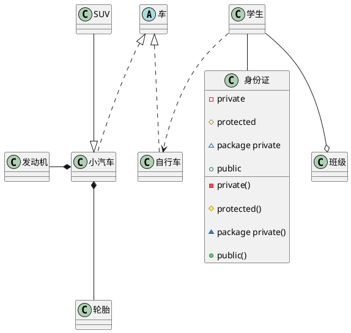

状态模式的原理类图

![[../../../img/state.svg]]

```plantuml
@startuml
abstract 车

class 身份证{

-private

#protected

~package private

+public

-private()

#protected()

~package private()

+public()

}

  

小汽车 .up.|> 车

自行车 .up.|> 车

小汽车 *-left- 发动机

小汽车 *-- 轮胎

SUV --|> 小汽车

学生 ..> 自行车

学生 --o 班级

学生 -- 身份证

@enduml
```